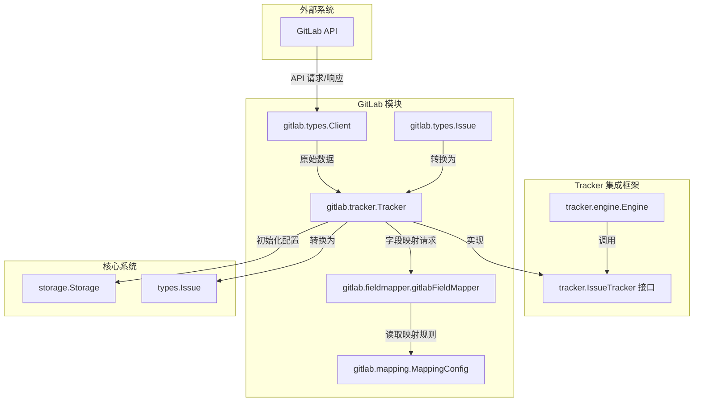

# GitLab Tracker 模块技术深度解析

## 1. 模块存在的问题与目的

想象一下：你有一个项目，核心任务追踪数据存储在本地的 Beads 系统中，但团队已经习惯在 GitLab 上协作。GitLab 有自己的问题追踪系统，你需要让这两个世界**无缝同步**——问题可以在 GitLab 创建，然后自动出现在本地；在本地更新的状态又要准确反映到 GitLab 上；同时还要处理状态映射、字段转换、依赖关系等一系列复杂问题。

这正是 `gitlab_tracker` 模块解决的问题。它不是一个简单的 API 包装器，而是一个完整的**双向翻译层**，让 Beads 系统能够将 GitLab 视为一个可同步的外部任务追踪系统。

### 核心挑战与解决方案设计
- **状态翻译问题**：GitLab 用 "opened"、"closed"，但 Beads 用自己的 `Status` 类型 → 通过 `gitlabFieldMapper` 处理双向映射
- **标识符歧义**：GitLab 有全局 ID（`id`）和项目内的 IID（`iid`）→ 明确分工用 IID 作为外部引用标识符
- **配置复杂性**：需要认证令牌、项目 ID、基础 URL → 设计了分层配置机制（存储配置 → 环境变量）
- **数据双向转换**：GitLab 问题 ↔ Beads 问题 ↔ 通用 `TrackerIssue` 格式 → 通过三层转换架构处理

## 2. 架构与数据流

### Mermaid 架构图


### 核心角色与数据流向

1. **Tracker 结构** — 整个模块的中心协调者
   - 实现 `tracker.IssueTracker` 接口
   - 持有 GitLab 客户端、映射配置和存储引用
   - 协调查找、创建、更新等所有操作

2. **数据转换三层结构**：
   ```
   GitLab Issue (gitlab.types.Issue) 
       ↓ (gitlabToTrackerIssue)
   TrackerIssue (tracker.types.TrackerIssue) [通用中间格式]
       ↓ (FieldMapper.IssueToBeads)
   Beads Issue (types.Issue) [内部核心类型]
   ```

3. **配置加载流程**：
   - `Init()` 首先尝试从 `storage.Storage` 读取配置
   - 失败则回退到环境变量（`GITLAB_TOKEN`、`GITLAB_URL`、`GITLAB_PROJECT_ID`）
   - 最后初始化客户端并使用默认映射配置

## 3. 核心组件深度解析

### 3.1 Tracker 结构体

**设计目的**：作为 GitLab 集成的门面，封装所有与 GitLab 的交互，对外暴露统一的 `tracker.IssueTracker` 接口。

**内部机制**：
- 持有三个核心依赖：
  - `client`: 负责原始 HTTP API 调用
  - `config`: 字段映射配置规则
  - `store`: 用于读取配置的存储接口

**关键方法解析**：

#### `Init(ctx, store)` — 初始化与配置
这是最复杂的方法之一，因为它需要处理多层配置回退：
```go
// 配置读取优先级：
// 1. 存储中的 gitlab.token → 2. GITLAB_TOKEN 环境变量 → 3. 失败报错
```
设计选择：优先从存储读取，允许用户通过 Beads 配置系统管理，而环境变量作为备用方案适合 CI/CD 场景。

#### `FetchIssues(ctx, opts)` — 问题拉取
该方法包含一个巧妙的状态转换：
```go
if state == "open" {
    state = "opened"  // GitLab 用 "opened" 而不是 "open"
}
```
这显示了集成层的一个重要职责：**术语归一化**——在外部系统的术语和内部通用术语之间进行翻译。

#### `CreateIssue/UpdateIssue` — 写入操作
两个方法都遵循相同的模式：
1. 将 Beads 问题通过 `BeadsIssueToGitLabFields` 转换为 GitLab 字段
2. 调用客户端执行 API 操作
3. 将返回的 GitLab 问题再转换回 `TrackerIssue`

这种模式确保了**写入后读取一致性**——你在 GitLab 中创建的就是你在 Beads 中得到的。

#### `IsExternalRef/ExtractIdentifier/BuildExternalRef` — 引用处理
这三个方法形成了完整的引用生命周期管理：
- `IsExternalRef`: 判断一个字符串是否是 GitLab 引用（包含 "gitlab" 且匹配 IID 模式）
- `ExtractIdentifier`: 从 URL 或引用中提取数字 IID
- `BuildExternalRef`: 为问题构造外部引用（优先使用 URL，回退到 `gitlab:` 格式）

这里的设计体现了**宽容输入，严格输出**原则——能识别多种格式的引用，但生成时使用规范格式。

### 3.2 gitlabToTrackerIssue 转换函数

**设计意图**：将 GitLab 特定的 `Issue` 结构转换为通用的 `tracker.TrackerIssue` 中间格式。

**关键映射规则**：
- GitLab 的 `ID`（全局 ID）→ `TrackerIssue.ID`
- GitLab 的 `IID`（项目内 ID）→ `TrackerIssue.Identifier`（这是用户可见的标识符）
- `WebURL` → `URL`
- `ClosedAt` → `CompletedAt`（术语映射）

**注意**：这个函数**只做浅层转换**，不处理优先级、状态、类型等需要复杂映射的字段——那些留给 `FieldMapper` 处理。这是良好的关注点分离。

### 3.3 配置系统

`getConfig` 方法实现了一个**两级配置回退策略**：
1. 首先尝试从 `store.GetConfig(ctx, key)` 读取
2. 失败或为空时，尝试从环境变量读取
3. 都没有则返回空字符串

这种设计非常实用：
- 本地开发可以用环境变量
- 生产环境可以通过 Beads 配置系统统一管理
- 敏感信息（令牌）可以通过环境变量注入，避免写入配置文件

## 4. 依赖分析

### 入站依赖（谁调用它）
- **tracker 包注册机制**：通过 `init()` 中的 `tracker.Register` 自动注册
- **tracker.engine.Engine**：同步引擎通过 `IssueTracker` 接口调用它，用于 pull/push 操作
- **CLI 命令**：如 `cmd.bd.gitlab` 包中的命令可能直接使用它

### 出站依赖（它调用谁）
- **gitlab.types.Client**：实际的 GitLab API 调用者
- **gitlab.fieldmapper.gitlabFieldMapper**：字段双向转换
- **gitlab.mapping.MappingConfig**：映射规则配置
- **storage.Storage**：配置读取
- **types.Issue**：内部问题类型

### 数据契约
- **输入契约**：`FetchIssues` 接受 `tracker.FetchOptions`，支持按状态和时间筛选
- **输出契约**：所有问题操作都返回或生成 `tracker.TrackerIssue`，这是与外部系统交互的通用格式
- **错误契约**：配置缺失返回明确的配置错误，API 错误直接透传

## 5. 设计决策与权衡

### 5.1 IID vs ID — 标识符选择
**决策**：使用 GitLab 的 `iid`（项目内标识符）作为外部引用标识符，而不是全局的 `id`。

**为什么这样做**：
- 用户只关心 `#42` 这样的项目内引用，从不使用全局数字 ID
- IID 在项目上下文内稳定且有意义
- 全局 ID 是内部实现细节

**权衡**：
- ✅ 对用户友好，符合 GitLab 使用习惯
- ❌ 要求项目上下文（IID 不是全局唯一的），但这在当前设计中是可接受的

### 5.2 状态术语翻译
**决策**：在 `FetchIssues` 中硬编码将 "open" 转换为 "opened"。

**为什么这样做**：
- 这是 GitLab API 的特殊性
- 在 tracker 层处理避免了污染通用接口

**权衡**：
- ✅ 封装了 GitLab 的特殊性，上游调用者不用关心
- ❌ 增加了 tracker 实现的复杂度
- **替代方案**：可以在 FieldMapper 中处理，但这里选择在 API 调用前处理，因为这是 API 层面的术语差异

### 5.3 配置分层策略
**决策**：存储配置优先，环境变量作为备用。

**为什么这样做**：
- 存储配置支持动态配置和多环境管理
- 环境变量适合 CI/CD 和容器化部署
- 给用户最大的灵活性

**权衡**：
- ✅ 灵活性高，适应不同部署场景
- ❌ 配置来源可能不明显，调试时需要检查两个地方
- **缓解**：错误信息明确提示配置位置

### 5.4 转换层次分离
**决策**：三层转换（GitLab → TrackerIssue → Beads Issue）。

**为什么这样做**：
- `TrackerIssue` 作为通用中间格式，所有 tracker 实现都使用它
- 第一层转换只做最简单的字段复制，第二层处理复杂映射
- 便于测试和维护

**权衡**：
- ✅ 清晰的关注点分离，每个转换层职责单一
- ❌ 多层转换有轻微性能开销，但在同步场景下可忽略
- ✅ 新添加 tracker 只需实现相同模式

## 6. 用法与示例

### 6.1 基本初始化
```go
tracker := &gitlab.Tracker{}
err := tracker.Init(ctx, storage)
if err != nil {
    log.Fatal(err)
}
```

### 6.2 配置方式
**方法 1：通过存储配置**
```go
// 在初始化前设置配置
store.SetConfig(ctx, "gitlab.token", "glpat-...")
store.SetConfig(ctx, "gitlab.url", "https://gitlab.example.com")
store.SetConfig(ctx, "gitlab.project_id", "my-group/my-project")
```

**方法 2：通过环境变量**
```bash
export GITLAB_TOKEN=glpat-...
export GITLAB_URL=https://gitlab.example.com
export GITLAB_PROJECT_ID=my-group/my-project
```

### 6.3 拉取问题
```go
// 拉取所有问题
issues, err := tracker.FetchIssues(ctx, tracker.FetchOptions{})

// 拉取特定状态的问题
issues, err := tracker.FetchIssues(ctx, tracker.FetchOptions{
    State: "opened",
})

// 增量拉取
since := time.Now().Add(-24 * time.Hour)
issues, err := tracker.FetchIssues(ctx, tracker.FetchOptions{
    Since: &since,
})
```

### 6.4 处理外部引用
```go
// 判断是否是 GitLab 引用
isGitLab := tracker.IsExternalRef("https://gitlab.com/group/project/issues/42")
// → true

// 提取标识符
id := tracker.ExtractIdentifier("https://gitlab.com/group/project/issues/42")
// → "42"

// 获取单个问题
issue, err := tracker.FetchIssue(ctx, "42")
```

## 7. 边缘情况与注意事项

### 7.1 标识符陷阱
**问题**：GitLab 有两个标识符——全局 `id` 和项目内 `iid`。
**注意**：始终使用 `iid` 作为外部标识符，永远不要向用户展示全局 `id`。

### 7.2 状态术语差异
**问题**：Beads 用 "open"，GitLab 用 "opened"。
**注意**：在 `FetchIssues` 中已经处理了这种转换，但在其他地方直接调用 API 时要记住这一点。

### 7.3 配置缺失
**问题**：Init 会因配置缺失失败，但如果初始化后配置被移除会怎样？
**注意**：`Validate()` 只检查客户端是否初始化，不重新验证配置有效性。在初始化后确保配置不被外部移除。

### 7.4 并发安全
**问题**：Tracker 结构没有显式的同步机制。
**注意**：当前设计假设 Tracker 被初始化后，配置是只读的。如果需要动态重新配置，需要添加同步机制。

### 7.5 空指针风险
**问题**：`gitlabToTrackerIssue` 访问了多个指针字段（Assignee、CreatedAt 等）。
**缓解**：该函数已经有适当的 nil 检查，不会因为可选字段缺失而崩溃。

### 7.6 URL 构建回退
**问题**：`BuildExternalRef` 优先使用 issue.URL，但有些情况下 URL 可能缺失。
**注意**：回退到 `gitlab:%s` 格式是安全的，但要确保系统其他部分能处理这种非 URL 引用。

## 8. 扩展与维护指南

### 8.1 添加新的字段映射
新的字段映射应该在 `gitlabFieldMapper` 中实现，而不是在 `Tracker` 或转换函数中。保持 `Tracker` 专注于协调。

### 8.2 支持 GitLab 企业版特性
如果要添加 GitLab 企业版特有功能（如史诗、多里程碑）：
- 首先检查 API 响应中是否有这些字段
- 在 `gitlab.types.Issue` 中添加可选字段
- 在 `gitlabFieldMapper` 中添加映射逻辑
- 避免在 `Tracker` 核心逻辑中添加企业版特定代码

### 8.3 错误处理增强
当前实现透传 GitLab API 错误。如果需要更友好的错误处理：
- 可以在 `Client` 层包装常见错误（如认证失败、权限不足）
- 使用自定义错误类型，让上游可以区分不同失败原因
- 但要保持 `IssueTracker` 接口的简单性

## 9. 相关模块参考

- [Tracker Integration Framework](tracker_integration_framework.md) - 定义了 `IssueTracker` 接口和同步引擎
- [GitLab Types](gitlab_types.md) - GitLab API 数据结构和客户端
- [GitLab FieldMapper](gitlab_fieldmapper.md) - 字段双向映射实现
- [GitLab Mapping](gitlab_mapping.md) - 映射配置结构和默认值

---

*最后更新：2024年*
