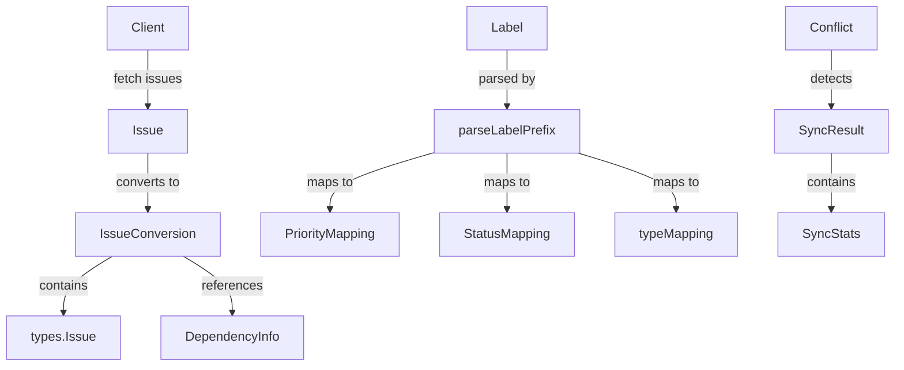

# GitLab Types 模块深度解析

## 1. 模块概览

`gitlab_types` 模块是 Beads 系统与 GitLab 问题跟踪系统集成的核心数据模型层。它是整个 GitLab 集成套件的基础，为 [`gitlab_tracker`](gitlab_tracker.md)、[`gitlab_fieldmapper`](gitlab_fieldmapper.md) 和 [`gitlab_mapping`](gitlab_mapping.md) 等模块提供数据结构支持。

它扮演着两个关键角色：
1. **数据适配器**：在 GitLab REST API 的数据格式和 Beads 内部类型系统之间进行双向转换
2. **语义映射器**：将 GitLab 的标签、状态、里程碑等概念映射到 Beads 的领域模型中

这个模块解决的核心问题是：如何让一个通用的项目管理工具（Beads）与 GitLab 这种特定的问题跟踪系统无缝集成，同时保持双方数据模型的完整性和一致性。

## 2. 架构与数据流

### 2.1 核心组件关系



### 2.2 数据流说明

当从 GitLab 同步数据时，数据流如下：
1. **Client** 发起 API 请求获取 GitLab 数据
2. 原始 JSON 被反序列化为 `Issue`、`Label`、`Milestone` 等 GitLab 特定类型
3. 这些类型通过 `parseLabelPrefix` 和映射表（`PriorityMapping`、`StatusMapping`、`typeMapping`）进行语义转换
4. 转换结果被封装在 `IssueConversion` 中，包含 Beads 内部的 `types.Issue` 和依赖关系信息
5. 整个同步过程的统计信息被记录在 `SyncStats` 和 `SyncResult` 中

## 3. 核心组件深度解析

### 3.1 Issue 结构体

**设计意图**：`Issue` 结构体是 GitLab 问题在 Beads 系统中的精确镜像，它保留了 GitLab API 响应的所有关键字段，确保在转换过程中不会丢失信息。

**关键特性**：
- 同时包含全局 ID (`ID`) 和项目范围 ID (`IID`)，这是 GitLab 的独特设计
- 使用指针类型处理可选字段（如 `ClosedAt`、`ClosedBy`），以区分"未设置"和"零值"
- 包含 `Links` 字段，提供相关资源的 URL 引用

**设计权衡**：选择完整镜像 GitLab API 结构而非精简版本，虽然增加了结构体的复杂性，但确保了：
1. 未来功能扩展时不需要修改数据结构
2. 调试时可以访问原始 GitLab 数据
3. 支持 GitLab 的所有特性（如 `Weight`、`Confidential` 等）

### 3.2 标签解析与映射系统

`parseLabelPrefix` 函数和三个映射表（`PriorityMapping`、`StatusMapping`、`typeMapping`）构成了模块的语义转换核心。

**设计意图**：GitLab 使用简单的字符串标签来表示优先级、状态和类型，而 Beads 有结构化的枚举类型。这个系统将 GitLab 的平面标签空间映射到 Beads 的结构化类型系统中。

**工作原理**：
1. `parseLabelPrefix` 将类似 "priority::high" 的标签拆分为前缀 ("priority") 和值 ("high")
2. 根据前缀选择相应的映射表
3. 将 GitLab 的标签值转换为 Beads 的内部表示

**设计权衡**：使用硬编码的映射表而非动态配置，虽然减少了灵活性，但：
- 提供了单一事实来源，避免配置错误
- 简化了部署，无需额外的配置文件
- 性能更好，无需运行时解析配置

### 3.3 IssueConversion 和 DependencyInfo

**设计意图**：这两个结构体解决了依赖关系导入的时序问题。在导入问题时，我们可能会遇到指向尚未导入的问题的依赖关系。

**解决方案**：
- `IssueConversion` 包含转换后的问题和所有依赖关系信息
- `DependencyInfo` 单独存储依赖关系，使用 GitLab IID 作为临时引用
- 导入完成后，系统可以使用 `DependencyInfo` 批量创建所有依赖关系

这种设计确保了即使依赖关系指向尚未导入的问题，我们也能正确处理。

### 3.4 同步统计与冲突检测

`SyncStats`、`SyncResult` 和 `Conflict` 构成了同步操作的反馈系统。

**设计意图**：提供详细的同步操作可见性，帮助用户理解同步过程中发生了什么，以及为什么某些操作失败了。

**关键特性**：
- `SyncStats` 跟踪拉取、推送、创建、更新等操作的数量
- `Conflict` 精确记录冲突的详细信息，包括双方的更新时间和引用
- `SyncResult` 封装整个同步过程的结果，包括成功/失败状态、统计信息和警告

## 4. 依赖关系分析

### 4.1 输出依赖

`gitlab_types` 模块依赖于：
- `internal/types`：提供 Beads 内部的 `Issue` 类型，这是转换的目标类型
- 标准库：`net/http`、`strings`、`time` 等基础功能

### 4.2 输入依赖

以下模块依赖于 `gitlab_types`：
- [`internal/gitlab/tracker`](gitlab_tracker.md)：`Tracker` 结构体使用 `Client` 进行 API 调用，使用各种类型处理数据转换
- [`internal/gitlab/fieldmapper`](gitlab_fieldmapper.md)：`gitlabFieldMapper` 使用这些类型进行字段映射
- [`internal/gitlab/mapping`](gitlab_mapping.md)：`MappingConfig` 与模块中的映射表（`PriorityMapping`、`StatusMapping`、`typeMapping`）紧密相关，`MappingConfig` 提供了更灵活的运行时配置，而模块中的映射表是默认值的来源

### 4.3 数据契约

模块与外部的关键数据契约包括：
- GitLab API v4 的 JSON 格式（通过结构体标签定义）
- Beads 内部 `types.Issue` 的结构
- 映射表的键值对格式

## 5. 设计决策与权衡

### 5.1 完整镜像 vs 精简转换

**决策**：选择完整镜像 GitLab API 结构。

**原因**：
1. **未来兼容性**：GitLab API 可能会添加新字段，完整镜像可以避免频繁修改
2. **调试便利**：保留原始数据使得问题排查更容易
3. **功能完整性**：支持 GitLab 的所有特性，即使当前不使用

**权衡**：增加了代码复杂度和内存使用，但对于集成模块来说，这是合理的投资。

### 5.2 硬编码映射 vs 配置驱动

**决策**：选择硬编码映射表。

**原因**：
1. **单一事实来源**：避免配置错误导致的不一致
2. **简化部署**：无需额外的配置文件
3. **性能更好**：无需运行时解析配置

**权衡**：牺牲了灵活性，但对于大多数用户来说，默认映射已经足够。如果需要自定义，可以通过修改代码实现。

### 5.3 指针 vs 值类型

**决策**：对可选字段使用指针类型。

**原因**：
- 在 Go 中，区分"未设置"和"零值"很重要
- GitLab API 中的许多字段是可选的
- 使用指针可以精确反映 API 响应的实际内容

**权衡**：增加了空指针检查的需要，但这是处理可选数据的标准 Go 模式。

## 6. 使用指南与示例

### 6.1 标签解析示例

```go
// 解析 GitLab 标签
prefix, value := parseLabelPrefix("priority::high")
// prefix = "priority", value = "high"

// 获取优先级
priority := getPriorityFromLabel(value)
// priority = 1 (P1)
```

### 6.2 状态验证示例

```go
// 验证 GitLab 状态
isValid := isValidState("opened")
// isValid = true

isValid = isValidState("invalid_state")
// isValid = false
```

## 7. 边缘情况与注意事项

### 7.1 标签命名约定

模块假设 GitLab 标签使用 `::` 作为前缀分隔符（如 `priority::high`）。如果项目使用不同的约定，需要修改 `parseLabelPrefix` 函数。

### 7.2 依赖关系导入

依赖关系的创建需要等到所有问题都导入后才能进行，因为依赖关系可能指向尚未导入的问题。这就是为什么 `DependencyInfo` 被设计为单独存储的原因。

### 7.3 时区处理

GitLab API 返回的时间戳是 UTC 时间，但在显示给用户时可能需要转换为本地时区。模块保留了原始的 `time.Time` 值，让调用者决定如何处理时区。

### 7.4 增量同步

`PullStats` 中的 `Incremental` 和 `SyncedSince` 字段支持增量同步，但实际的增量逻辑由调用者实现，模块只提供数据结构。

## 8. 扩展点

### 8.1 自定义映射

模块提供了两种自定义映射的方式：

1. **直接修改导出的映射表**（简单但全局影响）：
```go
// 自定义优先级映射
gitlab.PriorityMapping["urgent"] = 0
```

2. **使用 MappingConfig**（推荐，更灵活且可隔离）：
与 [`gitlab_mapping`](gitlab_mapping.md) 模块配合使用，创建自定义的 `MappingConfig`，这样可以在不同的同步操作中使用不同的映射配置，而不会影响全局状态。

### 8.2 新标签类型

添加新的标签类型需要：
1. 创建新的映射表
2. 修改 `parseLabelPrefix` 或创建新的解析函数
3. 添加相应的 getter 函数

### 8.3 自定义状态验证

`validStates` 映射是未导出的，但可以通过封装 `isValidState` 函数来添加自定义状态验证。

## 9. 总结

`gitlab_types` 模块是 Beads 与 GitLab 集成的基础层，它通过精确的数据镜像和灵活的语义映射，实现了两个系统之间的无缝数据转换。模块的设计注重完整性、可靠性和可维护性，虽然在某些地方牺牲了灵活性，但这是为了确保集成的稳定性和一致性。

对于新贡献者，理解这个模块的关键是掌握：
1. GitLab API 数据结构与 Beads 内部类型的对应关系
2. 标签解析和映射系统的工作原理
3. 依赖关系导入的时序问题解决方案
