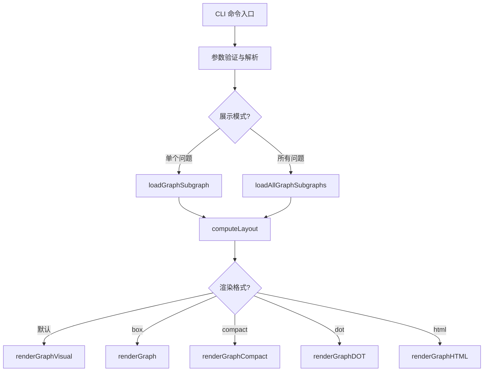
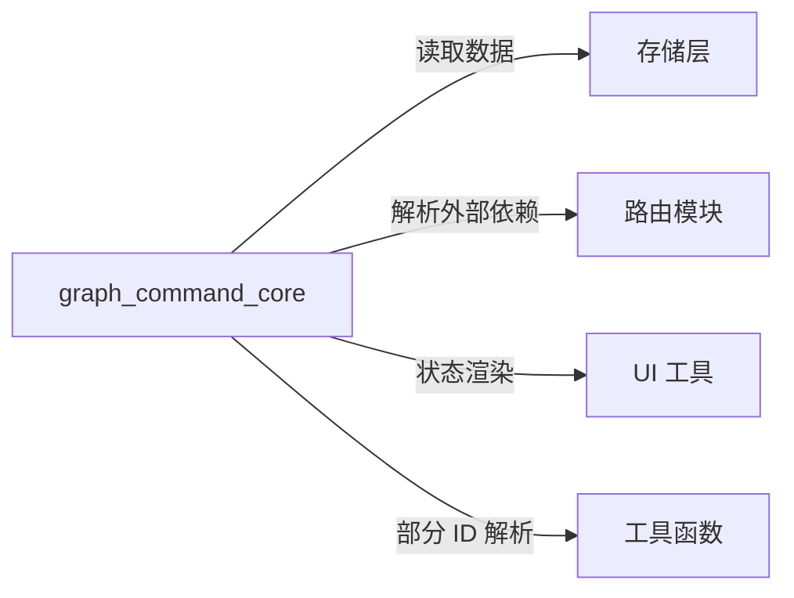

# graph_command_core 模块技术深度解析

## 目录
1. [问题域与核心作用](#问题域与核心作用)
2. [核心抽象与心智模型](#核心抽象与心智模型)
3. [架构设计与数据流程](#架构设计与数据流程)
4. [核心组件详解](#核心组件详解)
5. [依赖关系与交互](#依赖关系与交互)
6. [设计决策与权衡](#设计决策与权衡)
7. [使用示例与最佳实践](#使用示例与最佳实践)
8. [边界条件与注意事项](#边界条件与注意事项)

---

## 问题域与核心作用

### 为什么需要这个模块？

在项目管理和问题跟踪系统中，理解问题之间的依赖关系是高效工作的关键。当团队处理复杂的项目时，问题之间可能存在多种依赖关系：
- 阻塞关系（一个问题必须在另一个问题完成后才能开始）
- 父子关系（一个问题是另一个问题的子任务）
- 相关关系（两个问题相关联但不直接阻塞）

传统的列表视图无法直观地展示这些复杂关系，而静态的依赖图又缺乏交互性和多种展示形式。`graph_command_core` 模块正是为了解决这个问题而设计的。

### 核心价值

该模块提供了一个灵活的依赖图可视化框架，支持：
1. **多种展示格式**：从简洁的树状视图到交互式 HTML 可视化
2. **拓扑排序**：自动计算问题的执行顺序（层）
3. **连通分量分析**：将问题分组为独立的依赖子图
4. **状态可视化**：直观展示每个问题的状态和优先级

---

## 核心抽象与心智模型

### 关键抽象

#### 1. **GraphNode** - 图节点
```go
type GraphNode struct {
    Issue     *types.Issue  // 问题数据
    Layer     int           // 水平层（拓扑顺序）
    Position  int           // 层内垂直位置
    DependsOn []string      // 此节点依赖的 ID（仅阻塞依赖）
}
```

**设计意图**：将问题实体与图布局信息分离，使得同一个问题数据可以在不同的布局算法中复用。

#### 2. **GraphLayout** - 图布局
```go
type GraphLayout struct {
    Nodes    map[string]*GraphNode  // 节点映射
    Layers   [][]string              // 层索引 -> 该层的节点 ID
    MaxLayer int                     // 最大层数
    RootID   string                  // 根节点 ID
}
```

**设计意图**：封装布局计算结果，为不同的渲染器提供统一的数据结构。

### 心智模型

想象这个模块是一个**建筑蓝图生成器**：
- **问题**是建筑中的各个房间
- **依赖关系**是房间之间的走廊和门
- **层（Layer）**是建筑的楼层，低楼层的房间必须先建好才能建高楼层
- **布局（Layout）**是建筑平面图，展示房间的位置和连接
- **渲染器**是不同的图纸风格，从简洁的草图到详细的 3D 模型

---

## 架构设计与数据流程

### 整体架构



### 关键数据流程

1. **子图加载阶段**
   - 从存储层获取问题及其依赖
   - 构建连通分量（使用 BFS）
   - 解析外部依赖（通过路由）

2. **布局计算阶段**
   - 拓扑排序（使用最长路径算法）
   - 层分配（无依赖的问题在层 0）
   - 层内排序（确保一致的输出）

3. **渲染阶段**
   - 选择合适的渲染器
   - 应用样式和格式化
   - 输出到终端或文件

---

## 核心组件详解

### 1. 子图加载器

#### `loadGraphSubgraph` - 单个问题的子图加载

**功能**：加载指定问题及其所有连通的依赖关系。

**实现细节**：
- 使用双向 BFS 遍历（同时探索依赖和被依赖）
- 支持外部依赖解析（通过 `resolveAndGetIssueWithRouting`）
- 构建完整的 `TemplateSubgraph` 结构

**设计亮点**：
```go
// 双向遍历设计 - 同时探索依赖和被依赖
// 这确保了我们能看到完整的连通图，而不仅仅是向下的依赖链
queue := []string{root.ID}
visited := map[string]bool{root.ID: true}

for len(queue) > 0 {
    currentID := queue[0]
    queue = queue[1:]
    
    // 获取依赖于此问题的问题（被依赖）
    dependents, err := s.GetDependents(ctx, currentID)
    // ...
    
    // 获取此问题依赖的问题（依赖）
    dependencies, err := s.GetDependencies(ctx, currentID)
    // ...
}
```

#### `loadAllGraphSubgraphs` - 所有问题的连通分量加载

**功能**：加载所有开放问题并按连通分量分组。

**实现细节**：
- 多状态查询（open, in_progress, blocked）
- 并查集思想的连通分量识别
- 智能根节点选择（史诗 > 高优先级 > 最旧）

**排序策略**：
```go
// 组件排序：先按大小降序，再按第一个问题的优先级升序
sort.Slice(components, func(i, j int) bool {
    // 第一优先级：大小（大的在前）
    if len(components[i]) != len(components[j]) {
        return len(components[i]) > len(components[j])
    }
    // 第二优先级：优先级（数字小的在前）
    issueI := issueMap[components[i][0]]
    issueJ := issueMap[components[j][0]]
    return issueI.Priority < issueJ.Priority
})
```

### 2. 布局计算器

#### `computeLayout` - 拓扑布局计算

**功能**：使用拓扑排序为节点分配层。

**算法选择**：最长路径算法（而非 Kahn 算法）

**设计决策**：
```go
// 为什么选择最长路径而不是 Kahn 算法？
// 1. 最长路径能确保依赖关系的"深度"被正确反映
// 2. 对于执行计划来说，这是更直观的可视化
// 3. 同一层的节点确实可以并行执行

// 算法步骤：
// 1. 初始化所有节点层为 -1（未分配）
// 2. 无依赖的节点分配到层 0
// 3. 其他节点的层 = 其所有依赖节点的最大层 + 1
// 4. 处理循环依赖（分配到层 0）
```

**关键实现**：
```go
// 迭代直到没有更多节点可以分配层
changed := true
for changed {
    changed = false
    for id, node := range layout.Nodes {
        if node.Layer >= 0 {
            continue // 已分配
        }
        
        deps := dependsOn[id]
        if len(deps) == 0 {
            // 无依赖 - 层 0
            node.Layer = 0
            changed = true
        } else {
            // 检查所有依赖是否都已分配层
            maxDepLayer := -1
            allAssigned := true
            for _, depID := range deps {
                depNode := layout.Nodes[depID]
                if depNode == nil || depNode.Layer < 0 {
                    allAssigned = false
                    break
                }
                if depNode.Layer > maxDepLayer {
                    maxDepLayer = depNode.Layer
                }
            }
            if allAssigned {
                node.Layer = maxDepLayer + 1
                changed = true
            }
        }
    }
}
```

### 3. 渲染器

#### `renderGraphCompact` - 紧凑树状渲染

**设计理念**：信息密度优先，适合快速扫描。

**特点**：
- 每层一行，使用树状连接符（├──, └──, │）
- 显示状态图标、ID、优先级和标题
- 递归渲染父子关系

#### `renderGraph` - ASCII 盒子渲染

**设计理念**：清晰的层结构展示，适合理解执行顺序。

**特点**：
- 每个节点一个 ASCII 盒子
- 显示依赖计数（blocks/needs）
- 使用语义颜色区分状态

#### 其他渲染器

- `renderGraphVisual`：终端原生 DAG 可视化（默认）
- `renderGraphDOT`：Graphviz DOT 格式（适合生成图片）
- `renderGraphHTML`：交互式 HTML 可视化（基于 D3.js）

---

## 依赖关系与交互

### 输入依赖

| 依赖项 | 用途 | 耦合度 |
|--------|------|--------|
| `dolt.DoltStore` | 数据存储访问 | 高 |
| `types.Issue` | 问题数据模型 | 高 |
| `types.Dependency` | 依赖关系模型 | 高 |
| `ui` 包 | 状态渲染和样式 | 中 |
| `utils` 包 | 部分 ID 解析 | 低 |

### 输出契约

该模块产生多种格式的输出：
1. **终端文本**：ASCII 艺术图、树状图
2. **JSON**：结构化数据（用于程序化消费）
3. **DOT**：Graphviz 格式
4. **HTML**：自包含的交互式页面

### 与其他模块的交互



---

## 设计决策与权衡

### 1. 依赖类型的选择性可视化

**决策**：只在布局计算中使用 `DepBlocks` 类型的依赖。

**原因**：
- 阻塞关系是唯一影响执行顺序的依赖类型
- 父子关系和相关关系会在渲染中显示，但不影响层分配
- 避免了过于复杂的布局计算

**权衡**：
| 优点 | 缺点 |
|------|------|
| 布局更直观，反映真实执行顺序 | 可能丢失一些依赖关系的视觉线索 |
| 计算效率更高 | 需要用户理解不同依赖类型的区别 |

### 2. 最长路径 vs Kahn 算法

**决策**：选择最长路径算法进行拓扑排序。

**原因**：
- 最长路径产生的层更符合"执行阶段"的直觉
- 同一层的节点确实可以并行执行
- 对于项目管理场景更有意义

**权衡**：
| 最长路径 | Kahn 算法 |
|----------|-----------|
| 层更少，更紧凑 | 层更多，更细粒度 |
| 反映"深度" | 反映"广度" |
| 更适合执行计划 | 更适合依赖分析 |

### 3. 根节点省略的依赖计数

**决策**：在计算 `blocks` 和 `needs` 计数时，省略根节点的依赖。

**代码位置**：
```go
// 跳过如果阻塞者是根问题 - 这从图结构中很明显
// 当只是父史诗时显示 "needs:1" 是认知噪音
if dep.DependsOnID == rootID {
    continue
}
```

**原因**：
- 根节点的依赖关系从图结构中已经很明显
- 减少认知噪音，让用户关注更重要的依赖
- 符合"渐进式信息揭示"的设计原则

### 4. 多格式渲染架构

**决策**：支持多种渲染格式，但共享相同的布局计算。

**架构**：
```
                    ┌─ renderGraphVisual
                    ├─ renderGraph
computeLayout ──────┼─ renderGraphCompact
                    ├─ renderGraphDOT
                    └─ renderGraphHTML
```

**优点**：
- 布局计算只做一次，效率高
- 新的渲染格式可以轻松添加
- 每种格式可以专注于自己的展示目标

---

## 使用示例与最佳实践

### 基本使用

```bash
# 单个问题的默认可视化
bd graph issue-id

# ASCII 盒子视图
bd graph --box issue-id

# 紧凑树状视图
bd graph --compact issue-id

# 导出为 Graphviz 格式
bd graph --dot issue-id | dot -Tsvg > graph.svg

# 交互式 HTML 视图
bd graph --html issue-id > graph.html

# 所有开放问题
bd graph --all --html > all.html
```

### 常见模式

1. **快速查看执行计划**
   ```bash
   bd graph --compact epic-id
   ```
   使用紧凑视图快速扫描哪些问题可以并行执行。

2. **生成报告用图**
   ```bash
   bd graph --dot issue-id | dot -Tpng -Gdpi=150 > report.png
   ```
   生成高分辨率图片用于报告。

3. **团队协作视图**
   ```bash
   bd graph --all --html > team-board.html
   ```
   生成包含所有开放问题的交互式视图。

---

## 边界条件与注意事项

### 1. 循环依赖

**现象**：存在循环依赖时，所有相关节点会被分配到层 0。

**处理方式**：
```go
// 处理任何未分配的节点（循环或断开连接）
for _, node := range layout.Nodes {
    if node.Layer < 0 {
        node.Layer = 0
    }
}
```

**建议**：使用 `bd doctor` 命令检测和修复循环依赖。

### 2. 大型图的性能

**注意事项**：
- 对于包含数百个问题的大图，终端渲染可能会很慢
- HTML 视图在浏览器中可能会有性能问题
- 建议使用 `--compact` 或 `--dot` 格式处理大型图

**优化策略**：
- 分批处理连通分量
- 使用虚拟滚动（HTML 视图）
- 提供图大小警告

### 3. 外部依赖的解析

**限制**：
- 外部依赖需要正确配置路由
- 解析失败时会静默跳过
- 可能导致图不完整

**调试建议**：
- 使用 `bd routed` 命令检查路由配置
- 查看日志中的路由解析错误

### 4. 状态和样式的一致性

**重要**：该模块使用 `ui` 包中的共享状态图标和样式，确保与其他命令的一致性。

```go
// 使用共享的状态图标和样式
statusIcon := ui.RenderStatusIcon(status)
style := ui.GetStatusStyle(status)
```

**不要**在该模块中硬编码状态样式，始终使用 `ui` 包提供的函数。

---

## 总结

`graph_command_core` 模块是一个精心设计的依赖图可视化框架，它通过清晰的抽象分离（数据加载、布局计算、渲染）、智能的算法选择（最长路径拓扑排序）和灵活的输出格式，为用户提供了强大而易用的依赖关系可视化工具。

该模块的设计体现了几个重要原则：
1. **关注点分离**：数据、布局、渲染各司其职
2. **渐进式信息揭示**：从简洁到详细的多种视图
3. **一致性**：与系统其他部分共享样式和行为
4. **实用性**：优先考虑实际项目管理需求

对于新贡献者，理解该模块的关键是掌握其核心抽象（`GraphNode`、`GraphLayout`）和数据流程，以及设计决策背后的权衡考虑。

## 相关文档

- [graph_export_formats](graph_export_formats.md)
- [graph_visual_terminal_dag](graph_visual_terminal_dag.md)
- [Routing](Routing.md)
- [Dolt Storage Backend](Dolt Storage Backend.md)
