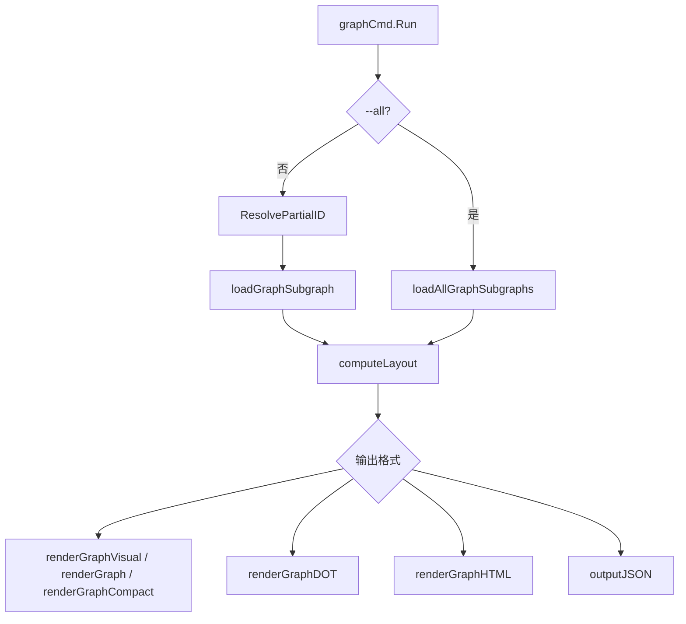

# graph_command_core

`graph_command_core` 是 `bd graph` 的“总调度层”：它不负责底层存储实现，也不专注某一种渲染样式，而是把**取数、建图、分层、分发渲染器**串成一条完整管线。你可以把它理解为机场塔台：真正起飞的是不同航班（`--dot`、`--html`、默认终端 DAG 等），但塔台负责统一调度跑道和起飞顺序。

## 核心问题与设计动机

为什么这个层必须存在？因为依赖图命令有两个天然矛盾：

1. **数据来源复杂**：图不只是 root issue 的直接依赖，还要覆盖双向可达节点、外部依赖重写、`--all` 下的连通分量拆分。
2. **输出形态多样**：终端紧凑模式、盒式模式、DAG 视图、DOT、HTML、JSON 都要复用同一份图语义。

如果把这些逻辑散在各渲染器里，行为会快速分叉。这里的策略是：先统一产出 `TemplateSubgraph` + `GraphLayout`，再做渲染分发。

## 关键抽象

### `GraphNode`
`GraphNode` 是“渲染视图节点”，包装了：
- `Issue *types.Issue`：领域实体本体
- `Layer int`：拓扑层（横向）
- `Position int`：层内位置（纵向）
- `DependsOn []string`：仅 `DepBlocks` 的依赖 ID

它把业务对象转成布局对象，避免渲染器重复解析依赖类型。

### `GraphLayout`
`GraphLayout` 是“已计算好的图平面”：
- `Nodes map[string]*GraphNode`
- `Layers [][]string`
- `MaxLayer int`
- `RootID string`

渲染器只消费这个结构，不再做拓扑推导。

## 端到端数据流

### 单 issue 模式
1. 通过 `utils.ResolvePartialID` 解析短 ID。
2. `loadGraphSubgraph` 从 root 开始做 BFS，双向遍历 `GetDependents` 和 `GetDependencies`。
3. 加载 `GetDependencyRecords`，并处理 `external:` 依赖（`resolveAndGetIssueWithRouting`）。
4. `computeLayout` 基于 `DepBlocks` 分层。
5. 按 flag 分发到对应渲染器。

### `--all` 模式
1. 分三次状态查询：`StatusOpen` / `StatusInProgress` / `StatusBlocked`（因为 `IssueFilter` 一次只接受一个状态）。
2. 汇总依赖后构建无向邻接表。
3. BFS 找连通分量。
4. 每个分量选择 root（偏好：`TypeEpic` > 更高优先级）。
5. 每个分量分别 `computeLayout` + 渲染。

## 非显性设计选择与取舍

### 1) 分层只看 `DepBlocks`
`computeLayout` 只把 `types.DepBlocks` 纳入 `dependsOn`。这是为了让层语义严格对应“可执行顺序”。代价是 parent-child 关系不参与层计算，可能在导出图中出现跨层的组织关系边。

### 2) 循环依赖容错而非硬失败
分层循环结束后，未分配层的节点直接落到 `Layer 0`。这避免命令因坏数据崩溃，提升可用性；代价是循环图会被“近似展示”，需要使用者理解这不是严格拓扑排序结果。

### 3) 外部依赖尝试解析，失败即跳过
遇到 `external:` 依赖时会尝试路由解析，失败则 `continue`。选择了“尽力展示可见子图”而非“全图原子一致”。CLI 场景下这更实用，但会让部分边静默缺失。

### 4) 错误处理偏韧性
批量加载依赖时大量分支是 `continue` 而不是返回 error。好处是单个坏记录不拖垮整图；坏处是可观测性较弱，异常容易被忽略。

## 新贡献者易踩坑

- `graphAll` 与位置参数互斥：`--all` 不能再给 issue-id。
- `loadGraphSubgraph` / `loadAllGraphSubgraphs` 参数叫 `s`，但外部依赖解析时调用的是全局 `store`，存在隐式全局耦合。
- `computeLayout` 假设 `subgraph.Root != nil`（直接取 `subgraph.Root.ID`）。
- `renderGraphCompact` 构建了 `childSet` 但当前未使用，属于可读性噪点。

## 相关文档

- [CLI Graph Commands](CLI Graph Commands.md)
- [graph_export_formats](graph_export_formats.md)
- [graph_visual_terminal_dag](graph_visual_terminal_dag.md)
- [Routing](Routing.md)
- [Dolt Storage Backend](Dolt Storage Backend.md)
