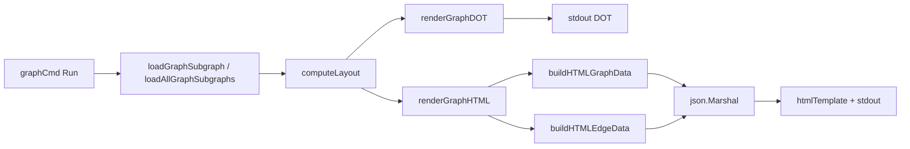

# graph_export_formats 深度解析

`graph_export_formats` 模块是 `bd graph` 命令里的“最后一公里翻译层”：上游已经把依赖关系整理成 `GraphLayout` + `TemplateSubgraph`，它的职责是把这份结构化图数据，稳定地导出成两种面向外部工具/环境的格式——Graphviz DOT（适合管道化、自动化、离线渲染）和自包含 HTML（适合交互探索）。

如果没有这个模块，最直接的“朴素方案”通常是把终端渲染逻辑直接复用到导出里，或者临时拼字符串输出 JSON/HTML。问题在于：终端视图强调可读字符布局，导出格式强调**契约稳定**和**跨工具兼容**。两者目标冲突明显。这个模块存在的核心原因，就是把“图语义”与“展示介质”解耦，让同一份图数据能被不同消费端可靠使用。

## 架构角色与数据流



从架构定位看，这个模块是一个**纯导出适配层（export adapter）**，不是图计算器，也不是存储访问层。`graph.go` 的 `graphCmd` 在完成数据装载（`loadGraphSubgraph` / `loadAllGraphSubgraphs`）与分层计算（`computeLayout`）后，才会调用 `renderGraphDOT` 或 `renderGraphHTML`。也就是说，它依赖上游已经提供“可渲染的图模型”，自己不再推导依赖闭包、不再做拓扑分析。

这一分层非常关键：导出逻辑只处理“如何表达”，不处理“图是否正确”。这样做让导出功能能快速扩展格式，同时避免把业务规则散落在不同渲染器里。

## 心智模型：它像“同传翻译台”而不是“会议组织者”

理解这个模块最有用的比喻是：

- `GraphLayout` / `TemplateSubgraph` 是会议内容（事实与结构）
- `graph_export_formats` 是同传翻译台（把同一内容翻成 DOT 或 HTML）
- Graphviz / 浏览器 D3 是听众终端（各自有自己的语法和交互能力）

因此你在这里看到的大多数代码都围绕三件事：

1. **筛选可视依赖类型**（只导出 `types.DepBlocks` 和 `types.DepParentChild`）
2. **做目标格式安全处理**（DOT 的 ID/label 转义、HTML title 的 escape）
3. **保持方向语义一致**（统一使用 `DependsOnID -> IssueID`，即 blocker 指向 blocked）

## 组件深潜

### `renderGraphDOT(layout *GraphLayout, subgraph *TemplateSubgraph)`

这是 DOT 导出的主入口。它先处理空图，直接输出 `digraph beads { }`，保证管道场景（例如 `| dot -Tsvg`）不会拿到非法输入。随后输出全局样式（`rankdir=LR`、默认 node/edge 样式），再做两段式发射：先节点、后边。

它的非显性设计点在于“按 layer 输出 invisible cluster + `rank=same`”。这并不是为了 Graphviz 的 cluster 语义本身，而是借用 cluster 来稳定层内对齐，让上游 `computeLayout` 的层级意图在 DOT 渲染阶段尽可能保真。

边输出时，函数严格过滤依赖类型，并检查两端节点都存在于 `layout.Nodes`。这避免了上游子图筛选或外部依赖解析后出现“悬空边”污染导出结果。最终方向固定为 `dep.DependsOnID -> dep.IssueID`，确保视觉箭头表达“谁阻塞谁”。

### `dotNodeAttrs(node *GraphNode) (label, fillColor, fontColor string)`

这个函数把业务状态映射为 DOT 的视觉编码，返回三元组而不是直接打印，属于小而明确的“样式策略函数”。`label` 模板为：

`<status icon> <issue id>\nP<priority> | <truncated title>`

这里复用了 `statusPlainIcon` 和 `truncateTitle`，说明导出层并未重新定义状态语义或标题裁剪规则，而是沿用图命令的既有认知。

状态色采用硬编码 switch（open/in_progress/blocked/closed/default），是一个典型的“简洁优先”选择：没有额外配置面，但可读性高、测试成本低。

### `dotEdgeStyle(depType types.DependencyType) string`

依赖类型到 DOT edge 样式的映射器。当前仅显式支持：

- `types.DepBlocks` -> 实线 + normal arrow
- `types.DepParentChild` -> 虚线 + empty arrow + 灰色

其他类型返回空字符串。这与上游过滤形成双保险：即便将来过滤条件放宽，未知类型也不会被错误地套用某种误导性样式。

### `dotEscapeID(id string) string`

DOT 注入防线。它仅处理会破坏 quoted string 的两个字符：反斜杠和双引号。范围很小，但足够覆盖 DOT 字符串最关键的语法风险。

注意：节点 label 的引号转义在 `renderGraphDOT` 中额外用 `strings.ReplaceAll` 完成，ID 转义和 label 转义分开处理，体现了“不同字段不同规则”的谨慎设计。

### `statusPlainIcon(status types.Status) string`

给导出格式提供无 ANSI 颜色的状态符号。它的意义在于“导出介质中立”：终端渲染可用彩色样式，但 DOT/HTML 数据层应该是纯文本/结构化内容，不夹杂终端控制码。

### `renderGraphHTML(layout *GraphLayout, subgraph *TemplateSubgraph)`

HTML 导出的主入口。内部流程是：

1. 调 `buildHTMLGraphData` 和 `buildHTMLEdgeData` 构造结构化数据
2. `json.Marshal` 成 JS 可嵌入字面量
3. 构建页面标题（若有 root 则显示 root title + id）
4. 用 `fmt.Fprintf(os.Stdout, htmlTemplate, escapedTitle, nodesJSON, edgesJSON)` 输出完整 HTML

这里最关键的设计是“**自包含单文件输出**”。调用者只要重定向到文件即可浏览，不需要额外静态资源打包流程。代价是模板较大且内联脚本较多，但在 CLI 工具语境下是合理权衡。

### `HTMLNode` / `HTMLEdge`

这两个 struct 是 HTML 模板与 Go 端数据之间的契约层。

`HTMLNode` 暴露 `id/title/status/priority/type/layer/assignee`；`assignee` 带 `omitempty`，避免空字段污染 JSON。`HTMLEdge` 则是经典 `source/target/type` 三元组，直接对应 D3 force-link 的期望模型。

这里的一个重要点是：`layer` 被保留到前端，D3 仿真里用 `forceX` 把节点拉向 `150 + layer * 220`，也就是“力导布局 + 层级偏置”混合策略。它不是严格 DAG 布局，但能在交互性和层级可读性之间取平衡。

### `buildHTMLGraphData(layout *GraphLayout, _ *TemplateSubgraph) []HTMLNode`

从 `layout.Nodes` 投影到 `HTMLNode` 数组，属于纯转换函数，无副作用。参数中虽然保留了 `subgraph`，但当前未使用（`_`），这透露出设计留白：未来若要把更多上下文（如 root 标记、聚类信息）写入节点，不需要改函数签名。

一个需要记住的事实：遍历 map 的顺序不稳定，因此输出节点顺序不保证固定。当前前端逻辑不依赖顺序，所以没问题；若未来引入快照测试或 deterministic diff，需要显式排序。

### `buildHTMLEdgeData(layout *GraphLayout, subgraph *TemplateSubgraph) []HTMLEdge`

把 `subgraph.Dependencies` 过滤并映射为 HTML edge。与 DOT 导出同样遵循两条约束：只导出 `DepBlocks` / `DepParentChild`，且两端必须在 `layout.Nodes` 内。

这样做可避免前端 D3 在 link 解析时遇到不存在的 source/target，减少运行时不确定行为。

## 依赖关系分析

这个模块向下依赖非常克制：

- 标准库：`encoding/json`（序列化）、`fmt`（输出）、`html`（title escape）、`os`（stdout/stderr）、`strings`（转义与替换）
- 领域类型：`internal/types`，主要使用 `types.Status` 与 `types.DependencyType` 常量
- 同包对象：`GraphLayout`、`GraphNode`、`TemplateSubgraph`、`truncateTitle`

它不直接调用存储层，也不直接触达 CLI 参数解析。调用方主要是 `graph.go` 的 `graphCmd` 运行路径：

- 单 issue：`loadGraphSubgraph` -> `computeLayout` -> `renderGraphDOT/renderGraphHTML`
- `--all`：`loadAllGraphSubgraphs` -> 对每个 subgraph `computeLayout` -> `render...`

契约上，上游需保证：

1. `layout.Nodes` 与 `subgraph.Issues` 语义一致，至少 ID 能对齐
2. `subgraph.Dependencies` 的方向语义符合 `IssueID depends on DependsOnID`
3. `subgraph.Root` 可能为 `nil`（HTML 导出已处理）

若这些契约变化（例如方向反转），该模块会“看起来还能运行”，但视觉语义会悄悄出错，这是最需要警惕的耦合点。

## 关键设计取舍

这个模块里最典型的取舍是“**简单稳定优先于高度可配置**”。例如颜色、模板、边样式大多硬编码；没有主题系统、没有插件式 formatter。对 CLI 导出场景而言，这换来了低认知负担和低维护成本。

另一个取舍是“**正确性防护优先于完整呈现**”。无论 DOT 还是 HTML，都会丢弃不在 `layout.Nodes` 内的边。这可能让某些跨子图关系在导出里“看不见”，但避免了 broken graph 输出，属于防御式策略。

在 HTML 里选择 CDN 的 D3.js（`https://d3js.org/d3.v7.min.js`）也是务实取舍：文件更小、实现更简洁，但离线环境或受限网络会影响可视化可用性。

## 使用方式与扩展示例

典型用法（来自 `bd graph` 命令路径）：

```bash
bd graph --dot ISSUE-123 | dot -Tsvg > graph.svg
bd graph --html ISSUE-123 > graph.html
bd graph --all --html > all.html
```

如果你要新增一种导出格式（例如 Mermaid），建议沿用现有模式：

1. 入口函数签名保持 `func renderGraphX(layout *GraphLayout, subgraph *TemplateSubgraph)`
2. 复用现有过滤规则（依赖类型、端点存在性）
3. 把“数据投影”和“最终输出”拆开（类似 `buildHTMLGraphData` / `buildHTMLEdgeData`）
4. 在 `graphCmd` 分支里增加 flag 与调度

这样能保持导出家族的一致性，避免每个格式重复实现一套图语义。

## 边界条件与新贡献者注意事项

第一，所有导出函数都直接写 `os.Stdout` / `os.Stderr` 且返回 `void`。这使得命令集成很直观，但测试时需要像 `graph_export_test.go` 那样重定向全局 stdout，也意味着相关测试不能随意并行化。

第二，DOT 和 HTML 都只承认 `DepBlocks` 与 `DepParentChild`。如果你新增依赖类型并期望“自动出现在图里”，不会发生；你必须同时改过滤与样式映射。

第三，`renderGraphHTML` 仅对 `title` 做了 `html.EscapeString`，节点与边数据依赖 `json.Marshal` 的正确转义。如果后续有人绕过 JSON 直接拼接字符串，容易引入脚本注入风险。

第四，HTML 节点/边顺序来自 map/切片遍历，存在非确定性。现在 D3 力导不会受太大影响，但做 golden file 测试时要特别小心。

第五，`computeLayout` 主要按 `DepBlocks` 分层；但导出边还会包含 `DepParentChild`。因此你会看到某些 parent-child 边跨层或“逆层”的视觉效果，这不是导出 bug，而是上游布局语义与边语义并存的自然结果。

## 参考阅读

- [graph_command_core](graph_command_core.md)：`bd graph` 的命令入口、子图装载与 `computeLayout`
- [issue_domain_model](issue_domain_model.md)：`Issue` / `Dependency` / `Status` 等领域语义
- [Core Domain Types](Core%20Domain%20Types.md)：更完整的核心类型总览
