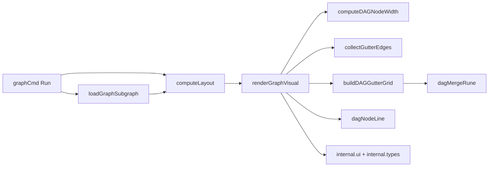

# graph_visual_terminal_dag

`graph_visual_terminal_dag` 这块代码的存在意义，可以用一句话概括：**把“依赖关系”从一堆抽象边，翻译成终端里一眼能读懂的执行拓扑图**。在 `bd graph` 的默认输出中，它不依赖浏览器、Graphviz 或富 UI，而是直接在纯文本终端中画出“层（layer）+ 箭头（gutter edges）”。这解决的是一个非常现实的问题：开发者常在 SSH、CI 日志、tmux、无图形环境下工作，仍需要快速判断“哪些 issue 现在可做、哪些被谁卡住”。

与朴素做法（例如直接打印 `A -> B` 列表，或简单缩进树）相比，这个模块的设计洞察是：**依赖图是二维信息**，既有“先后层次”（横向）也有“并行关系”（纵向）。因此它引入“节点列 + 层间 gutter 路由”的心智模型，把 DAG 信息压缩成可扫描的文本画布。

## 架构与数据流



从调用链看，`renderGraphVisual` 不是图计算器，而是**终端渲染编排器**。在 `graphCmd` 的默认分支里（未指定 `--box/--compact/--dot/--html`），流程是先 `loadGraphSubgraph` 装载子图，再 `computeLayout` 计算节点层和行位置，最后交给 `renderGraphVisual` 做“像素级”（字符级）绘制。

这意味着 `graph_visual_terminal_dag` 的架构角色不是业务决策层，而是一个**布局消费者 + 视图投影器**：它信任上游给的 `GraphLayout`，自己专注把该布局稳定地投射到终端字符串。

## 心智模型：把终端当作“有车道的立交桥图”

理解这段代码最有效的方式是想象一个立交桥：

- 每个 `Layer` 是一列收费站（同一层节点可并行）。
- 每列之间有固定宽度的“gutter”（车道区域）专门走边。
- 每条依赖边不是自由曲线，而是“先横向出站 -> 必要时垂直换道 -> 横向进入目标节点”的折线路由。
- 多条边共享同一个 gutter 网格时，通过 `dagMergeRune` 做字符级“交通合流”，把冲突合并成 `┼/┬/┴/├/┤` 这类交叉字符。

这个模型很工程化：它牺牲了几何最优（不是最短路径绘图），换来**可预测、稳定、可调试**的输出。

## 组件深潜

### `dagEdgeInfo`

`dagEdgeInfo` 只有 `sourceRow` 和 `targetRow`，刻意不带节点 ID。原因是它是一个**渲染中间态**，只服务于“某个 gutter 内该从哪一行连到哪一行”。在这个层面，身份信息已不重要，几何信息才重要。

这种降维简化让 `buildDAGGutterGrid` 可以完全不关心业务实体，专注画线。

### `renderGraphVisual(layout *GraphLayout, subgraph *TemplateSubgraph)`

这是模块主入口，负责整个渲染生命周期：

1. 基础校验与标题（空图直接输出 `Empty graph`）。
2. 计算统一节点宽度 `computeDAGNodeWidth`。
3. 统计最大层高（`maxRows`）决定画布总行数。
4. 按相邻层收集边 `collectGutterEdges`。
5. 逐个 gutter 预计算字符网格 `buildDAGGutterGrid`。
6. 逐行拼装：节点列（`dagNodeLine`）+ gutter 行。
7. 输出汇总信息（blocking 依赖数量与层数）。

关键设计点是“**先预计算 gutter，再逐行合成**”。如果在逐行阶段临时算每条边，会出现复杂状态和重复计算。现在的实现把“路由计算”和“最终拼接”分离，逻辑更清晰，也方便测试。

### `computeDAGNodeWidth(layout *GraphLayout) int`

它做的是“全局统一列宽”而不是每节点自适应。理由很实际：终端网格若列宽不一致，边与节点会错位。

宽度取值策略：

- 标题按 `truncateTitle(..., 22)` 后的 rune 长度计算（考虑 Unicode）。
- 同时比较 ID+Priority 行宽（`"%s P%d"`）。
- 再加内边距，最小值强制 `18`。

这里体现了“可读性优先于紧凑度”：即使标题很短，也保留最低宽度保证视觉稳定。

### `collectGutterEdges(layout, subgraph, numLayers)`

此函数把 `subgraph.Dependencies` 转成“按 gutter 分桶”的 `[][]dagEdgeInfo`。它只处理 `types.DepBlocks`，并且只接受 `tgt.Layer > src.Layer` 的前向边。

这背后有两个隐含契约：

- 该 DAG 视图只表达 blocking 关系，不展示其他依赖类型。
- 布局应当是拓扑有序的；反向边/同层回边会被忽略。

对跨多层边，函数会在每个中间 gutter 生成“通行段”。实现上它把中间段收敛到目标行（`tgt.Position`），这是一个简化路由策略：不追求几何美观，追求实现简单和输出稳定。

此外它有 per-gutter 去重（`edgeKey{s,t}`），避免同一行对重复画线。

### `dagNodeLine(node *GraphNode, nodeW, lineIdx int) string`

节点框是固定 4 行：上边框、标题行、ID+优先级行、下边框。状态渲染依赖 `internal/ui`：

- `ui.RenderStatusIcon` 画状态符号。
- `ui.GetStatusStyle` 取样式；`open` 状态刻意不着色（避免噪音）。
- `ui.RenderMuted` 弱化 ID 行。

该函数把“业务字段”映射为“视觉语义”。例如优先级被压缩成 `P%d`，使每个节点在狭窄终端中仍有调度信息。

### `buildDAGGutterGrid(edges, gutterW, totalLines, bandH)`

这是渲染核心算法。它先创建 `totalLines × gutterW` 的 rune 网格，然后逐条边写入。

同一行边：直接水平线到右侧箭头 `▶`。  
跨行边：

- 从左边水平走到 channel（`chX`）
- 用 `╮/╯` 下折或上折
- 中间竖线 `│`
- 目标行用 `╰/╭` 转向
- 再水平到右侧 `▶`

channel 分配只针对跨行边，按序“均匀摊开”。这是典型的**近似路由器**：简单、快、可预测，但在边很多时会拥挤。

### `dagMergeRune(existing, incoming rune) rune`

这是字符级冲突合并器，相当于一个很小的“图形 compositing 引擎”。例如：

- `│ + ─ => ┼`
- 竖线与拐角组合成 `├/┤`
- 横线与拐角组合成 `┬/┴`
- 箭头 `▶` 优先级最高

如果没有这个函数，多边重叠会互相覆盖，图会断裂或语义错误。

## 依赖分析（谁调用它 / 它调用谁）

从当前代码关系看：

- 上游调用者：`graphCmd` 的默认渲染路径会调用 `renderGraphVisual`（位于 [graph_command_core](graph_command_core.md) 对应的命令实现中）。
- 上游前置数据：`computeLayout` 产出 `GraphLayout`，`loadGraphSubgraph` 产出 `TemplateSubgraph`。
- 本模块下游依赖：
  - `internal.ui`：状态 icon、颜色样式、弱化文本、标题高亮。
  - `internal.types`：依赖类型 `types.DepBlocks`、状态常量 `types.StatusOpen`。
  - 同包工具函数：`truncateTitle`、`padRight`（定义于 graph 相关代码）。

数据契约最关键的是 `GraphLayout`：

- `Layers[layerIdx]` 中的 ID 必须能在 `Nodes` 中找到对应 `*GraphNode`。
- `GraphNode.Layer`、`GraphNode.Position` 应与 `Layers` 一致。
- 若契约被破坏，`renderGraphVisual` 在 `dagNodeLine(node, ...)` 处可能因 `node == nil` 触发 panic。

## 设计取舍与原因

这个模块有几个明显的“务实取舍”：

第一，它选择**固定尺寸 + 字符画**而非复杂自适应布局。好处是跨平台终端稳定，不依赖外部图形工具；代价是在超大图上可读性一般。

第二，它选择**只渲染 `DepBlocks`**。这与 `bd graph` 的“可执行顺序”语义一致：用户最关心谁阻塞谁。代价是信息不全，其他依赖语义被隐藏。

第三，它采用**两阶段渲染（预计算 gutter / 逐行输出）**。这提高了逻辑清晰度和可测试性；代价是会额外持有 gutter 网格内存，但对 CLI 规模通常可接受。

第四，它采用**近似 channel 路由**而非全局最优布线。性能和实现复杂度都更可控；代价是高密度边场景可能出现拥挤、重叠和美观下降。

## 使用方式与常见模式

最常见入口是 CLI 默认图模式：

```bash
bd graph <issue-id>
```

当不加 `--box/--compact/--dot/--html` 时，会走 `renderGraphVisual`。

调试渲染问题时，建议按这个顺序定位：

```go
subgraph, _ := loadGraphSubgraph(ctx, store, issueID)
layout := computeLayout(subgraph)
renderGraphVisual(layout, subgraph)
```

如果“节点位置对，但边不对”，优先看 `collectGutterEdges`；如果“边路由对，但字符断裂”，优先看 `buildDAGGutterGrid` 和 `dagMergeRune`。

## 新贡献者需要特别注意的坑

- `renderGraphVisual` 对空图和空层处理不完全对称：`len(layout.Nodes)==0` 会打印 `Empty graph`，但 `len(layout.Layers)==0` 只会提前返回（前面标题已打印）。
- `collectGutterEdges` 丢弃 `tgt.Layer <= src.Layer` 的边；若上游布局算法变化（如允许同层依赖）会“静默消失”。
- `gutterW` 固定为 6，跨行边多时 channel 会挤压重合，视觉可读性明显下降。
- `computeDAGNodeWidth` 使用 `truncateTitle(..., 22)` 参与宽度估算，这使得超长标题不会继续拉宽列；好处是整体不爆宽，代价是信息截断。
- 箭头终点总在 gutter 最右列（`gutterW-1`），意味着边视觉上是“指向下一列”，不是精确接到节点边框某个像素点，这是刻意简化。

## 参考阅读

若你要继续改这块代码，建议按依赖关系阅读以下文档：

- [graph_command_core](graph_command_core.md)：`bd graph` 命令入口、格式分发、`computeLayout` 与 `renderGraphVisual` 的衔接。
- [graph_export_formats](graph_export_formats.md)：同一布局如何投影到 DOT/HTML，便于比较不同渲染器职责边界。
- [issue_domain_model](issue_domain_model.md)：`types.Issue` / `types.Dependency` 的字段语义与依赖类型定义。
- [UI Utilities](UI Utilities.md)：`RenderStatusIcon`、状态样式等终端渲染基础设施。
