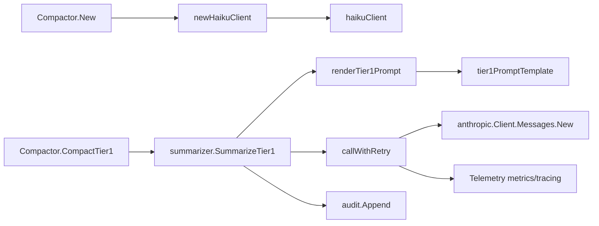

# haiku_summarization_client

`haiku_summarization_client`（对应代码在 `internal/compact/haiku.go`）可以把它想成“压缩流水线里的 AI 压缩机头”。上游已经决定某个 issue 可以被压缩，这个模块的职责不是决定“该不该压缩”，而是稳定地把一个结构化 issue 文本送给 Anthropic 模型，拿回可落库的短摘要，并把可观测性（trace/metrics）和审计（audit）做完整。朴素做法是直接 `client.Messages.New()` 一把梭，但在真实系统里你会立刻遇到超时、限流、非文本返回、上下文取消、API key 来源冲突、以及“审计失败不能拖垮主流程”等工程问题——这个模块存在的意义就是把这些硬问题集中封装掉。

## 它解决的核心问题：不是“能调用 LLM”，而是“可运营地调用 LLM”

在 compaction 场景里，LLM 只是一个子步骤，但这个子步骤有明显的不确定性：网络会抖、服务会 429/5xx、模型返回格式可能偏离预期、调用成本需要计量、调用历史需要留痕。`haikuClient` 的设计目标是把“不稳定外部依赖”变成“内部可预期组件”。

更具体地说，它解决了四件事：

1. **输入标准化**：用 `renderTier1Prompt` + `tier1PromptTemplate` 把 `types.Issue` 的关键信息映射成固定 prompt 结构，减少自由文本导致的输出漂移。
2. **调用韧性**：`callWithRetry` 做指数退避重试，并且只对明确可重试错误（超时、429、5xx）重试。
3. **可观测性**：通过 `telemetry.Tracer` 和 OTel metric 记录模型、耗时、token 消耗、重试次数。
4. **审计隔离**：`SummarizeTier1` 在 `auditEnabled` 时写 `audit.Entry`，但审计是 best-effort，不允许影响 compaction 主流程。

这就是它和“直接 SDK 调用”的本质差异：它是一个**带策略的网关**，而不只是 API 封装。

## 心智模型：把它当成“有保险丝的外部服务适配器”

理解这个模块最好的类比是“机房边界的 API 网关”：

- `renderTier1Prompt` 像入站规范化层，把业务对象翻译为下游能稳定理解的协议文本；
- `callWithRetry` 像弹性调用层，负责限流/超时/瞬时故障的恢复策略；
- metrics + trace 像监控面板，告诉你每次请求花了多少 token、多久、是否重试；
- audit 像合规日志侧车，记录 prompt/response，但绝不反向阻塞主链路。

所以 `haikuClient` 的关键抽象不是“模型客户端”，而是“**一次可追踪、可重试、可审计的摘要事务**”。

## 架构与数据流



从依赖关系看，这个模块位于 [compaction_orchestration](compaction_orchestration.md)（`Compactor`）的下游。`Compactor` 通过 `summarizer` 接口调用 `SummarizeTier1`，而 `haikuClient` 是该接口的默认实现。也就是说，`Compactor` 负责“业务编排”，`haikuClient` 负责“外部模型交互策略”。

一次完整调用路径如下：`Compactor.CompactTier1` 在通过 eligibility 检查后读取 issue，调用 `c.summarizer.SummarizeTier1(ctx, issue)`；随后 `haikuClient.SummarizeTier1` 先渲染 prompt，再进入 `callWithRetry` 发起 Anthropic 请求；成功后返回纯文本摘要给 `Compactor`，`Compactor` 再负责写回 issue 字段、记录 compaction 元数据与 comment。失败时错误向上返回，由 `Compactor` 决定如何处理批处理中的单条失败。

## 组件深潜

### `haikuClient`：状态聚合点

`haikuClient` 字段包含 `anthropic.Client`、`model`、`tier1Template`、重试参数以及审计开关/actor。这个结构把“运行时策略”与“外部依赖实例”绑定在一起，避免调用方每次手动组装。

值得注意的是它没有暴露大量 setter，策略主要在构造阶段固定（`newHaikuClient`），这是一种偏“不可变配置”的思路：减少运行中漂移，提升行为可预测性。

### `newHaikuClient(apiKey string) (*haikuClient, error)`：构造期防御

这个函数做了三层关键决策。

第一层是 API key 优先级：`ANTHROPIC_API_KEY` 环境变量覆盖显式传入 key。这个决策让运行时注入（CI/CD、容器密钥管理）拥有最高优先级，减少“代码参数和部署环境不一致”的事故。

第二层是失败分级：如果最终没有 key，会返回包装过的 `errAPIKeyRequired`。上游 `Compactor.New` 会识别这个错误并自动降级到 `DryRun`，而不是直接失败。换句话说，这里把“配置缺失”建模成“可降级错误”，而不是硬崩溃。

第三层是一次性初始化观测指标：`aiMetricsOnce.Do(initAIMetrics)`。这是一个典型的懒初始化 + 并发安全模式，避免重复注册 OTel instrument。

### `SummarizeTier1(ctx, issue)`：主入口与副作用编排

这个函数做两步主逻辑：渲染 prompt、调用带重试的模型请求。非显眼但很重要的设计是 audit 写入策略：即使调用失败，也会尝试写 `audit.Entry`（包含错误文本）；而且 audit 写入失败被显式忽略（`_, _ = audit.Append(e)`）。

这体现出非常明确的优先级：

- compaction 主链路成功/失败由 LLM 调用结果决定；
- audit 是“增强能力”，不能成为可用性单点。

关于 audit 数据结构，使用的是 [Audit](Audit.md) 模块中的 `audit.Entry`，并填充 `Kind`、`Actor`、`IssueID`、`Model`、`Prompt`、`Response`、`Error`。

### `callWithRetry(ctx, prompt)`：可靠性核心

这是模块最“工程化”的部分。它先创建 trace span（`anthropic.messages.new`），记录模型和操作属性，然后构造 `anthropic.MessageNewParams`（固定 `MaxTokens: 1024`，单条 user text message）。

重试循环从 `attempt := 0` 到 `h.maxRetries`，并在重试时使用指数退避：`initialBackoff * 2^(attempt-1)`。每次请求都会测量耗时毫秒；成功时记录三类指标：输入 token、输出 token、请求时延。span 还会记录 token 数和尝试次数。

响应解析上只接受首个 content block 且 `type == "text"`。这是一种“严格协议假设”：宁可快速报错，也不在这里做多模态兜底，保证下游拿到的永远是可写入 issue 的纯文本。

失败分支里，它先检查 `ctx.Err()`，确保取消/超时语义优先；然后用 `isRetryable` 判定是否继续。如果错误不可重试，会立刻打 span error 并返回；全部重试耗尽后返回 `failed after N retries`。

### `isRetryable(err)`：错误分类边界

可重试范围是：

- `net.Error` 且 `Timeout() == true`
- `*anthropic.Error` 且 status 是 `429` 或 `>=500`

不可重试范围是：

- `context.Canceled` / `context.DeadlineExceeded`
- 其他 4xx（通过 `*anthropic.Error` 分支隐式覆盖）
- 普通未知错误

这背后的取舍是“保守重试”：只对高概率瞬时故障重试，避免把参数错误、协议错误重试放大为额外成本。

### `tier1Data` 与 `renderTier1Prompt`

`tier1Data` 是模板输入 DTO，只包含 `Title/Description/Design/AcceptanceCriteria/Notes`。`renderTier1Prompt` 从 `types.Issue` 拿这几个字段执行模板渲染。

模板通过 `{{if .Design}}` 这类条件块做可选字段输出，避免空字段污染 prompt。模板末尾强约束输出格式（`Summary`、`Key Decisions`、`Resolution`）并要求“必须比原文更短”，这其实是在把下游 `Compactor` 的“体积缩减目标”前置到 prompt 指令层，降低“摘要变长”概率。

### `bytesWriter`

`bytesWriter.Write` 只是 append 到 `[]byte`。严格说它可被 `bytes.Buffer` 代替，但当前实现极简、零额外依赖且可控。这里的设计偏向“最小实现面”，代价是可读性略逊于标准库类型名。

## 依赖与契约分析

这个模块调用的关键外部能力有三类。其一是 Anthropic SDK：`anthropic.NewClient` 与 `client.Messages.New`，这是核心功能依赖；其二是观测栈：`telemetry.Meter` / `telemetry.Tracer` 与 OTel instrument；其三是审计：`audit.Append`。此外还依赖 [Configuration](Configuration.md) 提供的 `config.DefaultAIModel()` 来确定默认模型。

反向看谁依赖它：`Compactor.New` 在非 dry-run 时调用 `newHaikuClient`，并通过 `summarizer` 接口注入 `Compactor`；`Compactor.CompactTier1` 再通过该接口调用 `SummarizeTier1`。这种接口隔离让 `Compactor` 不与 Anthropic SDK 直接耦合，也使单元测试可以用 stub summarizer。

关键数据契约有三个：

- 输入契约：`SummarizeTier1` 接受 `*types.Issue`（来自 [Core Domain Types](Core%20Domain%20Types.md)）。
- 输出契约：返回 `string`，必须是可直接落回 `issue.description` 的纯文本。
- 错误契约：调用方依赖 error 语义来决定是否中断当前 issue 的 compaction。

如果上游 `types.Issue` 字段发生重命名，`renderTier1Prompt` 会立刻受影响；如果 Anthropic 返回 content 结构变化，`callWithRetry` 的“仅 text block”解析会失败并暴露错误。这些都属于“显式失败优于静默降级”的设计选择。

## 设计取舍与隐含决策

这个模块明显偏向正确性和可运营性，而不是极致灵活。

首先是**简单性 vs 灵活性**：目前只有 Tier1 模板和单一 `SummarizeTier1` 路径，没有做策略插件化。这让代码短小、行为一致，但也意味着未来引入多模板/多模型时需要扩展结构。

其次是**成本 vs 稳定性**：开启重试会增加 token 与请求成本，但对 429/5xx/网络超时的恢复收益很高，符合“离线批处理 compaction 可以接受稍高延迟”的场景特征。

再次是**耦合 vs 自治**：`haikuClient` 与 Anthropic 响应格式有一定耦合（只取第一个 text block），降低了通用性；但它让 `Compactor` 上层几乎不用关心任何模型细节，换来上层自治与简洁。

最后是**观测完整性 vs 主流程可用性**：audit 采取 best-effort，metrics 初始化失败也不阻断主流程（代码忽略 instrument 创建 error）。这是典型“生产优先可用”的决策。

## 使用方式与实践示例

虽然 `haikuClient` 本身是内部实现，实际入口通常是 `compact.New(...)`。下面示例展示了它如何间接工作：

```go
cfg := &compact.Config{
    APIKey:       "",
    Concurrency:  5,
    DryRun:       false,
    AuditEnabled: true,
    Actor:        "compactor-bot",
}

c, err := compact.New(store, "", cfg)
if err != nil {
    // 仅当非 API key 类致命错误才会返回
    return err
}

err = c.CompactTier1(ctx, "bd-123")
if err != nil {
    // 可能是 ineligible、summarize 失败、或摘要不够短
}
```

新贡献者常用的调试开关是 `DryRun`。当没有 API key 时，`New` 会自动切到 dry-run（基于 `errAPIKeyRequired`），这在本地开发和 CI 非密钥环境下非常实用。

## 边界条件与易踩坑

第一，`SummarizeTier1` 没有对 `issue == nil` 做防御；当前调用链由 `Compactor` 保证非空。如果未来直接复用该方法，需要额外保护。

第二，`callWithRetry` 固定 `MaxTokens: 1024`。这对超长 issue 可能导致摘要截断风险；是否需要动态 token 上限，取决于未来数据分布。

第三，返回解析只接受 `message.Content[0]` 且必须是 text。若模型返回多个 block 或前置非文本 block，会被判为格式错误。

第四，prompt 明确要求“摘要更短”，但这只是模型指令，不是数学保证。最终“是否真的变短”由上游 `Compactor.CompactTier1` 再次做硬校验（`compactedSize >= originalSize` 时拒绝写回）。这是一条非常关键的双保险。

第五，审计会记录完整 prompt/response。开启 `AuditEnabled` 前要确认组织对数据留存和敏感信息治理的要求。

## 参考阅读

- [Core Domain Types](Core%20Domain%20Types.md)：`types.Issue` 字段定义与语义。
- [Audit](Audit.md)：`audit.Entry` 与 `audit.Append` 所在模块。
- [Configuration](Configuration.md)：默认模型配置来源（`config.DefaultAIModel()`）。
- [Dolt Storage Backend](Dolt%20Storage%20Backend.md)：`Compactor` 最常见的存储后端。

如果你下一步要改 `haiku_summarization_client`，建议先通读 `internal/compact/compactor.go`，因为这个模块的“业务约束”（何时调用、失败如何处理、摘要落库策略）都在 `Compactor` 中定义，而 `haikuClient` 只是把这些约束可靠地执行到外部模型。