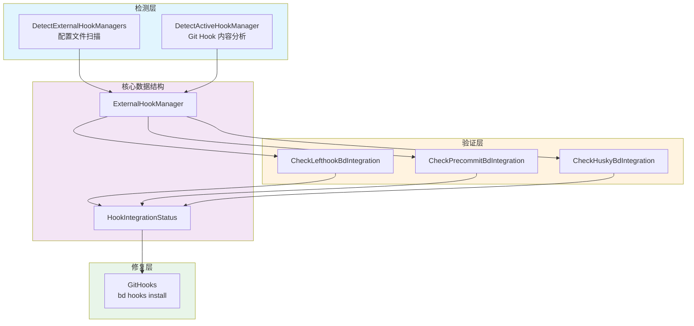

# hook 集成检测与修复

## 模块概述

想象一下，你的团队使用 Git 进行版本控制，同时引入了多种自动化工具来保证代码质量 —— 有人在 `pre-commit` 时运行 lint，有人在 `pre-push` 时运行测试。这些工具被称为 **Git Hook 管理器**（如 lefthook、husky、pre-commit 等）。现在，`bd` 工具也需要在这些钩子触发时执行自己的逻辑（例如同步 issue 状态、更新依赖关系）。

**核心问题**：当多个钩子管理器共存时，如何确保 `bd` 的钩子能被正确触发，同时不破坏现有的钩子配置？

这个模块就是为了解决这个问题而存在的。它扮演着一个 **"钩子生态系统的诊断医生"** 角色：
1. **检测** —— 识别项目中使用了哪些外部钩子管理器
2. **验证** —— 检查这些管理器是否已正确集成 `bd hooks run` 命令
3. **修复** —— 自动修复缺失或损坏的钩子配置，同时尊重现有配置

 naive 的方案会直接覆盖 `.git/hooks/` 目录，但这会破坏团队已有的钩子配置。本模块的设计洞察是：**钩子集成应该是协作式的，而非覆盖式的**。通过识别现有管理器并采用链式调用（`--chain` 参数），`bd` 可以优雅地融入现有工作流。

## 架构设计



### 数据流 walkthrough

整个模块的工作流程遵循 **"检测 → 验证 → 修复"** 的三段式模式：

1. **检测阶段**（`DetectExternalHookManagers` + `DetectActiveHookManager`）
   - 首先扫描项目根目录，查找已知钩子管理器的配置文件（如 `lefthook.yml`、`.husky/` 目录等）
   - 然后读取 `.git/hooks/` 目录中的实际钩子脚本内容，通过正则匹配确定哪个管理器真正安装了这些钩子
   - 为什么需要两步检测？因为配置文件的 presence 不代表钩子已激活 —— 用户可能安装了 lefthook 但忘记运行 `lefthook install`

2. **验证阶段**（`Check*Integration` 系列函数）
   - 根据检测到的管理器类型，调用对应的验证函数
   - 解析管理器的配置文件（支持 YAML/TOML/JSON 多格式），检查 `pre-commit`、`post-merge`、`pre-push` 三个推荐钩子是否包含 `bd hooks run` 命令
   - 生成 `HookIntegrationStatus` 报告，明确区分：已集成的钩子、已配置但未集成 `bd` 的钩子、完全未配置的钩子

3. **修复阶段**（`GitHooks`）
   - 如果检测到外部管理器，使用 `--chain` 参数调用 `bd hooks install`，确保新钩子会链式调用现有钩子
   - 如果没有外部管理器，直接安装 `bd` 的原生钩子

### 架构角色定位

这个模块在整体系统中扮演 **诊断与修复工具** 的角色，位于 `cmd.bd.doctor` 子系统下。它的上游调用者是 `doctor` 命令的诊断流程，下游依赖是文件系统（读取配置文件和钩子脚本）以及 `bd` 二进制本身（执行修复命令）。

关键的设计约束是：**它不应该修改任何配置，只负责报告和提供修复建议**。实际的配置修改由 `GitHooks` 函数通过调用 `bd hooks install` 来完成，这保持了职责分离。

## 核心组件深度解析

### ExternalHookManager

**设计意图**：这是一个轻量级的数据传输对象（DTO），用于封装检测到的外部钩子管理器信息。

```go
type ExternalHookManager struct {
    Name       string // e.g., "lefthook", "husky", "pre-commit"
    ConfigFile string // Path to the config file that was detected
}
```

**为什么需要这个结构**？想象你在一个大型 monorepo 中工作，不同子项目可能使用不同的钩子管理器。这个结构允许系统精确报告："项目 A 使用 lefthook（配置文件在 `lefthook.yml`），项目 B 使用 husky（配置文件在 `.husky/`）"。这种细粒度的信息对于后续的修复决策至关重要。

**内部机制**：该结构本身没有行为，纯粹是数据载体。它的值由 `DetectExternalHookManagers` 函数填充，然后传递给验证函数和状态报告。

**使用注意**：`ConfigFile` 字段存储的是相对于项目根目录的路径（如 `lefthook.yml`），而非绝对路径。这在生成用户友好的错误消息时很有用，但在实际读取文件时需要与项目路径拼接。

### HookIntegrationStatus

**设计意图**：这是模块的核心输出结构，代表一次钩子集成检查的完整结果。

```go
type HookIntegrationStatus struct {
    Manager          string   // Hook manager name
    HooksWithBd      []string // Hooks that have bd integration (bd hooks run)
    HooksWithoutBd   []string // Hooks configured but without bd integration
    HooksNotInConfig []string // Recommended hooks not in config at all
    Configured       bool     // Whether any bd integration was found
    DetectionOnly    bool     // True if we detected the manager but can't verify its config
}
```

**为什么设计这三个列表**？这是一种 **分类报告模式**。想象医生给你体检报告，不会只说"你有健康问题"，而是会列出："已治疗的疾病"、"已诊断但未治疗的疾病"、"建议筛查但未筛查的项目"。同样的，这个结构让用户一目了然地知道：
- `HooksWithBd` —— 一切正常，无需操作
- `HooksWithoutBd` —— 需要手动添加 `bd hooks run` 到现有配置
- `HooksNotInConfig` —— 需要先在配置文件中添加该钩子的定义

**`DetectionOnly` 字段的深意**：这是一个重要的设计信号。当系统检测到某个钩子管理器（如 overcommit、yorkie），但没有实现针对该管理器的验证逻辑时，会设置此标志为 `true`。这告诉用户："我知道你在用这个工具，但我无法验证集成状态，请手动检查"。这是一种 **诚实的降级策略** —— 与其给出错误的肯定/否定，不如明确承认能力边界。

### DetectExternalHookManagers

**设计意图**：通过文件系统扫描，识别项目中存在哪些钩子管理器的配置文件。

**内部机制**：
```go
func DetectExternalHookManagers(path string) []ExternalHookManager {
    var managers []ExternalHookManager
    for _, mgr := range hookManagerConfigs {
        for _, configFile := range mgr.configFiles {
            configPath := filepath.Join(path, configFile)
            if info, err := os.Stat(configPath); err == nil {
                if info.IsDir() || info.Mode().IsRegular() {
                    managers = append(managers, ExternalHookManager{
                        Name:       mgr.name,
                        ConfigFile: configFile,
                    })
                    break // Only report each manager once
                }
            }
        }
    }
    return managers
}
```

这个函数采用 **配置驱动的检测策略**。`hookManagerConfigs` 是一个预定义的列表，按优先级排序，每个条目包含管理器名称和可能的配置文件路径列表。例如，lefthook 支持 15 种不同的配置文件变体（YAML/TOML/JSON 三种格式 × 5 种位置变体）。

**为什么需要这么多配置文件变体**？因为不同团队有不同的约定。有些团队喜欢把配置文件放在 `.config/` 目录下以保持根目录整洁，有些团队喜欢用 `.lefthook.yml`（带前导点）来隐藏文件。模块通过穷举所有常见变体来最大化检测覆盖率。

**`break` 语句的关键作用**：一旦检测到某个管理器的任意一个配置文件，就立即跳出内层循环。这避免了重复报告同一个管理器（例如，同时报告 `lefthook.yml` 和 `lefthook.toml`）。

### DetectActiveHookManager

**设计意图**：通过读取 `.git/hooks/` 目录中的实际钩子脚本内容，确定哪个管理器真正安装了这些钩子。

**为什么需要这个函数**？这是一个关键的 **防御性设计**。考虑以下场景：
- 项目中有 `lefthook.yml` 配置文件，但用户从未运行 `lefthook install`
- 项目中同时有 `lefthook.yml` 和 `.pre-commit-config.yaml`，但只有其中一个真正生效

仅检查配置文件会给出错误结论。通过读取钩子脚本内容并匹配特征字符串（如 `lefthook`、`husky.sh`、`pre-commit run`），可以确定实际生效的管理器。

**内部机制**：
1. 使用 `git rev-parse --git-common-dir` 获取 Git 仓库的公共目录（这正确处理了 worktree 场景，其中 `.git` 是文件而非目录）
2. 检查 `core.hooksPath` 配置，支持自定义钩子路径
3. 读取 `pre-commit`、`pre-push`、`post-merge` 三个常见钩子的内容
4. 按优先级顺序匹配正则表达式，返回第一个匹配的管理器名称

**优先级排序的深意**：注意 `hookManagerPatterns` 中 `prek` 排在 `pre-commit` 之前。这是因为 prek 是 pre-commit 的 Rust 替代品，使用相同的配置文件格式，但钩子脚本中会包含 `prek run` 而非 `pre-commit run`。如果顺序颠倒，prek 安装的钩子可能被错误识别为 pre-commit。

### CheckLefthookBdIntegration

**设计意图**：解析 lefthook 配置文件，检查推荐钩子是否已集成 `bd hooks run` 命令。

**内部机制**：
1. 遍历 `lefthookConfigFiles` 列表，找到第一个存在的配置文件
2. 根据文件扩展名选择解析器（YAML/TOML/JSON）
3. 将配置解析为 `map[string]interface{}`（通用 JSON 树结构）
4. 对每个推荐钩子（`pre-commit`、`post-merge`、`pre-push`），检查配置中是否存在该钩子定义
5. 如果存在，调用 `hasBdInCommands` 递归检查是否包含 `bd hooks run` 命令

**`hasBdInCommands` 的双语法支持**：Lefthook 在 v1.10.0 引入了新的 `jobs` 数组语法，替代了旧的 `commands` 映射语法。这个函数同时支持两种语法：
```go
// 旧语法 (commands)
pre-commit:
  commands:
    bd:
      run: bd hooks run

// 新语法 (jobs)
pre-commit:
  jobs:
    - run: bd hooks run
```

**正则表达式 `bdHookPattern` 的设计**：
```go
var bdHookPattern = regexp.MustCompile(`\bbd\s+hooks\s+run\b`)
```
使用 `\b` 单词边界确保匹配的是完整的命令，而非子字符串（避免误匹配 `some-bd hooks runner` 之类的内容）。`\s+` 允许命令之间有多个空格，增加鲁棒性。

### CheckPrecommitBdIntegration

**设计意图**：解析 pre-commit 配置文件，检查是否已集成 `bd hooks run` 命令。

**与 lefthook 验证的关键差异**：pre-commit 的配置结构是 `repos` 列表，每个 repo 包含 `hooks` 列表，每个 hook 有 `entry` 字段指定要运行的命令。验证逻辑需要遍历这个三层嵌套结构。

**阶段（stages）处理的复杂性**：pre-commit 允许为每个 hook 指定 `stages` 字段，定义该 hook 在哪些 Git 事件触发。例如：
```yaml
- id: bd-hooks
  entry: bd hooks run
  stages: [pre-commit, pre-push]
```
`getPrecommitStages` 函数负责提取并规范化这些阶段名称。它处理了 legacy 阶段名称（如 `commit` → `pre-commit`），确保与推荐的钩子名称列表一致。

**为什么 `hooksWithBd` 使用 map 而非 slice**？因为一个 `bd hooks run` 条目可能覆盖多个阶段（如上例同时覆盖 `pre-commit` 和 `pre-push`）。使用 map 可以避免重复计数，并支持 O(1) 查找。

### CheckHuskyBdIntegration

**设计意图**：检查 `.husky/` 目录中的钩子脚本是否包含 `bd hooks run` 命令。

**与配置文件解析的差异**：husky 不使用集中式配置文件，而是为每个钩子创建独立的脚本文件（如 `.husky/pre-commit`）。验证逻辑简化为：
1. 检查 `.husky/` 目录是否存在
2. 对每个推荐钩子，读取对应的脚本文件
3. 直接搜索文件内容中是否包含 `bd hooks run`

**设计权衡**：这种方法的优点是简单直接，缺点是无法区分"钩子未配置"和"钩子配置但未集成 bd"。在 husky 场景下，如果脚本文件不存在，统一归类为 `HooksNotInConfig`。

### GitHooks

**设计意图**：修复缺失或损坏的 Git 钩子，通过调用 `bd hooks install` 命令。

**核心设计决策**：这个函数不直接修改文件，而是委托给 `bd hooks install` 子命令。这遵循了 **单一职责原则** —— 诊断模块负责发现问题，修复模块负责解决问题。

**`--chain` 参数的战略意义**：
```go
if len(externalManagers) > 0 {
    args = append(args, "--chain")
}
```
当检测到外部钩子管理器时，添加 `--chain` 参数。这会告诉 `bd hooks install` 生成链式调用的钩子脚本，确保新钩子执行后会继续调用现有的钩子。这是实现 **非破坏性集成** 的关键。

**`--force` 参数的理由**：注释中提到 "GH#1466"，表明这是一个基于用户反馈的设计决策。使用 `--force` 可以干净地替换过时的钩子，而不创建备份文件，避免仓库污染。

**Git 仓库验证**：使用 `git rev-parse --git-dir` 而非检查 `.git` 目录存在性，这正确处理了 worktree 场景（其中 `.git` 是文件，指向主仓库）。

## 依赖关系分析

### 上游调用者

这个模块主要被 `cmd.bd.doctor` 子系统调用，具体是 `doctor fix` 命令的诊断流程。调用模式通常是：
```go
status := CheckExternalHookManagerIntegration(repoPath)
if status != nil && !status.Configured {
    // 报告问题并建议修复
}
```

**隐式契约**：调用者期望：
1. 返回 `nil` 表示未检测到任何钩子管理器（而非错误）
2. 返回的 `HookIntegrationStatus` 中 `Manager` 字段始终非空（如果非 nil）
3. 函数不会修改文件系统（只读操作）

### 下游依赖

1. **文件系统**（`os` 包）：读取配置文件和钩子脚本
   - 隐式假设：文件路径是可信的（代码中有 `// #nosec G304` 注释，表明已审计路径来源）
   
2. **Git 命令行**（`exec.Command("git", ...)`）：获取仓库元数据
   - 隐式假设：`git` 在 PATH 中可用
   - 错误处理：如果 Git 命令失败，函数返回空字符串或 nil，而非传播错误

3. **配置解析库**（`toml`、`yaml.v3`、`json`）：解析不同格式的配置文件
   - 设计决策：使用 `map[string]interface{}` 而非强类型结构，因为不同管理器的配置 schema 差异很大

4. **`bd` 二进制自身**（`getBdBinary()`、`newBdCmd()`）：执行修复命令
   - 隐式假设：`bd` 二进制在 PATH 中可用，或通过某种机制可定位

### 数据契约

`HookIntegrationStatus` 是模块的主要输出契约。调用者可以根据以下字段做出决策：
- `Configured == true` → 无需操作
- `HooksWithoutBd` 非空 → 建议用户手动添加 `bd hooks run` 到现有配置
- `HooksNotInConfig` 非空 → 建议运行 `GitHooks` 函数进行修复
- `DetectionOnly == true` → 告知用户需要手动验证

## 设计决策与权衡

### 检测策略：配置文件 vs 钩子内容

**决策**：同时使用两种检测方式，优先信任钩子内容检测。

**权衡分析**：
- 仅检查配置文件：优点是快速，缺点是可能报告未激活的管理器
- 仅检查钩子内容：优点是准确，缺点是无法检测未安装的管理器

**当前方案**：先扫描配置文件获取候选列表，再读取钩子内容确定实际生效的管理器。如果钩子内容检测失败，回退到配置文件检测。这是一种 **防御性分层策略**。

### 优先级排序的必要性

**决策**：`hookManagerConfigs` 和 `hookManagerPatterns` 都显式按优先级排序。

**为什么不能按字母顺序**？考虑以下冲突场景：
- prek 和 pre-commit 使用相同的配置文件（`.pre-commit-config.yaml`）
- 如果按字母顺序，pre-commit 会先匹配，导致 prek 用户被错误分类

**设计洞察**：优先级排序是一种 **特异性原则** 的实现 —— 更具体的匹配规则应该先于更通用的规则。

### 多格式配置解析

**决策**：lefthook 支持 YAML、TOML、JSON 三种格式，模块为每种格式实现独立的解析分支。

**替代方案**：可以要求用户统一使用某种格式，或只支持最流行的格式。

**为什么选择多格式支持**？这是 **用户友好性优先** 的决策。不同团队有不同的配置偏好，强制统一会增加采用阻力。代价是代码复杂度增加（三个解析分支），但考虑到 lefthook 是官方支持的功能，这个代价是可接受的。

### 只读验证 vs 自动修复

**决策**：验证函数（`Check*Integration`）只读不写，修复函数（`GitHooks`）委托给子命令。

**设计洞察**：这是一种 **关注点分离** 模式。验证逻辑可以安全地在诊断流程中频繁调用，而修复逻辑需要用户确认（因为会修改文件）。如果混合在一起，会导致诊断命令有意外的副作用。

### 正则表达式 vs AST 解析

**决策**：使用正则表达式匹配钩子脚本内容，而非解析 shell 脚本 AST。

**权衡分析**：
- AST 解析：准确，但需要引入额外的解析库，且不同 shell（bash/zsh）语法有差异
- 正则匹配：可能有误报/漏报，但实现简单，覆盖常见场景

**为什么选择正则**？钩子脚本通常是简单的命令序列，而非复杂的 shell 逻辑。正则匹配 `bd\s+hooks\s+run` 足以覆盖 99% 的使用场景，代价是极端边缘情况可能误判。这是一个 **务实的 80/20 法则** 应用。

## 使用指南

### 基本使用模式

```go
// 检测并验证钩子集成
status := CheckExternalHookManagerIntegration(repoPath)
if status == nil {
    fmt.Println("未检测到外部钩子管理器")
    return
}

if status.DetectionOnly {
    fmt.Printf("检测到 %s，但无法验证集成状态，请手动检查\n", status.Manager)
    return
}

if !status.Configured {
    fmt.Printf("%s 未集成 bd hooks\n", status.Manager)
    if len(status.HooksNotInConfig) > 0 {
        fmt.Printf("缺失的钩子：%v\n", status.HooksNotInConfig)
    }
    if len(status.HooksWithoutBd) > 0 {
        fmt.Printf("未集成 bd 的钩子：%v\n", status.HooksWithoutBd)
    }
    
    // 执行修复
    if err := GitHooks(repoPath); err != nil {
        fmt.Printf("修复失败：%v\n", err)
    }
}
```

### 配置选项

本模块没有运行时配置选项，行为由硬编码的 `hookManagerConfigs` 和 `recommendedBdHooks` 控制。如果需要支持新的钩子管理器，需要修改源代码。

### 扩展新管理器

添加对新钩子管理器的支持需要三步：

1. **添加配置检测**：在 `hookManagerConfigs` 中添加新条目
```go
{"new-manager", []string{".new-manager-config.yaml"}},
```

2. **添加钩子内容检测**：在 `hookManagerPatterns` 中添加正则模式
```go
{"new-manager", regexp.MustCompile(`(?i)new-manager`)},
```

3. **实现验证逻辑**：添加 `CheckNewManagerBdIntegration` 函数，并在 `checkManagerBdIntegration` 中注册

## 边界情况与陷阱

### 陷阱 1：配置文件存在但钩子未安装

**场景**：项目中有 `lefthook.yml`，但用户从未运行 `lefthook install`。

**表现**：`DetectExternalHookManagers` 返回 lefthook，但 `DetectActiveHookManager` 返回空字符串。

**处理策略**：`CheckExternalHookManagerIntegration` 会回退到检查配置文件，但生成的 `HookIntegrationStatus` 可能不准确。用户需要手动运行 `lefthook install`。

**缓解建议**：在诊断报告中明确区分"配置文件存在"和"钩子已激活"。

### 陷阱 2：多个管理器共存

**场景**：项目中同时有 `lefthook.yml` 和 `.pre-commit-config.yaml`。

**表现**：`DetectExternalHookManagers` 返回两个管理器，但 `DetectActiveHookManager` 只返回一个（实际生效的）。

**处理策略**：优先使用 `DetectActiveHookManager` 的结果。如果返回空，则按 `hookManagerConfigs` 顺序检查第一个有验证逻辑的管理器。

**潜在问题**：如果用户确实想同时使用两个管理器（例如 lefthook 管理 pre-commit，pre-commit 管理 lint），当前逻辑可能只报告其中一个的状态。

### 陷阱 3：自定义钩子路径

**场景**：用户设置了 `git config core.hooksPath .githooks`。

**表现**：`DetectActiveHookManager` 可能找不到钩子文件，因为默认搜索 `.git/hooks/`。

**处理策略**：代码中已处理此场景，通过 `git config --get core.hooksPath` 获取自定义路径。但如果 `core.hooksPath` 是相对路径且包含变量（如 `$GIT_DIR/hooks`），可能解析失败。

### 陷阱 4：配置文件解析失败

**场景**：`lefthook.yml` 包含 YAML 语法错误。

**表现**：`CheckLefthookBdIntegration` 返回 nil，调用者可能误认为"未检测到 lefthook"。

**处理策略**：当前实现静默失败（返回 nil），不报告解析错误。这是一个 **已知限制**。

**缓解建议**：在诊断流程中，如果检测到配置文件但验证返回 nil，应提示用户检查配置文件语法。

### 陷阱 5：bd 二进制不可用

**场景**：`GitHooks` 函数调用 `getBdBinary()` 失败。

**表现**：返回错误 "failed to get bd binary"。

**处理策略**：这是预期行为，调用者应捕获错误并提示用户确保 `bd` 在 PATH 中。

### 已知限制

1. **不支持的管理器**：overcommit、yorkie、simple-git-hooks 只能检测，无法验证集成状态（`DetectionOnly = true`）

2. **单钩子验证**：验证逻辑假设每个钩子管理器只有一个配置文件。如果项目有多个配置文件（如 monorepo），可能只报告其中一个的状态

3. **动态配置**：不支持通过环境变量或条件逻辑动态生成的配置（如 `lefthook.local.yml` 覆盖）

4. **钩子执行顺序**：不验证链式调用中钩子的执行顺序，只验证是否存在 `bd hooks run`

## 参考链接

- [诊断核心模块](诊断核心.md) — 父模块，包含 doctor 命令的整体架构
- [维护清理执行](维护清理执行.md) — 兄弟模块，包含其他维护命令的实现
- [Hooks](Hooks.md) — `bd hooks` 命令的实现，被本模块调用进行修复
- [CLI Hook Commands](CLI Hook Commands.md) — 钩子相关的 CLI 命令定义
