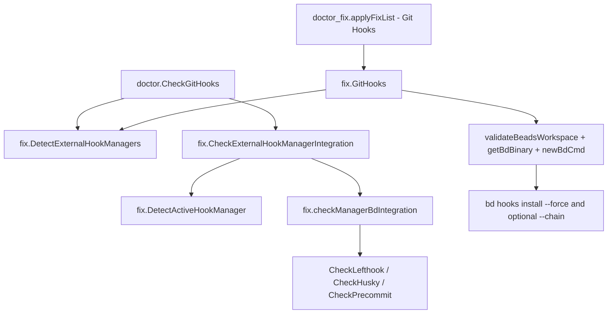

# hook_manager_detection_and_safe_hook_fix

这个模块可以理解为 `bd doctor` 里“和外部 Git Hook 生态和平共处”的适配层。它要解决的不是“能不能装上 bd hooks”这么简单，而是：当仓库里已经有 `lefthook`、`husky`、`pre-commit`、`prek` 等工具时，`bd` 如何在**不破坏既有 hook 管理链路**的前提下判断集成状态、给出诊断、并在修复时选择安全策略。朴素做法是直接覆盖 `.git/hooks/*`，但那会把外部工具的行为打断；这个模块的核心设计洞察是：**先检测谁在管 hooks，再决定如何检查与安装，默认优先保留外部管理器（通过 chain）**。

## 架构角色与数据流



在系统中，这个模块扮演的是“诊断+安全修复策略器（policy adapter）”。

上游入口有两个：第一是 [`CheckGitHooks`](dolt_connection_and_core_checks.md)（`cmd/bd/doctor/git.go`），它在检测到外部 hook manager 时调用 `DetectExternalHookManagers` 与 `CheckExternalHookManagerIntegration`，并把结果映射成 `DoctorCheck`。第二是 `cmd/bd/doctor_fix.go` 的 `applyFixList`，当检查项名称是 `"Git Hooks"` 时，会调用 `fix.GitHooks(path)` 执行自动修复。

下游依赖分三类。第一类是 Git 运行时探测：`DetectActiveHookManager` 会执行 `git rev-parse --git-common-dir` 与 `git config --get core.hooksPath`，并读取 hook 文件内容识别签名。第二类是配置解析：`CheckLefthookBdIntegration` 支持 YAML/TOML/JSON，`CheckPrecommitBdIntegration` 解析 YAML，`CheckHuskyBdIntegration` 直接读取 `.husky/<hook>` 脚本。第三类是修复执行：`GitHooks` 最终通过 `newBdCmd(...)` 调 `bd hooks install --force`，并在发现外部 manager 时附加 `--chain`。

## 它解决的问题：为什么不能“直接安装 hooks”

真实仓库里常见一个情况：团队已经使用 `husky` 或 `pre-commit` 维护 hook，`bd` 只是其中一个步骤。若 `bd doctor --fix` 粗暴覆盖 `.git/hooks/pre-commit`，外部 manager 可能失效，最终变成“修一个问题，制造另一个问题”。

因此模块将问题拆成三层：

1. **存在性检测**：仓库里有没有外部 manager（通过配置文件或目录）。
2. **活跃性判定**：真正安装到 Git hooks 里的到底是谁（读实际 hook 脚本签名，比只看配置文件更可靠）。
3. **bd 集成度检查**：该 manager 的配置里，推荐的 hook（`pre-commit`/`post-merge`/`pre-push`）是否调用了 `bd hooks run`。

这三层分开后，修复逻辑就可以做“最小侵入”：检测到外部 manager 时走 `--chain`，避免破坏既有链路。

## 心智模型：把它当作“多航司共用登机口的地勤协调员”

想象一个机场：`git hooks` 是登机口，`bd` 和 `lefthook/husky/pre-commit` 都想在登机前检查旅客。朴素方案是 `bd` 把自己锁进登机口，不让别人用；这个模块则像地勤协调员，先确认当前是谁在执勤（active manager），再检查协作流程里有没有 `bd` 这一站，最后在修复时选择“串联安检（chain）”而不是“替换安检”。

你在脑子里可以维护三个抽象：

- `ExternalHookManager`：**发现了谁**（名字 + 发现依据文件）。
- `HookIntegrationStatus`：**bd 集成到了什么程度**（哪些 hook 已接入、哪些缺失、是否仅能检测不能验证）。
- `GitHooks`：**最终修复策略执行器**（校验环境并调用 `bd hooks install`，是否 `--chain` 由检测结果驱动）。

## 组件深挖

### `type ExternalHookManager`

`ExternalHookManager` 只是一个轻量检测结果载体：`Name` 和 `ConfigFile`。设计上它只表达“看到线索”，不表达“正在生效”。这也是后面还要 `DetectActiveHookManager` 的原因——存在配置文件不等于当前 hooks 真由它接管。

### `type hookManagerConfig` 与 `hookManagerConfigs`

`hookManagerConfig` 是内部表驱动结构，把 manager 名称和可识别的配置文件路径放在一起。`hookManagerConfigs` 列表是**有优先级顺序**的：比如 `lefthook` 在前，`pre-commit` 与 `prek` 共用配置文件但后续再由 active 检测区分。

这里的取舍是“可维护性优先于插件化”：新增 manager 很简单（加一段配置），但并没有动态注册机制，属于编译期固定策略。

### `DetectExternalHookManagers(path string) []ExternalHookManager`

这是第一层粗筛。它遍历 `hookManagerConfigs` 的 `configFiles`，通过 `os.Stat` 判断路径存在，并接受目录或普通文件（`.husky` 目录就是典型目录型配置）。一旦某个 manager 命中任意配置文件，就 `break`，保证每个 manager 只上报一次。

关键点是“按顺序返回”的稳定性：测试 `TestDetectExternalHookManagers_MultiplePresentInOrder` 明确验证了多 manager 并存时结果顺序与配置优先级一致。这为后续 fallback 选择提供了可预测行为。

### `type HookIntegrationStatus`

这是模块的核心诊断合同，字段含义有明显分层：

- `HooksWithBd`：推荐 hooks 中已调用 `bd hooks run` 的集合。
- `HooksWithoutBd`：该 hook 已配置，但没接入 bd。
- `HooksNotInConfig`：配置里根本没出现该推荐 hook。
- `Configured`：是否至少发现一个 bd 集成点。
- `DetectionOnly`：只知道 manager 存在，但无法可靠解析配置验证。

这个结构的价值在于能让上游 `CheckGitHooks` 生成更细粒度文案，而不是“有/没有 bd”二元判断。

### `bdHookPattern`

`bdHookPattern = \bbd\s+hooks\s+run\b` 是跨 manager 共用的语义锚点。它故意允许任意空白（`\s+`），并要求词边界（避免匹配 `kbd` 之类）。

但要注意，它只做文本匹配，不理解 shell AST；测试中也明确“注释里写了 `bd hooks run` 也会匹配”。这是性能与实现复杂度上的有意折中。

### `type hookManagerPattern` 与 `hookManagerPatterns`

这组正则用于从**实际 hook 脚本内容**反推出 active manager。顺序非常关键，尤其 `prek` 必须在 `pre-commit` 前：因为某些 `prek` 生成内容可能包含 `pre-commit` 字样，如果顺序错了会误判。

### `DetectActiveHookManager(path string) string`

这是本模块最有“运行时真实感”的函数。流程是：

1. `git rev-parse --git-common-dir` 定位共享 hooks 根（兼容 worktree）。
2. 读取 `core.hooksPath`（若设置则覆盖默认 hooks 目录，支持相对路径）。
3. 依次读取 `pre-commit`、`pre-push`、`post-merge` 文件。
4. 按 `hookManagerPatterns` 顺序匹配签名，首个命中即返回。

为什么这样设计：同一仓库可能残留多个 manager 的配置文件，但真正执行的是 hooks 目录里的脚本。对“谁是 active manager”这个问题，读脚本比读配置更接近事实。

### `CheckLefthookBdIntegration(path string) *HookIntegrationStatus`

它先在 `lefthookConfigFiles` 中找首个存在配置，再按扩展名选择解码器：`.toml` 用 `toml.Decode`，`.json` 用 `json.Unmarshal`，其余按 YAML。然后检查推荐 hooks（`pre-commit`、`post-merge`、`pre-push`）各自是否含 bd 集成。

真正的结构遍历交给 `hasBdInCommands`：同时支持 lefthook 旧的 `commands.*.run` 与新 `jobs[*].run`。这个兼容层是该函数的核心设计点，避免把 lefthook 版本差异上推到调用方。

### `hasBdInCommands(hookSection interface{}) bool` / `hasBdInRunField(config interface{}) bool`

两者是“弱类型 map 遍历器”。因为 YAML/TOML/JSON 解码后都是 `map[string]interface{}`/`[]interface{}`，它们需要大量类型断言并在失败时返回 `false`。

这类实现容错强，但也带来静默失败特性：配置结构稍微不符合预期时会被视为“没集成 bd”，不会抛解析错误给上层。

### `CheckPrecommitBdIntegration(path string) *HookIntegrationStatus`

它只处理 `.pre-commit-config.yaml/.yml`。重点不在“有没有 bd hook”，而在“bd hook 绑定到哪些 stage”。流程是：遍历 `repos[*].hooks[*]`，匹配 `entry` 包含 `bd hooks run`，再通过 `getPrecommitStages` 把 stage 归一化。

`getPrecommitStages` 的设计是一个小但关键的兼容点：

- 未声明 `stages` 时默认 `pre-commit`。
- 旧名 `commit`/`push` 归一到 `pre-commit`/`pre-push`。

这让诊断不受 pre-commit 历史语义变化影响。

### `CheckHuskyBdIntegration(path string) *HookIntegrationStatus`

husky 路径简单直接：查 `.husky` 目录是否存在，再逐个读 `.husky/pre-commit`、`.husky/post-merge`、`.husky/pre-push`。存在且匹配模式算 `HooksWithBd`；存在但未匹配算 `HooksWithoutBd`；文件不存在算 `HooksNotInConfig`。

这种“按文件脚本事实判断”的思路，与 `DetectActiveHookManager` 的运行时导向是一致的。

### `checkManagerBdIntegration(name, path string) *HookIntegrationStatus`

这是小型分发器，目前支持：

- `lefthook` → `CheckLefthookBdIntegration`
- `husky` → `CheckHuskyBdIntegration`
- `pre-commit` 与 `prek` → 共用 `CheckPrecommitBdIntegration`（并在 `prek` 场景回填 `status.Manager = "prek"`）

其他 manager 返回 `nil`，交由上层走 detection-only 分支。

### `CheckExternalHookManagerIntegration(path string) *HookIntegrationStatus`

这是诊断主编排：

1. 先 `DetectExternalHookManagers`，没有就 `nil`。
2. 尝试 `DetectActiveHookManager`，若识别到 active manager，则优先检查它的集成状态。
3. 否则按检测到的 manager 顺序 fallback 检查。
4. 若都无法验证（例如仅有 `overcommit`/`yorkie`），返回 `DetectionOnly=true` 的基础状态。

这个顺序体现了“真实性优先”策略：能从 hooks 实际内容识别就不依赖配置存在性；无法识别时再退回配置优先级。

### `ManagerNames(managers []ExternalHookManager) string`

简单工具函数，把 manager 名列表拼成 `", "` 分隔字符串。它的作用主要是在 detection-only 场景构造可读消息。

### `GitHooks(path string) error`

这是“safe hook fix”执行器，关键步骤：

1. `validateBeadsWorkspace(path)`：要求存在 `.beads`。
2. `git rev-parse --git-dir`：确认是 git 仓库（兼容 worktree 场景，不靠 `.git` 目录判断）。
3. `DetectExternalHookManagers(path)`：是否有外部 manager。
4. `getBdBinary()`：优先当前可执行文件，测试二进制时返回 `ErrTestBinary` 防 fork bomb。
5. 构造命令参数：固定 `hooks install --force`，若检测到外部 manager 则追加 `--chain`。
6. `newBdCmd(...).Run()` 执行安装，stdout/stderr 直通当前进程。

这里最重要的非显然选择是：**检测外部 manager 只看“是否存在”，修复阶段不再深究 active 状态**。这会偏保守（可能多加 `--chain`），但更安全，符合“别覆盖别人 hooks”的目标。

## 依赖关系与数据契约

该模块被上游两条主链调用：

- 诊断链：`doctor.CheckGitHooks` -> `fix.DetectExternalHookManagers` / `fix.CheckExternalHookManagerIntegration`。
- 修复链：`applyFixList`（`cmd/bd/doctor_fix.go`）在 case `"Git Hooks"` -> `fix.GitHooks`。

它对外部系统的关键契约如下：

- 与 Git 命令行的契约：`git rev-parse --git-common-dir`、`git config --get core.hooksPath`、`git rev-parse --git-dir` 必须可执行。
- 与配置文件语义的契约：
  - lefthook 支持 map `commands` 与 array `jobs` 两种结构，关键字段是 `run`。
  - pre-commit 关键路径是 `repos[*].hooks[*].entry` 与可选 `stages`。
  - husky 关键是 `.husky/<hook>` 脚本文本。
- 与上游显示层契约：`HookIntegrationStatus` 的字段语义由 `CheckGitHooks` 消费并转换成 `DoctorCheck` 文案。

## 关键设计取舍

这个模块的主线是“正确性和兼容性优先于完美精确”。

第一，检测采用启发式文本匹配（正则 + 字符串），没有做 shell 语法或 manager 原生 API 解析。好处是快、依赖少、跨工具统一；代价是可能出现误报/漏报（例如注释中出现 `bd hooks run` 也会被判定为已集成）。

第二，它把 manager 分成“可验证”和“仅检测”两类。`lefthook/husky/pre-commit/prek` 可验证，`overcommit/yorkie/simple-git-hooks` 当前只检测存在。这种分层避免了“假装支持”的错误自信，但也意味着某些生态只能给提示，不能给强校验。

第三，修复阶段对外部 manager 的判断非常保守：只要检测到任一外部 manager 就加 `--chain`。这牺牲了一部分“最简安装”路径，但显著降低了破坏现有 hook 链条的风险。

第四，优先级顺序是硬编码表驱动。优点是行为稳定、可测试；缺点是扩展新 manager 需要改代码并补测试，灵活性一般。

## 使用方式与示例

在代码里，常见用法是由 `CheckGitHooks` 触发，不需要单独调用 fix 模块函数。若你在新检查中复用，可按以下模式：

```go
integration := fix.CheckExternalHookManagerIntegration(repoRoot)
if integration != nil && integration.Configured {
    // integration.HooksWithBd / HooksWithoutBd / HooksNotInConfig
}
```

自动修复路径由 doctor 框架触发：

```bash
bd doctor --fix
```

当检查项命中 `Git Hooks` 时，会执行 `fix.GitHooks(path)`，实际运行类似：

```bash
bd hooks install --force --chain
```

若未检测到外部 manager，则不带 `--chain`。

## 边界条件与新贡献者注意事项

这个模块有几个容易踩坑的隐式约束。

第一，`DetectActiveHookManager` 只检查 `pre-commit`、`pre-push`、`post-merge` 三个 hook 文件。若某 manager 只在其他 hook 生效，这里可能识别不到 active manager，然后回退到配置文件顺序逻辑。

第二，`CheckExternalHookManagerIntegration` 是“active 优先 + 配置回退”。多 manager 并存时，结果可能与你直觉不同：只要 active 能识别，其他 manager 会被忽略；若 active 识别失败，按 `hookManagerConfigs` 顺序取第一个可验证状态。

第三，`getPrecommitStages` 会把未声明 `stages` 的 hook 视作 `pre-commit`。这符合 pre-commit 默认行为，但也意味着只写 `entry: bd hooks run pre-push` 而不写 `stages`，仍会计入 `pre-commit`。

第四，`bdHookPattern` 是纯文本匹配，不区分命令注释、死代码分支或 heredoc 内容。若你要提升精度，需要引入更重的语义解析，并评估复杂度与性能成本。

第五，`validateBeadsWorkspace` 来自通用 fix 基础设施。根据现有测试（`fix_edge_cases_test.go`），“`.beads` 存在但不是目录”目前也可能通过校验。这不是 hooks 模块独有问题，但会影响 `GitHooks` 的前置安全边界。

## 参考阅读

- [dolt_connection_and_core_checks](dolt_connection_and_core_checks.md)（`CheckGitHooks` 所在诊断链）
- [doctor_command_entry_orchestration](doctor_command_entry_orchestration.md)（`bd doctor` 检查编排）
- [CLI Doctor Commands](CLI Doctor Commands.md)（doctor 模块总体）
- [hook_runtime_and_status](hook_runtime_and_status.md)（hook 运行与状态相关命令）
- [init_hook_bootstrap_and_detection](init_hook_bootstrap_and_detection.md)（hook 初始化与检测入口）
