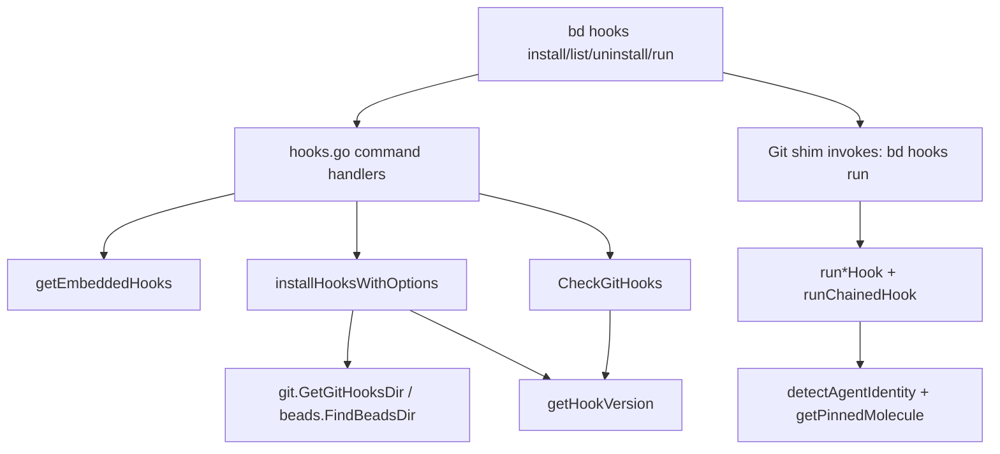

# hook_runtime_and_status

`hook_runtime_and_status` 模块（`cmd/bd/hooks.go` 中与 `bd hooks` 相关的部分）本质上是在做一件“很工程化但很关键”的事：把 Git hook 这套本来分散、易漂移、跨平台容易踩坑的机制，收口成一套可安装、可检测、可升级、可链式兼容的运行时系统。你可以把它想成“机场地勤调度台”：真正起飞的是 Git 自己触发的 hook 脚本，但这个模块负责保证航线（安装位置）、机型版本（shim/inline 版本识别）、联程航班（chain `.old`）和登机记录（`prepare-commit-msg` 写入 agent trailer）都一致可控。

如果没有这个模块，最朴素做法是让每个开发者手工维护 `.git/hooks/*`。问题是：hook 文件会和 CLI 版本漂移、worktree 下路径容易错、团队共享 hook 难以一致、已有自定义 hook 容易被覆盖、重复安装可能导致递归执行。这个模块存在的“设计洞察”是：**把 hook 当作运行时基础设施来管理，而不是当作一次性脚本拷贝**。

---

## 架构与数据流



从架构角色看，这个模块不是 domain 逻辑层，而是 **CLI 基础设施编排层**：它一头面向 Cobra 命令（`hooks install/list/uninstall/run`），一头面向操作系统/Git 文件系统状态（hook 文件、权限位、`git config core.hooksPath`、子进程执行）。

关键数据流有三条：

第一条是“安装流”：`hooks install` 先通过 `getEmbeddedHooks()` 从内嵌模板加载 hook 内容，再进入 `installHooksWithOptions(...)` 决定目标目录（`.git/hooks`、`.beads-hooks`、`.beads/hooks`），按 `force/shared/chain/beads` 策略处理已存在文件，写入可执行脚本，必要时调用 `configureSharedHooksPath()` 或 `configureBeadsHooksPath()` 更新 `core.hooksPath`。

第二条是“状态流”：`hooks list` 调 `CheckGitHooks()`，逐个 hook 读取 `getHookVersion(path)`，产出 `HookStatus`（`Installed/Version/IsShim/Outdated`），再由 `FormatHookWarnings(...)` 或 list 输出逻辑生成人类可读状态。

第三条是“运行流”：真正被 Git 触发的 shim 会执行 `bd hooks run <hook-name> [args...]`，再分发到 `runPreCommitHook`/`runPrePushHook`/`runPrepareCommitMsgHook` 等函数。每个函数先执行 `runChainedHook(...)`（若存在 `.old`），然后运行当前逻辑；其中 `prepare-commit-msg` 还会注入 `Executed-By/Rig/Role/Molecule` trailer。

---

## 心智模型：三层“防漂移”机制

理解这个模块，建议脑中放一个三层模型。

第一层是 **文件层防漂移**：hook 内容来自 `embed.FS`，由 CLI 统一安装，不依赖用户手工复制。`getEmbeddedHooks()` 还把 `CRLF` 归一化为 `LF`，避免 `sh\r` 错误。

第二层是 **版本层防漂移**：`getHookVersion()` 识别三类状态——`# bd-shim `（薄 shim）、`# bd-hooks-version: `（旧式内联版本）、`# bd (beads)`（无版本 marker 的 inline hook）。`CheckGitHooks()` 基于此判断是否过期：shim 永不过期（逻辑委托给当前 `bd`），inline 若版本缺失或不等于 `Version` 则标记 `Outdated`。

第三层是 **兼容层防破坏**：`--chain` 模式通过 `.old` 保留原 hook；但会显式避免把已有 bd hook 再次重命名成 `.old`，否则会发生递归调用（代码注释对应 GH#843 / GH#1120）。这层设计的核心不是“功能多”，而是“重复执行安装也不把用户环境搞坏”。

---

## 组件深潜

### `HookStatus`

`HookStatus` 是状态输出契约，字段非常克制：`Name`、`Installed`、`Version`、`IsShim`、`Outdated`。它不是 hook 全量元数据模型，而是“运维视角”模型：只保留能回答“是否安装、是否旧、是什么形态”的最小信息。这种收敛让 `hooks list --json` 的消费方更稳定。

### `hookVersionInfo`

`hookVersionInfo` 是内部解析结果，额外有 `IsBdHook`。这个字段的关键价值在链式安装和防递归场景：并不关心“版本号是多少”，而先判断“这是不是 bd 自己的 hook”，从而决定是否允许重命名为 `.old` 或执行 `.old`。

### `agentIdentity`

`agentIdentity` 用于 `prepare-commit-msg` 写追踪 trailer。`FullIdentity` 是原始身份（如 `beads/crew/dave`），`Rig/Role` 是拆分字段，`Molecule` 来自 `getPinnedMolecule()`。这是一个偏审计/取证导向的数据结构，不参与 hook 安装流程。

### `getEmbeddedHooks()`

该函数读取固定 hook 名单：`pre-commit`、`post-merge`、`pre-push`、`post-checkout`、`prepare-commit-msg`。读取失败会中断安装；成功后统一 `\r\n -> \n`。这是一处典型“跨平台 correctness 优先”选择：宁可多做一次文本处理，也要避免 shell 解释器兼容事故。

### `getHookVersion(path string)`

该函数只扫描前 15 行并累计局部内容。先匹配 shim marker，再匹配 legacy version marker，最后 fallback 检查 inline marker。这是性能与鲁棒性的折中：

- 扫描前若干行足够覆盖 marker 约定位置，避免全文件读取。
- 仍保留 `content` 缓冲做 inline marker 检测，覆盖“无版本但可识别”的旧产物。

注意它“无 marker”时返回 `(emptyInfo, nil)`，这意味着“不是 bd hook”与“读取失败”通过 error 区分，调用方能据此做不同策略。

### `CheckGitHooks()`

这是状态总线。它先通过 `git.GetGitHooksDir()` 获取 common hooks 目录（对 worktree 友好），失败则把所有 hook 视为未安装。对每个 hook，若 `getHookVersion()` 无错误则视为安装；并根据 `IsShim/IsBdHook/Version` 决定 `Outdated`。这段逻辑体现了一个重要约定：**只对 bd hook 谈“过期”，不对第三方 hook 乱下结论**。

### `FormatHookWarnings(statuses []HookStatus)`

它不暴露明细，只输出“缺失数”和“过期数”并给出统一修复动作 `bd hooks install`。这是运营化设计：在多数入口（例如状态汇总）里，用户不需要每个 hook 的细粒度差异，只要知道是否需要执行修复命令。

### `installHooksWithOptions(...)`

这是安装核心。

目标目录选择顺序体现了明确策略：

- `beadsHooks=true`：写到 `beads.FindBeadsDir()/hooks`，并配置 `core.hooksPath=.beads/hooks`；
- 否则 `shared=true`：写到 `.beads-hooks` 并配置 `core.hooksPath=.beads-hooks`；
- 默认：写到 `git.GetGitHooksDir()`。

已有文件处理策略：

- `chain=true`：优先保护已有用户 hook 到 `.old`，但若当前文件已是 bd hook 则直接覆盖（防递归）；若 `.old` 已存在不覆盖（防数据破坏）。
- 非 `chain` 且非 `force`：重命名到 `.backup`。
- `force`：直接覆盖。

这段代码最不明显但最关键的设计点是“**幂等安装安全**”：重复执行安装不会持续破坏历史 hook 资产。

### `configureSharedHooksPath()` / `configureBeadsHooksPath()`

二者都通过 `git config core.hooksPath ...` 修改仓库配置，且 `cmd.Dir` 设为 `git.GetRepoRoot()`。如果不在 Git 仓库中直接报错。这是把“写文件”和“启用路径”拆成两个阶段，避免只安装不生效的伪成功。

### `uninstallHooks()`

卸载仅处理默认 common hooks 目录中的固定 hook 列表：删除目标 hook，若存在 `.backup` 则尝试恢复。恢复失败只警告不终止。这体现了“最大化可继续性”策略：卸载操作尽量完成主体目标，不因次级恢复问题整体失败。

### `runChainedHook(hookName, args)`

这是运行时兼容核心。它定位 `<hook>.old`，检查存在与可执行位，再通过 `getHookVersion()` 识别是否是 bd hook：若是则跳过，防无限递归。执行时 stdin/stdout/stderr 全透传，返回真实 exit code；非 `ExitError` 则返回 1 并打印 warning。

语义上它把链式 hook 当作“前置闸门”：任何非零退出都会阻断当前 bd hook 逻辑继续执行。

### `runPreCommitHook` / `runPostMergeHook` / `runPrePushHook` / `runPostCheckoutHook`

这四个函数目前行为非常克制：只做 chained hook 转发与退出码传递。`post-merge`、`post-checkout` 明确注释“总是 0”取向（`nolint:unparam`），体现“警告可见但不阻断开发流程”的权衡。

### `runPrepareCommitMsgHook(args)`

这是唯一有本地业务逻辑的运行时 hook：

1. 先跑 chained hook；
2. 参数不足直接成功返回；
3. `source == "merge"` 跳过；
4. `detectAgentIdentity()` 检测不到 agent 则跳过；
5. 读取 commit message，若已有 `Executed-By:` 则跳过（避免 amend 重复）；
6. 追加 trailers 并以 `0600` 回写。

重点是它几乎所有异常都“降级为 warning + 返回 0”。这不是偷懒，而是有意避免 hook 破坏开发主路径（commit 不应因取证信息写入失败而被拦截）。

### `detectAgentIdentity()` / `parseAgentIdentity()` / `detectAgentFromPath()` / `getPinnedMolecule()`

身份检测优先读取 `GT_ROLE`，并要求 compound 格式（必须含 `/`）。`parseAgentIdentity()` 只拆前两段作为 `Rig/Role`，`FullIdentity` 保留原文，`Molecule` 通过执行 `gt mol status --json` 获取。

`detectAgentFromPath()` 目前恒返回 `nil`（代码标注 deprecated），表示路径推断被明确废弃，身份来源转向外部编排系统（Gas Town）提供的环境变量。这是一个“去魔法化”决策：降低误判，代价是调用方必须正确注入上下文。

### `isRebaseInProgress()`

该函数检查 `.git/rebase-merge` / `.git/rebase-apply`，当前文件中未见调用。对新贡献者来说，这通常意味着两种可能：未来扩展预留或历史遗留。修改前应先全局检索再决定是否删除。

### Cobra 命令对象与 `init()`

`hooksCmd` 提供子命令容器；`hooksInstallCmd`、`hooksUninstallCmd`、`hooksListCmd`、`hooksRunCmd` 分别负责安装、卸载、状态、执行入口。`init()` 中集中注册 flags（`force/shared/chain/beads`）并挂到 `rootCmd`。

值得注意的是，`hooksRunCmd` 是给 shim 调用的执行入口，不是面向终端用户日常手工调用的高层命令。

---

## 依赖关系与契约

从当前源码可直接确认，本模块主要依赖三类下游：

它依赖 `internal/git` 获取仓库语义位置（`git.GetGitHooksDir()`、`git.GetRepoRoot()`），这样能在 worktree/公共 git dir 场景下避免路径判断错误。

它依赖 `internal/beads` 的 `beads.FindBeadsDir()`（实际实现位于 Beads 仓库上下文模块）来支持 `--beads` 安装目标。

它还依赖 OS 进程与文件系统 API（`os.Stat`、`os.WriteFile`、`os.Rename`、`exec.Command`），以及 Cobra 命令框架进行 CLI 编排。

上游调用方面，源码中能确定的入口是 Cobra：`rootCmd -> hooksCmd -> {install|uninstall|list|run}`。此外 Git shim 会调用 `bd hooks run ...`，这条链路通过命令约定建立，不通过 Go 函数直接调用。

数据契约有两条最关键：

其一，hook 版本识别契约依赖注释 marker：`# bd-shim `、`# bd-hooks-version: `、`# bd (beads)`。改 marker 需要同时更新解析逻辑和模板，否则状态判断会失真。

其二，`prepare-commit-msg` 的 trailer 契约是文本行前缀 `Executed-By:`（以及 `Rig/Role/Molecule`）。下游审计若依赖这些字段，字段名应保持稳定。

---

## 关键设计取舍

这个模块最明显的取舍是“简单可控优先于高度可配置”。支持的 hook 名称是固定集合，版本 marker 是固定格式，`run` 子命令分发也是固定 switch。这样做牺牲了动态扩展能力，但换来行为稳定和低维护成本，非常符合 CLI 基础设施层定位。

第二个取舍是“开发流畅优先于严格阻断”。尤其在 `runPrepareCommitMsgHook()` 中，读写失败多数仅 warning 不阻断 commit；`post-merge/post-checkout` 也偏向不阻断。这减少了误伤，但意味着审计信息可能偶发缺失，需要外围监控弥补。

第三个取舍是“兼容已有生态优先于纯净安装”。`--chain` 与 `.old` 机制明显增加复杂度，却让项目能和已有 pre-commit 体系共存。复杂度主要集中在防递归和 `.old` 保全逻辑，代码已通过显式检查收敛风险。

第四个取舍是“shim 永不过期”策略。它把升级成本转移给 `bd` 二进制本身：只要 CLI 升级，行为自动升级。代价是诊断时要区分“shim 文件版本”和“当前 CLI 版本”语义。

---

## 使用方式与实践示例

最常见是直接安装：

```bash
bd hooks install
```

保留已有 hook 并链式执行：

```bash
bd hooks install --chain
```

共享到版本库目录并启用：

```bash
bd hooks install --shared
# 会设置: git config core.hooksPath .beads-hooks
```

在 beads 工作区使用 `.beads/hooks`：

```bash
bd hooks install --beads
# 会设置: git config core.hooksPath .beads/hooks
```

查看状态（可用于 CI 健康检查）：

```bash
bd hooks list
bd hooks list --json
```

Git shim 调用运行入口（通常不手动调用）：

```bash
bd hooks run pre-push <git-provided-args>
```

---

## 新贡献者高频坑点

第一，`installHooksWithOptions()` 对 `chain` 与 `force` 的组合语义要非常谨慎。尤其是 `.old` 已存在时“只覆盖当前 hook、不再重命名”的分支，是防止覆盖用户原始 hook 的关键保护，不要轻易“简化”。

第二，`getHookVersion()` 的“返回空信息但 nil error”语义很重要，代表“文件可读但非 bd hook”。如果改成 error，会影响 `CheckGitHooks()` 和链式递归保护判断。

第三，`runChainedHook()` 的递归保护依赖 `getHookVersion(oldHookPath).IsBdHook`。如果你调整 marker 或模板头部格式而不更新解析器，可能重新引入无限递归。

第四，`runPrepareCommitMsgHook()` 明确避免阻断 commit。若你将某些 warning 升级为 hard-fail，必须有非常明确的产品决策支持，否则会显著改变开发体验。

第五，`detectAgentFromPath()` 已废弃且返回 `nil`，不要在新逻辑里恢复路径推断“魔法”。当前方向是依赖 `GT_ROLE` 的显式上下文。

第六，`isRebaseInProgress()` 当前未在此文件调用。若打算删除，先确认全项目是否无引用，并评估后续计划中的 rebase 场景。

---

## 参考阅读

- [Hooks](Hooks.md)：系统级 hook 运行器（`internal.hooks`）设计，与本模块的 CLI hook 管理是不同层次。
- [Beads Repository Context](Beads Repository Context.md)：`.beads` 目录发现与重定向语义，理解 `--beads` 路径选择。
- [repo_context_resolution_and_git_execution](repo_context_resolution_and_git_execution.md)：仓库上下文与 git 执行环境细节。
- [repository_discovery_and_redirect](repository_discovery_and_redirect.md)：仓库发现/redirect 机制，辅助理解 `FindBeadsDir` 行为。

