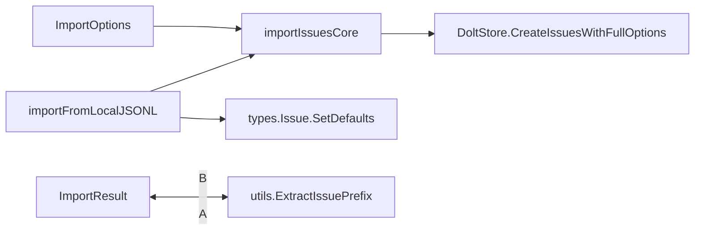

# `import_shared` 模块技术深度解析

## 概述

`import_shared` 模块是 Beads 系统中负责将 issue 数据从外部源导入到 Dolt 存储后端的核心组件。它处理从 JSONL 文件读取、验证、转换和批量导入 issue 的完整流程，同时还提供了丰富的配置选项来控制导入行为。

## 架构设计

### 核心组件关系图



### 数据流程

1. **读取与解析阶段**：`importFromLocalJSONL` 从本地 JSONL 文件读取数据，逐行解析为 `types.Issue` 对象
2. **配置与验证阶段**：自动检测并设置 issue 前缀（如需要），配置导入选项
3. **批量导入阶段**：通过 `importIssuesCore` 桥接到 Dolt 存储层的批量创建 API

## 核心组件详解

### ImportOptions 结构体

`ImportOptions` 结构体定义了导入行为的配置选项，它提供了丰富的控制参数：

```go
type ImportOptions struct {
    DryRun                     bool              // 模拟导入但不实际写入
    SkipUpdate                 bool              // 跳过更新操作
    Strict                     bool              // 严格模式，遇到问题立即失败
    RenameOnImport             bool              // 导入时重命名
    ClearDuplicateExternalRefs bool              // 清除重复的外部引用
    OrphanHandling             string            // 孤儿 issue 处理策略
    DeletionIDs                []string          // 要删除的 ID 列表
    SkipPrefixValidation       bool              // 跳过前缀验证
    ProtectLocalExportIDs      map[string]time.Time // 保护本地导出 ID
}
```

**设计意图**：这个结构体采用了"选项模式"的变体，允许调用者精确控制导入过程的各个方面。每个选项都代表了导入过程中的一个决策点，反映了系统在灵活性和安全性之间的权衡。

### ImportResult 结构体

`ImportResult` 结构体描述了导入操作的结果，提供了详细的统计信息：

```go
type ImportResult struct {
    Created             int               // 新创建的 issue 数量
    Updated             int               // 更新的 issue 数量
    Unchanged           int               // 未更改的 issue 数量
    Skipped             int               // 跳过的 issue 数量
    Deleted             int               // 删除的 issue 数量
    Collisions          int               // 冲突数量
    IDMapping           map[string]string // ID 映射关系
    CollisionIDs        []string          // 冲突的 ID 列表
    PrefixMismatch      bool              // 是否有前缀不匹配
    ExpectedPrefix      string            // 期望的前缀
    MismatchPrefixes    map[string]int    // 不匹配的前缀统计
    SkippedDependencies []string          // 跳过的依赖
}
```

**设计意图**：这个结构体提供了全面的导入操作反馈，使调用者能够了解导入过程中发生的每一件事。这对于调试、审计和用户反馈都非常重要。

### importIssuesCore 函数

`importIssuesCore` 是导入功能的核心桥接函数，它将高级导入选项转换为底层存储 API 调用：

```go
func importIssuesCore(ctx context.Context, _ string, store *dolt.DoltStore, issues []*types.Issue, opts ImportOptions) (*ImportResult, error)
```

**工作原理**：
1. 首先检查是否为干运行或无 issue 可导入，若是则立即返回
2. 构造 `storage.BatchCreateOptions`，设置适当的孤儿处理策略和前缀验证选项
3. 调用 `store.CreateIssuesWithFullOptions` 执行实际的批量创建
4. 返回导入结果

**设计意图**：这个函数充当了适配器角色，将 CLI 层的选项映射到存储层的 API。它隔离了导入逻辑的核心，使其可以被多个入口点复用。

### importFromLocalJSONL 函数

`importFromLocalJSONL` 负责从本地 JSONL 文件导入 issue：

```go
func importFromLocalJSONL(ctx context.Context, store *dolt.DoltStore, localPath string) (int, error)
```

**关键特性**：
1. 读取文件内容并使用 bufio.Scanner 逐行解析
2. 配置了 64MB 的行缓冲区以支持大型描述
3. 对每个 issue 调用 `SetDefaults()` 确保必填字段有默认值
4. 自动检测并设置 issue 前缀（如需要）
5. 调用 `importIssuesCore` 执行实际导入

**设计意图**：这个函数专门处理从工作树中的 JSONL 文件导入，这与基于 git 的导入不同。它保留了用户对 JSONL 文件的手动清理工作（如通过 `bd compact --purge-tombstones` 完成的清理）。

## 设计决策与权衡

### 1. 前缀自动检测机制

**决策**：在导入过程中，如果存储中没有配置 `issue_prefix`，系统会自动从第一个 issue 的 ID 中提取前缀并设置。

**权衡**：
- ✅ **优点**：提高了用户体验，减少了手动配置步骤
- ⚠️ **缺点**：如果第一个 issue 的 ID 前缀不具有代表性，可能导致错误的配置

**替代方案考虑**：
- 要求用户明确配置前缀（过于严格）
- 从所有导入的 issue 中统计最常见的前缀（更复杂但可能更准确）

### 2. 大文件处理策略

**决策**：使用 64MB 的行缓冲区来支持大型 issue 描述。

**权衡**：
- ✅ **优点**：可以处理包含大量文本的 issue
- ⚠️ **内存使用**：为每个扫描操作分配了较大的缓冲区

### 3. 桥接函数设计

**决策**：使用 `importIssuesCore` 作为 CLI 层和存储层之间的桥接。

**权衡**：
- ✅ **优点**：解耦了 CLI 参数处理和存储 API 调用，提高了可测试性和可复用性
- ⚠️ **间接性**：增加了一层抽象，可能使代码流程稍微不那么直观

## 使用场景与最佳实践

### 常见使用模式

1. **从本地 JSONL 文件导入**：
   ```go
   // 注意：这是内部函数，通常通过 CLI 命令调用
   count, err := importFromLocalJSONL(ctx, store, "path/to/issues.jsonl")
   ```

2. **干运行模式**：
   ```go
   opts := ImportOptions{DryRun: true}
   result, err := importIssuesCore(ctx, "", store, issues, opts)
   ```

### 边缘情况与注意事项

1. **空文件处理**：如果 JSONL 文件为空或只包含空行，函数会优雅地处理，返回 0 而不会报错。

2. **前缀不匹配**：虽然当前实现默认跳过前缀验证，但在其他上下文中使用此模块时，前缀不匹配可能导致导入失败。

3. **内存考虑**：导入大量大型 issue 时，需要注意内存使用情况，因为所有 issue 都会先加载到内存中然后再批量导入。

## 与其他模块的关系

- **依赖**：
  - [Core Domain Types](core_domain_types.md)：提供 `Issue` 类型定义
  - [Dolt Storage Backend](dolt_storage_backend.md)：提供 `DoltStore` 实现
  - `internal.storage`：提供批量创建选项
  - `internal.utils`：提供前缀提取工具函数

- **被依赖**：
  - CLI 导入命令（未在提供的代码中显示，但根据结构可以推断）
  - [backup_restore](backup_restore.md)：在恢复问题时可能会使用类似的导入逻辑

## 总结

`import_shared` 模块是 Beads 系统中连接外部数据和内部存储的关键组件。它通过精心设计的选项和结果结构，提供了灵活而强大的导入功能，同时保持了代码的清晰性和可维护性。该模块的设计体现了对用户体验、错误处理和系统灵活性的深入考虑。
