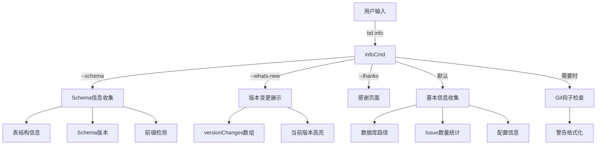

# info_diagnostics 模块深度解析

## 1. 问题空间与存在意义

在开始理解这个模块之前，我们需要先了解它解决了什么问题。想象一个在多个仓库和环境中工作的开发者或 AI 代理，他们经常会遇到以下困惑：

- "我现在到底在使用哪个数据库？"
- "这个数据库里有多少个 issue？"
- "最近的版本更新了什么功能？"
- "我的 Git 钩子安装正确吗？"
- "这个数据库的 Schema 版本是什么？"

一个简单的解决方案是让用户自己去查找文件路径、运行 SQL 查询、查看 CHANGELOG.md，但这存在几个问题：
1. 用户需要知道数据库的位置和结构
2. 需要手动连接数据库运行查询
3. 版本变更信息分散在多个地方
4. 没有统一的方式获取这些信息
5. 对于 AI 代理来说，这些操作特别复杂

这就是 `info_diagnostics` 模块存在的原因——它提供了一个统一的、一键式的系统信息查看工具，就像汽车的仪表盘一样，让你一眼就能看到所有关键信息。

## 2. 核心抽象与心智模型

把这个模块想象成一个**系统诊断中心**，它的工作原理类似于医院的体检中心：

- `infoCmd` 是**前台接待台**，接收你的请求并引导你到正确的检查项目
- `VersionChange` 是**体检报告模板**，结构化地记录每次版本变更
- `versionChanges` 是**历史病历档案**，保存了所有版本的变更记录
- `extractPrefix` 是**样本分析仪**，从 issue ID 中提取有用的前缀信息
- `showWhatsNew` 是**健康变化通知**，告诉你最近有什么新变化

核心抽象包括：

### infoCmd 命令
这是整个模块的中心，它封装了所有诊断功能，包括：
- 数据库路径显示
- 统计信息收集
- Schema 信息展示
- 版本变更历史
- Git 钩子状态检查

### VersionChange 结构体
这是一个小型但关键的抽象，它结构化地记录了单个版本的变更信息，包括版本号、发布日期和变更列表。

### extractPrefix 函数
这个函数展示了复杂的前缀提取逻辑，支持多种命名模式，从简单的 "bd-1" 到复杂的 "beads-vscode-1"。

## 3. 架构与数据流程

让我们通过 Mermaid 图来理解这个模块的架构：



### 数据流程详解

#### 基本信息收集流程
1. **解析标志位**：首先检查用户指定了哪些标志位（`--schema`、`--whats-new`、`--thanks`、`--json`）
2. **处理特殊标志**：如果是 `--thanks` 或 `--whats-new`，直接跳转到对应的处理逻辑
3. **获取数据库路径**：将相对路径转换为绝对路径
4. **构建信息结构**：创建一个 map 来存储所有信息
5. **获取统计信息**：从存储中获取 issue 数量
6. **获取配置信息**：从存储中获取所有配置
7. **添加 Schema 信息**：如果需要，添加表结构、版本、前缀等信息
8. **输出结果**：根据 `--json` 标志决定输出格式

#### 版本变更展示流程
1. **获取当前版本**：从全局变量 `Version` 中获取当前版本号
2. **检查输出格式**：如果是 JSON 格式，构建 JSON 结构
3. **格式化人类可读输出**：
   - 打印标题和当前版本
   - 遍历所有版本变更
   - 高亮当前版本
   - 格式化输出每个变更
4. **添加提示信息**：告诉用户可以使用 `--json` 获取机器可读格式

#### 前缀提取流程
1. **尝试最后一个连字符**：找到最后一个连字符的位置
2. **检查后缀**：验证连字符后的部分是否为数字
3. **处理小数点**：如果后缀包含小数点，只检查小数点前的部分
4. **验证数字**：尝试将后缀解析为整数
5. **返回前缀**：如果成功，返回连字符前的部分
6. **回退策略**：如果后缀不是数字，尝试第一个连字符
7. **返回结果**：如果都失败，返回空字符串

## 4. 核心组件深度解析

### infoCmd 命令

```go
var infoCmd = &cobra.Command{
    Use:     "info",
    GroupID: "setup",
    Short:   "Show database information",
    Long:    `Display information about the current database...`,
    Run: func(cmd *cobra.Command, args []string) {
        // 实现逻辑
    },
}
```

**设计意图**：
- 作为整个模块的入口点，统一处理所有信息查询请求
- 使用 `cobra.Command` 提供标准的 CLI 界面
- 支持多种输出格式和信息类型
- 详细的帮助文档，包括使用示例

**关键特点**：
- 属于 "setup" 命令组，表明这是一个设置和诊断工具
- 详细的 `Long` 描述，解释了命令的用途和功能
- 多个标志位支持不同的信息类型
- 同时支持 JSON 和人类可读输出

### VersionChange 结构体

```go
type VersionChange struct {
    Version string   `json:"version"`
    Date    string   `json:"date"`
    Changes []string `json:"changes"`
}
```

**设计意图**：
- 结构化版本变更信息，便于人类和机器读取
- 使用 JSON 标签支持序列化
- 包含版本号、日期和变更列表三个关键字段

**关键特点**：
- 简单清晰的结构，易于理解和使用
- JSON 标签确保与 `--json` 输出格式兼容
- `Changes` 是字符串数组，支持多个变更点

### versionChanges 数组

这是一个预定义的 `VersionChange` 数组，包含了从 0.23.0 到 0.56.1 的所有版本变更。

**设计意图**：
- 将版本变更历史硬编码在代码中，确保与代码一起版本控制
- 提供完整的变更记录，便于用户了解系统演进
- 支持 AI 代理快速获取最新变更信息

**关键特点**：
- 按版本号倒序排列，最新版本在前
- 每个版本都有详细的变更列表
- 包含 NEW、FIX、REMOVED、CHANGED 等类型的变更

### extractPrefix 函数

```go
func extractPrefix(issueID string) string
```

**设计意图**：
- 从 issue ID 中提取前缀，支持多种命名模式
- 优先处理多段前缀（如 "beads-vscode-1"）
- 保持向后兼容性，支持简单前缀（如 "bd-1"）

**关键实现细节**：
- 首先尝试最后一个连字符，这是为了支持多段前缀
- 检查后缀是否为数字，包括处理小数点的情况
- 使用 `fmt.Sscanf` 验证数字部分
- 如果后缀不是数字，回退到第一个连字符
- 如果都失败，返回空字符串

**为什么选择这个设计**：
- 多段前缀是常见的命名模式，如 "project-component-123"
- 优先尝试最后一个连字符可以正确提取这种前缀
- 回退策略确保了向后兼容性

### showWhatsNew 函数

```go
func showWhatsNew()
```

**设计意图**：
- 展示最近版本的变更记录，便于用户了解新功能
- 支持 JSON 和人类可读两种输出格式
- 高亮当前版本，让用户知道他们正在使用的版本

**关键实现细节**：
- 从全局变量 `Version` 获取当前版本号
- JSON 输出包含当前版本和所有变更
- 人类可读输出使用格式化标题和列表
- 当前版本用 "← current" 标记高亮
- 最后添加提示信息，告诉用户可以使用 JSON 格式

## 5. 依赖分析

### 内部依赖

这个模块相对独立，主要依赖以下内部组件：
- `internal/types`：`IssueFilter` 类型，用于搜索 issue
- `store`：全局存储接口，用于访问数据库
- `rootCtx`：根上下文，用于数据库操作
- `Version`：全局版本变量，来自 version.go
- `CheckGitHooks`：Git 钩子检查函数
- `FormatHookWarnings`：Git 钩子警告格式化函数
- `outputJSON`：JSON 输出函数
- `printThanksPage`：感谢页面函数

### 被依赖情况

根据模块树，这个模块是 `CLI Issue Management Commands` 的子模块，主要被 CLI 框架直接调用。

### 数据契约

**输入契约**：
- 命令行标志位：`--schema`、`--whats-new`、`--thanks`、`--json`
- 全局状态：`store`、`rootCtx`、`Version`、`jsonOutput`

**输出契约**：
- 标准输出：人类可读的信息或 JSON 格式
- 数据库路径：绝对路径字符串
- Issue 数量：整数
- Schema 信息：包含表、版本、前缀等的 map
- 版本变更：`VersionChange` 数组

## 6. 设计决策与权衡

### 决策 1：硬编码版本变更记录

**选择**：将版本变更记录硬编码在代码中，而不是从外部文件读取。

**原因**：
- 简单直接，不需要额外的文件 I/O
- 版本变更记录与代码一起版本控制，确保一致性
- 避免了文件不存在或路径错误的问题
- 对于 AI 代理来说，硬编码的信息更容易访问

**权衡**：
- 优点：简单、可靠、无外部依赖
- 缺点：需要重新编译才能更新版本变更记录
- 但考虑到版本变更记录在发布时才更新，这个权衡是合理的

### 决策 2：多输出格式支持

**选择**：同时支持 JSON 和人类可读两种输出格式，通过 `--json` 标志切换。

**原因**：
- JSON 格式适合机器解析（AI 代理、脚本）
- 人类可读格式适合人类用户
- 两种格式的需求都很常见
- 通过标志位切换，保持接口简洁

**权衡**：
- 优点：灵活性高，满足不同用户需求
- 缺点：代码复杂度增加，需要维护两套输出逻辑
- 但通过先构建通用的数据结构，再分别格式化，可以减少重复代码

### 决策 3：前缀提取的双策略

**选择**：优先尝试最后一个连字符，然后回退到第一个连字符。

**原因**：
- 支持多段前缀（如 "beads-vscode-1"）
- 保持向后兼容性，支持简单前缀（如 "bd-1"）
- 多段前缀是越来越常见的命名模式

**权衡**：
- 优点：支持更多命名模式，灵活性高
- 缺点：逻辑稍微复杂，需要处理两种情况
- 但通过详细的注释和清晰的代码结构，这个复杂性是可控的

### 决策 4：最佳努力的错误处理

**选择**：对于可选的信息（如配置、Schema 信息），使用最佳努力的方式，失败时不影响主要功能。

**原因**：
- 主要功能是显示基本信息，即使某些可选信息获取失败，也应该继续
- 避免因为小问题导致整个命令失败
- 提供尽可能多的信息，而不是完美的信息

**权衡**：
- 优点：鲁棒性强，不会因为小问题失败
- 缺点：可能显示不完整的信息
- 但通过不显示失败的部分，用户不会被错误信息干扰

### 决策 5：标志位优先处理

**选择**：首先检查特殊标志位（`--thanks`、`--whats-new`），如果存在，直接处理并返回。

**原因**：
- 这些标志位代表完全不同的功能，不应该与其他功能混合
- 提前处理可以避免不必要的工作
- 代码结构更清晰，逻辑更容易理解

**权衡**：
- 优点：代码结构清晰，性能优化
- 缺点：需要在函数开头处理这些特殊情况
- 但这是一个常见且合理的 CLI 设计模式

## 7. 使用与示例

### 基本用法

```bash
# 显示基本信息
bd info

# 显示 schema 信息
bd info --schema

# 显示版本变更
bd info --whats-new

# JSON 输出
bd info --json
bd info --schema --json
bd info --whats-new --json
```

### 输出示例：

```
Beads Database Information
===========================
Database: /path/to/.beads/dolt
Mode: direct

Issue Count: 42

Schema Information:
  Tables: [issues dependencies labels config metadata]
  Schema Version: 0.56.0
  Detected Prefix: bd
  Sample Issues: [bd-1 bd-2 bd-3]
```

## 8. 边缘情况与陷阱

### 陷阱 1：数据库不存在

**问题**：如果 `store` 为 nil（数据库未初始化），模块仍然会继续运行，但只会显示基本信息。

**解决方案**：
- 这是有意的设计，模块会优雅地处理这种情况
- 用户会看到数据库路径，但不会看到 issue 数量等信息
- 如果需要完整信息，先确保数据库已初始化

### 陷阱 2：Issue ID 格式不标准

**问题**：`extractPrefix` 函数处理了多种 issue ID 格式，但如果 ID 格式非常特殊（如没有连字符、后缀不是数字等），可能会返回空字符串。

**解决方案**：
- 函数有回退策略，会尝试多种方法
- 如果都失败，返回空字符串是安全的默认值
- 在 schema 信息中，会清楚地显示检测到的前缀（可能为空）

### 陷阱 3：版本号不匹配

**问题**：如果当前版本不在 `versionChanges` 数组中，`showWhatsNew` 会正常显示所有版本变更，但不会高亮当前版本。

**解决方案**：
- 这是最佳努力的功能，即使没有匹配也不会失败
- 用户仍然可以看到所有版本变更
- 在发布新版本时，确保更新 `versionChanges` 数组

### 陷阱 4：Git 钩子检查失败

**问题**：Git 钩子检查是最佳努力的，即使失败也不会影响主要功能。

**解决方案**：
- 这是有意的设计，确保主要功能不受影响
- 如果钩子检查失败，会显示警告信息
- 用户可以根据警告信息手动检查钩子状态

### 陷阱 5：相对路径 vs 绝对路径

**问题**：数据库路径会被转换为绝对路径，但如果转换失败，会使用原始的相对路径。

**解决方案**：
- 这是最佳努力的处理
- 即使转换失败，用户仍然可以看到路径
- 在大多数情况下，`filepath.Abs()` 会成功

## 9. 总结与最佳实践

`info_diagnostics` 模块是一个精心设计的系统诊断工具，它解决了多环境下的信息获取问题。通过统一的 CLI 界面、结构化的版本变更记录、智能的前缀提取和多种输出格式，它提供了一个简单但强大的诊断工具。

### 最佳实践

1. **定期运行 `bd info`**：在开始工作前运行，确保你在正确的数据库中
2. **使用 `--whats-new` 了解变更**：在升级版本后，查看有什么新功能和修复
3. **结合 `--json` 用于脚本**：在自动化脚本中使用 JSON 格式，便于解析
4. **使用 `--schema` 调试问题**：当遇到数据库相关问题时，查看 schema 信息
5. **查看 Git 钩子警告**：注意输出中的 Git 钩子警告，确保钩子正确安装

### 未来扩展方向

- 支持更多的诊断信息（如性能统计、锁状态等）
- 添加历史比较功能，显示数据库的变化
- 支持导出诊断报告到文件
- 添加更详细的健康检查
- 支持自定义诊断插件

通过理解这个模块的设计意图、核心抽象和使用场景，您将能够有效地使用它来诊断和解决问题，为您的工作流程提供强大的支持。

## 10. 参考资料

- [CLI 命令参考](CLI_REFERENCE.md)
- [存储接口](DOLT-BACKEND.md)
- [版本控制](ARCHITECTURE.md)
