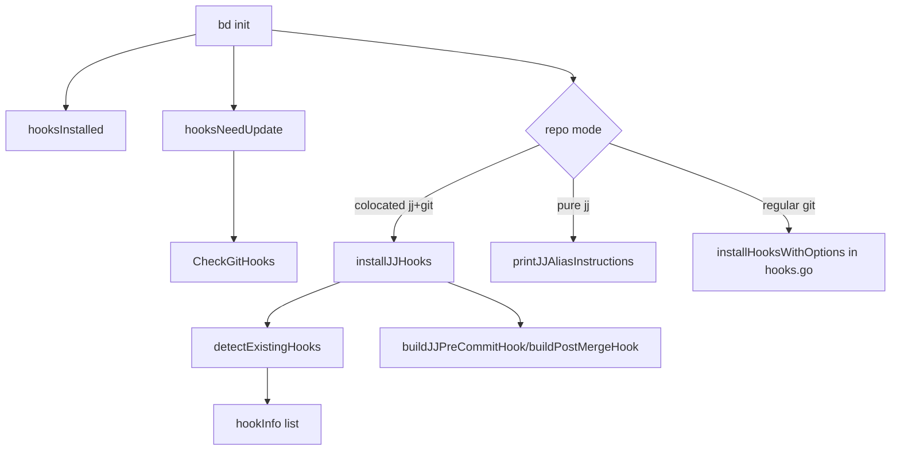

# init_hook_bootstrap_and_detection 深度解析

`init_hook_bootstrap_and_detection`（对应 `cmd/bd/init_git_hooks.go`）本质上是一个“仓库入口闸机安装器”：它在 `bd init` 阶段判断当前仓库有没有可用的 hooks、这些 hooks 是否是 bd 自己的、是否需要升级，然后把一套可执行的 shell hook 安全地落盘。它存在的原因并不是“写两个文件这么简单”，而是要在真实团队环境里处理冲突与兼容：用户可能已经有自己的 hook、可能在 worktree、可能在 jujutsu+git 混合仓库、也可能在 Windows 上生成 CRLF 脚本。这个模块的价值是把这些“初始化时最容易埋雷”的细节统一收口。

## 这个模块解决的根问题

如果用朴素方案实现 hooks 安装，你可能会直接 `WriteFile(.git/hooks/pre-commit)` 覆盖旧文件，写入 `bd hooks run pre-commit` 后就结束。但在真实项目中，这会立刻出现几个问题：第一，覆盖会破坏已有 hook 生态（如 pre-commit/prek、团队自定义检查）；第二，hook 版本演进后你无法识别“这是旧版 bd hook 还是用户自定义 hook”；第三，不同 VCS 工作模型（git 与 jujutsu）需要不同 pre-commit 语义；第四，跨平台换行符导致 shebang 失效是高频隐蔽故障。

这个模块的设计洞察是：**hook 安装不是一次写文件动作，而是一次“探测 → 分类 → 迁移（链式接入）→ 生成脚本 → 权限校验”的引导流程**。它把“是否可覆盖”的判断前置，用 `hookInfo` 做轻量分类，再通过 `.old` 链接策略避免破坏已有流程。

## 心智模型：把它看成“机场安检改造”

可以把这个模块想象成给机场新增一条安检通道（bd hook），但机场原本已经有旧通道（用户 hooks / 第三方框架）。你不能直接把旧通道拆掉，否则全机场停摆；正确做法是：先识别旧通道类型，再把新通道接在前后，并保留失败时回退路径。

在这个模型里：

- `detectExistingHooks()` 是“场地勘测员”，负责看当前有哪些通道。
- `hookInfo` 是“勘测报告格式”，记录是否存在、是否是 bd、内容特征等。
- `installGitHooks()` / `installJJHooks()` 是“施工总包”，负责链式迁移和落盘。
- `build*Hook()` / `*HookBody()` 是“蓝图生成器”，负责按模式拼装最终脚本。
- `hooksInstalled()` / `hooksNeedUpdate()` 是“验收与巡检”，分别判断“是否已装好”与“是否需要升级”。

## 架构与数据流



从调用关系看，这个模块在 `bd init` 路径中承担“bootstrap 入口”角色：`init.go` 中先调用 `hooksInstalled()` 和 `hooksNeedUpdate()` 决定是否要动作；随后根据仓库类型（`git.IsJujutsuRepo()`、`git.IsColocatedJJGit()`）选择路径。在 colocated 场景里，它会进入 `installJJHooks()`；在纯 jujutsu 场景只输出 alias 指引；普通 git 场景当前由 `hooks.go` 的 `installHooksWithOptions(...)` 安装到 `.beads/hooks/`。

这里有个很关键的连接点：`hooksNeedUpdate()` 并不自己做版本比较，而是委托 [hook_runtime_and_status](hook_runtime_and_status.md) 里对应实现 `CheckGitHooks()`。这样版本解析（shim、inline、legacy marker）只保留一份逻辑，避免 init 与 runtime 检查分叉。

## 组件级深潜

### `hookInfo`：探测阶段的数据合同

`hookInfo` 是内部结构体，字段包括 `name`、`path`、`exists`、`isBdHook`、`isPreCommitFramework`、`content`。它不是通用 domain model，而是安装流程的“临时判定载体”。

设计上它有两个值得注意的点。第一，`content` 被完整保留，给后续模式识别留余地；第二，`isPreCommitFramework` 只在“非 bd hook”时才评估，避免把 bd 自己脚本误判为第三方框架。这个字段当前在安装逻辑中未被分支使用，但它与 doctor 中的模式保持一致（同一 regex 意图），属于为跨模块一致性预留的信号。

### `hooksInstalled() bool`：强约束验收，而不是“文件存在即可”

这个函数做了三层校验：文件存在（`pre-commit` 与 `post-merge` 都要有）、内容签名包含 `bd (beads) ... hook`、文件具备可执行权限（`Mode().Perm()&0111`）。

为什么这么严格？因为“仅存在”会把半安装、手工拷贝损坏、权限错误都误判成成功，最终在用户第一次 commit 时才爆炸。它把失败尽量前移到 init 阶段。

### `hooksNeedUpdate() bool`：把版本策略外包给统一检测器

实现非常短，只遍历 `CheckGitHooks()` 返回的 `HookStatus`，看到 `Outdated` 就返回 true。核心价值不在逻辑复杂度，而在边界划分：**版本语义由 hooks runtime 模块定义，这里只消费结果**。这样避免两个模块分别理解“什么叫过期”。

### `detectExistingHooks() []hookInfo`：安装前地形扫描

它固定扫描 `pre-commit`、`post-merge`、`pre-push` 三个路径，读取成功即标记存在；通过 `strings.Contains(..., "bd (beads)")` 识别 bd hook；对非 bd 内容再用 `preCommitFrameworkPattern` 做 pre-commit/prek 框架识别。

这里的取舍是“有限扫描而非全目录遍历”。优点是低成本、目标明确；代价是如果未来需要管理更多 hook 类型，列表要手工扩展。

### `installGitHooks() error`：git 模式内联安装器

该函数流程是：拿 hooks 目录 → `MkdirAll` → 探测已有 hooks → 如果发现非 bd hooks，默认开启 chain 模式并把原文件重命名为 `.old` → 生成 pre-commit/post-merge 内容 → 统一 CRLF→LF → 以 `0700` 写入。

最关键的设计选择有两个。其一，**默认 chain，不弹交互确认**，优先减少自动化脚本中的阻塞；其二，重命名失败只 warning 并继续，不整体失败，体现“尽可能安装成功”的实用主义。副作用是部分 hook 可能没链上，需要后续 `bd doctor --fix` 收敛。

### `buildPreCommitHook(...)` 与 `preCommitHookBody()`：把复杂逻辑下沉到 `bd hooks run`

生成的脚本无论链式与否，核心都走：

```sh
exec bd hooks run pre-commit "$@"
```

这是一种“薄壳 hook”策略：shell 层只做可执行检查和参数转发，真正逻辑在 Go 侧统一实现。注释里明确动机是避免 lock deadlocks，并处理 Dolt export/sync-branch 路由。换句话说，这里故意牺牲“hook 文件自包含”，换取“运行时行为集中治理”。

### `buildPostMergeHook(...)`：Dolt 语义下的最小化 no-op

post-merge 在当前设计里是 no-op（除链式调用旧 hook 外直接 `exit 0`）。这看起来“什么都没做”，但实际上是一种后端语义对齐：注释明确 Dolt backend 内部已处理同步，不需要重复 flush。保留该 hook 的主要价值是兼容链式生态，而不是执行 bd 逻辑。

### `installJJHooks()` / `buildJJPreCommitHook()` / `jjPreCommitHookBody()`：为 jujutsu 模型做特化

这组函数是该模块里最有“模型意识”的部分。它承认 jujutsu 与 git 的工作副本语义不同（无需 staging），因此 pre-commit 脚本不调用 `bd hooks run pre-commit`，而是以 workspace 探测为主：检查 `bd` 命令、识别 worktree 下 `.beads` 应位于 main repo root、若不在 beads workspace 则直接退出。

最终逻辑是“确认环境后 no-op”，因为注释已给出契约：Dolt 直接持久化，不需要 flush。这里的 tradeoff 是保守正确性优先——宁愿少做，也不在 jj 模型里引入错误的 git 风格副作用。

### `printJJAliasInstructions()`：纯 jj 仓库的降级路径

当仓库是纯 jujutsu（非 colocated）时，模块不会尝试安装不存在的 hook 机制，而是打印 `jj` alias 配置建议：

```toml
push = ["util", "exec", "--", "sh", "-c", "bd sync --flush-only && jj git push \"$@\"", ""]
```

这体现了“能力缺失时给替代流程”的工程态度：不假装支持，也不沉默失败。

## 依赖分析：它调用谁、谁调用它

这个模块向下依赖主要是三类：仓库上下文解析（`internal/git`，核心是 `git.GetGitHooksDir()`）、文件系统（`os`/`filepath`/`strings`/`regexp`）和 CLI 输出渲染（`internal/ui`）。其中最热路径是 `git.GetGitHooksDir()`，几乎每个入口函数都依赖它；这意味着上游如果改变 hooks 目录策略（例如切到 `core.hooksPath` 优先），这里行为会整体受影响。

向上调用方面，明确可见的入口来自 `init.go`：`hooksInstalled()`、`hooksNeedUpdate()`、`installJJHooks()`、`printJJAliasInstructions()`。同时，`hooksNeedUpdate()` 又把版本语义委托给 `CheckGitHooks()`（定义在 [hook_runtime_and_status](hook_runtime_and_status.md) 对应模块），形成“init bootstrap 消费 runtime 状态”的跨模块契约：`HookStatus.Outdated` 的定义必须稳定。

另外，`preCommitFrameworkPattern` 注释说明它与 doctor/fix 的 pattern 设计保持一致，可参考 [hook_manager_detection_and_safe_hook_fix](hook_manager_detection_and_safe_hook_fix.md)。这是一种跨模块“检测语义一致”契约：不是代码复用，而是规则对齐。

## 关键设计决策与权衡

这个模块在多处选择了“务实兼容”而非“纯净设计”。最明显的是链式策略：默认链旧 hook、通过 `.old` 保留原脚本，降低破坏性；代价是状态复杂化（可能出现 rename 失败、残留 `.old`、多次安装叠加）。它没有引入完整事务回滚机制，而是用 warning + doctor 修复兜底。

第二个权衡是“内联生成脚本”与“模板驱动脚本”并存。`installGitHooks()`/`installJJHooks()`使用内联构造字符串，而普通 git 初始化路径在 `init.go` 里走 `installHooksWithOptions(..., beadsHooks=true)`（基于 embedded templates）。这提高了历史兼容性与场景特化能力，但也带来维护分叉风险：同名 hook 在不同安装路径可能行为不同。

第三个权衡是正确性优先于激进自动化：例如检测到 `bd` 不存在时脚本直接 `exit 0`，避免阻断开发提交；这牺牲了“强一致执行”，但更符合 hooks 作为辅助层的定位。

## 使用方式与示例

在 `bd init` 场景下，模块是自动触发的，核心判定逻辑是：

```go
hooksExist := hooksInstalled()
if !skipHooks && (!hooksExist || hooksNeedUpdate()) {
    // 根据仓库类型进入 jj alias / installJJHooks / installHooksWithOptions
}
```

对新贡献者来说，更实际的用法是理解“何时不会安装”：

- 传入 `--skip-hooks`。
- 纯 jujutsu 非 colocated 仓库（只打印 alias 指南）。
- 检测已安装且未过期。

如果你在改安装逻辑，建议同时做两类验证：一是 hook 文件头部 marker（`# bd-hooks-version: ...`、`bd (beads)`）是否与 `CheckGitHooks()` 兼容；二是脚本最终换行符是否为 LF，避免 shebang 在类 Unix 环境失效。

## 边界条件与容易踩坑点

一个非直观点是 `detectExistingHooks()` 包含 `pre-push` 扫描，但 `installGitHooks()` 实际只写 `pre-commit` 与 `post-merge`。这意味着它会把 `pre-push` 也纳入“是否需要 chain”判断，并可能重命名 `.old`，但不会在本函数里重建 `pre-push`。这种行为在阅读时容易误判为 bug；从代码看它更像历史兼容路径的一部分，新路径可能交给 `hooks.go` 处理。

另一个隐含契约是 `.old` 命名策略：重命名目标固定为 `hook.path + ".old"`，没有冲突处理。如果目标已存在，`os.Rename` 会失败并走 warning。结果是“部分链成功、部分链失败”的混合状态，需要依赖 `bd doctor --fix` 做后处理。

还有一个常被忽略的点：`hooksInstalled()` 只认可包含 `bd (beads) ...` 注释且可执行的 pre-commit/post-merge。也就是说，即使你安装了 shim 风格 hook，但注释或权限不符合，这里也会判定未安装；这与 `CheckGitHooks()` 的版本检测维度并不完全一致，修改时要避免让两个判定标准漂移过大。

## 给新贡献者的工作建议

如果你要扩展这个模块（比如新增 hook 类型、增强 manager 识别），优先守住三条线：第一，别破坏 `CheckGitHooks()` 与 init 检测的一致性；第二，链式迁移必须始终默认保守，不要轻易覆盖非 bd hooks；第三，任何新脚本内容都要保证 LF 与执行权限。实践上，改动后应联动检查 [hook_runtime_and_status](hook_runtime_and_status.md) 与 [hook_manager_detection_and_safe_hook_fix](hook_manager_detection_and_safe_hook_fix.md) 的契约是否仍成立。

## 参考模块

- [hook_runtime_and_status](hook_runtime_and_status.md)
- [hook_manager_detection_and_safe_hook_fix](hook_manager_detection_and_safe_hook_fix.md)
- [repository_discovery_and_redirect](repository_discovery_and_redirect.md)
