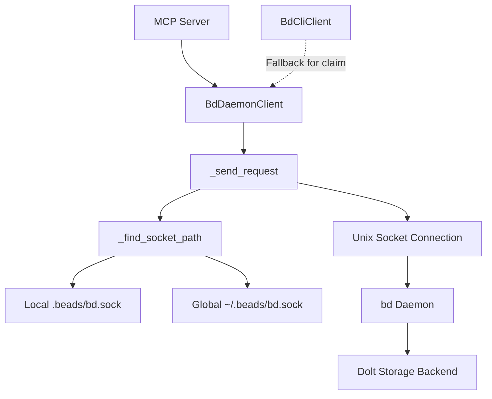

# daemon_transport_client 模块技术深度文档

## 概述

`daemon_transport_client` 模块提供了一个通过 Unix 域套接字与 bd 守护进程进行 RPC 通信的客户端实现。它允许 MCP 服务器通过守护进程高效地访问 Beads 数据库功能，而不是每次操作都启动一个新的 CLI 进程。

这个模块解决了直接使用 CLI 客户端时存在的性能问题：每次 CLI 调用都需要启动新进程、建立数据库连接，这在高频操作场景下会造成显著的开销。通过守护进程，我们可以保持持久的数据库连接和状态，同时提供快速的响应时间。

## 架构



### 核心组件

1. **BdDaemonClient**：主客户端类，继承自 `BdClientBase`，实现了与守护进程通信的所有方法
2. **异常类**：
   - `DaemonError`：守护进程客户端错误的基类
   - `DaemonNotRunningError`：当守护进程未运行时抛出
   - `DaemonConnectionError`：当连接守护进程失败时抛出

### 数据流程

1. **初始化**：客户端创建时可以指定套接字路径，也可以自动发现
2. **套接字发现**：`_find_socket_path` 方法从当前工作目录向上查找 `.beads/bd.sock`，如果未找到则检查全局位置 `~/.beads/bd.sock`
3. **请求发送**：`_send_request` 方法构建 JSON 请求，通过 Unix 套接字发送，并解析响应
4. **操作执行**：各种业务方法（如 `create`、`update`、`list` 等）将参数转换为 RPC 调用并返回结果

## 组件深度解析

### BdDaemonClient 类

`BdDaemonClient` 是模块的核心，它实现了 `BdClientBase` 接口，提供了与守护进程通信的完整功能。

#### 核心方法

**`_find_socket_path()`**
- **目的**：定位守护进程的 Unix 套接字文件
- **机制**：
  - 首先检查是否已显式指定套接字路径
  - 然后从工作目录向上遍历文件系统，查找 `.beads/bd.sock`
  - 如果未找到本地套接字，检查全局位置 `~/.beads/bd.sock`
- **设计考虑**：这种设计允许在项目级别和用户级别运行守护进程，提供了灵活性

**`_send_request(operation, args)`**
- **目的**：发送 RPC 请求到守护进程并处理响应
- **参数**：
  - `operation`：RPC 操作名称（如 "create"、"list"）
  - `args`：操作特定的参数字典
- **请求格式**：
  ```json
  {
    "operation": "create",
    "args": {"title": "New Issue", ...},
    "cwd": "/path/to/repo",
    "actor": "user@example.com"
  }
  ```
- **响应格式**：
  ```json
  {
    "success": true,
    "data": {...}
  }
  ```
- **错误处理**：通过检查响应中的 `success` 字段来确定操作是否成功

**业务方法（create, update, list_issues 等）**
- **目的**：提供与 Beads 数据库交互的高级接口
- **共同模式**：
  1. 将输入参数转换为 RPC 参数字典
  2. 调用 `_send_request` 发送请求
  3. 解析响应数据并转换为适当的模型对象
- **特殊情况**：
  - `claim` 方法有一个回退机制：如果守护进程不支持声明语义，会自动回退到 CLI 客户端
  - 一些管理操作（如 `inspect_migration`、`get_schema_info`）目前不通过守护进程支持，会抛出 `NotImplementedError`

### 异常层次结构

模块定义了三个专用异常类，形成了一个清晰的错误层次结构：

1. **DaemonError**：所有守护进程相关错误的基类
2. **DaemonNotRunningError**：继承自 `DaemonError`，表示无法找到守护进程套接字
3. **DaemonConnectionError**：继承自 `DaemonError`，表示连接守护进程失败

这种分层设计允许调用者根据需要捕获特定类型的错误或更一般的错误。

## 依赖分析

### 输入依赖

- **BdClientBase**：提供了客户端接口定义，确保与 `BdCliClient` 的互换性
- **models**：定义了请求和响应的数据结构，如 `CreateIssueParams`、`Issue` 等
- **asyncio**：用于异步 socket 通信
- **json**：用于序列化和反序列化 RPC 消息
- **os, pathlib**：用于文件系统操作和套接字路径发现

### 输出依赖

- **bd Daemon**：实际处理请求的服务端组件
- **BdCliClient**：在 `claim` 方法中作为回退选项使用

### 与其他模块的关系

- **[cli_transport_client](integrations-beads-mcp-src-beads_mcp-bd_client.md)**：`BdDaemonClient` 和 `BdCliClient` 都实现了相同的 `BdClientBase` 接口，提供了两种不同的传输方式
- **[mcp_models_and_data_contracts](integrations-beads-mcp-src-beads_mcp-models.md)**：定义了客户端使用的数据模型

## 设计决策与权衡

### 1. Unix 域套接字 vs 其他 IPC 机制

**选择**：使用 Unix 域套接字进行进程间通信
**原因**：
- 性能：Unix 域套接字比 TCP/IP 套接字更快，因为它们不需要网络协议栈开销
- 安全性：Unix 域套接字可以通过文件系统权限控制访问
- 简单性：不需要处理网络配置、端口分配等问题

**权衡**：
- 只能用于本地通信，不支持远程守护进程
- 在非 Unix 系统（如 Windows）上不可用

### 2. 每个请求一个连接 vs 持久连接

**选择**：每个请求打开和关闭一个新连接
**原因**：
- 简单性：不需要处理连接管理、重连逻辑等复杂性
- 可靠性：每个请求都是独立的，不会受到之前连接错误的影响
- 资源使用：对于大多数使用场景，连接建立的开销是可以接受的

**权衡**：
- 高频操作场景下可能存在性能损耗
- 无法利用持久连接的优势，如连接复用

### 3. 自动发现 vs 显式配置

**选择**：支持自动发现和显式配置两种方式
**原因**：
- 灵活性：满足不同用户的需求和使用场景
- 易用性：大多数用户可以依赖自动发现，无需额外配置
- 可控性：高级用户可以显式指定套接字路径，获得完全控制

**权衡**：
- 增加了代码复杂性
- 自动发现可能在某些边缘情况下找到错误的套接字

### 4. JSON 消息格式 vs 二进制格式

**选择**：使用换行符分隔的 JSON 消息
**原因**：
- 可读性：JSON 格式易于调试和日志记录
- 互操作性：JSON 在大多数编程语言中都有良好支持
- 简单性：不需要处理复杂的二进制序列化和反序列化

**权衡**：
- 性能：JSON 序列化和反序列化比二进制格式慢
- 消息大小：JSON 消息通常比二进制表示大

### 5. 部分操作的 CLI 回退

**选择**：对于某些操作（如 `claim`），如果守护进程不支持，则回退到 CLI 客户端
**原因**：
- 兼容性：确保即使守护进程不支持某些功能，客户端仍然可以工作
- 渐进式采用：允许逐步向守护进程添加功能，而不会破坏现有功能

**权衡**：
- 复杂性：增加了代码路径和测试需求
- 不一致性：不同的传输方式可能有细微的行为差异

## 使用与示例

### 基本使用

```python
from beads_mcp.bd_daemon_client import BdDaemonClient
from beads_mcp.models import CreateIssueParams

# 创建客户端实例（自动发现套接字）
client = BdDaemonClient(working_dir="/path/to/repo")

# 检查守护进程是否运行
if await client.is_daemon_running():
    # 创建新问题
    params = CreateIssueParams(
        title="Implement new feature",
        issue_type="issue",
        description="This is a detailed description"
    )
    issue = await client.create(params)
    print(f"Created issue: {issue.id}")
else:
    print("Daemon is not running")
```

### 高级配置

```python
# 显式指定套接字路径
client = BdDaemonClient(
    socket_path="/custom/path/to/bd.sock",
    working_dir="/path/to/repo",
    actor="user@example.com",
    timeout=60.0  # 增加超时时间
)

# 健康检查
health = await client.health()
print(f"Daemon status: {health['status']}")
print(f"Uptime: {health['uptime']} seconds")
```

## 边缘情况与注意事项

### 套接字发现的边缘情况

- **嵌套的 .beads 目录**：如果在目录树中有多个 `.beads` 目录，客户端会找到最接近工作目录的那个
- **符号链接**：客户端会解析工作目录的符号链接，然后再开始搜索
- **权限问题**：如果用户没有权限访问 `.beads` 目录或套接字文件，发现过程会失败

### 错误处理

- 始终捕获并处理 `DaemonError` 及其子类，特别是 `DaemonNotRunningError`
- 注意 `NotImplementedError`：某些操作可能不通过守护进程支持
- 超时处理：默认超时为 30 秒，对于某些操作可能需要调整

### 并发注意事项

- 客户端是异步的，可以在并发环境中使用
- 每个请求都使用独立的连接，因此多个请求可以安全地并发执行
- 没有请求队列或限流机制，客户端需要自行控制并发级别

### 数据一致性

- 守护进程可能会对请求进行排队，因此不能保证请求的即时执行
- 对于需要强一致性的操作（如 `claim`），有回退机制确保语义正确
- 在执行读写操作后，建议进行验证以确保状态一致

## 参考资料

- [cli_transport_client](integrations-beads-mcp-src-beads_mcp-bd_client.md)：另一种传输方式实现
- [mcp_models_and_data_contracts](integrations-beads-mcp-src-beads_mcp-models.md)：数据模型定义
- [Dolt Storage Backend](internal-storage-dolt.md)：底层存储实现
