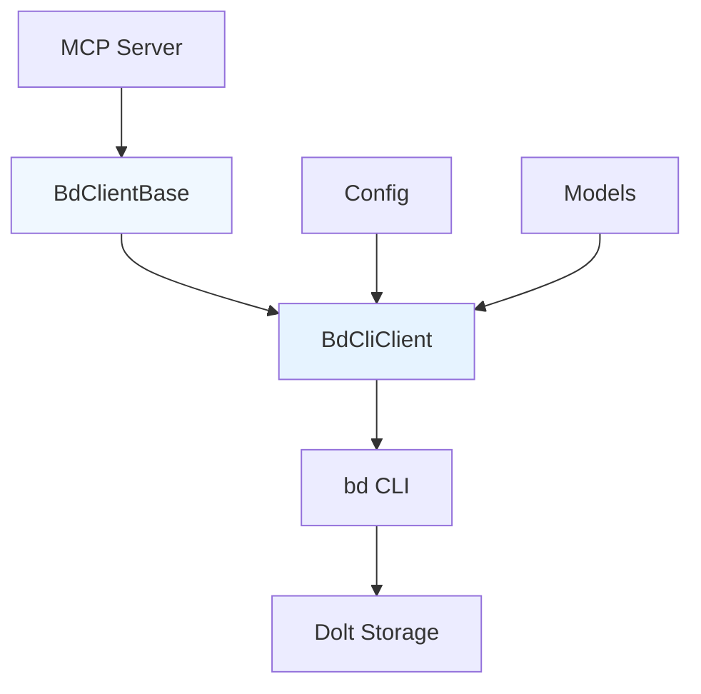

# CLI Transport Client 模块深度解析

## 什么是 CLI Transport Client？

CLI Transport Client 模块是 beads MCP 集成的核心通信层，它为 MCP 服务器提供了一个干净、类型安全的接口，用于与 beads 命令行工具（bd CLI）进行交互。这个模块解决了一个关键问题：如何在保持代码可读性和可维护性的同时，让 MCP 服务器能够调用外部 CLI 工具并正确处理其 JSON 输出。

## 架构概览



这个架构采用了经典的**策略模式**：
- `BdClientBase` 定义了完整的抽象接口契约
- `BdCliClient` 实现了基于 CLI 进程调用的具体策略
- 未来可以轻松添加 `BdDaemonClient` 作为替代实现

## 核心组件详解

### BdClientBase：抽象接口契约

`BdClientBase` 是整个模块的基石，它定义了所有 beads 客户端必须实现的完整功能集。这个抽象类的设计体现了**接口隔离原则**和**依赖倒置原则**。

**设计意图**：
- 定义统一的接口，使上层代码可以透明地切换不同的客户端实现
- 强制所有实现提供完整的功能集，避免功能碎片化
- 使用类型注解确保 API 契约的清晰性

### BdCliClient：CLI 进程调用实现

`BdCliClient` 是 `BdClientBase` 的具体实现，它通过异步子进程调用 bd CLI 命令并解析 JSON 输出。这个类的核心是 `_run_command` 方法。

**关键设计决策**：
1. **异步执行**：使用 `asyncio.create_subprocess_exec` 避免阻塞事件循环
2. **环境隔离**：通过环境变量传递数据库配置，而不是命令行参数
3. **JSON 输出**：始终添加 `--json` 标志确保结构化输出
4. **工作目录**：利用 bd CLI 的自动发现机制，通过工作目录定位数据库

### 版本兼容性检查

`_check_version` 方法是一个重要的安全措施，它确保 bd CLI 的版本满足最低要求。

**为什么需要这个**：
- bd CLI 和 MCP 服务器是独立发布的组件
- 版本不兼容会导致命令参数或输出格式的不匹配
- 提前检查可以提供清晰的错误信息和升级指导

### 依赖数据清理

`_sanitize_issue_deps` 函数解决了一个微妙的数据契约问题。

**问题背景**：
- bd CLI 的 `list`/`ready`/`blocked` 命令返回原始依赖记录
- 但 Pydantic 的 `Issue` 模型期望的是丰富的 `LinkedIssue` 对象
- 直接验证会失败

**解决方案**：
- 检测原始依赖记录
- 保留依赖计数
- 将依赖列表替换为空数组
- 这样既满足了验证要求，又不会丢失关键信息

## 数据流向分析

让我们以 `ready` 方法为例，追踪数据的完整流向：

1. **调用层**：MCP 服务器调用 `client.ready(params)`
2. **参数构建**：`BdCliClient` 将参数转换为 CLI 标志
3. **进程执行**：`_run_command` 异步执行 `bd ready --limit 10 --json`
4. **输出解析**：JSON 输出被解析为 Python 字典列表
5. **数据清理**：每个 issue 字典通过 `_sanitize_issue_deps` 清理
6. **模型验证**：清理后的字典通过 `Issue.model_validate` 转换为 Pydantic 模型
7. **返回结果**：类型安全的 `List[Issue]` 返回给调用者

## 设计权衡与决策

### 1. 异步 vs 同步执行

**选择**：全异步设计

**原因**：
- MCP 服务器是异步的，保持一致的异步接口避免上下文切换
- CLI 调用可能涉及磁盘 I/O 和网络操作
- 异步执行可以同时处理多个请求

**权衡**：
- 更好的并发性能
- 代码复杂度略有增加
- 测试需要异步框架

### 2. 环境变量 vs 命令行参数

**选择**：通过环境变量传递数据库配置

**原因**：
- `--db` 标志在 v0.20.1 中被移除
- bd CLI 现在通过工作目录自动发现数据库
- 环境变量是传递敏感配置的更安全方式

**权衡**：
- 更安全
- 符合 bd CLI 的最新设计
- 配置方式不那么直观

### 3. 抽象接口的完整性

**选择**：`BdClientBase` 定义了所有可能的方法

**原因**：
- 确保所有实现提供一致的功能集
- 上层代码可以依赖完整的接口
- 避免功能碎片化

**权衡**：
- 接口一致性
- 实现类可能需要提供不支持的方法

### 4. 错误处理策略

**选择**：自定义异常层次结构

**原因**：
- 不同的错误类型需要不同的处理方式
- 清晰的错误层次结构便于上层代码捕获和处理
- 可以提供特定于错误类型的有用信息

## 使用指南

### 基本使用

```python
from beads_mcp.bd_client import create_bd_client

# 创建客户端
client = create_bd_client()

# 获取就绪工作
ready_issues = await client.ready()

# 创建问题
new_issue = await client.create(CreateIssueParams(
    title="Fix bug",
    priority=2,
    issue_type="bug"
))
```

### 配置选项

`BdCliClient` 的构造函数接受多个配置参数，这些参数会覆盖配置文件中的值。

## 注意事项与陷阱

### 1. 工作目录的重要性

bd CLI 通过工作目录自动发现数据库，因此确保 `working_dir` 配置正确至关重要。

### 2. 依赖数据的不完整性

`list`/`ready`/`blocked` 命令返回的 issue 对象中的 `dependencies` 和 `dependents` 字段会被清空。如果需要完整的依赖信息，必须使用 `show` 方法单独获取每个 issue 的详情。

### 3. 版本兼容性

始终确保 bd CLI 的版本满足最低要求。

### 4. 异步执行的注意事项

所有方法都是异步的，必须使用 `await` 调用。

## 相关模块

- [MCP Models](integrations-beads-mcp-src-beads_mcp-mcp_models_and_data_contracts.md)
- [MCP Config](integrations-beads-mcp-src-beads_mcp-mcp_runtime_config.md)
- [Daemon Transport Client](integrations-beads-mcp-src-beads_mcp-daemon_transport_client.md)
