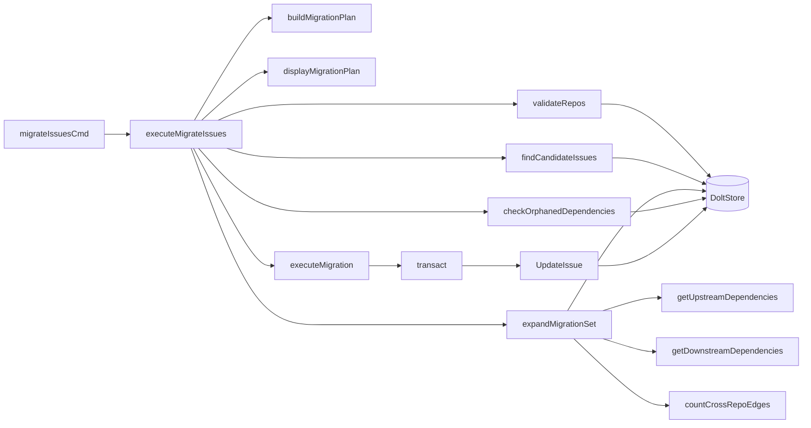

# inter_repo_migration 模块技术深度解析

## 问题背景与存在意义

在使用 Beads 管理跨多个仓库的工作流程时，团队经常需要重新组织问题（Issue）的归属。想象一下：你有一个规划仓库，团队在那里进行早期的需求讨论和任务分解，但当工作进入实际开发阶段时，你需要将这些问题移动到对应的代码仓库中。或者，随着项目的演进，你可能需要将多个仓库的问题合并到一个新的中央仓库，或者将一个大仓库的问题拆分成多个子仓库。

这就是 `inter_repo_migration` 模块要解决的问题。简单来说，它允许你在不同的仓库之间移动问题，并智能地处理它们之间的依赖关系。

为什么不能只是简单地修改 `source_repo` 字段呢？因为问题之间可能存在复杂的依赖关系图。如果你只是盲目地移动一个问题，可能会破坏依赖链，导致"孤儿"依赖（引用不存在的问题）。此外，你可能希望一起移动相关的问题（比如某个功能的所有子任务），而不是手动逐个选择。

## 核心心智模型

理解这个模块的关键是建立一个**图遍历**的心智模型。把问题看作图的节点，依赖关系看作有向边。迁移过程可以看作是在这个图上进行的几个关键步骤：

1. **候选集筛选**：根据用户提供的条件（状态、优先级、标签等）在源仓库中筛选出初始的问题集合。
2. **集合扩展**：根据用户指定的依赖包含策略（上游、下游或闭包），通过图遍历扩展候选集，形成最终的迁移集合。
3. **依赖边界分析**：分析迁移集合与外部问题之间的依赖关系，计算"入边"和"出边"。
4. **批量更新**：在一个事务中，将迁移集合中所有问题的 `source_repo` 字段更新为目标仓库。

这就像是在地图上划定一个区域的边界——你先选几个关键点，然后把它们周围的区域也包含进来，最后确保你清楚地知道这个区域与外部的连接点。

## 架构与数据流程



### 主要组件角色与数据流向

1. **`migrateIssuesCmd`**（入口点）：
   - 负责解析命令行参数，构建 `migrateIssuesParams` 结构体
   - 进行基本的参数验证（如 `from` 和 `to` 不能相同）
   - 调用 `executeMigrateIssues` 执行实际逻辑

2. **`executeMigrateIssues`**（编排者）：
   - 这是模块的核心编排函数，按照线性顺序执行迁移的各个阶段
   - 从验证仓库开始，到构建候选集，扩展迁移集合，检查孤儿依赖，构建计划，显示计划，最后执行迁移
   - 每个阶段的输出作为下一个阶段的输入

3. **`validateRepos`**（仓库验证器）：
   - 验证源仓库和目标仓库的存在性和状态
   - 在严格模式下，如果源仓库没有问题会失败；否则只发出警告
   - 这是一个防御性检查，防止用户在错误的仓库上操作

4. **`findCandidateIssues`**（候选集筛选器）：
   - 根据用户提供的过滤条件（状态、优先级、类型、标签、ID 等）构建 `types.IssueFilter`
   - 调用 `DoltStore.SearchIssues` 获取匹配的问题
   - 返回问题 ID 的列表作为初始候选集

5. **`expandMigrationSet`**（迁移集合扩展器）：
   - 这是模块中最复杂的组件之一，负责根据依赖关系扩展候选集
   - 使用 BFS（广度优先搜索）遍历依赖图，根据 `--include` 参数决定遍历方向
   - 支持三种模式：
     - `upstream`：包含所有被候选问题依赖的问题
     - `downstream`：包含所有依赖候选问题的问题
     - `closure`：同时包含上游和下游依赖
   - 调用 `countCrossRepoEdges` 分析迁移集合与外部的依赖边界

6. **`checkOrphanedDependencies`**（孤儿依赖检查器）：
   - 检查所有依赖记录中引用的问题是否都存在
   - 这是一个预防性检查，确保迁移不会引入或留下无效的依赖关系
   - 在严格模式下，如果发现孤儿依赖会导致迁移失败

7. **`buildMigrationPlan`**（计划构建器）：
   - 将前面步骤收集的所有信息（候选集大小、扩展的数量、入边出边数、孤儿依赖等）组装成一个 `migrationPlan` 结构体
   - 这个计划既用于显示给用户，也用于 JSON 输出

8. **`displayMigrationPlan`**（计划显示器）：
   - 根据 `jsonOutput` 标志决定是输出人类可读的格式还是 JSON 格式
   - 在人类可读模式下，会显示迁移的关键统计信息，包括问题数量、依赖边界、孤儿依赖警告等

9. **`executeMigration`**（迁移执行器）：
   - 在一个事务中执行实际的迁移操作
   - 对迁移集合中的每个问题，调用 `UpdateIssue` 将其 `source_repo` 字段更新为目标仓库
   - 使用事务确保迁移的原子性——要么全部成功，要么全部回滚

## 核心组件深度解析

### migrateIssuesParams 结构体

```go
type migrateIssuesParams struct {
    from           string
    to             string
    status         string
    priority       int
    issueType      string
    labels         []string
    ids            []string
    include        string
    withinFromOnly bool
    dryRun         bool
    strict         bool
    yes            bool
}
```

这个结构体是迁移命令的参数容器。它的设计体现了"参数对象"模式——将多个相关参数打包成一个对象，这样可以简化函数签名，并使参数传递更加清晰。

每个字段都直接对应一个命令行标志。注意 `priority` 的默认值是 `-1`，这是一个哨兵值，表示用户没有指定优先级过滤器。这种设计允许我们区分"用户明确指定优先级 0"和"用户没有指定优先级"两种情况。

### migrationPlan 结构体

```go
type migrationPlan struct {
    TotalSelected     int      `json:"total_selected"`
    AddedByDependency int      `json:"added_by_dependency"`
    IncomingEdges     int      `json:"incoming_edges"`
    OutgoingEdges     int      `json:"outgoing_edges"`
    Orphans           int      `json:"orphans"`
    OrphanSamples     []string `json:"orphan_samples,omitempty"`
    IssueIDs          []string `json:"issue_ids"`
    From              string   `json:"from"`
    To                string   `json:"to"`
}
```

这个结构体是迁移计划的数据模型，同时用于人类可读输出和 JSON 输出。注意 `OrphanSamples` 字段的 `omitempty` 标签——这意味着如果没有孤儿依赖，这个字段将不会出现在 JSON 输出中，保持输出的简洁性。

这个结构体的设计体现了"报告"模式——它不是简单的操作结果，而是一个包含上下文信息的综合报告，帮助用户理解将要发生（或已经发生）的事情。

### expandMigrationSet 函数

这是模块中最复杂的函数之一，让我们深入分析它的设计：

```go
func expandMigrationSet(ctx context.Context, s *dolt.DoltStore, candidates []string, p migrateIssuesParams) ([]string, dependencyStats, error) {
    if p.include == "none" || p.include == "" {
        return candidates, dependencyStats{}, nil
    }

    // 构建初始集合
    migrationSet := make(map[string]bool)
    for _, id := range candidates {
        migrationSet[id] = true
    }

    // BFS 遍历依赖图
    visited := make(map[string]bool)
    queue := make([]string, len(candidates))
    copy(queue, candidates)

    // ... BFS 遍历逻辑 ...
}
```

这里有几个值得注意的设计决策：

1. **使用 map 表示集合**：`migrationSet` 和 `visited` 都是 `map[string]bool` 类型。这是 Go 中表示集合的惯用方式，因为它提供了 O(1) 的存在性检查。

2. **显式队列的 BFS**：与递归实现的 DFS 不同，这里使用显式队列实现 BFS。这是有意的选择，因为 BFS 更适合这种"逐层扩展"的场景，而且可以避免递归深度过大的问题。

3. **分离的访问标记**：`migrationSet` 和 `visited` 是两个不同的 map。`migrationSet` 记录最终要迁移的问题，而 `visited` 记录已经处理过的问题，避免重复处理。

### countCrossRepoEdges 函数

这个函数负责计算迁移集合与外部问题之间的依赖边界：

```go
func countCrossRepoEdges(ctx context.Context, s *dolt.DoltStore, migrationSet []string) (dependencyStats, error) {
    // ... 省略初始化代码 ...

    // 计算出边：迁移集合中的问题依赖外部问题
    outgoing := 0
    for _, deps := range depsByIssue {
        for _, dep := range deps {
            if !setMap[dep.DependsOnID] {
                outgoing++
            }
        }
    }

    // 计算入边：外部问题依赖迁移集合中的问题
    incoming := 0
    for issueID, deps := range allDeps {
        if setMap[issueID] {
            continue // 跳过迁移集合内部的边
        }
        for _, dep := range deps {
            if setMap[dep.DependsOnID] {
                incoming++
            }
        }
    }

    return dependencyStats{
        incomingEdges: incoming,
        outgoingEdges: outgoing,
    }, nil
}
```

这里的设计很有意思：

1. **出边计算的优化**：对于出边，它只需要查询迁移集合中问题的依赖记录（`GetDependencyRecordsForIssues`），而不需要查询所有依赖。这是一个性能优化，因为迁移集合通常比整个数据库小得多。

2. **入边计算的必要性**：对于入边，它必须查询所有依赖记录（`GetAllDependencyRecords`），因为入边可能来自任何问题，而不仅仅是迁移集合中的问题。这是一个不可避免的权衡——要获得完整的入边信息，必须扫描所有依赖。

### executeMigration 函数

```go
func executeMigration(ctx context.Context, s *dolt.DoltStore, migrationSet []string, to string) error {
    return transact(ctx, s, fmt.Sprintf("bd: migrate %d issues to %s", len(migrationSet), to), func(tx storage.Transaction) error {
        for _, id := range migrationSet {
            if err := tx.UpdateIssue(ctx, id, map[string]interface{}{
                "source_repo": to,
            }, actor); err != nil {
                return fmt.Errorf("failed to update issue %s: %w", id, err)
            }
        }
        return nil
    })
}
```

这个函数展示了一个重要的设计模式——**事务脚本**。它将整个迁移操作封装在一个事务中，确保原子性：

1. **事务的使用**：通过 `transact` 函数，所有的更新操作都在一个事务中执行。如果任何一个更新失败，整个事务都会回滚，数据库保持一致状态。

2. **最小化更新**：只更新 `source_repo` 字段，而不是整个问题对象。这是一个有意的选择，减少了意外修改其他字段的风险。

3. **有意义的提交信息**：提交信息包含了迁移的问题数量和目标仓库，这对于审计和调试非常有用。

## 依赖关系分析

### 被依赖的模块

这个模块主要依赖以下几个核心模块：

1. **[Dolt Storage Backend](dolt_storage_backend.md)**：
   - 依赖 `dolt.DoltStore` 进行所有的数据库操作
   - 关键方法：`SearchIssues`、`GetDependencyRecords`、`GetDependents`、`GetAllDependencyRecords`、`UpdateIssue`
   - 这些方法构成了模块与数据存储层的契约

2. **[Core Domain Types](core_domain_types.md)**：
   - 依赖 `types.IssueFilter` 构建查询条件
   - 依赖 `types.Status` 和 `types.IssueType` 进行类型安全的过滤

3. **[Storage Interfaces](storage_interfaces.md)**：
   - 依赖 `storage.Transaction` 接口进行事务操作

### 调用它的模块

这个模块是一个 CLI 命令模块，主要被：

1. **CLI 命令框架**：通过 `cobra.Command` 机制被调用
2. **用户**：直接通过命令行 `bd migrate issues` 调用

### 数据契约

模块的输入输出契约非常清晰：

- **输入**：`migrateIssuesParams` 结构体，包含所有迁移参数
- **输出**：
  - 成功时：`migrationPlan` 结构体（通过 JSON 输出或人类可读格式）
  - 失败时：错误信息
- **副作用**：修改问题的 `source_repo` 字段（仅在非 dry-run 模式下）

## 设计决策与权衡

### 1. 只修改 source_repo 字段 vs 移动整个问题

**决策**：只修改 `source_repo` 字段，而不是创建新问题并删除旧问题。

**原因**：
- 保持问题 ID 不变，这对于链接和引用非常重要
- 保留完整的历史记录，包括所有的评论和事件
- 实现更简单，性能更好

**权衡**：
- 问题 ID 不会反映新的仓库（如果 ID 生成包含仓库信息）
- 没有"撤销"按钮，除了再次迁移回去

### 2. BFS  vs 递归 DFS

**决策**：使用显式队列的 BFS 进行依赖图遍历。

**原因**：
- BFS 更符合"逐层扩展"的直觉，用户更容易理解
- 避免递归深度过大的问题（虽然在实践中不太可能，但防御性编程是好的）
- 更容易实现"已访问"检查，避免无限循环

**权衡**：
- 代码稍微冗长一些
- 内存使用可能稍高（需要维护队列）

### 3. 事务原子性

**决策**：将整个迁移操作封装在一个事务中。

**原因**：
- 确保迁移的原子性——要么全部成功，要么全部回滚
- 避免部分迁移导致的不一致状态
- 简化错误处理——如果任何步骤失败，整个事务回滚

**权衡**：
- 对于非常大的迁移集合，可能会持有锁较长时间
- 事务日志可能会变大

### 4. 依赖边界的完整分析

**决策**：计算入边和出边，即使这需要查询所有依赖记录。

**原因**：
- 提供完整的迁移影响分析，帮助用户做出明智的决策
- 符合"显式优于隐式"的设计哲学
- 对于理解迁移后依赖关系的变化非常重要

**权衡**：
- 对于大型数据库，`GetAllDependencyRecords` 可能会很慢
- 内存使用可能较高（需要存储所有依赖记录）

### 5. Dry-run 模式

**决策**：提供完整的 dry-run 功能，显示计划但不做任何修改。

**原因**：
- 迁移是潜在的破坏性操作，用户需要在执行前确认
- 符合"安全优先"的设计原则
- 允许用户测试过滤条件和依赖包含策略

**权衡**：
- 代码复杂度增加（需要区分 dry-run 和实际执行）
- 可能导致用户过度依赖 dry-run，而不仔细阅读计划

## 使用指南与示例

### 基本用法

```bash
# 从 planning 仓库迁移所有开放的问题到当前仓库
bd migrate issues --from ~/planning --to . --status open

# 预览迁移
bd migrate issues --from ~/planning --to . --status open --dry-run

# 执行迁移，无需确认
bd migrate issues --from ~/planning --to . --status open --yes
```

### 高级用法

```bash
# 迁移特定问题及其所有依赖
bd migrate issues --from . --to ~/archive --id bd-abc --include closure

# 迁移带有特定标签的问题，只包含源仓库内的依赖
bd migrate issues --from . --to ~/feature-work --label frontend --within-from-only

# 从文件读取问题 ID 列表
bd migrate issues --from . --to ~/archive --ids-file issues.txt

# 严格模式（发现孤儿依赖则失败）
bd migrate issues --from . --to ~/archive --id bd-abc --strict
```

### 参数说明

- `--from`：源仓库路径（必需）
- `--to`：目标仓库路径（必需）
- `--status`：按状态过滤（open/closed/all）
- `--priority`：按优先级过滤（0-4）
- `--type`：按问题类型过滤（bug/feature/task/epic/chore/decision）
- `--label`：按标签过滤（可多次指定）
- `--id`：特定问题 ID（可多次指定）
- `--ids-file`：包含问题 ID 的文件
- `--include`：依赖包含策略（none/upstream/downstream/closure）
- `--within-from-only`：只包含源仓库内的依赖（默认 true）
- `--dry-run`：显示计划但不执行
- `--strict`：严格模式（发现孤儿依赖则失败）
- `--yes`：跳过确认提示

## 边界情况与注意事项

### 1. 循环依赖

**情况**：问题 A 依赖问题 B，问题 B 又依赖问题 A。

**处理**：模块会正确处理这种情况，因为它使用了 `visited` map 来跟踪已经处理过的问题，避免无限循环。

### 2. 跨仓库依赖

**情况**：迁移集合中的问题依赖于其他仓库的问题，或者其他仓库的问题依赖于迁移集合中的问题。

**处理**：模块会计算并显示这些"入边"和"出边"，但不会阻止迁移。依赖关系会被保留，即使它们跨越仓库边界。

### 3. 孤儿依赖

**情况**：依赖记录引用了不存在的问题。

**处理**：模块会检测到这种情况并显示警告。在严格模式下，这会导致迁移失败。

**注意**：孤儿依赖可能是之前操作的遗留问题，不一定是本次迁移导致的。

### 4. 大型迁移集合

**情况**：迁移数千个问题。

**注意事项**：
- 事务可能会持有锁较长时间，影响其他操作
- 考虑分批迁移，而不是一次性迁移所有问题
- 先使用 dry-run 模式确认计划

### 5. 同时迁移到同一个目标仓库

**情况**：多个用户同时从不同的源仓库迁移问题到同一个目标仓库。

**注意事项**：
- 由于使用了事务，应该是安全的，但可能会有冲突
- 建议分批迁移，避免长时间持有锁

### 6. ID 唯一性

**情况**：问题 ID 在整个数据库中是唯一的，而不是在每个仓库中唯一。

**注意事项**：
- 这是有意的设计，确保跨仓库的引用能够正常工作
- 迁移不会改变问题 ID，所以引用仍然有效

## 总结

`inter_repo_migration` 模块是一个精心设计的工具，用于在仓库之间移动问题并智能处理依赖关系。它的核心设计理念是：

1. **安全第一**：提供 dry-run 模式、严格模式和确认提示
2. **完整性**：正确处理依赖关系，提供完整的影响分析
3. **原子性**：使用事务确保迁移要么全部成功，要么全部回滚
4. **灵活性**：提供丰富的过滤选项和依赖包含策略

这个模块展示了如何设计一个既强大又易用的工具——它隐藏了依赖图遍历的复杂性，但仍然提供了足够的控制选项，让用户能够精确地定义迁移范围。

对于新贡献者，理解这个模块的关键是掌握图遍历的心智模型，并注意观察它如何在每个步骤中平衡功能、安全性和性能。
