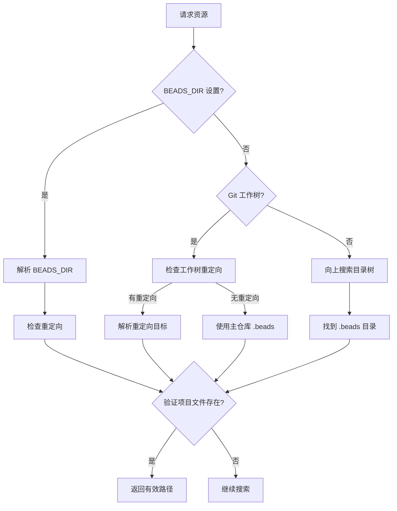

# Beads 模块技术深度解析

## 1. 问题背景与模块定位

在现代软件开发工作流中，项目数据和配置通常存储在特定的项目目录结构中。对于 `bd` 工具链而言，需要一种可靠的方式来定位和访问其核心数据库和配置文件，同时支持灵活的重定向机制以适应各种工作场景。

**beads 模块的核心价值在于**：提供一个最小化的公共 API，用于定位、发现和访问 `bd` 工具链的核心资源（数据库、配置目录），同时处理复杂的工作流场景如 Git 工作树、环境变量覆盖、目录重定向等。

## 2. 核心概念与心智模型

想象 `beads` 模块是一个**智能路径路由器**：
- 它从多个信号源（环境变量、Git 仓库元数据、目录扫描）收集线索
- 按照优先级和规则解析出正确的 `.beads` 目录位置
- 处理重定向机制，就像域名解析中的 CNAME 记录
- 最终返回一个可靠的访问入口，屏蔽掉底层的复杂性

### 关键抽象：
1. **RedirectInfo**：封装重定向关系的信息结构
2. **DatabaseInfo**：封装数据库发现结果的信息结构
3. **路径发现算法**：一套优先级明确的目录搜索和验证规则

## 3. 架构与数据流

让我们用 Mermaid 图展示核心发现流程：



### 发现流程详解：

1. **环境变量优先**：`BEADS_DIR` 提供显式的目录路径，具有最高优先级
2. **Git 工作树特殊处理**：支持工作树内的重定向覆盖，或者默认使用主仓库的 `.beads` 目录
3. **目录树搜索**：从当前目录向上搜索，直到 Git 仓库根或文件系统根
4. **重定向跟随**：检查 `redirect` 文件，解析并验证重定向目标（不支持链式重定向）
5. **项目文件验证**：确保找到的 `.beads` 目录包含实际的项目文件，而非仅守护进程注册表

## 4. 核心组件深入解析

### RedirectInfo 结构
```go
type RedirectInfo struct {
    IsRedirected bool   // 是否存在重定向
    LocalDir     string // 本地 .beads 目录（包含 redirect 文件）
    TargetDir    string // 实际使用的 .beads 目录（重定向后）
}
```

**设计意图**：封装重定向关系的完整信息，便于调用者理解当前的路径解析状态。这对于调试和日志记录特别有用。

### DatabaseInfo 结构
```go
type DatabaseInfo struct {
    Path       string // 数据库文件或目录的完整路径
    BeadsDir   string // 父级 .beads 目录
    IssueCount int    // 问题数量（未知时为 -1）
}
```

**设计意图**：提供数据库发现的完整上下文，不仅仅是路径本身，还包含相关的元数据。这使得调用者可以做出更明智的决策。

### FollowRedirect 函数
这是重定向机制的核心实现。它：
- 读取 `redirect` 文件内容
- 处理注释和空行
- 解析相对路径（相对于项目根目录）
- 验证目标的存在性和有效性
- 防止链式重定向

**关键设计决策**：不支持链式重定向。这是一个有意的简化，避免了复杂的循环检测和无限递归问题。

### FindBeadsDir 函数
这是模块的核心发现函数。它实现了完整的搜索策略：
1. 检查 `BEADS_DIR` 环境变量
2. 处理 Git 工作树的特殊情况
3. 向上搜索目录树，受 Git 根限制
4. 跟随重定向
5. 验证项目文件存在性

**设计亮点**：`hasBeadsProjectFiles` 函数确保返回的目录是真正的项目目录，而非仅包含守护进程注册表的 `~/.beads`。

## 5. 依赖关系分析

`beads` 模块是一个相对独立的基础设施模块，它主要依赖：

- **git 模块**：用于检测 Git 仓库、工作树和获取仓库根目录
- **configfile 模块**：用于读取和解析 `metadata.json` 配置
- **storage 模块**：作为类型别名的来源（`Storage` 和 `Transaction`）
- **utils 模块**：用于路径规范化等辅助功能

**被依赖情况**：`beads` 模块作为基础设施，被上层的命令行工具和扩展代码广泛使用，提供统一的资源发现入口。

## 6. 设计权衡与决策

### 1. 重定向机制 vs 符号链接
**选择**：实现自定义的 `redirect` 文件机制
**原因**：
- 符号链接在某些平台或 Git 配置下可能有问题
- `redirect` 文件可以包含注释，更具表达力
- 更容易检测和防止循环

### 2. 不支持链式重定向
**选择**：仅跟随一层重定向
**权衡**：
- 优点：实现简单，行为可预测，无循环风险
- 缺点：限制了灵活性

### 3. 项目文件验证
**选择**：验证目录包含实际项目文件
**原因**：
- 防止错误地返回 `~/.beads`（仅包含守护进程注册表）
- 确保发现的目录是真正的项目目录

### 4. Git 根限制搜索
**选择**：在 Git 仓库根处停止向上搜索
**原因**：
- 避免在嵌套仓库场景中找到错误的 `.beads` 目录
- 保持搜索范围在项目边界内

## 7. 使用指南与示例

### 基本用法：发现 .beads 目录
```go
beadsDir := beads.FindBeadsDir()
if beadsDir == "" {
    log.Fatal("No .beads directory found")
}
fmt.Printf("Using .beads directory: %s\n", beadsDir)
```

### 发现数据库路径
```go
dbPath := beads.FindDatabasePath()
if dbPath == "" {
    log.Fatal("No database found")
}
fmt.Printf("Database path: %s\n", dbPath)
```

### 检查重定向信息
```go
redirectInfo := beads.GetRedirectInfo()
if redirectInfo.IsRedirected {
    fmt.Printf("Redirected from %s to %s\n", 
        redirectInfo.LocalDir, 
        redirectInfo.TargetDir)
}
```

## 8. 注意事项与陷阱

### 1. 重定向目标验证
当 `redirect` 文件指向无效目录时，`FollowRedirect` 会静默失败并返回原始路径。这种情况下会在标准错误输出警告，但不会返回错误。

### 2. BEADS_DIR 的特殊处理
当 `BEADS_DIR` 环境变量设置时，即使该目录不包含数据库，`FindDatabasePath` 也不会继续搜索其他位置。这允许 `--no-db` 模式正常工作。

### 3. Git 工作树边界
在 Git 工作树中，搜索会在工作树根和主仓库根处都停止，确保不会找到不相关的项目资源。

### 4. 项目文件验证的严格性
`hasBeadsProjectFiles` 函数会排除仅包含守护进程注册表文件的目录，这可能导致某些边缘情况下找不到预期的 `.beads` 目录。

### 5. 路径规范化
模块会对路径进行规范化处理（`utils.CanonicalizePath`），确保返回的路径是绝对路径且不包含冗余组件。

## 9. 总结

`beads` 模块是 `bd` 工具链的基础设施组件，提供了可靠的资源发现和路径解析功能。它通过精心设计的搜索策略和重定向机制，屏蔽了底层复杂性，为上层代码提供了简单统一的 API。其设计体现了在简单性与灵活性、正确性与性能之间的良好权衡，是一个典型的基础设施模块范例。
