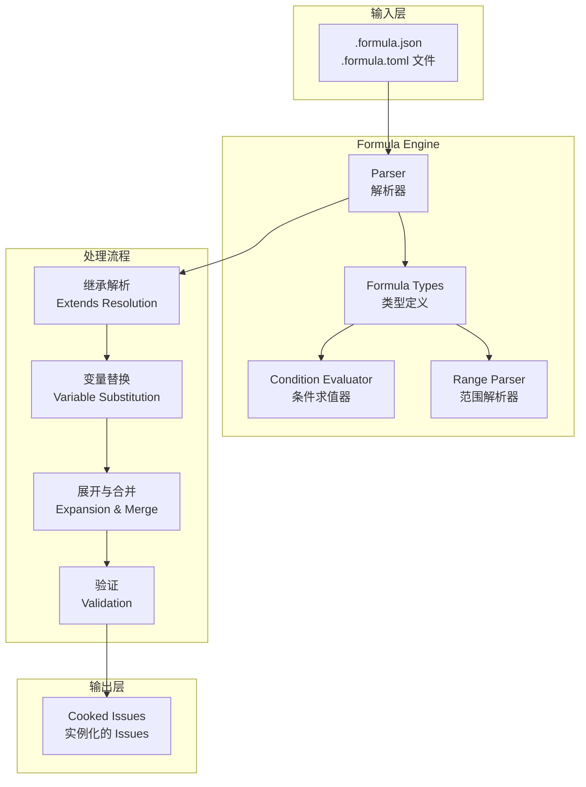

# Formula Engine

## 模块概述

**Formula Engine** 是一个用于解析、验证和实例化工作流模板的核心模块。它处理 `.formula.json` 或 `.formula.toml` 文件——这些文件定义了可重用的工作流蓝图，可以"烹饪"(cook)成具体的 issues 和依赖关系。

> 想象一下：Formula 就像餐厅的**菜谱**。菜谱定义了做菜的步骤（Steps）、需要的食材变量（Vars）、如何与其他菜谱组合（Compose Rules），以及烹饪过程中的条件判断（Conditions/Gates）。当你"烹饪"一道菜时，系统会根据菜谱创建具体的菜品（issues），并在烹饪过程中根据条件动态调整。

### 这个模块解决什么问题？

在 beads 系统中，如果你需要为每个功能都手动创建一系列相关的 issues（设计 → 开发 → 测试 → 部署），这将是繁琐且容易出错的工作。Formula Engine 解决了以下问题：

1. **重复性工作的自动化**：定义一次工作流模板，然后在不同场景下重复使用，每次只需提供不同的变量值
2. **工作流组合与扩展**：通过继承（extends）、切面（aspects）、扩展（expansions）机制，将简单的工作流组合成复杂的系统
3. **条件执行与门控**：支持基于步骤状态、输出或外部条件的动态流程控制
4. **迭代与循环**：支持基于计数、范围或条件的循环展开

---

## 架构概览



### 核心组件说明

| 组件 | 职责 | 关键类型 |
|------|------|----------|
| **Parser** | 加载、解析、继承解析公式文件 | `Parser`, `Formula` |
| **Formula Types** | 定义公式的结构化表示 | `Formula`, `Step`, `ComposeRules`, `VarDef` |
| **Condition** | 评估门控和循环的条件表达式 | `Condition`, `ConditionContext`, `StepState` |
| **Range** | 解析和求值范围表达式（用于循环） | `RangeSpec`, `exprParser` |

---

## 核心抽象与心智模型

### 公式的三种类型

Formula Engine 支持三种类型的公式，它们代表了不同的工作流抽象级别：

1. **TypeWorkflow（标准工作流）**：最常用的类型，定义一个线性或带分支的工作流程
   - 示例：`mol-feature` - 功能开发的标准流程

2. **TypeExpansion（扩展宏）**：可被内联展开的模板，类似于代码中的宏
   - 示例：`exp-test-lint` - 展开为"测试 + 代码检查"的组合
   - 使用 `{target}` 占位符引用被展开的目标步骤

3. **TypeAspect（切面）**：横切关注点，可应用于其他公式
   - 示例：`security-audit` - 为所有步骤添加安全审查步骤
   - 使用 `AdviceRule` 定义 before/after/around advice

### 步骤的组成

每个 `Step` 代表一个要创建的工作项，它包含：
- **标识**：ID（用于依赖引用）
- **内容**：Title、Description（支持 `{{variable}}` 变量替换）
- **元数据**：Type（task/bug/feature/epic）、Priority、Labels、Assignee
- **依赖**：DependsOn、Needs（定义执行顺序）
- **控制流**：
  - `Gate`：异步等待条件（GitHub PR、workflow run、人工审批等）
  - `Loop`：迭代展开
  - `OnComplete`：步骤完成后的动态扩展（for-each 模式）
  - `Condition`：条件包含/排除
  - `WaitsFor`：扇出门控（等待所有或任意子步骤）

### 组合规则

`ComposeRules` 定义了公式如何与其他公式组合：

- **BondPoints**：命名附着点，其他公式可以挂载到这里
- **Hooks**：基于标签或条件的自动挂载
- **Expand/Map**：单目标/多目标扩展规则
- **Branch**：fork-join 并行模式
- **Gate**：运行时条件等待
- **Aspects**：应用的切面公式列表

---

## 数据流分析

### 完整的公式实例化流程

```
用户输入: bd cook mol-feature component=api-server
    │
    ▼
┌─────────────────────────────────────────────────────────────┐
│ 1. Parser.ParseFile()                                       │
│    - 读取 .formula.json 文件                                 │
│    - 解析 JSON/TOML 为 Formula 结构                          │
└─────────────────────────────────────────────────────────────┘
    │
    ▼
┌─────────────────────────────────────────────────────────────┐
│ 2. Parser.Resolve() - 继承解析                               │
│    - 加载父公式 (via extends)                                │
│    - 递归解析父公式                                          │
│    - 合并 vars、steps、compose rules                         │
│    - 子定义覆盖父定义                                         │
│    - 循环检测 (circular extends)                             │
└─────────────────────────────────────────────────────────────┘
    │
    ▼
┌─────────────────────────────────────────────────────────────┐
│ 3. ValidateVars() - 变量验证                                 │
│    - 检查必需变量是否提供                                     │
│    - 应用默认值                                               │
│    - 验证 enum 和 pattern 约束                               │
└─────────────────────────────────────────────────────────────┘
    │
    ▼
┌─────────────────────────────────────────────────────────────┐
│ 4. 变量替换 Substitute()                                     │
│    - 替换 title、description 中的 {{variable}}              │
│    - 替换 assignee、condition 中的变量                       │
└─────────────────────────────────────────────────────────────┘
    │
    ▼
┌─────────────────────────────────────────────────────────────┐
│ 5. 条件过滤 FilterStepsByCondition()                         │
│    - 解析 step.condition                                     │
│    - 评估条件（可能需要运行时上下文）                         │
│    - 排除不满足条件的步骤                                     │
└─────────────────────────────────────────────────────────────┘
    │
    ▼
┌─────────────────────────────────────────────────────────────┐
│ 6. 循环展开 (如需要)                                         │
│    - 解析 LoopSpec (Count/Until/Range)                      │
│    - Range: ParseRange() 解析 "1..2^{n}" 表达式             │
│    - 展开 body 步骤 N 次                                      │
└─────────────────────────────────────────────────────────────┘
    │
    ▼
┌─────────────────────────────────────────────────────────────┐
│ 7. 内联扩展 ApplyInlineExpansions()                          │
│    - 解析 step.expand                                        │
│    - 加载扩展公式                                             │
│    - 替换 {target}、{target.description} 占位符             │
│    - 展开模板步骤                                            │
└─────────────────────────────────────────────────────────────┘
    │
    ▼
┌─────────────────────────────────────────────────────────────┐
│ 8. 验证 Validate()                                           │
│    - 检查必需的 id、title                                    │
│    - 验证依赖引用的有效性                                     │
│    - 验证 waits_for、on_complete 格式                        │
└─────────────────────────────────────────────────────────────┘
    │
    ▼
    输出: 可执行的 Issue 列表 (包含依赖关系)
```

### 与其他模块的交互

Formula Engine 位于系统的中间层：

- **上游（输入）**：
  - CLI 命令（`cmd.bd.cook`、`cmd.bd.formula`）提供用户输入
  - 文件系统（`.beads/formulas/` 目录）

- **下游（输出）**：
  - **Storage 接口** (`internal.storage.storage`)：持久化解析后的 issues
  - **Molecules 模块** (`internal.molecules.molecules`)：将公式实例化为 molecule
  - **Tracker 集成** (`internal.tracker.*`)：同步到外部 issue tracker

---

## 设计决策与权衡分析

### 1. JSON vs TOML 格式支持

**决策**：同时支持 `.formula.json` 和 `.formula.toml`，TOML 为首选

**权衡分析**：
- JSON 优点：广泛熟悉、工具链成熟
- TOML 优点：更简洁的语法、更好的注释支持（对配置文件很重要）
- 决策原因：TOML 更适合配置文件场景，但保留 JSON 兼容性支持遗留用户

### 2. 继承机制的设计

**决策**：使用 `extends` 字段实现单继承（支持多父，但按顺序合并）

**权衡分析**：
- 选择继承而非组合的原因：工作流模板本身就是"is-a"关系（一个功能工作流"是"一个基本工作流）
- 风险：多层继承可能导致复杂性爆炸
- 缓解：通过 Validate() 限制复杂度，通过 source tracking 追踪来源

### 3. 条件求值的限制

**决策**：条件表达式仅限于预定义的模式匹配，不支持任意代码执行

**权衡分析**：
- 为什么不支持完整表达式语言？安全性 + 可预测性
- 支持的模式：
  - 字段访问：`step.status == 'complete'`
  - 聚合函数：`children(step).all(status == 'complete')`
  - 外部检查：`file.exists('go.mod')`、`env.CI == 'true'`
  - 统计：`steps.complete >= 3`
- 这样做的好处：条件始终可判定，不会因为用户代码错误而卡死

### 4. Parser 的非线程安全性

**决策**：`Parser` 结构体明确标注为非线程安全

**权衡分析**：
- 风险：如果多 goroutine 共享一个 Parser，可能有竞态条件
- 设计选择：不在内部加锁，以获得最佳单线程性能
- 正确用法：为每个 goroutine 创建独立的 Parser，或外部同步

### 5. 变量替换的双层语法

**决策**：
- `{{variable}}` 用于 title/description 等用户可见文本
- `{variable}` 用于内部占位符（如 range 表达式、expand 模板）

**权衡分析**：
- 两套语法增加了学习成本
- 但这样做可以避免歧义：`{{var}}` 总是用户变量，`{target}` 总是系统占位符

---

## 扩展点与锁定边界

### 可扩展的部分

| 扩展点 | 机制 | 示例 |
|--------|------|------|
| **新公式类型** | `FormulaType` 枚举扩展 | 添加 `TypePipeline` |
| **新条件类型** | 在 `condition.go` 添加 pattern | 添加 `gh.status` 支持 |
| **新门控类型** | `Gate.Type` 字符串扩展 | 添加 `jira.status` |
| **内联展开** | `Step.Expand` 字段 | 引用扩展公式 |

### 锁定边界

- **Formula 结构体**：JSON/TOML 序列化格式是稳定的公共 API
- **验证规则**：`Validate()` 方法确保结构完整性，修改需谨慎
- **条件语法**：改变条件语法会影响现有公式，需向后兼容

---

## 贡献者注意事项

### 常见陷阱

1. **循环继承检测**
   - 如果公式 A extends B，B extends A，Parser 会检测到并报错
   - 错误信息会显示完整的循环链

2. **变量覆盖顺序**
   - 父公式的变量会被子公式覆盖
   - `required: true` 和 `default` 不能同时设置（验证会报错）

3. **范围表达式的求值时机**
   - `range: "1..{n}"` 中的 `{n}` 在 cook 时求值，不是在定义时
   - 支持的运算符：`+ - * / ^ (power)` 和括号

4. **Condition 的求值上下文**
   - 条件在两个阶段被评估：
     - **Cook 时**：`step.condition` - 静态条件
     - **Runtime**：`ComposeRules.Gate` 中的 `GateRule` - 动态门控
   - 不同条件类型需要不同的上下文

5. **Source Tracing**
   - 解析时自动设置 `SourceFormula` 和 `SourceLocation`
   - 对于继承的步骤，这些字段指向原始定义位置，而非最终组合位置

### 调试技巧

- 使用 `Parser.ParseFile()` 直接加载并检查 formula
- 使用 `ExtractVariables()` 找出公式中所有的变量引用
- 使用 `ValidateVars()` 在实例化前检查变量合法性

---

## 子模块文档

- [Formula Types](internal-formula-types.md) - 公式类型定义
- [Formula Condition](internal-formula-condition.md) - 条件求值引擎
- [Formula Range](internal-formula-range.md) - 范围表达式解析
- [Formula Parser](internal-formula-parser.md) - 解析器与加载器

---

## 相关模块参考

- [Molecules 模块](internal-molecules-molecules.md) - 将公式实例化为 molecule
- [CLI Cook Commands](cmd-bd-cook.md) - 公式烹饪命令
- [CLI Formula Commands](cmd-bd-formula.md) - 公式管理命令