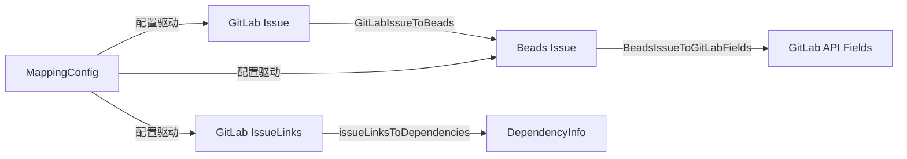

# GitLab 映射模块技术深度解析

## 1. 模块概述

`gitlab_mapping` 模块是 GitLab 集成的核心转换层，解决的核心问题是如何在两个完全不同的领域模型之间建立双向映射：GitLab 的问题跟踪系统和内部的 Beads 问题域模型。

### 为什么需要这个模块？

简单来说，GitLab 和 Beads 看待问题的方式不一样。GitLab 使用标签（labels）作为元数据的主要载体，而 Beads 有专门的类型安全字段来表示优先级、状态和问题类型。这个模块就像一个翻译官，负责在两种语言之间进行双向转换，同时处理状态优先级、默认值和数据完整性等边界情况。

## 2. 核心架构与数据流程

### 数据转换流程



### 核心组件角色

- **MappingConfig**：配置中心，定义了所有字段映射规则的容器
- **转换函数族**：`GitLabIssueToBeads`、`BeadsIssueToGitLabFields` 等，执行实际的领域模型转换
- **辅助提取函数**：`priorityFromLabels`、`statusFromLabelsAndState`、`typeFromLabels`，从 GitLab 标签中提取结构化信息

## 3. 核心组件深度解析

### MappingConfig 结构

`MappingConfig` 是整个模块的配置核心，它采用了映射表模式（Mapping Table Pattern），将领域特定的转换规则集中管理。

```go
type MappingConfig struct {
    PriorityMap  map[string]int    // priority label value → beads priority (0-4)
    StateMap     map[string]string // GitLab state → beads status
    LabelTypeMap map[string]string // type label value → beads issue type
    RelationMap  map[string]string // GitLab link type → beads dependency type
}
```

**设计意图**：使用映射表而非硬编码条件判断，让转换规则可配置、可扩展，同时保持代码的简洁性。这种设计使得不同团队可以根据自己的 GitLab 标签约定自定义映射，而无需修改代码。

### DefaultMappingConfig 工厂函数

`DefaultMappingConfig` 提供了标准的映射配置，同时实现了防御性复制（Defensive Copy）模式。

```go
func DefaultMappingConfig() *MappingConfig {
    // 复制映射以避免外部修改
    priorityMap := make(map[string]int, len(PriorityMapping))
    for k, v := range PriorityMapping {
        priorityMap[k] = v
    }
    // ...
}
```

**设计亮点**：这里使用了深拷贝来保护内部状态，防止调用方意外修改共享配置。这是在 Go 语言中处理可变配置对象的常见安全实践。

### GitLabIssueToBeads 转换函数

这是模块的核心入口函数，负责将 GitLab 问题完整转换为 Beads 问题。

```go
func GitLabIssueToBeads(gl *Issue, config *MappingConfig) *IssueConversion
```

**转换逻辑**：
1. 从 GitLab 标签中提取优先级、类型和状态
2. 处理特殊字段映射（如 weight → EstimatedMinutes）
3. 设置源系统引用和外部链接
4. 过滤掉内部使用的作用域标签

**设计意图**：采用了管道式设计，每个转换步骤相对独立，便于测试和维护。

### BeadsIssueToGitLabFields 反向转换

这个函数将 Beads 问题转换为 GitLab API 可接受的字段映射。

```go
func BeadsIssueToGitLabFields(issue *types.Issue, config *MappingConfig) map[string]interface{}
```

**关键特性**：
- 将 Beads 的结构化字段转换回 GitLab 的作用域标签（如 `type::bug`）
- 处理状态转换的特殊性：GitLab 用 `state_event` 来控制开放/关闭，而不是直接设置状态
- 时间估算的双向转换（weight ↔ EstimatedMinutes）

## 4. 依赖关系分析

### 上游依赖
- **gitlab_fieldmapper**：使用 `MappingConfig` 来构建字段映射器
- **gitlab_tracker**：集成 `MappingConfig` 作为 GitLab 跟踪器的配置部分

### 数据契约
- 从 GitLab API 获取 `Issue` 和 `IssueLink` 结构
- 输出符合 Beads 领域模型的 `types.Issue` 结构

## 5. 设计决策与权衡

### 映射表 vs 条件判断

**选择**：使用映射表（map）而非条件判断链  
**原因**：
- 更易于扩展和维护
- 配置与逻辑分离
- 运行时可修改，支持自定义配置

**权衡**：
- 失去了编译时类型检查
- 需要额外处理映射缺失的情况

### 防御性复制

**选择**：在 `DefaultMappingConfig` 中深拷贝映射  
**原因**：防止外部代码意外修改共享配置，确保线程安全  
**权衡**：轻微的性能开销，但换取了更好的安全性

### 标签解析策略

**选择**：支持作用域标签（`type::bug`）和普通标签（`bug`）两种格式  
**原因**：平衡了 GitLab 的最佳实践和向后兼容性  
**设计细节**：先检查作用域标签，再检查普通标签，确保明确性优先

## 6. 使用指南与示例

### 基本使用模式

```go
// 创建默认映射配置
config := gitlab.DefaultMappingConfig()

// 从 GitLab 转换到 Beads
conversion := gitlab.GitLabIssueToBeads(glIssue, config)
beadsIssue := conversion.Issue

// 从 Beads 转换回 GitLab 字段
glFields := gitlab.BeadsIssueToGitLabFields(beadsIssue, config)
```

### 自定义映射配置

```go
// 基于默认配置进行自定义
config := gitlab.DefaultMappingConfig()

// 添加自定义优先级映射
config.PriorityMap["urgent"] = 0
config.PriorityMap["routine"] = 3

// 添加自定义问题类型
config.LabelTypeMap["enhancement"] = "feature"
```

## 7. 边界情况与注意事项

### 状态优先级

**重要**：在 `statusFromLabelsAndState` 中，GitLab 的 "closed" 状态优先级最高，会覆盖任何状态标签。这是设计决策，确保问题关闭状态的一致性。

### 默认值策略

- 优先级默认值：2（medium）
- 问题类型默认值："task"
- 状态默认值："open"

### 标签过滤

`filterNonScopedLabels` 会移除所有内部作用域标签（`priority::*`、`status::*`、`type::*`），只保留用户自定义标签。

### 依赖关系方向

处理 `IssueLinks` 时需要特别注意方向：GitLab 的链接是有方向的，需要根据源 IID 和目标 IID 正确确定依赖关系。

## 8. 相关模块参考

- [GitLab 类型定义](internal-gitlab-types.md)：了解 GitLab 数据结构
- [GitLab 字段映射器](internal-gitlab-fieldmapper.md)：字段映射的高层抽象
- [GitLab 跟踪器](internal-gitlab-tracker.md)：完整的 GitLab 集成实现