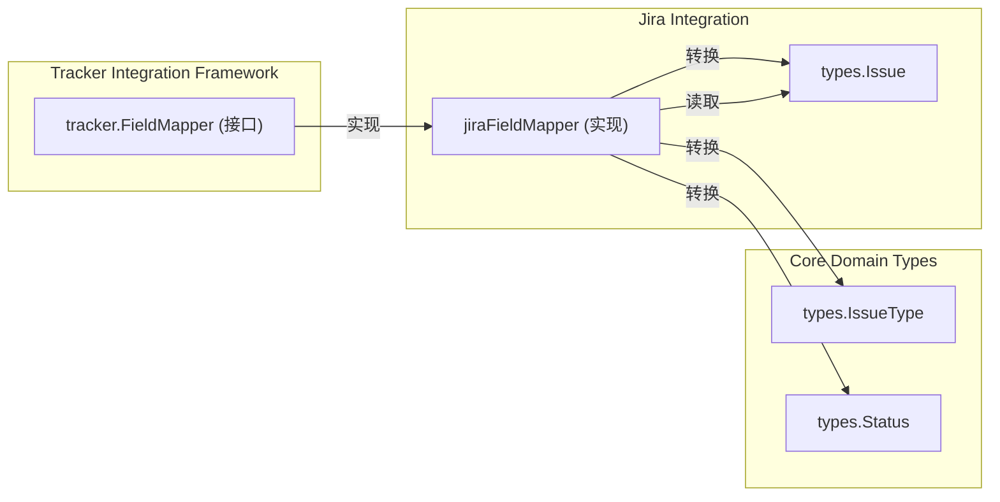

# Jira 字段映射模块技术深度解析

## 1. 模块概述

Jira 字段映射模块 (`internal.jira.fieldmapper`) 是整个系统中 Jira 集成的关键组件，它负责在系统内部数据模型与 Jira 数据模型之间进行双向转换。

### 问题背景

在构建与 Jira 集成的工具时，我们面临一个核心问题：**Jira 和内部系统 (Beads) 对相同概念使用了不同的表示方式**。例如：

1. **状态差异**：Beads 使用标准状态集（如 "Open"、"InProgress"），但 Jira 允许自定义状态名称
2. **优先级差异**：Beads 使用 0-4 的数值优先级，而 Jira 使用命名优先级
3. **描述格式差异**：Jira API v3 使用 Atlassian Document Format (ADF)，而内部系统使用纯文本
4. **字段结构差异**：Jira 问题具有复杂的嵌套字段结构，内部系统需要将其扁平化

如果不解决这些差异，系统将无法正确地与 Jira 同步问题数据，导致信息丢失或误解。

### 解决方案

`jiraFieldMapper` 实现了 `tracker.FieldMapper` 接口，提供了一套统一的转换机制，使得系统可以无缝地将 Jira 问题转换为内部问题，反之亦然。它支持配置自定义状态映射，以便处理 Jira 实例中常见的状态名称差异。

## 2. 架构与核心组件

### 架构图



### 核心组件

#### jiraFieldMapper 结构体

```go
type jiraFieldMapper struct {
	apiVersion string            // "2" 或 "3" (默认: "3")
	statusMap  map[string]string // beads status → Jira status name (来自 jira.status_map.* 配置)
}
```

这个结构体是模块的核心，它包含两个关键字段：

1. **apiVersion**：支持 Jira API 的两个主要版本（v2 和 v3），这在处理描述字段格式时尤为重要
2. **statusMap**：允许将内部状态映射到自定义的 Jira 状态名称，提供了灵活性

## 3. 核心功能与转换逻辑

### 3.1 状态转换

状态转换是模块中最复杂的部分，因为它需要同时支持标准状态映射和自定义状态映射。

#### StatusToBeads (Jira → Beads)

```go
func (m *jiraFieldMapper) StatusToBeads(trackerState interface{}) types.Status {
	if state, ok := trackerState.(string); ok {
		// 首先检查自定义映射 (反向: jira name → beads status)
		for beadsStatus, jiraName := range m.statusMap {
			if strings.EqualFold(state, jiraName) {
				return types.Status(beadsStatus)
			}
		}
		// 然后检查标准映射
		switch state {
		case "To Do", "Open", "Backlog", "New":
			return types.StatusOpen
		case "In Progress", "In Review":
			return types.StatusInProgress
		case "Blocked":
			return types.StatusBlocked
		case "Done", "Closed", "Resolved":
			return types.StatusClosed
		}
	}
	return types.StatusOpen
}
```

**设计意图**：
- 优先检查自定义映射，确保用户的特定配置得到尊重
- 使用 `strings.EqualFold` 进行大小写不敏感的比较，提高鲁棒性
- 提供广泛的标准状态映射，覆盖大多数常见的 Jira 工作流
- 如果无法匹配，默认返回 "Open" 状态，确保数据不会丢失

#### StatusToTracker (Beads → Jira)

```go
func (m *jiraFieldMapper) StatusToTracker(beadsStatus types.Status) interface{} {
	// 首先检查自定义映射
	if name, ok := m.statusMap[string(beadsStatus)]; ok {
		return name
	}
	// 然后使用标准映射
	switch beadsStatus {
	case types.StatusOpen:
		return "To Do"
	case types.StatusInProgress:
		return "In Progress"
	case types.StatusBlocked:
		return "Blocked"
	case types.StatusClosed:
		return "Done"
	default:
		return "To Do"
	}
}
```

**设计意图**：
- 保持与 `StatusToBeads` 相同的优先级逻辑（自定义映射优先）
- 使用 Jira 中最常见的默认状态名称

### 3.2 优先级转换

#### PriorityToBeads (Jira → Beads)

```go
func (m *jiraFieldMapper) PriorityToBeads(trackerPriority interface{}) int {
	if name, ok := trackerPriority.(string); ok {
		switch name {
		case "Highest":
			return 0
		case "High":
			return 1
		case "Medium":
			return 2
		case "Low":
			return 3
		case "Lowest":
			return 4
		}
	}
	return 2 // 默认优先级
}
```

#### PriorityToTracker (Beads → Jira)

```go
func (m *jiraFieldMapper) PriorityToTracker(beadsPriority int) interface{} {
	switch beadsPriority {
	case 0:
		return "Highest"
	case 1:
		return "High"
	case 2:
		return "Medium"
	case 3:
		return "Low"
	case 4:
		return "Lowest"
	default:
		return "Medium"
	}
}
```

**设计意图**：
- 使用简单的数值映射，符合内部系统对优先级的处理方式
- 提供明确的默认值，确保转换的一致性

### 3.3 类型转换

#### TypeToBeads (Jira → Beads)

```go
func (m *jiraFieldMapper) TypeToBeads(trackerType interface{}) types.IssueType {
	if t, ok := trackerType.(string); ok {
		switch t {
		case "Bug":
			return types.TypeBug
		case "Story", "Feature":
			return types.TypeFeature
		case "Epic":
			return types.TypeEpic
		case "Task", "Sub-task":
			return types.TypeTask
		}
	}
	return types.TypeTask
}
```

#### TypeToTracker (Beads → Jira)

```go
func (m *jiraFieldMapper) TypeToTracker(beadsType types.IssueType) interface{} {
	switch beadsType {
	case types.TypeBug:
		return "Bug"
	case types.TypeFeature:
		return "Story"
	case types.TypeEpic:
		return "Epic"
	default:
		return "Task"
	}
}
```

**设计意图**：
- 将 Jira 的多种类型映射到内部系统的标准类型
- 在反向转换时，选择最常见的 Jira 类型（如 Feature → Story）

### 3.4 完整问题转换

#### IssueToBeads (Jira 问题 → Beads 问题)

```go
func (m *jiraFieldMapper) IssueToBeads(ti *tracker.TrackerIssue) *tracker.IssueConversion {
	ji, ok := ti.Raw.(*Issue)
	if !ok || ji == nil {
		return nil
	}

	issue := &types.Issue{
		Title:       ji.Fields.Summary,
		Description: DescriptionToPlainText(ji.Fields.Description),
		Priority:    m.PriorityToBeads(priorityName(ji)),
		Status:      m.StatusToBeads(statusName(ji)),
		IssueType:   m.TypeToBeads(typeName(ji)),
	}

	// 设置可选字段
	if ji.Fields.Assignee != nil {
		issue.Owner = ji.Fields.Assignee.DisplayName
	}

	if ji.Fields.Labels != nil {
		issue.Labels = ji.Fields.Labels
	}

	// 设置外部引用
	if ji.Self != "" {
		ref := extractBrowseURL(ji)
		issue.ExternalRef = &ref
	}

	return &tracker.IssueConversion{
		Issue: issue,
	}
}
```

**设计意图**：
- 使用类型断言安全地访问原始 Jira 问题数据
- 通过辅助函数（如 `priorityName`、`statusName`）安全地提取嵌套字段
- 将 Jira 的 ADF 格式描述转换为纯文本
- 构建外部引用 URL，提供从内部问题到 Jira 问题的直接链接

#### IssueToTracker (Beads 问题 → Jira 字段)

```go
func (m *jiraFieldMapper) IssueToTracker(issue *types.Issue) map[string]interface{} {
	fields := map[string]interface{}{
		"summary": issue.Title,
	}

	// 根据 API 版本设置描述格式
	if issue.Description != "" {
		if m.apiVersion == "2" {
			fields["description"] = issue.Description
		} else {
			fields["description"] = PlainTextToADF(issue.Description)
		}
	}

	// 设置问题类型
	typeName := m.TypeToTracker(issue.IssueType)
	if name, ok := typeName.(string); ok {
		fields["issuetype"] = map[string]string{"name": name}
	}

	// 设置优先级
	priorityName := m.PriorityToTracker(issue.Priority)
	if name, ok := priorityName.(string); ok {
		fields["priority"] = map[string]string{"name": name}
	}

	// 设置标签
	if len(issue.Labels) > 0 {
		fields["labels"] = issue.Labels
	}

	return fields
}
```

**设计意图**：
- 根据 API 版本选择正确的描述格式（v2 用纯文本，v3 用 ADF）
- 构建符合 Jira API 期望的嵌套字段结构
- 只设置非空字段，避免覆盖 Jira 中已有的值

## 4. 设计决策与权衡

### 4.1 自定义状态映射的实现方式

**决策**：在 `statusMap` 中存储内部状态到 Jira 状态的正向映射，但在 `StatusToBeads` 中反向遍历该映射。

**权衡**：
- **优点**：配置更加直观（用户设置 "Open" → "待办"）
- **缺点**：`StatusToBeads` 需要遍历整个映射来查找匹配，时间复杂度为 O(n)

**替代方案**：同时维护正向和反向映射，但这会增加内存使用和同步复杂性。

### 4.2 默认值的使用

**决策**：在无法匹配状态、优先级或类型时，提供明确的默认值。

**权衡**：
- **优点**：确保转换总是能产生有效的结果，避免错误传播
- **缺点**：可能掩盖配置问题，导致数据不准确

### 4.3 API 版本支持

**决策**：通过 `apiVersion` 字段同时支持 Jira API v2 和 v3，主要差异体现在描述字段的格式上。

**权衡**：
- **优点**：适应不同的 Jira 部署环境
- **缺点**：增加了代码复杂性，需要维护两套格式转换逻辑

## 5. 依赖关系

### 5.1 内部依赖

- `tracker.FieldMapper`：定义了字段映射器的接口契约
- `types.Issue`、`types.Status`、`types.IssueType`：内部数据模型
- `client.Issue`：Jira API 数据模型

### 5.2 被依赖关系

- `jira.tracker.Tracker`：使用 `jiraFieldMapper` 进行问题数据转换

## 6. 使用指南与示例

### 6.1 创建 jiraFieldMapper

```go
// 创建具有默认配置的映射器
mapper := &jiraFieldMapper{
	apiVersion: "3",
	statusMap:  map[string]string{},
}

// 创建具有自定义状态映射的映射器
mapper := &jiraFieldMapper{
	apiVersion: "3",
	statusMap: map[string]string{
		string(types.StatusOpen):        "待办",
		string(types.StatusInProgress):  "进行中",
		string(types.StatusBlocked):     "被阻塞",
		string(types.StatusClosed):      "已完成",
	},
}
```

### 6.2 转换 Jira 问题

```go
// 假设我们有一个 Jira 问题
jiraIssue := &client.Issue{
	Key: "PROJ-123",
	Self: "https://company.atlassian.net/rest/api/3/issue/10001",
	Fields: client.IssueFields{
		Summary:     "修复登录问题",
		Description: []byte(`{"type":"doc","version":1,"content":[{"type":"paragraph","content":[{"type":"text","text":"用户无法登录系统"}]}]}`),
		Status:      &client.StatusField{Name: "In Progress"},
		Priority:    &client.PriorityField{Name: "High"},
		IssueType:   &client.IssueTypeField{Name: "Bug"},
	},
}

// 包装为 TrackerIssue
trackerIssue := &tracker.TrackerIssue{
	Raw: jiraIssue,
}

// 转换为内部问题
conversion := mapper.IssueToBeads(trackerIssue)
if conversion != nil {
	internalIssue := conversion.Issue
	// 使用 internalIssue...
}
```

## 7. 注意事项与潜在问题

### 7.1 状态映射的大小写敏感性

尽管 `StatusToBeads` 使用大小写不敏感的比较，但 `statusMap` 中的键是区分大小写的。确保在配置状态映射时使用正确的内部状态名称。

### 7.2 描述格式转换

从 ADF 到纯文本的转换（`DescriptionToPlainText`）可能会丢失格式信息，特别是复杂的表格、列表或媒体内容。

### 7.3 自定义 Jira 字段

当前实现不支持自定义 Jira 字段的映射。如果需要同步自定义字段，需要扩展 `jiraFieldMapper` 或创建自定义转换器。

### 7.4 线程安全性

`jiraFieldMapper` 是不可变的（一旦创建，其字段不会更改），因此是线程安全的。

## 8. 总结

`jiraFieldMapper` 模块是系统与 Jira 集成的关键组件，它解决了两个系统之间数据模型不匹配的问题。通过提供可配置的状态映射和支持多个 Jira API 版本，它实现了灵活而强大的数据转换功能。

该模块的设计遵循了清晰的接口契约，使用安全的字段访问模式，并提供了合理的默认值，确保了在各种情况下的可靠运行。
