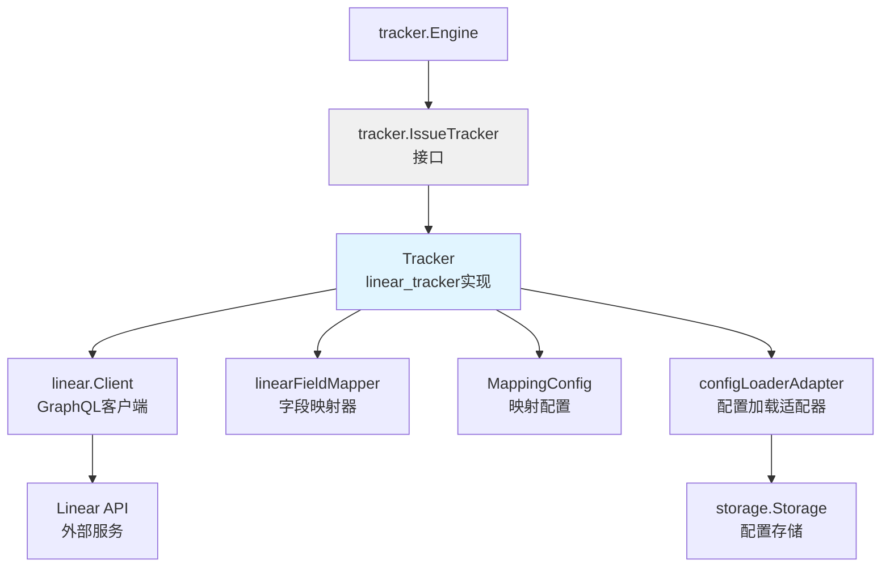

# Linear Tracker 模块技术深度解析

## 概述

`linear_tracker` 模块是 beads 系统与 Linear 项目管理工具之间的集成桥梁，它通过实现 `tracker.IssueTracker` 接口，将外部 Linear 系统与内部 beads 域模型无缝连接起来。简单来说，它的作用就像一个智能翻译官——一边说着 Linear 的 GraphQL API 语言，另一边说着 beads 的内部问题跟踪语言，使两者能够顺畅对话。

## 架构概览



这个模块的核心是 `Tracker` 结构体，它实现了 `IssueTracker` 接口，充当 beads 系统与 Linear 平台之间的翻译层和协调者。

## 核心组件详解

### Tracker 结构体

`Tracker` 是这个模块的灵魂，它封装了与 Linear 交互所需的所有上下文。

**设计意图**：通过将所有 Linear 相关的状态和操作集中在一个结构体中，实现了关注点分离——让 tracker 引擎只需要知道通用的 `IssueTracker` 接口，而不需要了解 Linear 特定的细节。

**核心字段**：
- `client`：Linear GraphQL API 的客户端，负责实际的网络通信
- `config`：字段映射配置，控制 Linear 和 beads 之间的数据转换
- `store`：内部存储的引用，用于读取配置
- `teamID`/`projectID`：Linear 中的目标团队和项目标识

```go
type Tracker struct {
    client    *Client
    config    *MappingConfig
    store     storage.Storage
    teamID    string
    projectID string
}
```

### configLoaderAdapter 结构体

这是一个小巧但关键的适配器，它的存在体现了优秀的接口隔离原则。

**设计意图**：`MappingConfig` 加载器需要一个简单的 `GetAllConfig()` 方法，但 `storage.Storage` 接口提供的是更丰富的功能。这个适配器将复杂的存储接口适配成配置加载器需要的简单接口，避免了让配置加载系统依赖不必要的存储功能。

```go
type configLoaderAdapter struct {
    ctx   context.Context
    store storage.Storage
}
```

## 数据流程解析

### 初始化流程

当 beads 系统需要与 Linear 同步时，初始化流程如下：

1. `tracker.Engine` 调用 `Tracker.Init()`
2. `Tracker` 从存储或环境变量中读取 API 密钥和团队 ID
3. 创建 `linear.Client` 实例
4. 通过 `configLoaderAdapter` 从存储加载 `MappingConfig`
5. 初始化完成，准备进行数据同步

### 拉取问题流程（Pull）

```
Tracker.FetchIssues() 
  → Client.FetchIssues/FetchIssuesSince() 
    → [Linear GraphQL API]
      → linear.Issue[]
        → linearToTrackerIssue()
          → tracker.TrackerIssue[]
            → [返回给 tracker.Engine]
```

这里的关键点是 `linearToTrackerIssue` 转换函数，它将 Linear 特定的数据结构转换为 tracker 引擎能理解的通用 `TrackerIssue` 结构。

### 推送问题流程（Push）

```
Tracker.CreateIssue/UpdateIssue()
  → FieldMapper.IssueToTracker()  // beads → Linear 字段映射
  → findStateID()                  // 状态解析
  → Client.CreateIssue/UpdateIssue()
    → [Linear GraphQL API]
      → linear.Issue
        → linearToTrackerIssue()
          → [返回更新后的问题]
```

值得注意的是 `findStateID` 方法——它不是直接使用状态名称，而是通过状态类型来查找对应的 Linear 状态 ID，这确保了即使团队重命名了工作流状态，同步仍然能正常工作。

## 设计决策与权衡

### 1. 配置来源的双重优先级

**决策**：配置值优先从存储读取，其次从环境变量读取

```go
func (t *Tracker) getConfig(ctx context.Context, key, envVar string) (string, error) {
    val, err := t.store.GetConfig(ctx, key)
    if err == nil && val != "" {
        return val, nil
    }
    if envVar != "" {
        if envVal := os.Getenv(envVar); envVal != "" {
            return envVal, nil
        }
    }
    return "", nil
}
```

**权衡分析**：
- ✅ 灵活性：支持通过环境变量进行快速配置和测试
- ✅ 持久化：通过存储支持跨会话的配置保持
- ❌ 复杂度：配置源的双重性可能导致调试困难（需要检查两个地方）

**为什么这样设计**：这符合 "配置分层" 原则——开发时使用环境变量方便，生产环境使用存储配置更安全且可审计。

### 2. 状态映射的类型优先策略

**决策**：通过状态类型而不是名称来匹配工作流状态

```go
func (t *Tracker) findStateID(ctx context.Context, status types.Status) (string, error) {
    targetType := StatusToLinearStateType(status)
    states, err := t.client.GetTeamStates(ctx)
    // ...
    for _, s := range states {
        if s.Type == targetType {
            return s.ID, nil
        }
    }
    // ...
}
```

**权衡分析**：
- ✅ 鲁棒性：团队可以重命名状态而不破坏同步
- ❌ 限制：每个状态类型只能有一个映射，不支持更细粒度的状态区分

**为什么这样设计**：在实践中，Linear 团队经常会调整工作流状态的名称，但状态类型（如 "todo"、"in_progress"、"done"）相对稳定。这种设计优先考虑了集成的弹性。

### 3. 适配器模式的配置加载

**决策**：使用 `configLoaderAdapter` 来适配 `storage.Storage` 接口

**权衡分析**：
- ✅ 接口隔离：配置加载器不需要了解完整的存储接口
- ✅ 可测试性：可以轻松模拟简单的 `ConfigLoader` 接口
- ❌ 间接层：增加了一个小的抽象层次

**为什么这样设计**：这是经典的"依赖倒置原则"应用——高层模块（配置加载）不应该依赖低层模块（存储）的细节，两者都应该依赖抽象。

## 关键实现细节

### linearToTrackerIssue 转换

这个函数是两个数据模型之间的桥梁，它的设计体现了防御性编程的思想：

```go
func linearToTrackerIssue(li *Issue) tracker.TrackerIssue {
    ti := tracker.TrackerIssue{
        // 基础字段直接赋值
        ID:          li.ID,
        Identifier:  li.Identifier,
        // ...
        Labels:      make([]string, 0),  // 安全的空集合
        Raw:         li,
    }

    // 可选字段使用 nil 检查
    if li.State != nil {
        ti.State = li.State
    }
    
    // 时间解析使用错误忽略策略
    if t, err := time.Parse(time.RFC3339, li.CreatedAt); err == nil {
        ti.CreatedAt = t
    }
    // ...
}
```

**注意事项**：时间解析采用了"最佳努力"策略——如果解析失败，只是跳过而不是返回错误。这是因为即使时间信息缺失，问题的核心数据仍然可用。

### 外部引用处理

`Tracker` 实现了三个与外部引用相关的方法，形成了一个完整的引用处理链：

1. `IsExternalRef()` - 判断引用是否属于 Linear
2. `ExtractIdentifier()` - 从引用中提取可读标识符
3. `BuildExternalRef()` - 为问题构建规范引用

这种设计确保了 beads 系统中存储的外部引用具有一致性和可追溯性。

## 使用指南与常见模式

### 初始化 Tracker

```go
// 通常由 tracker 包的注册机制自动调用
tracker := &linear.Tracker{}
err := tracker.Init(ctx, storage)
```

### 字段映射扩展

字段映射行为由 `MappingConfig` 控制，可以通过配置存储中的 `linear.*` 键来调整：

- `linear.priority_map.*` - 优先级映射
- `linear.state_map.*` - 状态映射
- `linear.label_type_map.*` - 标签到类型的映射
- `linear.relation_map.*` - 关系类型映射

## 边缘情况与注意事项

### 1. 状态回退策略

当找不到匹配的状态类型时，`findStateID` 会回退到使用第一个可用状态：

```go
if len(states) > 0 {
    return states[0].ID, nil
}
```

**注意**：这可能导致问题被推送到意料之外的状态。如果 Linear 团队没有标准的工作流状态，应该在初始化时进行验证。

### 2. 时间解析的容错性

如前所述，时间解析失败不会导致整个转换失败。这在处理来自不同版本 Linear API 或格式不一致的数据时很有用，但也可能导致时间信息缺失而不易察觉。

### 3. 项目 ID 的可选性

`projectID` 是可选的——如果没有配置，问题将被创建在团队默认位置。这增加了灵活性，但也可能导致问题分散在不同项目中。

## 依赖关系

`linear_tracker` 模块依赖以下关键组件：

- [tracker](internal-tracker-tracker.md) - 定义了 `IssueTracker` 和 `FieldMapper` 接口
- [linear_types](internal-linear-linear_types.md) - 定义了 Linear API 数据结构
- [linear_mapping](internal-linear-linear_mapping.md) - 提供字段映射配置加载
- [storage](internal-storage-storage.md) - 用于配置持久化

被以下组件依赖：

- [tracker_engine](internal-tracker-engine.md) - 使用该实现进行同步操作
- [CLI Linear 命令](cmd-bd-linear.md) - 可能直接使用某些辅助函数

## 总结

`linear_tracker` 模块是一个精心设计的集成层，它通过清晰的接口分离、审慎的权衡决策和防御性的实现，使 beads 系统能够与 Linear 平台可靠地同步。它的价值不仅在于"连接了两个系统"，更在于它以一种可维护、可扩展的方式实现了这种连接。

这个模块展示了集成代码设计的几个重要原则：依赖倒置、接口隔离、防御性编程，以及在灵活性和鲁棒性之间的审慎平衡。
