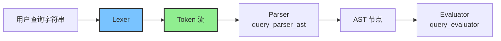

# Query Lexer 模块技术深度解析

## 问题定位与模块存在意义

在处理问题追踪系统时，用户需要灵活的过滤能力来找到特定的任务集合。简单的键值对匹配无法满足复杂查询需求，而直接使用 SQL 或其他通用查询语言又过于复杂，且难以与领域模型无缝集成。`query_lexer` 模块正是为了解决这个问题而存在的——它是查询引擎的第一道关卡，负责将人类可读的查询字符串转换为结构化的标记流，为后续的语法分析和语义评估奠定基础。

想象一下，当用户输入 `status=open AND (priority>1 OR updated<7d)` 这样的查询时，系统需要理解其中的字段名、运算符、关键字和值。如果没有词法分析器，解析器将直接面对原始字符流，代码会变得混乱且难以维护。词法分析器就像一个"智能分词器"，将无结构的字符流转换为有意义的词汇单元。

## 核心心智模型与架构

### 心智模型

可以将 `Lexer` 想象成一个**状态机驱动的光标**：它在输入字符串上逐字符移动，根据当前看到的字符决定是继续收集字符形成一个标记，还是立即产生一个标记并移动到下一个位置。它维护着三个核心状态：
- 当前位置 (`pos`)：光标在输入字符串中的位置
- 上一个字符的宽度 (`width`)：用于回退操作
- 输入字符串本身 (`input`)

关键的操作原语包括：
- `next()`：前进并返回下一个字符
- `peek()`：查看下一个字符但不前进
- `backup()`：回退一个字符
- `skipWhitespace()`：跳过空白字符

### 架构数据流



数据流向非常清晰：原始查询字符串进入 `Lexer`，经过词法分析后产生 `Token` 序列，然后传递给 [Parser](internal-query-parser.md) 构建抽象语法树，最后由 [Evaluator](internal-query-evaluator.md) 进行实际的过滤评估。

## 核心组件深度解析

### Token 结构

`Token` 是词法分析的基本产出单位，它封装了三个关键信息：

```go
type Token struct {
    Type  TokenType  // 标记类型，如标识符、字符串、运算符等
    Value string     // 标记的原始字符串值
    Pos   int        // 标记在输入字符串中的起始位置
}
```

这种设计非常实用：`Type` 告诉下游解析器"这是什么"，`Value` 提供"内容是什么"，而 `Pos` 则在出错时能够准确定位问题所在。值得注意的是，即使是关键字（如 `AND`、`OR`）也保留了原始 `Value`，这使得错误消息可以直接使用用户输入的原始形式。

### TokenType 枚举

`TokenType` 定义了所有可能的标记类型，覆盖了查询语言的所有词汇元素：

- **基础类型**：`TokenIdent`（标识符/字段名）、`TokenString`（引用字符串）、`TokenNumber`（数字）、`TokenDuration`（相对时间）
- **比较运算符**：`TokenEquals`、`TokenNotEquals`、`TokenLess`、`TokenLessEq`、`TokenGreater`、`TokenGreaterEq`
- **逻辑运算符**：`TokenAnd`、`TokenOr`、`TokenNot`
- **结构符号**：`TokenLParen`、`TokenRParen`、`TokenComma`
- **结束标记**：`TokenEOF`

这种细致的分类使得解析器可以根据类型快速做出决策，而不必进行字符串匹配。

### Lexer 结构与核心方法

`Lexer` 是一个轻量级的状态机，只维护必要的最小状态：

```go
type Lexer struct {
    input string  // 输入字符串
    pos   int     // 当前位置
    width int     // 上一个字符的宽度
}
```

这种设计体现了"最小状态"原则——只保留绝对必要的信息，这使得 `Lexer` 既高效又易于推理。

#### NextToken 方法

`NextToken()` 是 `Lexer` 的核心方法，它驱动整个词法分析过程：

1. 首先跳过空白字符
2. 查看当前字符，根据字符类型决定如何处理
3. 对于单字符标记（如 `(`、`)`、`,`），直接返回
4. 对于可能的多字符运算符（如 `!=`、`<=`、`>=`），使用 `peek()` 查看下一个字符来确认
5. 对于字符串，调用 `readString()` 处理引用和转义
6. 对于数字或持续时间，调用 `readNumberOrDuration()` 区分
7. 对于标识符或关键字，调用 `readIdent()` 处理并识别关键字

这种设计遵循了"单一职责"原则——每个辅助方法负责处理一种特定类型的标记，使得主方法保持清晰。

#### 专用读取方法

**readString()**：处理引用字符串，支持单引号和双引号，并处理转义序列（`\n`、`\t`、`\\` 等）。值得注意的是，它会正确处理未终止的字符串和未终止的转义序列等错误情况。

**readNumberOrDuration()**：这是一个巧妙的设计——它首先读取数字部分，然后检查是否有持续时间后缀（`h`、`d`、`w`、`m`、`y`，不区分大小写）。如果有后缀，返回 `TokenDuration`，否则返回 `TokenNumber`。这种方法避免了预读的复杂性。

**readIdent()**：读取标识符，并在最后检查是否是关键字（`AND`、`OR`、`NOT`）。关键字识别采用大小写不敏感的方式（通过 `strings.ToUpper()`），但保留原始大小写在 `Value` 中，这是一个很好的用户体验设计。

#### Tokenize 便捷方法

`Tokenize()` 提供了一个便捷的接口，将整个输入一次性转换为标记列表。这对于测试和简单使用场景非常方便，但对于大型输入或流式处理，逐次调用 `NextToken()` 会更高效。

## 设计决策与权衡

### 1. 手写词法分析器 vs 生成器

**决策**：手写实现，而不是使用 lex/yacc 等工具生成。

**理由**：
- 查询语言相对简单，手写实现更直接
- 更容易控制错误消息的质量（如针对 `!` 的提示）
- 避免了额外的构建依赖和生成代码的复杂性
- 可以更灵活地处理边界情况

**权衡**：失去了生成器的形式化保证，需要更多的测试来覆盖各种情况。

### 2. 错误恢复策略

**决策**：遇到错误立即返回，不尝试恢复。

**理由**：
- 查询字符串通常很短，用户可以轻松修复错误
- 简单直接的错误处理更容易理解和维护
- 避免了错误恢复可能带来的级联错误

**权衡**：在交互式环境中可能不够友好，但对于当前的使用场景是合理的。

### 3. 关键字识别方式

**决策**：在读取标识符后，通过字符串匹配识别关键字。

**理由**：
- 简单直接，易于理解和维护
- 关键字数量很少（只有 3 个），性能影响可忽略
- 便于扩展新关键字

**权衡**：不是最高效的方法（理论上可以用跳转表），但对于当前规模完全足够。

### 4. Duration 类型的特殊处理

**决策**：将持续时间（如 `7d`）作为单独的 `TokenDuration` 类型，而不是 `TokenIdent`。

**理由**：
- 这是领域特定的语义信息，在词法阶段识别可以减轻解析器负担
- 持续时间有明确的格式（数字+后缀），适合在词法阶段处理

**权衡**：将一些语义判断放入了词法分析器，稍微模糊了词法和语法分析的界限。

## 使用指南与常见模式

### 基本使用

```go
// 创建词法分析器
lexer := NewLexer("status=open AND priority>1")

// 逐个获取标记
for {
    tok, err := lexer.NextToken()
    if err != nil {
        // 处理错误
        break
    }
    if tok.Type == TokenEOF {
        break
    }
    // 处理标记
}

// 或者一次性获取所有标记
tokens, err := lexer.Tokenize()
if err != nil {
    // 处理错误
}
```

### 与 Parser 协作

`Lexer` 设计上是为 [Parser](internal-query-parser.md) 服务的，典型的协作模式是：

```go
lexer := NewLexer(queryString)
parser := NewParser(lexer)
ast, err := parser.Parse()
```

Parser 会持有 Lexer 的引用，并在需要时调用 `NextToken()`。

## 边缘情况与陷阱

### 1. 未终止的字符串

输入 `"unterminated string` 会导致错误，因为缺少闭合引号。错误消息会包含起始位置，帮助定位问题。

### 2. 孤立的 '!' 字符

输入 `!status=open` 会产生友好的错误提示，建议使用 `!=` 或 `NOT`，这是一个很好的用户体验设计。

### 3. 标识符中的特殊字符

标识符可以包含字母、数字、`_`、`-` 和 `.`，但必须以字母或 `_` 开头。这意味着 `user.name` 是有效的标识符，但 `123abc` 不是。

### 4. 持续时间后缀的大小写

持续时间后缀不区分大小写，`7d` 和 `7D` 都是有效的，但会保留原始大小写在 `Value` 中。

### 5. 转义序列的处理

在字符串中，只有特定的转义序列会被特殊处理（`\n`、`\t`、`\\`、`\"`、`\'`），其他转义序列会被原样保留。

## 与其他模块的关系

`query_lexer` 是 [Query Engine](internal-query.md) 的基础组件，它的直接下游是 [query_parser_ast](internal-query-parser.md) 模块。Parser 接收 Lexer 产生的 Token 流，并构建抽象语法树。

值得注意的是，`Lexer` 是一个相对独立的组件——它不依赖于其他内部模块，只使用标准库。这种低耦合设计使得它可以单独测试和理解。

## 扩展点与维护建议

### 可能的扩展

1. **支持更多持续时间单位**：可以在 `isDurationSuffix()` 中添加新的后缀
2. **添加注释支持**：可以在 `skipWhitespace()` 中添加跳过注释的逻辑
3. **支持更多转义序列**：可以在 `readString()` 中扩展转义处理
4. **添加位置范围**：可以扩展 `Token` 结构，包含结束位置

### 维护建议

1. 保持 `Lexer` 的简单性——不要将过多的语义判断放入词法分析器
2. 添加新标记类型时，确保更新 `TokenType.String()` 方法
3. 任何修改都应该有相应的测试覆盖，特别是边界情况
4. 错误消息应该尽可能友好，提供上下文和可能的修复建议
