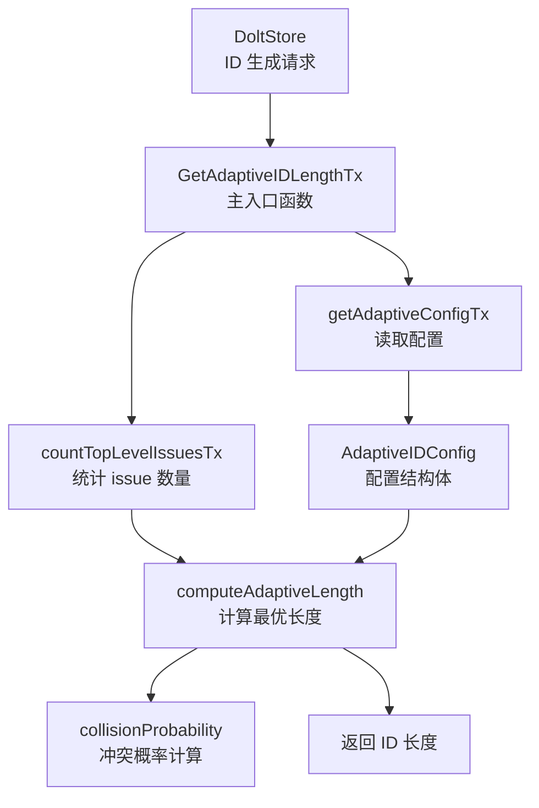

# Adaptive ID 模块技术深度解析

## 1. 问题背景与模块定位

### 问题空间

在 issue 跟踪系统中，ID 设计面临一个经典的权衡困境：
- **短 ID**：易于输入、记忆和分享，提升用户体验
- **长 ID**：提供更大的命名空间，降低冲突概率，支持大规模数据集

传统解决方案通常选择固定长度的 ID（如 8 位十六进制或 UUID），但这会导致两种糟糕体验：
1. 小规模项目使用过长 ID，增加不必要的认知负担
2. 大规模项目遭遇 ID 冲突，需要复杂的冲突解决机制

### 设计洞察

`adaptive_id` 模块的核心思想是：**让 ID 长度根据实际使用规模动态调整**。就像根据行李大小选择不同尺寸的行李箱，而不是所有人都用最大的箱子。

该模块通过数学建模（生日悖论）来预测冲突概率，并在用户体验和数据完整性之间找到动态平衡点。

---

## 2. 核心概念与心理模型

### 核心抽象

想象 `adaptive_id` 是一个**智能标尺**：
- 它首先测量当前仓库中有多少个 issue（"负载"）
- 然后根据预设的冲突容忍度（"安全系数"）
- 推荐一个既足够短又足够安全的 ID 长度（"标尺刻度"）

### 关键概念

- **命名空间大小**：给定长度的 base36 编码可以表示的唯一值总数（$36^{\text{length}}$）
- **冲突概率**：在当前 issue 数量下，随机生成 ID 发生碰撞的概率（基于生日悖论计算）
- **自适应阈值**：可配置的最大可接受冲突概率，超过此阈值时自动增加 ID 长度

---

## 3. 架构与数据流程

### 组件关系图



### 数据流向

1. **请求发起**：`DoltStore` 在创建新 issue 时调用 `GetAdaptiveIDLengthTx`
2. **计数阶段**：`countTopLevelIssuesTx` 查询数据库，统计顶级 issue 数量（排除子 issue）
3. **配置加载**：`getAdaptiveConfigTx` 从数据库读取配置，未设置时使用默认值
4. **长度计算**：`computeAdaptiveLength` 从最小长度开始尝试，找到满足冲突概率阈值的最小长度
5. **结果返回**：将计算出的 ID 长度返回给调用者

---

## 4. 核心组件详解

### AdaptiveIDConfig 结构体

**作用**：封装自适应 ID 长度的所有配置参数，作为配置的单一数据源。

```go
type AdaptiveIDConfig struct {
    MaxCollisionProbability float64  // 触发长度增加的冲突概率阈值
    MinLength               int      // 最小哈希长度
    MaxLength               int      // 最大哈希长度
}
```

**设计意图**：
- 将配置集中管理，便于验证和传递
- 通过 `DefaultAdaptiveConfig()` 提供合理的开箱即用配置
- 支持数据库持久化配置，允许运行时调整

### collisionProbability 函数

**作用**：基于生日悖论计算给定 issue 数量和 ID 长度时的冲突概率。

**数学模型**：
$$ P(\text{collision}) \approx 1 - e^{-\frac{n^2}{2N}} $$

其中：
- $n$ = 当前 issue 数量
- $N = 36^{\text{length}}$ = 可能的 ID 总数（base36 编码）

**实现细节**：
- 使用指数近似而非精确计算，性能更高且对于大数足够准确
- 固定使用 base36 编码，平衡可读性和命名空间效率

### computeAdaptiveLength 函数

**作用**：贪婪算法寻找满足冲突概率约束的最小 ID 长度。

**算法流程**：
1. 从 `MinLength` 开始尝试
2. 计算当前长度的冲突概率
3. 如果概率 ≤ 阈值，返回当前长度
4. 否则增加长度继续尝试
5. 如果所有长度都超过阈值，返回 `MaxLength`

**设计权衡**：
- 贪婪策略保证找到最小的可行长度（局部最优即全局最优）
- 优先考虑用户体验（短 ID），在安全阈值内尽可能缩短

### GetAdaptiveIDLengthTx 函数

**作用**：事务安全的主入口函数，协调整个自适应 ID 长度计算流程。

**错误处理策略**：
- 当计数失败时，返回默认长度 6 而非错误
- 设计理念：ID 生成是关键路径，宁可保守也不失败

---

## 5. 依赖分析

### 被依赖关系

`adaptive_id` 模块主要被 **[Dolt Storage Backend](internal-storage-dolt.md)** 模块调用，具体是在 issue 创建流程中。

### 依赖关系

- **数据库层**：直接使用 `*sql.Tx` 执行查询，与 Dolt 数据库紧密耦合
- **配置存储**：依赖数据库中的 `config` 表存储自定义配置
- **issues 表**：通过特定模式查询 issue 数量（`prefix-%` 且不含 `.`）

**耦合点分析**：
- 表结构假设：`issues` 表有 `id` 字段，`config` 表有 `key`/`value` 字段
- ID 格式假设：顶级 issue ID 格式为 `prefix-hash`，子 issue 包含 `.`
- 数据库方言：使用 `INSTR` 和 `CONCAT` 函数，兼容 MySQL/Dolt 语法

---

## 6. 设计决策与权衡

### 1. Base36 而非 Base64 或 Hex

**决策**：固定使用 Base36 编码（0-9, a-z）

**原因**：
- 平衡可读性和命名空间效率（比 hex 多 6 个字符，比 base64 少但更友好）
- 避免大小写混淆（全部小写）
- URL 安全，无需额外编码

**权衡**：相比 base64，相同长度下命名空间略小，但可读性提升更重要。

### 2. 只计算顶级 Issue

**决策**：`countTopLevelIssuesTx` 只统计不含 `.` 的 issue ID

**原因**：
- 子 issue 通常包含父 ID 作为前缀，冲突风险由父 ID 承担
- 子 issue 数量不影响顶级 ID 的命名空间需求
- 更准确地反映实际需要独立 ID 的实体数量

### 3. 保守的错误处理

**决策**：计数失败时返回默认长度 6，而非 propagate 错误

**原因**：
- ID 生成是关键路径，不能因计数失败而阻塞创建
- 长度 6 是相对安全的中间值，在大多数场景下都适用
- 体现了"可用性优先"的设计哲学

**权衡**：在极少数情况下可能使用比最优更长的 ID，但确保了系统可用性。

### 4. 贪婪算法而非优化求解

**决策**：从最小长度开始线性搜索，而非数学求解最优解

**原因**：
- 搜索空间极小（最多 6 次尝试，3-8），线性搜索完全可以接受
- 代码简单直观，易于验证和维护
- 避免了浮点数比较和边界情况处理的复杂性

### 5. 配置持久化与默认值结合

**决策**：支持数据库配置，但提供合理默认值

**原因**：
- 大多数用户不需要调整，开箱即用体验好
- 高级用户可以根据需求微调
- 配置在数据库中，便于仓库级别的定制

---

## 7. 使用指南与示例

### 默认使用

```go
// 自动使用默认配置
length, err := GetAdaptiveIDLengthTx(ctx, tx, "feature")
// 小仓库: 返回 3 或 4
// 中等仓库: 返回 5 或 6
// 大仓库: 返回 7 或 8
```

### 自定义配置

通过数据库配置表调整：

```sql
-- 设置更保守的冲突概率 (10%)
INSERT INTO config (`key`, value) VALUES ('max_collision_prob', '0.1');

-- 设置最小长度为 4
INSERT INTO config (`key`, value) VALUES ('min_hash_length', '4');

-- 设置最大长度为 10
INSERT INTO config (`key`, value) VALUES ('max_hash_length', '10');
```

### 配置参数说明

| 参数 | 默认值 | 说明 |
|------|--------|------|
| `max_collision_prob` | 0.25 | 最大可接受冲突概率，范围 0-1 |
| `min_hash_length` | 3 | 最小 ID 长度，至少 1 |
| `max_hash_length` | 8 | 最大 ID 长度，建议 ≤ 10 |

---

## 8. 边缘情况与注意事项

### 已知限制

1. **不处理已存在的冲突**：该模块只预防未来冲突，不解决已发生的冲突
2. **单向增长**：ID 长度只增不减，即使删除大量 issue 也不会缩短
3. **独立前缀**：每个前缀有独立的计数和长度计算，前缀间互不影响

### 隐含契约

1. **ID 格式约定**：
   - 顶级 issue：`{prefix}-{hash}`
   - 子 issue：`{prefix}-{hash}.{sub-hash}`
   
2. **配置表约定**：
   - 表名：`config`
   - 列：`key` (VARCHAR), `value` (VARCHAR)
   
3. **事务要求**：必须在事务内调用，确保计数和配置读取的一致性

### 操作注意事项

1. **大量导入时**：批量导入大量 issue 可能导致 ID 长度跳跃式增加
2. **修改配置后**：配置修改只影响新 issue，已有 issue ID 保持不变
3. **前缀重用**：删除所有带某前缀的 issue 后，新 issue 会重新使用短 ID（因为计数归零）

### 性能考虑

- 每次创建 issue 都会执行计数查询，在超大规模仓库（>100K issue）可能成为瓶颈
- 考虑添加缓存层，但要注意缓存失效策略

---

## 9. 相关模块参考

- **[Dolt Storage Backend](internal-storage-dolt.md)**：主存储实现，是此模块的主要消费者
- **[Transaction Management](internal-storage-dolt-transaction.md)**：事务管理，与此模块的事务安全特性相关
- **[Migration System](internal-storage-dolt-migrations.md)**：如果需要调整 ID 策略，可能通过迁移执行
