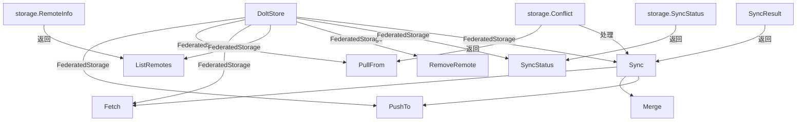

# Federation Sync 模块深度解析

## 1. 概述

**federation_sync** 模块是 Beads 系统中用于实现多个 Gas Towns 之间点对点数据同步的核心组件。它基于 Dolt 数据库的版本控制能力，提供了一套完整的远程同步、合并和冲突解决机制。

想象一下多个协作的团队，每个团队都有自己独立的问题追踪数据库，但他们需要定期同步各自的工作。这个模块就是这样一个"数据同步管道"，它确保不同的 Gas Towns 可以安全地交换数据变更，同时处理可能出现的冲突。

## 2. 架构与数据流



### 核心组件角色

* **DoltStore**：作为整个同步操作的核心载体，提供了所有远程操作的入口点
* **FederatedStorage 接口实现**：提供了 PushTo、PullFrom、Fetch、Sync 等核心同步方法
* **SyncResult**：封装完整同步操作的结果信息
* **storage.Conflict**：表示数据合并时的冲突信息
* **storage.SyncStatus**：表示与对等节点的同步状态

## 3. 核心组件深度解析

### 3.1 SyncResult 结构

```go
type SyncResult struct {
    Peer              string
    StartTime         time.Time
    EndTime           time.Time
    Fetched           bool
    Merged            bool
    Pushed            bool
    PulledCommits     int
    PushedCommits     int
    Conflicts         []storage.Conflict
    ConflictsResolved bool
    Error             error
    PushError         error // Non-fatal push error
}
```

**设计意图**：SyncResult 不仅仅是一个简单的返回值结构，它是一个完整的同步操作审计记录。每个字段都有其特定的审计和调试目的：

* **时间记录**（StartTime/EndTime）：用于性能分析和同步时长统计
* **阶段标记**（Fetched/Merged/Pushed）：明确同步操作执行到了哪个阶段
* **变更计数**（PulledCommits/PushedCommits）：量化同步的数据量
* **冲突信息**（Conflicts/ConflictsResolved）：提供冲突解决的完整记录
* **错误分离**（Error/PushError）：区分致命错误和非致命错误，推送失败不应该阻止本地合并

### 3.2 Sync 方法 - 完整同步流程

Sync 方法是整个模块的核心，它实现了一个完整的双向同步流程：

1. **Fetch**：从对等节点获取最新引用（不合并）
2. **获取当前状态**：记录合并前的提交哈希
3. **Merge**：合并对等节点的分支
4. **冲突处理**：如果有冲突，根据策略自动解决或留待手动处理
5. **Push**：将本地变更推送到对等节点
6. **记录同步时间**：更新元数据中的最后同步时间

**关键设计决策**：
* **先拉后推**：始终先获取并合并远程变更，再推送本地变更，减少冲突可能性
* **推送失败非致命**：PushError 单独处理，因为对等节点可能没有权限接受推送
* **策略化冲突解决**：支持 "ours" 和 "theirs" 策略，避免阻塞自动化流程

### 3.3 单独的同步操作方法

#### PushTo
```go
func (s *DoltStore) PushTo(ctx context.Context, peer string) error
```
将本地提交推送到指定的对等节点。它会自动使用存储的凭据，并调用 Dolt 的 `DOLT_PUSH` 存储过程。

#### PullFrom
```go
func (s *DoltStore) PullFrom(ctx context.Context, peer string) ([]storage.Conflict, error)
```
从对等节点拉取并合并变更。与 Git 类似，这是一个 Fetch + Merge 的组合操作。特别的是，它会检测合并冲突并将其作为返回值，而不是简单地报错。

#### Fetch
```go
func (s *DoltStore) Fetch(ctx context.Context, peer string) error
```
获取对等节点的引用但不合并。这是一个安全的操作，用于查看远程变更而不影响本地工作。

#### SyncStatus
```go
func (s *DoltStore) SyncStatus(ctx context.Context, peer string) (*storage.SyncStatus, error)
```
检查与对等节点的同步状态，包括：
- 本地领先提交数（LocalAhead）
- 本地落后提交数（LocalBehind）  
- 是否有未解决冲突（HasConflicts）
- 最后同步时间（LastSync）

这个方法的设计很有意思，它通过比较本地和远程的 `dolt_log` 来计算 ahead/behind 计数，这是一种相对准确但成本较高的方法。

## 4. 依赖关系与数据流

### 调用关系

**federation_sync 模块依赖**：
* **Dolt 存储过程**：DOLT_PUSH、DOLT_PULL、DOLT_FETCH、DOLT_REMOTE
* **内部存储接口**：storage.Conflict、storage.SyncStatus、storage.RemoteInfo
* **DoltStore 内部方法**：Merge、ResolveConflicts、Commit、GetConflicts、GetCurrentCommit
* **元数据表**：用于存储最后同步时间

**被依赖关系**：
* 这个模块是 [Dolt Storage Backend](internal-storage-dolt-store.md) 的一部分，被更上层的同步编排组件调用
* 可能被 CLI 命令直接调用（如 `bd swarm sync` 或类似命令）

### 数据契约

该模块的关键数据契约包括：

1. **RemoteInfo**：必须包含 Name 和 URL，用于标识和连接对等节点
2. **Conflict**：包含 IssueID、Field、OursValue、TheirsValue，精确定位和描述冲突
3. **SyncStatus**：提供完整的同步状态视图，包括时间、提交计数、冲突状态
4. **SyncResult**：详细记录同步过程的每个阶段，用于审计和调试

## 5. 设计决策与权衡

### 5.1 基于 Dolt 版本控制的同步

**选择**：利用 Dolt 数据库的原生版本控制能力实现同步

**原因**：
- 避免重新实现一套复杂的版本控制和冲突检测机制
- Dolt 的 SQL 接口使得版本控制操作可以通过熟悉的存储过程调用
- 利用 Dolt 已有的远程同步基础设施

**权衡**：
- 深度耦合于 Dolt 数据库，难以迁移到其他存储后端
- 依赖 Dolt 的冲突检测和解决能力，无法完全自定义冲突处理逻辑

### 5.2 元数据存储同步时间

**选择**：在数据库的 metadata 表中存储每个对等节点的最后同步时间

**设计意图**：
```go
key := "last_sync_" + peer
value := time.Now().Format(time.RFC3339)
```

**原因**：
- 将同步元数据与数据存储在一起，确保一致性
- 便于查询和审计
- 避免外部依赖（如单独的配置文件）

**权衡**：
- 污染了业务数据的元数据表
- 每次同步都需要写入元数据，增加了同步操作的开销

### 5.3 推送失败非致命处理

**选择**：将 PushError 作为非致命错误单独处理

**设计意图**：
```go
if err := s.PushTo(ctx, peer); err != nil {
    // Push failure is not fatal - peer may not accept pushes
    result.PushError = err
} else {
    result.Pushed = true
}
```

**原因**：
- 对等节点可能没有配置接受推送的权限
- 网络问题可能导致推送失败但拉取成功
- 本地合并成功本身就是有价值的，不应被推送失败否定

**权衡**：
- 可能导致同步状态不一致（本地已合并但远程未更新）
- 需要调用者单独检查 PushError 以确保推送成功

### 5.4 简化的提交计数

**选择**：PulledCommits 简化为 1（有变更）或 0（无变更）

**设计意图**：
```go
if beforeCommit != afterCommit {
    result.PulledCommits = 1 // Simplified - could count actual commits
}
```

**原因**：
- 准确计数需要额外的查询，增加同步操作的复杂度和时间
- 对于大多数用例，知道"有变更"已经足够
- 注释中明确指出这是一个简化实现，为未来的改进留下空间

**权衡**：
- 丢失了变更量的精确信息
- 无法用于精确的同步进度跟踪

## 6. 使用指南与最佳实践

### 6.1 基本使用模式

**完全同步**：
```go
result, err := store.Sync(ctx, "peer-town", "theirs")
if err != nil {
    // 处理致命错误
}
if result.PushError != nil {
    // 处理推送失败（如果有必要）
}
if len(result.Conflicts) > 0 {
    // 检查冲突信息
}
```

**单独操作**：
```go
// 只拉取
conflicts, err := store.PullFrom(ctx, "peer-town")

// 只推送
err := store.PushTo(ctx, "peer-town")

// 检查状态
status, err := store.SyncStatus(ctx, "peer-town")
```

### 6.2 冲突策略选择

* **不指定策略**：如果有冲突，同步会失败，需要手动解决
* **"ours"**：优先保留本地变更
* **"theirs"**：优先采用远程变更

**最佳实践**：
- 自动化流程中使用 "theirs" 或 "ours" 策略避免阻塞
- 人工审核场景中不指定策略，确保每个冲突都被仔细检查
- 对于关键数据，考虑在同步后进行验证

## 7. 边缘情况与陷阱

### 7.1 远程分支不存在

**情况**：SyncStatus 方法可能返回 LocalAhead = -1 和 LocalBehind = -1

**原因**：当远程分支在本地尚不存在时，无法比较提交历史

**处理方式**：调用者应该检查这些负值，并相应地调整用户界面或逻辑

### 7.2 部分同步成功

**情况**：同步可能已经完成了 Fetch 和 Merge，但 Push 失败

**陷阱**：只检查 Error 而忽略 PushError，可能导致误认为整个同步失败

**处理方式**：总是检查 SyncResult 的各个字段，特别是 PushError

### 7.3 元数据操作失败

**情况**：setLastSyncTime 的错误被忽略

**原因**：这是一个"尽力而为"的操作，同步时间主要用于调度和显示

**影响**：
- 最后同步时间可能不准确
- 基于同步时间的调度逻辑可能受到影响

**缓解**：可以考虑添加警告日志，或者在 SyncResult 中添加元数据操作状态

### 7.4 凭据管理

**注意**：withPeerCredentials 方法（代码中未完全展示）负责在操作期间提供凭据

**陷阱**：如果凭据存储或检索有问题，所有远程操作都可能失败

**建议**：确保在使用同步功能前，正确配置了对等节点的凭据

## 8. 总结

federation_sync 模块是一个巧妙利用 Dolt 版本控制能力实现的点对点数据同步解决方案。它的设计体现了几个重要的原则：

1. **复用现有能力**：站在 Dolt 的肩膀上，避免重新发明轮子
2. **实用主义**：在精确性和复杂性之间做出明智的权衡（如简化的提交计数）
3. **容错设计**：将致命错误和非致命错误分开处理
4. **审计友好**：SyncResult 提供了同步过程的完整记录

这个模块的主要价值在于它使得多个独立的 Gas Towns 可以安全地同步数据，同时保留了每个节点的自主性。这对于分布式团队协作场景特别有价值。

## 9. 相关模块

* [Dolt Storage Backend](internal-storage-dolt-store.md) - 本模块的父模块，提供核心存储功能
* [Storage Interfaces](internal-storage-storage.md) - 定义了存储层的接口契约
* [Configuration](internal-config-config.md) - 可能包含联邦同步的配置选项
