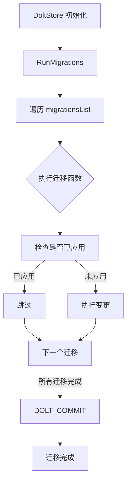

# Migration System 模块技术深度解析

## 1. 问题空间：为什么需要这个模块？

在任何长期演进的软件系统中，数据存储的结构都会随着功能需求的变化而不断演变。对于使用 Dolt 作为数据库后端的 Beads 系统来说，模式迁移（schema migration）是一个必须解决的核心问题：

### 为什么简单的解决方案不够用
一个简单的方法是在每次发布时手动运行 SQL 脚本来修改数据库结构。但这种方法存在多个问题：
- **不可重复**：手动脚本容易出错，而且很难保证在不同环境中执行结果一致
- **无版本控制**：难以追踪数据库当前处于哪个模式版本
- **无法回滚**：一旦出现问题，很难恢复到之前的状态
- **分布式风险**：在多个开发者协作的环境中，模式变更可能会相互冲突

### 设计洞察
Migration System 模块的核心洞察是：**将数据库模式变更视为有序的、可追踪的、可重复执行的函数序列**。每个迁移函数都是幂等的（idempotent），这意味着它们可以安全地多次运行而不会导致错误。

## 2. 核心抽象与心智模型

### Migration 结构体
```go
type Migration struct {
    Name string
    Func func(*sql.DB) error
}
```

这个结构体代表了单个模式迁移。你可以将其想象成一个"数据库变更原子"：
- `Name` 字段是迁移的唯一标识符，用于追踪执行状态
- `Func` 字段是实际执行迁移的函数，接收一个 SQL 数据库连接

### 心智模型：传送带模式
想象 Migration System 是一个传送带系统：
1. **传送带**（`migrationsList`）是一个有序的迁移序列
2. **工件**（`Migration`）是每个独立的模式变更
3. **工人**（`RunMigrations`函数）逐个处理工件
4. **质量检查**（每个迁移函数内部的幂等性检查）确保工件不会被重复加工

关键是，传送带上的工件顺序是固定的，新工件只能添加到末尾。这保证了模式变更的可预测性。

## 3. 架构与数据流



### 核心组件角色
1. **Migration 结构体**：定义迁移的契约（名称 + 函数）
2. **migrationsList**：有序的迁移注册表，决定执行顺序
3. **RunMigrations 函数**：迁移引擎的入口点，协调整个迁移过程
4. **CreateIgnoredTables 函数**：特殊辅助函数，处理 dolt_ignore 表的重建

### 关键数据流
迁移过程的典型流程如下：
1. 系统启动时，`DoltStore` 初始化会调用 `RunMigrations`
2. `RunMigrations` 按顺序遍历 `migrationsList` 中的每个 `Migration`
3. 每个迁移函数（如 `migrations.MigrateWispTypeColumn`）首先检查变更是否已应用
4. 如果未应用，则执行相应的 SQL 操作（如添加列、创建表等）
5. 所有迁移完成后，调用 `DOLT_COMMIT` 提交变更（如果有变更的话）
6. 如果没有变更（"nothing to commit"），则忽略提交错误

### 契约与依赖
- **输入契约**：需要一个有效的 `*sql.DB` 连接到 Dolt 数据库
- **输出契约**：成功返回 nil，失败返回带有迁移名称的错误
- **依赖**：依赖 `github.com/steveyegge/beads/internal/storage/dolt/migrations` 包中的实际迁移实现

## 4. 设计决策与权衡

### 决策 1：幂等迁移
**选择**：所有迁移函数必须是幂等的（可安全多次运行）
**原因**：
- 简化了错误处理和重试逻辑
- 允许在不确定迁移状态时安全重新运行
- 减少了需要专门跟踪迁移状态的复杂性

**权衡**：
- ✅ 优点：健壮性强，容错能力好
- ❌ 缺点：每个迁移函数需要额外的检查逻辑，增加了实现复杂度

### 决策 2：追加式迁移列表
**选择**：新迁移必须添加到 `migrationsList` 的末尾
**原因**：
- 保证迁移执行顺序的确定性
- 简化了依赖关系管理（后续迁移可以假设前面的迁移已完成）
- 与 Dolt 的版本控制特性天然契合

**权衡**：
- ✅ 优点：简单、可预测
- ❌ 缺点：无法重新排序迁移，历史迁移永远保留在列表中

### 决策 3：集成 Dolt 提交
**选择**：迁移完成后自动调用 `DOLT_COMMIT`
**原因**：
- 将模式变更与 Dolt 的版本控制集成
- 提供了回滚能力（通过 Dolt 的历史功能）
- 确保模式变更在工作集中持久化

**权衡**：
- ✅ 优点：利用 Dolt 的版本控制能力
- ❌ 缺点：耦合了迁移逻辑与 Dolt 特定功能

### 决策 4：分离迁移定义与实现
**选择**：`Migration` 结构体在 `dolt` 包中定义，但实际实现函数在 `migrations` 子包中
**原因**：
- 保持核心迁移引擎的简洁
- 允许迁移实现独立演进
- 便于测试（可以单独测试迁移函数）

**权衡**：
- ✅ 优点：关注点分离，模块化好
- ❌ 缺点：需要跨包调用，增加了一定的复杂度

## 5. 关键组件详解

### Migration 结构体
```go
type Migration struct {
    Name string
    Func func(*sql.DB) error
}
```
**目的**：定义单个迁移的契约。
- `Name`：迁移的唯一名称，用于错误报告和追踪
- `Func`：执行迁移的函数，必须是幂等的

### migrationsList 变量
```go
var migrationsList = []Migration{
    {"wisp_type_column", migrations.MigrateWispTypeColumn},
    {"spec_id_column", migrations.MigrateSpecIDColumn},
    // ... 更多迁移
}
```
**目的**：注册表，按执行顺序存储所有迁移。
- 新迁移必须追加到末尾
- 顺序很重要：后续迁移可以依赖前面的迁移

### RunMigrations 函数
```go
func RunMigrations(db *sql.DB) error
```
**目的**：迁移引擎的主入口点。
- 按顺序执行所有迁移
- 处理错误和提交
- 参数：`db` - Dolt 数据库连接
- 返回值：成功返回 nil，失败返回错误

**内部机制**：
1. 遍历 `migrationsList`
2. 对每个迁移调用其 `Func`
3. 如果任何迁移失败，立即返回错误
4. 所有迁移完成后，尝试提交变更
5. 忽略"nothing to commit"错误（这是正常情况）

### CreateIgnoredTables 函数
```go
func CreateIgnoredTables(db *sql.DB) error
```
**目的**：重新创建被 dolt_ignore 的表（wisps, wisp_*）。
- 这些表只存在于工作集中，分支时不会继承
- 导出供其他包的测试助手使用
- 幂等，可安全多次调用

## 6. 使用指南与最佳实践

### 添加新迁移
1. 在 `internal/storage/dolt/migrations/` 包中创建新的迁移函数
2. 确保函数是幂等的（先检查是否已应用）
3. 在 `migrationsList` 末尾添加新的 `Migration` 条目
4. 给迁移起一个描述性的名称

### 迁移函数示例
```go
func MigrateMyNewColumn(db *sql.DB) error {
    // 检查列是否已存在
    var exists bool
    err := db.QueryRow(`
        SELECT COUNT(*) > 0 
        FROM information_schema.columns 
        WHERE table_name = 'issues' AND column_name = 'my_new_column'
    `).Scan(&exists)
    if err != nil {
        return err
    }
    
    if exists {
        return nil // 已存在，跳过
    }
    
    // 添加列
    _, err = db.Exec("ALTER TABLE issues ADD COLUMN my_new_column TEXT")
    return err
}
```

### 测试迁移
- 使用 `CreateIgnoredTables` 来设置测试环境
- 测试迁移的幂等性（运行两次应该得到相同结果）
- 测试迁移的顺序依赖性

## 7. 边缘情况与陷阱

### 常见陷阱
1. **忘记幂等性检查**：迁移函数必须先检查变更是否已应用
2. **在列表中间插入迁移**：永远只能追加到末尾，否则会破坏顺序
3. **迁移函数中的错误处理**：不要忽略错误，让它们传播到 `RunMigrations`
4. **Dolt 特定 SQL**：确保迁移 SQL 与 Dolt 兼容（不要使用 MySQL 特有的不兼容功能）

### 边缘情况
- **无变更时的提交**：`DOLT_COMMIT` 会返回"nothing to commit"错误，代码会忽略这个错误
- **部分迁移失败**：如果某个迁移失败，整个过程会停止，之前成功的迁移不会回滚（但可以通过 Dolt 的历史功能恢复）
- **分支时的忽略表**：被 dolt_ignore 的表不会继承到新分支，需要调用 `CreateIgnoredTables` 重新创建

## 8. 相关模块

- [Dolt Storage Backend](internal-storage-dolt.md) - 迁移系统所属的上层模块
- [Storage Interfaces](internal-storage.md) - 定义了存储抽象，迁移系统是 Dolt 实现的一部分

## 总结

Migration System 模块是一个简洁而强大的数据库模式迁移解决方案，专门为 Dolt 设计。它的核心价值在于：
1. **有序性**：迁移按固定顺序执行
2. **幂等性**：迁移可安全多次运行
3. **集成性**：与 Dolt 的版本控制特性深度集成
4. **简单性**：API 简洁，易于使用和扩展

对于新加入团队的开发者来说，理解这个模块的关键是把握"传送带"心智模型，并始终记住幂等性是迁移安全的基石。
