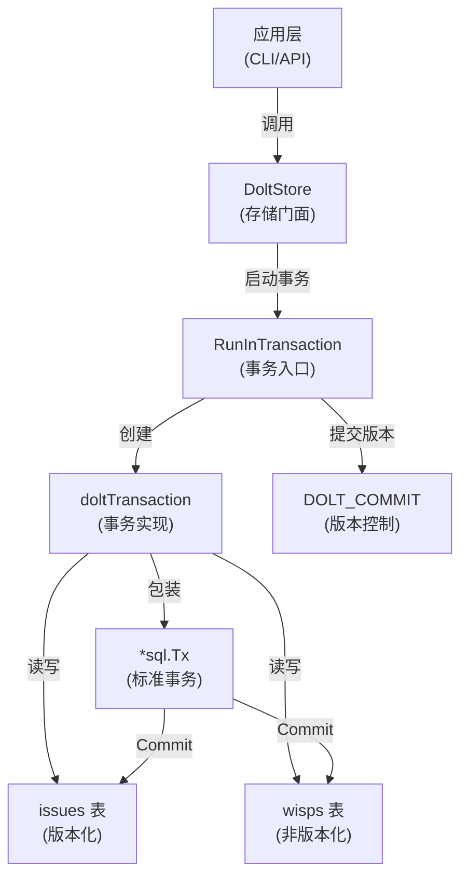

# Transaction Management Module 技术深度解析

## 1. 问题空间与模块定位

在分布式系统中，数据一致性和原子性是核心挑战。对于基于 Dolt 的版本控制系统，我们需要确保：

1. **原子性**：一组相关操作要么全部成功，要么全部失败
2. **可见性**：事务内的操作在提交前对其他事务不可见
3. **版本控制**：每次成功的事务都应该在 Dolt 的版本历史中留下可追溯的记录
4. **混合表支持**：需要同时处理版本化表（如 `issues`）和非版本化表（如 `wisps`）

简单的数据库事务无法满足这些需求，因为：
- Dolt 的 `DOLT_COMMIT` 操作有特殊的语义和限制
- 需要处理版本化表和非版本化表的混合写入
- 需要在 Go 的 `sql.Tx` 和 Dolt 的版本控制之间建立正确的映射

这就是 `transaction_management` 模块存在的原因——它在标准数据库事务之上构建了一个适配层，完美桥接了应用层需求和 Dolt 的特性。

## 2. 核心抽象与心智模型

### 2.1 核心组件

**`doltTransaction`** 是模块的核心抽象，它实现了 `storage.Transaction` 接口，封装了：
- 一个底层的 `*sql.Tx`（标准数据库事务）
- 指向父 `DoltStore` 的引用，用于访问 Dolt 特定功能

### 2.2 心智模型

可以将 `doltTransaction` 想象成一个**双向翻译器**：

```
应用层操作 → doltTransaction → SQL 操作 → Dolt 存储
                    ↓
              路由逻辑（issues vs wisps）
                    ↓
              元数据验证
                    ↓
              事务边界管理
```

更形象地说，它就像一个**智能快递分拣中心**：
- 接收所有的读写请求（包裹）
- 根据请求特征（问题ID、是否临时等）决定路由到哪个表（分拣到不同的配送通道）
- 确保所有包裹在同一批次中要么全部送达，要么全部退回（原子性）
- 最后在 Dolt 的版本历史中留下一个清晰的签收记录（提交）

### 2.3 关键设计洞察

模块的核心洞察是**"分离关注点"**：
1. 使用标准 SQL 事务保证 ACID 特性
2. 在 SQL 事务之外执行 Dolt 版本提交，避免状态不一致
3. 通过表路由逻辑统一处理持久化问题和临时问题（wisps）

## 3. 架构与数据流向

### 3.1 架构图



### 3.2 关键流程详解

#### 3.2.1 事务生命周期

事务的完整生命周期由 `DoltStore.RunInTransaction` 管理，流程如下：

1. **启动阶段**：调用 `db.BeginTx` 创建标准 SQL 事务
2. **执行阶段**：运行用户提供的函数，传入 `doltTransaction` 实例
3. **提交阶段**（关键设计！）：
   - 首先调用 `sqlTx.Commit()` 提交所有 SQL 更改（包括 wisps 表）
   - 然后在事务外调用 `DOLT_COMMIT` 创建版本记录
4. **错误处理**：任何步骤出错都会触发回滚

这个两阶段提交顺序是经过深思熟虑的，解决了一个关键问题：如果所有操作都在非版本化表上，`DOLT_COMMIT` 会返回 "nothing to commit"，这会让 `sql.Tx` 处于不一致状态。通过先提交 SQL 事务，我们确保即使没有 Dolt 版本提交，数据也不会丢失。

#### 3.2.2 表路由逻辑

几乎所有的 `doltTransaction` 方法都包含相同的路由模式：

```go
table := "issues"
if t.isActiveWisp(ctx, id) {
    table = "wisps"
}
```

这种设计使得：
- 应用层不需要关心问题是持久的还是临时的
- 两套表结构共享相同的操作逻辑
- 通过 `isActiveWisp` 方法统一决策

#### 3.2.3 问题创建流程

`CreateIssue` 方法展示了模块的完整能力：

1. **时间戳处理**：自动设置 `CreatedAt` 和 `UpdatedAt`
2. **内容哈希**：自动计算 `ContentHash`（如果缺失）
3. **表选择**：根据 `Ephemeral` 标志选择表
4. **ID 生成**：
   - 从配置读取前缀
   - 根据问题类型选择合适的前缀
   - 调用 `generateIssueIDInTable` 在选定的表中生成唯一 ID
5. **元数据验证**：如果配置了 schema，验证元数据
6. **插入数据**：调用 `insertIssueTxIntoTable` 执行实际插入

## 4. 核心组件深度解析

### 4.1 doltTransaction 结构体

```go
type doltTransaction struct {
    tx    *sql.Tx
    store *DoltStore
}
```

**设计意图**：
- `tx`：底层 SQL 事务，提供原子性保证
- `store`：回指父存储，用于访问 Dolt 特定功能（如 commit author）

**为什么需要 store 引用？**
- 某些操作需要访问存储级别的配置和方法
- 保持 `doltTransaction` 的轻量级，不重复存储配置

### 4.2 isActiveWisp 方法

```go
func (t *doltTransaction) isActiveWisp(ctx context.Context, id string) bool
```

**功能**：检查一个 ID 是否对应活跃的 wisp（临时问题）

**设计亮点**：
- 在事务内查询，能看到未提交的 wisps
- 同时支持 `-wisp-` 模式和显式 ID 的临时问题
- 这是表路由逻辑的核心

**与 store 级别方法的区别**：
- store 级别的 `isActiveWisp` 查询已提交的数据
- 这个方法查询事务内的未提交数据，确保一致性

### 4.3 CreateIssue 方法

这是最复杂的方法之一，展示了多个关注点的协调：

**关键决策点**：
1. **ID 生成策略**：
   - 如果未提供 ID，自动生成
   - 前缀标准化：去除尾部连字符防止双连字符 ID
   - 支持多种前缀变体（`PrefixOverride`、`IDPrefix`）

2. **元数据验证**：
   - 可选的 schema 验证（GH#1416 Phase 2）
   - 提前失败，避免无效数据进入存储

3. **表路由**：
   - 根据 `Ephemeral` 标志选择表
   - 确保 ID 生成和数据插入在同一个表中

### 4.4 UpdateIssue 方法

**设计亮点**：
1. **字段白名单**：通过 `isAllowedUpdateField` 防止非法字段更新
2. **JSON 序列化**：自动处理 `waiters` 等数组字段的 JSON 序列化
3. **元数据规范化**：接受多种类型（string/[]byte/json.RawMessage）并统一处理
4. **列名映射**：将应用层的 "wisp" 映射到数据库的 "ephemeral"

### 4.5 AddDependency 方法

**关键特性**：
1. **幂等性检查**：如果已存在相同类型的依赖，静默成功
2. **类型冲突检测**：如果已存在不同类型的依赖，返回明确错误
3. **表路由**：根据问题类型选择 `dependencies` 或 `wisp_dependencies`

**为什么需要类型冲突检测？**
- 依赖类型（如 "parent-child" vs "waits-for"）有不同的语义
- 静默覆盖会导致难以发现的 bug
- 明确的错误消息指导用户先移除再重新添加

## 5. 依赖分析

### 5.1 入站依赖（谁调用这个模块）

- **DoltStore**：通过 `RunInTransaction` 方法创建和管理 `doltTransaction`
- **应用层**：间接通过 `DoltStore` 的事务方法使用

### 5.2 出站依赖（这个模块调用谁）

- **database/sql**：标准库，提供事务原语
- **internal/storage**：定义了 `Transaction` 接口
- **internal/types**：核心领域类型（`Issue`、`Dependency` 等）
- **DoltStore**：父存储，提供配置和辅助方法

### 5.3 数据契约

**输入契约**：
- `Issue` 对象必须有有效的 `Ephemeral` 标志
- `Dependency` 对象必须有有效的 `Type` 字段
- 更新操作的字段必须在白名单中

**输出契约**：
- 所有操作要么成功，要么返回错误并回滚
- 成功的事务会在 Dolt 历史中留下记录（如果有版本化更改）
- ID 生成保证在事务内是唯一的

## 6. 设计决策与权衡

### 6.1 两阶段提交顺序

**决策**：先提交 SQL 事务，再执行 DOLT_COMMIT

**替代方案**：在 SQL 事务内执行 DOLT_COMMIT

**权衡分析**：
- **当前方案**：
  - ✅ 确保即使没有 Dolt 版本提交，数据也不会丢失
  - ✅ 正确处理只写入非版本化表的情况
  - ❌ DOLT_COMMIT 在事务外，理论上存在小窗口的不一致风险
- **替代方案**：
  - ✅ 原子性更强
  - ❌ 当没有版本化更改时，sql.Tx 会处于不一致状态
  - ❌ wisp 数据可能丢失

**为什么当前方案更优？**
- 数据丢失的风险比短暂的不一致窗口更严重
- 实际中，DOLT_COMMIT 失败的情况很少见
- 这个设计修复了实际的 bug（hq-3paz0m）

### 6.2 表路由的内联实现

**决策**：在每个方法中重复表路由逻辑

**替代方案**：创建一个辅助方法或中间件

**权衡分析**：
- **当前方案**：
  - ✅ 每个方法的逻辑清晰可见
  - ✅ 灵活性高（某些方法有特殊的路由逻辑）
  - ❌ 代码重复
- **替代方案**：
  - ✅ 减少代码重复
  - ❌ 增加抽象层级，可能降低可读性
  - ❌ 特殊情况处理更复杂

**为什么当前方案更优？**
- 路由逻辑很简单（一两行代码）
- 不是所有方法都使用相同的路由模式（如 `SearchIssues` 使用 filter）
- 显式性比 DRY 更重要

### 6.3 错误处理策略

**决策**：
- 事务内错误直接返回，触发回滚
- 回滚错误忽略（"best effort"）
- DOLT_COMMIT 的 "nothing to commit" 错误被视为良性

**权衡分析**：
- **忽略回滚错误**：
  - ✅ 不会掩盖原始错误
  - ❌ 可能留下未清理的资源
- **将 "nothing to commit" 视为成功**：
  - ✅ 正确处理只写入 wisps 的情况
  - ❌ 可能隐藏真正的问题（但有错误字符串检查作为防护）

## 7. 使用指南与最佳实践

### 7.1 基本用法

```go
err := store.RunInTransaction(ctx, "commit message", func(tx storage.Transaction) error {
    // 创建问题
    issue := &types.Issue{Title: "My Issue"}
    if err := tx.CreateIssue(ctx, issue, "user"); err != nil {
        return err
    }
    
    // 添加依赖
    dep := &types.Dependency{
        IssueID:     issue.ID,
        DependsOnID: "other-123",
        Type:        types.DependencyWaitsFor,
    }
    if err := tx.AddDependency(ctx, dep, "user"); err != nil {
        return err
    }
    
    return nil
})
```

### 7.2 最佳实践

1. **保持事务简短**：
   - 事务持有数据库锁，长时间运行会影响并发
   - 在事务外准备数据，只在事务内执行存储操作

2. **正确处理错误**：
   - 任何错误都应该直接返回，触发回滚
   - 不要在事务函数内部捕获错误并继续

3. **提交消息的重要性**：
   - 提供清晰的提交消息，它会成为 Dolt 历史的一部分
   - 遵循项目的提交消息规范

4. ** Wisps 的使用**：
   - 利用 `Ephemeral` 标志创建临时问题
   - 它们会自动路由到 wisps 表，不会污染版本历史

### 7.3 扩展点

模块设计考虑了以下扩展点：
1. **元数据验证**：`validateMetadataIfConfigured` 是一个可选的验证点
2. **ID 生成**：`generateIssueIDInTable` 可以自定义 ID 生成策略
3. **表路由**：可以通过修改 `isActiveWisp` 添加新的路由规则

## 8. 边缘情况与陷阱

### 8.1 已知陷阱

1. **DOLT_COMMIT 在事务外**：
   - 虽然很少见，但理论上 SQL 提交成功后 DOLT_COMMIT 可能失败
   - 结果：数据存在但没有版本记录
   - 缓解：监控 DOLT_COMMIT 错误，必要时手动创建版本

2. **Wisp ID 冲突**：
   - Wisps 不参与版本控制，ID 生成只在当前数据库中唯一
   - 如果手动创建 wisp，可能与自动生成的 ID 冲突
   - 缓解：总是让系统生成 wisp ID

3. **依赖类型冲突**：
   - 尝试添加不同类型的现有依赖会返回错误
   - 错误消息很清晰，但可能让人惊讶
   - 缓解：先检查或先移除再添加

### 8.2 隐性契约

1. **配置必须存在**：
   - `issue_prefix` 配置必须存在才能创建问题
   - 否则会返回 `storage.ErrNotInitialized`

2. **更新字段白名单**：
   - 不是所有字段都可以更新
   - 必须通过 `isAllowedUpdateField` 检查

3. **元数据格式**：
   - 元数据必须是有效的 JSON
   - 如果配置了 schema，还必须符合 schema

## 9. 总结

`transaction_management` 模块是一个精心设计的适配层，它：

1. **解决了**：标准数据库事务与 Dolt 版本控制之间的不匹配
2. **提供了**：统一的接口处理持久化问题和临时问题
3. **保证了**：即使在边缘情况下也不会丢失数据
4. **展示了**：在简单性和健壮性之间的明智权衡

这个模块的设计体现了一个重要原则：**不要试图改变底层系统的行为，而是要适配它**。通过接受 Dolt 的特性（而不是对抗它们），模块创建了一个既可靠又易于理解的抽象。

对于新贡献者，理解这个模块的关键是：
- 先理解两阶段提交的设计原因
- 再掌握表路由的模式
- 最后注意细节中的隐性契约
