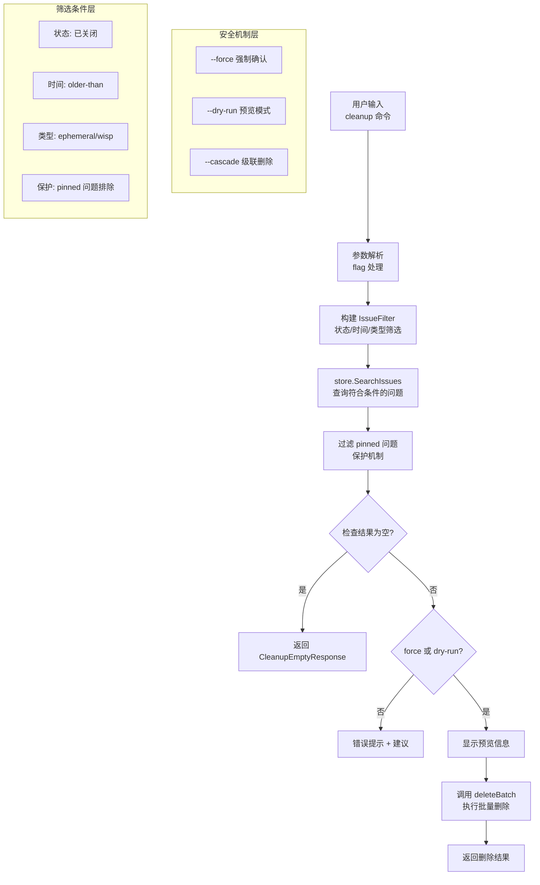

# Issue Cleanup 模块技术深度解析

## 1. 模块概览

**Issue Cleanup** 模块是 Beads 系统中用于数据库卫生管理的核心组件，专门负责**永久删除已关闭的问题**以减小数据库体积。这个模块不仅仅是一个简单的删除工具，它还体现了系统在**数据生命周期管理**、**安全防护**和**用户体验**方面的设计哲学。

### 核心问题与解决方案

在长期运行的项目管理系统中，已关闭的问题会不断累积，导致：
- 数据库体积膨胀，影响查询性能
- 备份和恢复时间增长
- 存储空间成本增加

**朴素方案的问题**：直接删除所有已关闭问题会带来风险——可能误删仍有价值的历史记录，或者破坏依赖关系。

**设计洞见**：Issue Cleanup 模块采用了**分层筛选** + **安全确认**的设计模式，通过多维度过滤（时间、类型、状态）和多重安全机制（预览、强制确认、干运行）来平衡效率与安全。

## 2. 架构与数据流程

### 模块架构图



### 数据流程解析

1. **命令入口**：用户通过 `bd admin cleanup` 命令触发模块
2. **参数解析**：解析 `--force`、`--dry-run`、`--cascade`、`--older-than`、`--ephemeral` 等标志
3. **过滤器构建**：创建 `types.IssueFilter` 实例，设置筛选条件
4. **问题查询**：调用 `store.SearchIssues()` 获取符合条件的已关闭问题
5. **附加过滤**：排除标记为 `pinned` 的问题（保护机制）
6. **安全检查**：确认用户意图（强制确认或预览模式）
7. **预览展示**：显示将要删除的问题信息
8. **批量删除**：调用 `deleteBatch()` 执行实际删除操作

## 3. 核心组件深度解析

### CleanupEmptyResponse 结构

```go
type CleanupEmptyResponse struct {
	DeletedCount int    `json:"deleted_count"`
	Message      string `json:"message"`
	Filter       string `json:"filter,omitempty"`
	Ephemeral    bool   `json:"ephemeral,omitempty"`
}
```

**设计意图**：
- 这是一个**专用响应结构**，用于处理"没有可删除问题"的边界情况
- 提供机器可读（`DeletedCount`）和人类可读（`Message`）的双重输出
- 通过可选字段（`Filter`、`Ephemeral`）保留上下文信息，便于调试和日志记录

**为什么需要专用结构？**：
- 统一空结果和有结果时的输出格式
- 保持 API 响应的一致性，便于客户端处理
- 提供更丰富的上下文信息，而不仅仅是一个空数组

### 筛选条件构建逻辑

模块构建筛选条件的过程体现了**渐进式细化**的设计思想：

1. **基础筛选**：默认只选择状态为 `StatusClosed` 的问题
2. **时间筛选**：如果指定 `--older-than`，添加 `ClosedBefore` 条件
3. **类型筛选**：如果指定 `--ephemeral`，添加 `Ephemeral` 条件
4. **附加保护**：在查询结果后，进一步过滤掉 `pinned` 问题

这种分层设计的好处是：
- 每一层都相对独立，易于测试和维护
- 可以灵活组合不同的筛选条件
- 提供了清晰的扩展点

### 安全机制设计

模块实现了**三层安全防护**：

1. **强制确认层**：`--force` 标志 - 没有它不会执行实际删除
2. **预览验证层**：`--dry-run` 标志 - 允许用户预览将要删除的内容
3. **关系保护层**：`--cascade` 标志 - 控制是否级联删除依赖项

这种设计反映了**安全优先**的原则：
- 默认情况下是"安全的"（不执行删除）
- 用户必须明确表示意图（`--force`）
- 提供了预览机制，减少误操作

## 4. 依赖关系分析

### 核心依赖

| 依赖组件 | 用途 | 架构角色 |
|---------|------|---------|
| `types.Issue` | 问题数据模型 | 领域实体 |
| `types.IssueFilter` | 问题查询过滤器 | 查询规范 |
| `Storage` 接口 | 数据持久化层 | 数据网关 |
| `deleteBatch()` | 批量删除逻辑 | 执行引擎 |
| `cobra.Command` | 命令行接口 | 用户交互层 |

### 依赖关系图

```
issue_cleanup
├── 依赖: types.Issue (核心数据模型)
├── 依赖: types.IssueFilter (查询构建)
├── 依赖: Storage 接口 (数据访问)
│   └── 具体实现: DoltStore
├── 调用: deleteBatch() (删除执行)
└── 框架: cobra (CLI 接口)
```

### 关键交互点

1. **与 Storage 接口的交互**：
   - 调用 `SearchIssues()` 查询符合条件的问题
   - 通过 `deleteBatch()` 间接调用删除方法
   - **契约**：假设 `SearchIssues()` 能正确处理 `IssueFilter` 中的所有条件

2. **与 deleteBatch() 的交互**：
   - 传递问题 ID 列表、强制标志、干运行标志等
   - **契约**：假设 `deleteBatch()` 能处理所有删除细节，包括级联删除

## 5. 设计决策与权衡

### 决策 1：命令式 vs 声明式接口

**选择**：采用命令式接口（`bd admin cleanup`）

**权衡**：
- ✅ 优点：简单直接，符合管理员操作习惯
- ❌ 缺点：不够灵活，难以支持复杂的自动化场景

**为什么这么选择**：
- 清理操作是一个**管理功能**，不是常规业务操作
- 预期使用频率低，主要由人工触发
- 简单性优先于灵活性

### 决策 2：在应用层过滤 vs 在存储层过滤

**选择**：混合策略 - 主要在存储层过滤，附加在应用层过滤（pinned 问题）

**权衡**：
- ✅ 优点：减少数据传输，提高效率；保留最后的安全检查
- ❌ 缺点：逻辑分散，可能导致重复过滤

**为什么这么选择**：
- pinned 问题的保护是一个**业务规则**，应该在应用层明确表达
- 其他过滤条件是**查询条件**，适合在存储层处理
- 这种分离反映了**关注点分离**的原则

### 决策 3：专用响应结构 vs 通用响应结构

**选择**：使用专用的 `CleanupEmptyResponse` 结构

**权衡**：
- ✅ 优点：类型安全，表达力强，文档自包含
- ❌ 缺点：增加了代码量，可能需要更多的维护

**为什么这么选择**：
- 这个模块的输出有特定的语义（空结果的上下文信息）
- 专用结构能更好地表达这些语义
- 符合**领域驱动设计**的思想

## 6. 使用指南与最佳实践

### 基本使用模式

```bash
# 预览将要删除的已关闭问题
bd admin cleanup --dry-run

# 删除所有已关闭问题（强制确认）
bd admin cleanup --force

# 删除 30 天前关闭的问题
bd admin cleanup --older-than 30 --force

# 只删除已关闭的 wisps（临时分子）
bd admin cleanup --ephemeral --force

# 级联删除（同时删除依赖项）
bd admin cleanup --force --cascade
```

### 最佳实践

1. **总是先预览**：在执行实际删除前，使用 `--dry-run` 查看将要删除的内容
2. **使用时间筛选**：优先使用 `--older-than` 来渐进式清理，避免一次性删除大量数据
3. **分离常规清理和特殊清理**：
   - 常规清理：`--older-than` 加上合理的天数
   - 特殊清理：`--ephemeral` 用于清理临时 wisps
4. **保护重要问题**：使用 `pinned` 标记保护需要保留的已关闭问题

### 扩展点

虽然当前模块没有明确的扩展点，但设计中隐含了一些可能的扩展方向：

1. **自定义筛选器**：可以添加更多的筛选标志，如按标签、创建者等筛选
2. **清理策略**：可以添加不同的清理策略，如"保留最近 N 个已关闭问题"
3. **归档而非删除**：可以添加归档选项，将问题移到归档存储而不是直接删除
4. **回调钩子**：可以添加删除前/删除后的回调钩子，用于集成其他系统

## 7. 边缘情况与陷阱

### 已知边缘情况

1. **pinned 问题**：即使符合所有其他条件，pinned 问题也会被跳过
   - **设计意图**：保护重要的历史记录
   - **注意**：这是一个隐式行为，用户可能不知道

2. **空结果处理**：当没有符合条件的问题时，返回专门的响应而不是错误
   - **设计意图**：区分"操作成功但没有删除任何东西"和"操作失败"
   - **注意**：客户端需要正确处理这种情况

3. **级联删除的风险**：使用 `--cascade` 可能会删除意想不到的依赖项
   - **建议**：在使用 `--cascade` 前，先不使用它运行一次，查看将要删除的内容

### 常见陷阱

1. **忘记 `--force`**：最常见的错误 - 没有这个标志，命令只会显示错误信息
2. **误删重要问题**：没有使用 `--dry-run` 预览就直接执行删除
3. **不理解 `--ephemeral`**：这个标志只删除 wisps（临时分子），不是所有临时问题
4. **忽略 pinned 保护**：用户可能不知道 pinned 问题会被自动跳过

### 操作建议

1. **在测试环境先验证**：在生产环境执行前，先在测试环境验证
2. **备份数据**：在执行大规模清理前，先备份数据库
3. **渐进式清理**：使用 `--older-than` 逐步增加天数，而不是一次性清理所有
4. **监控执行**：在执行过程中监控系统性能和日志

## 8. 总结

Issue Cleanup 模块是一个看似简单但设计精良的组件，它体现了以下设计原则：

1. **安全优先**：多层安全机制，默认不执行危险操作
2. **用户友好**：清晰的预览和确认机制
3. **关注点分离**：筛选逻辑和执行逻辑分离
4. **领域驱动**：专用的数据结构和清晰的业务规则
5. **渐进式设计**：分层筛选，逐步细化

这个模块虽然小，但它是系统整体架构中不可或缺的一部分，负责保持数据库的健康和性能。通过理解它的设计思想和实现细节，我们可以更好地使用它，也可以在设计类似功能时借鉴它的经验。

## 相关模块

- [Storage 接口](storage.md) - 数据持久化层
- [Issue 数据模型](issue_domain_model.md) - 核心领域实体
- [Doctor 模块](cli_doctor_commands.md) - 自动健康检查和修复
- [Compaction 模块](compaction.md) - 旧问题压缩
