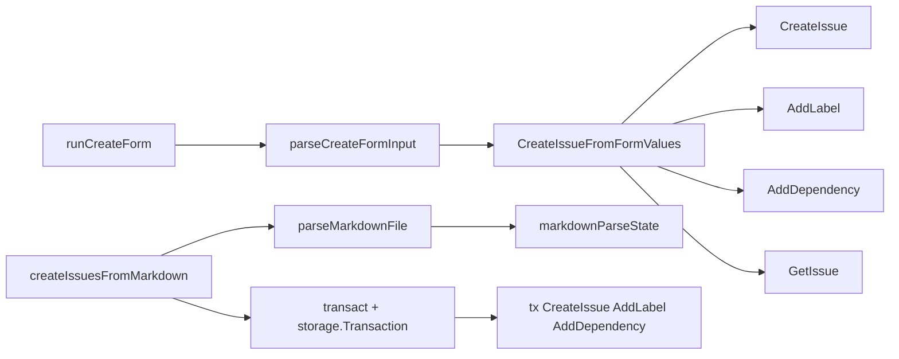

# issue_creation_inputs 模块深度解析

`issue_creation_inputs` 是 `bd` 在“创建 Issue”这条链路上的输入整形层：它把**人类友好的输入形态**（交互式表单、Markdown 文档）转换成**存储层可消费的结构化写入操作**。如果没有这层，创建流程要么把 UI 细节和存储细节搅在一起（难测、难维护），要么在每个入口点重复实现“字符串解析 + 校验 + 默认值 + 依赖关系解释”的样板逻辑。这个模块的价值不在“能创建 Issue”，而在于它把“输入不确定性”收敛成“领域可执行命令”。

## 架构角色与数据流



从架构上看，这个模块不是纯粹的 parser，也不是完整 orchestrator；它更像一个“双入口写入网关”：

- 一条入口是 `runCreateForm`，面向交互式 CLI。
- 另一条入口是 `createIssuesFromMarkdown`，面向批量导入。

两条入口都落到同一个核心目标：创建 `types.Issue`，并补齐 labels/dependencies 等关联数据。但它们在一致性策略上做了不同选择：

- `CreateIssueFromFormValues` 采用“主操作成功优先、附属操作尽力而为”。
- `createIssuesFromMarkdown` 采用“单事务全成功或全失败”。

这不是实现偶然，而是输入场景差异驱动的策略分化：交互模式强调“用户即时产出”，批量模式强调“批次一致性”。

## 心智模型：把它当成“入库前的海关”

可以把这个模块想象成海关系统：

- 旅客（用户输入）带来的行李格式各异：文本、逗号列表、`type:id` 依赖描述。
- 海关先做申报表标准化（`createFormRawInput` / Markdown 解析状态机）。
- 再做通关规则判定（优先级转换、类型归一、依赖类型有效性检查）。
- 最后分发到不同柜台（CreateIssue / AddLabel / AddDependency）。

关键点是：它不定义领域规则本体（例如 IssueType 的完整语义在 `types` 和 `validation`），而是负责将“输入语法”转译成“领域动作”。

## 组件深潜

### `createFormRawInput`

这个结构体专门承载 UI 层原始字符串。设计意图是把“控件值绑定”与“领域值”分离，尤其典型的是 `Priority string`：表单 select 返回字符串（`"0"`、`"1"`），不应该直接污染后续创建逻辑。

它还把 `Labels`、`Deps` 保留为逗号分隔字符串，让 UI 输入尽量自由，解析延迟到 `parseCreateFormInput`。这是一种典型的“延迟解释”策略：先采集，再归一。

### `createFormValues`

这是从 raw 到业务动作之间的“中间语义层”。和 `createFormRawInput` 相比，变化很明确：

- `Priority` 从 `string` 变 `int`
- `Labels` / `Dependencies` 从单字符串变为切片
- `Acceptance` 字段统一为 `AcceptanceCriteria`

这样做的价值是把 `CreateIssueFromFormValues` 变成一个可测试的纯业务入口，而不是必须通过 TUI 才能触发。

### `parseCreateFormInput(raw *createFormRawInput) *createFormValues`

这个函数是表单模式的“轻量标准化器”。它做三类事：

1. 类型转换：`strconv.Atoi(raw.Priority)`；失败回落到 `2`（P2）。
2. 列表拆分：`Labels`、`Deps` 按逗号切分并 `TrimSpace`。
3. 字段映射：把 raw 字段搬运到语义化结构。

这里的设计取舍很明显：它不做强校验（比如依赖格式、依赖类型），只做**格式整洁化**。真正的语义校验推迟到 `CreateIssueFromFormValues`。这种分层避免了两个函数重复解析同一规则。

### `CreateIssueFromFormValues(ctx, s, fv, actor)`

这是交互创建路径的核心写入函数，也是本模块最值得理解的点。

它的流程是：

- 构造 `types.Issue` 基本字段，并把 `IssueType` 做 `Normalize()`。
- 扫描 `fv.Dependencies`，如果出现 `discovered-from:<id>`，先 `GetIssue` 父 issue，再继承 `SourceRepo`。
- 调用 `s.CreateIssue` 落库主 issue。
- 依次 `s.AddLabel`、`s.AddDependency` 补齐关联。

最非显然的设计是 **source_repo 继承**：`discovered-from` 语义表示“这个 issue 是从某个父问题发现的”，所以创建新 issue 时沿用父 issue 的 `SourceRepo`。这是一种上下文传递，避免调用方每次显式传 repo 来源。

另一个关键取舍是错误策略：

- `CreateIssue` 失败：直接返回错误（主操作失败）。
- `AddLabel` / `AddDependency` 失败：写 stderr 警告但不中断。

这让交互模式更“韧性优先”：用户至少拿到一个已创建的 issue ID，不会因为一个坏 label 或单条依赖格式问题导致整次输入白费。

### `runCreateForm(cmd)`

`runCreateForm` 是交互入口编排器，不是业务核心。它主要职责：

- 使用 `huh` 组装多组输入控件。
- 在 UI 层做最基础校验（标题必填、长度上限）。
- 调 `parseCreateFormInput` 与 `CreateIssueFromFormValues`。
- 处理终端输出（JSON 或人类可读）。

注意它把取消行为显式识别为 `huh.ErrUserAborted`，并以 `os.Exit(0)` 退出，这保证“用户取消”不是错误态。

### `IssueTemplate`

这是 Markdown 批量导入路径的“单条模板语义”。它和 `createFormValues` 结构近似，但 `IssueType` 直接用 `types.IssueType`，因为 Markdown 解析阶段会直接调用 `validation.ParseIssueType` 做转换。

### `markdownParseState`

这是一个小型状态机容器，字段非常克制：

- `currentIssue`：当前解析的 issue
- `currentSection`：当前 H3 分节名
- `sectionContent`：当前分节内容缓冲
- `issues`：累计结果

它对应 `parseMarkdownFile` 的逐行扫描模型。你可以把它理解为“单遍 streaming parser 的上下文寄存器”。

### `parseMarkdownFile(path)`

它是 Markdown 路径的解析主函数，流程清晰：

1. `validateMarkdownPath` 防穿越、限制扩展名、检查文件存在且非目录。
2. 打开文件，创建带 1MB buffer 的 scanner（避免大段文本被默认 buffer 卡死）。
3. 行扫描时：
   - H2 (`##`) 开启新 issue
   - H3 (`###`) 切换 section
   - 其他行交给 `handleContentLine`
4. `finalize` 收尾并检查是否至少解析到一个 issue。

这里用正则识别标题层级，而不是完整 Markdown AST。原因很实际：只需要支持一个受控子集语法，完整 AST 带来额外复杂度与性能成本，不划算。

### `createIssuesFromMarkdown(_ *cobra.Command, filepath string)`

这是批量写入编排器，和交互路径最大的差异是事务边界：

- 它通过 `transact(..., func(tx storage.Transaction) error { ... })` 在单事务中创建全部 issue 及其 labels/dependencies。
- 任意一步错误都会返回，触发整个批次失败。

这让 Markdown 作为“基础设施输入”时具备可预期性：要么全部导入成功，要么不改变系统状态，适合脚本化和 CI 场景。

## 依赖关系与契约分析

从当前代码可见的直接调用关系看：

- `runCreateForm` 调用 `parseCreateFormInput` 与 `CreateIssueFromFormValues`。
- `CreateIssueFromFormValues` 依赖 `*dolt.DoltStore` 的 `GetIssue`、`CreateIssue`、`AddLabel`、`AddDependency`。
- `parseMarkdownFile` 依赖本文件内 `validateMarkdownPath`、`createMarkdownScanner` 和 `markdownParseState` 的一组 handler。
- `createIssuesFromMarkdown` 依赖 `parseMarkdownFile`，并在 `storage.Transaction` 上调用 `CreateIssue`、`AddLabel`、`AddDependency`。

这揭示了一个重要契约差异：

- 交互路径耦合到具体实现 `*dolt.DoltStore`。
- 批量路径耦合到抽象接口 `storage.Transaction`。

前者简单直接、调用方便；后者更抽象、利于事务语义复用。代价是模块内部出现两套写入风格，未来统一测试替身（mock/fake）时会有不一致成本。

在领域模型契约方面，这个模块显式依赖：

- `types.Issue` / `types.Dependency` 的字段语义（见 [issue_domain_model](issue_domain_model.md)）
- `types.DependencyType.IsValid()` 与 `IssueType.Normalize()` 行为
- `validation.ParsePriority` / `validation.ParseIssueType`（Markdown 路径）

如果上游修改这些契约（例如依赖类型枚举扩展、IssueType 规范变化），这里的解析与回退逻辑会直接受影响。

## 关键设计取舍

这个模块最核心的设计取舍可以概括为“入口多样性 + 写入策略分化”。

第一，**简单 vs 灵活**：输入解析使用字符串切分与小状态机，而不是引入统一 DSL parser。这样实现成本低、认知负担小，但也限制了语法表达能力（比如 labels/deps 里无法优雅处理带空格或转义的复杂 token）。

第二，**正确性 vs 可用性**：交互路径采取部分失败容忍，优先保证 issue 主体创建；批量路径采取事务原子性，优先保证批次一致性。二者都合理，但对调用方心智模型要求较高：同样是“创建 issue”，失败语义并不一致。

第三，**耦合 vs 复用**：`CreateIssueFromFormValues` 直接接 `*dolt.DoltStore`，减少抽象层；`createIssuesFromMarkdown` 走 `storage.Transaction`，强调可组合事务。短期看是 pragmatism，长期看可能需要抽一个统一写入服务以减少分叉。

## 实际使用与扩展示例

交互模式核心调用链可以抽象为：

```go
raw := &createFormRawInput{ /* 由 huh 表单填充 */ }
fv := parseCreateFormInput(raw)
issue, err := CreateIssueFromFormValues(rootCtx, store, fv, actor)
```

如果你要新增字段（例如 `Estimate`），推荐按现有分层扩展：

1. 在 `createFormRawInput` 增加 UI 原始字段。
2. 在 `createFormValues` 增加语义字段。
3. 在 `parseCreateFormInput` 做转换与默认值归一。
4. 在 `CreateIssueFromFormValues` 映射到 `types.Issue`（或关联表）。
5. Markdown 路径同步扩展 `IssueTemplate` + `processIssueSection`。

不要只改其中一条入口，否则两种创建方式会出现行为偏差。

## 边界条件与新贡献者注意事项

最容易踩坑的是“看起来同构，实际不同构”的两条创建路径。

首先，错误处理语义不同：交互路径对 labels/dependencies 失败只告警；Markdown 路径会整体失败回滚。改逻辑时一定先确认你在修改哪条路径，以及是否要保持这种差异。

其次，`CreateIssueFromFormValues` 会基于第一条匹配到的 `discovered-from` 依赖继承 `SourceRepo`。如果输入里有多条 `discovered-from`，当前实现取第一条后 `break`，这是一种隐式优先级。

再次，依赖格式解析默认“无类型前缀即 `blocks`”。这是方便性设计，但会让用户输入错误类型时悄悄落到默认语义；交互路径里还会因无效类型只告警不失败。

另外，Markdown 解析是行级 scanner + 正则标题匹配，要求文档遵循 `##` issue、`###` section 的受控格式；普通 `#`、更深层级标题或复杂 Markdown 块并不会被当作结构化字段处理。

最后，路径校验禁止 `..` 且限制 `.md/.markdown`，这是安全边界的一部分。任何“更灵活路径支持”改动都要重新评估目录穿越风险。

## 相关模块参考

- 领域类型与依赖类型语义：[`issue_domain_model`](issue_domain_model.md)
- 存储事务与接口契约：[`storage_contracts`](storage_contracts.md)
- Dolt 存储实现（`DoltStore` 所在）：[`store_core`](store_core.md)
- 元数据与验证相关能力：[`Validation`](Validation.md)
- CLI 命令上下文（全局 `store/actor/rootCtx` 生命周期）：[`CLI Command Context`](CLI Command Context.md)
