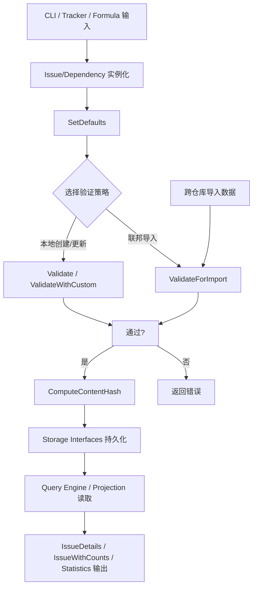

# issue_domain_model 深度解析

`issue_domain_model` 是整个系统里“问题对象的宪法层”。它不负责存储、不负责查询执行、不负责 CLI 展示；它负责定义**什么是一个合法、可比较、可推理的 Issue 与依赖关系**。如果把整个系统比作一座城市，这个模块不是交通系统（query/storage），也不是市政大厅（commands/integrations），而是城市的法律条文：字段含义、状态合法性、依赖语义、审计事件类型、以及跨仓库信任边界都在这里定死。没有这一层，其他模块会各自理解“issue 是什么”，最终产生语义漂移和数据不一致。

---

## 这个模块解决了什么问题？

从问题空间看，任务追踪系统最难的不是“存一条记录”，而是保证多入口（CLI、同步器、公式引擎、外部 tracker）在长期演化后仍然对同一个领域对象有一致理解。一个朴素方案是：每个调用方传一个 `map[string]any`，存储层只管落库，业务层自己约定字段。这种做法短期很快，长期会出现三类问题：

第一，**状态与字段不变量失守**。例如 `status=closed` 却没有 `closed_at`，或者非 closed 却带 `closed_at`。这类脏数据会污染 ready work、统计、同步差异。

第二，**跨仓库/跨系统同步没有信任模型**。本地允许的类型与远端允许的类型可能不同；如果硬校验所有类型，会阻断 federation；如果完全不校验，又会把拼写错误当作新类型放进系统。

第三，**内容等价判定不稳定**。在分布式或多副本场景，`Issue` 是否“实质变化”必须可重复判断，否则冲突检测、同步优化、审计归因都会抖动。

这个模块的设计核心是：把这些“语义规则”前置到统一的 domain type 层，用结构体 + 小型行为方法（`Validate*`, `ComputeContentHash`, `Normalize`, `AffectsReadyWork` 等）把规则固化成可复用、可组合的契约。

### 为什么朴素方案不行？

想象一个团队试图用简单的 JSON 对象表示问题：
- 开发者 A 认为 "closed" 状态需要一个时间戳
- 开发者 B 认为 "closed" 状态不需要时间戳
- 开发者 C 把 "status" 写成 "close"（拼写错误）
- 开发者 D 添加了一个 "metadata" 字段，但里面放的是非结构化字符串

结果就是：代码库中到处都是防御性检查，每个模块都在重复相同的验证逻辑，数据迁移变得极其困难。

`issue_domain_model` 模块通过提供单一事实来源解决了这个问题——所有模块都使用相同的类型定义和验证逻辑。

---

## 心智模型：它是“领域语义内核 + 轻行为对象”

理解这个模块最好的方式是：把它看成一个**“强类型领域字典”**。

- `Issue` 是主实体，携带生命周期、调度、集成、协作、审计相关字段。
- `Dependency` 是边（edge），`DependencyType` 决定这条边是否影响 ready work、是否只是知识图谱关系。
- `EntityRef` / `Validation` / `AttestsMeta` 是“谁做了什么、谁为结果背书”的信誉/证明层抽象。
- `IssueFilter` / `WorkFilter` / `StaleFilter` 是查询意图描述，不执行查询。
- `Statistics` / `EpicStatus` / `MoleculeProgressStats` / `BlockedIssue` / `TreeNode` 是投影视图（projection carrier），用于上层查询结果承载。

类比一下：`Issue` 像数据库里的“主文档”，`Dependency` 像图数据库中的“边记录”，而这个模块的各种 `IsValid*` 和 `Parse*` 方法就是**协议解析器与约束检查器**，保证进出系统的数据都在可解释范围内。

---

## 架构与数据流



这个流里最关键的是两条“准入路径”：

1. 常规创建/更新路径通常走 `SetDefaults` + `ValidateWithCustom(...)`。这里强调本地配置一致性（自定义 status/type 必须显式允许）。
2. federation 导入路径走 `ValidateForImport(...)`。这里采用“trust the chain below you”模型：对内建类型做校验（抓 typo），对非内建类型做信任透传（不阻断上游仓库的扩展语义）。

`ComputeContentHash()` 是另一条并行路径：它不关心“记录身份（ID/时间戳）”，而关心“语义内容”。通过稳定字段顺序 + null 分隔写入哈希，提供跨副本可重复的内容指纹。

### 模块在系统中的位置

`issue_domain_model` 位于系统架构的最底层，是整个系统的基础。它没有任何业务逻辑依赖，只依赖标准库，这确保了它的稳定性和可重用性。

从模块树中可以看到，它被组织在 **Core Domain Types** 下，作为：
- [query_and_projection_types](query_and_projection_types.md) 的基础
- [storage_contracts](storage_contracts.md) 的数据模型
- 所有上层模块（Tracker Integration、CLI、Formula Engine 等）的公共类型系统

这种分层设计确保了领域模型的稳定性——即使上层逻辑变化，核心数据结构保持一致。

### 数据契约

这个模块定义了系统中关键的数据契约：

1. **输入契约**：`Issue`、`Dependency` 等结构体定义了合法输入的形状
2. **验证契约**：`Validate*` 方法定义了数据必须满足的规则
3. **输出契约**：`IssueDetails`、`IssueWithCounts` 等定义了查询结果的形状
4. **等价契约**：`ComputeContentHash` 定义了什么是"语义等价"的 Issue

这些契约共同确保了系统各部分之间的可靠通信。

---

## 组件深潜

## `Issue`：高密度领域聚合体

`Issue` 是一个刻意“宽字段”的结构体。看起来字段很多，但设计意图是把跨子系统的核心语义集中在一个稳定合同中，而不是散落在 N 个扩展对象里。

非显而易见的点：

`Priority int` 没有 `omitempty`。这是为了保留 `0`（P0）这个合法高优先级值，避免 JSON 序列化把它误当“未设置”。

`Metadata json.RawMessage` 被允许承载扩展信息，但在校验中通过 `json.Valid` 保证至少是结构化 JSON，而不是任意字符串。

`SourceRepo`, `IDPrefix`, `PrefixOverride` 使用 `json:"-"`，说明它们属于运行态路由/ID 策略，不参与同步载荷。

`Labels` / `Dependencies` / `Comments` 放在 `Issue` 内是为了导入导出便利，而不是意味着主存储一定嵌套存储这些关系。

### `(*Issue).SetDefaults()`

它只补默认 `Status` 和 `IssueType`，**不**在反序列化后把 `Priority=0` 改成默认值。这是一个有意识的正确性优先选择：宁愿丢失“是否省略字段”的信息，也不把潜在 P0 任务误改优先级。

### `(*Issue).Validate*()` 三层校验策略

- `Validate()`：仅内建规则。
- `ValidateWithCustom(customStatuses, customTypes)`：允许本地扩展类型。
- `ValidateForImport(customStatuses)`：导入信任模型，类型策略更宽松。

这三层不是重复 API，而是把不同上下文的信任边界显式化。特别是 `ValidateForImport` 中的 `IssueType` 逻辑，体现“本地创建要严格，跨仓库导入要兼容”的取舍。

共同校验重点包括：

- title 必填且 <= 500
- priority 范围 [0,4]
- `EstimatedMinutes` 不能为负
- `StatusClosed <-> ClosedAt` 双向一致性
- `AgentState` 必须合法
- `Metadata` 必须是合法 JSON

### `(*Issue).ComputeContentHash()` 与 `hashFieldWriter`

这是模块里最关键的“确定性机制”。`ComputeContentHash` 刻意**排除** ID、时间戳、压缩元信息等“传输噪声”，仅对“业务语义字段”做 hash。

`hashFieldWriter` 每次写入后追加 `\0` 分隔符，防止字段拼接歧义（例如 `ab|c` 与 `a|bc`）。这个小技巧比直接字符串拼接更稳健。

需要注意：切片字段（如 `BondedFrom`, `Validations`, `Waiters`）按当前顺序写入，意味着调用方若希望“顺序无关”，必须在上游先做稳定排序。

## `Status`, `IssueType`, `AgentState`, `MolType`, `WispType`, `WorkType`

这一组枚举类型都采用“`type string` + 常量 + `IsValid`”模式。优点是兼容 JSON 且扩展简单。

其中最值得关注的是 `IssueType`：

- `IsValid()` 只认核心工作类型（含 `message`、`molecule`）。
- `TypeEvent` 不在 `IsValid()`，但在 `IsBuiltIn()` 里被视为内建系统类型。
- `IsValidWithCustom()` 先认 built-in，再认配置自定义类型。
- `Normalize()` 提供别名归一（如 `enhancement -> feature`）。

这套设计在“核心语义稳定”与“业务类型可扩展”之间做了平衡。

## `Dependency` 与 `DependencyType`

`Dependency` 是图边模型，`IssueID -> DependsOnID`。`Type` 决定这条边的运行语义。

`DependencyType.IsValid()` 的策略很宽：非空且长度 <= 50 即可。也就是说系统允许用户定义新关系类型。

但 `IsWellKnown()` 把内建关系列出来，供需要固定语义的路径识别。

`AffectsReadyWork()` 明确只有 `blocks`, `parent-child`, `conditional-blocks`, `waits-for` 四类影响 ready 计算。这是非常关键的隐式契约：新增 dependency type 默认不会阻塞工作，除非你修改这段逻辑或上层算法。

## `WaitsForMeta` + `ParseWaitsForGateMetadata()`

`waits-for` 的 metadata 用 JSON 字符串存储在 `Dependency.Metadata`。解析函数在 metadata 为空、非法 JSON、未知 gate 时都回退到 `WaitsForAllChildren`。

这是一种“向后兼容优先”的策略：旧数据或坏数据不会导致流程崩溃，只是退到更保守门控语义。

## `AttestsMeta`, `EntityRef`, `Validation`

这三者形成 HOP 信誉与证明的最小模型：谁（`EntityRef`）在何时以何结论（`Validation.Outcome`）验证了什么，或通过 `attests` 边声明某项技能。

`ParseEntityURI()` 同时接受 `hop://...` 与 legacy `entity://hop/...`，体现迁移兼容策略。

## 视图/投影载体

`IssueWithDependencyMetadata`, `IssueDetails`, `IssueWithCounts`, `BlockedIssue`, `TreeNode`, `EpicStatus`, `MoleculeProgressStats`, `Statistics` 都是“查询结果承载结构”。

它们在本模块定义，意味着“输出数据形状”也是领域合同的一部分，而不仅是查询层私有结构。

---

## 依赖关系分析（调用与被调用）

从源码可见，`issue_domain_model`（`internal/types/types.go`）只依赖标准库：`crypto/sha256`, `encoding/json`, `fmt`, `hash`, `strings`, `time`。这说明它是一个低耦合基础层。

根据模块树，它位于 **Core Domain Types** 下，并被多个上层能力共享：

- 查询与投影相关模块会消费 `IssueFilter`, `WorkFilter`, `IssueDetails`, `IssueWithCounts` 这类合同（见 [query_and_projection_types](query_and_projection_types.md)）。
- 存储接口与后端会持久化 `Issue`、`Dependency`、`Comment`、`Event` 等核心实体（见 [storage_contracts](storage_contracts.md)）。
- Tracker 集成、CLI 命令、公式/分子等模块都以这些类型为输入输出边界。

由于你提供的数据没有逐函数级 `depends_on / depended_by` 边明细，我无法精确列出“哪个函数调用了 `ValidateWithCustom`”。但从类型职责和注释可确定：创建/更新/导入路径都依赖这套校验与枚举合法性约束。

---

## 设计决策与权衡

`issue_domain_model` 的设计包含了多个关键的权衡，每个决策都是在特定约束条件下的最优选择。

### 1. 灵活性 vs 一致性

**决策**：`DependencyType` 允许自定义字符串（只要非空且 ≤50 字符），但 `AffectsReadyWork` 只识别少数内建类型。

**原因**：
- 允许自定义类型提供了业务扩展性，团队可以定义特定的关系类型
- 但核心调度逻辑（就绪工作计算）只依赖于固定语义的关系类型，防止不可预测的行为

**类比**：这就像一个城市允许居民创建自定义社区标志，但交通信号灯只有标准的红黄绿三色——这样既保留了地方特色，又保证了交通系统的安全可靠。

**权衡点**：
- ✅ 优点：业务层可以灵活扩展关系类型
- ✅ 优点：核心调度逻辑保持稳定可预测
- ❌ 缺点：自定义类型默认不会影响就绪工作，需要额外代码支持

### 2. 严格校验 vs Federation 兼容

**决策**：实现了 `ValidateWithCustom` 和 `ValidateForImport` 两个不同的验证方法。

**原因**：
- 本地创建需要严格验证，确保数据质量
- 跨仓库导入需要适度信任，否则会阻断 federation 工作流

**具体策略**（以 `IssueType` 验证为例）：
- **本地创建**：必须是内建类型或显式配置的自定义类型
- **联邦导入**：只验证内建类型（防止拼写错误），非内建类型直接信任

**权衡点**：
- ✅ 优点：本地数据质量得到保障
- ✅ 优点：跨仓库同步不会被阻止
- ❌ 缺点：增加了 API 复杂度，需要理解两种验证策略的适用场景

### 3. 可演进 Schema vs 单体字段膨胀

**决策**：使用单一的 `Issue` 结构体包含所有字段，而不是分离成多个小对象。

**原因**：
- 统一的结构体提供了单一事实来源
- 简化了序列化和反序列化
- 减少了关联查询的需要
- 提供了更好的缓存局部性

**字段组织策略**：
- 字段按逻辑分组（核心标识、问题内容、状态与工作流等）
- 使用 `json:"-"` 标记不参与同步的字段
- 提供专用的投影类型（如 `IssueDetails`、`IssueWithCounts`）用于特定场景

**权衡点**：
- ✅ 优点：跨模块数据交换简单直接
- ✅ 优点：序列化/反序列化性能好
- ❌ 缺点：结构体变得较大
- ❌ 缺点：字段变更需要谨慎评估对哈希、验证的影响

### 4. 确定性 vs 处理成本

**决策**：`ComputeContentHash` 手工列出字段并按固定顺序计算，而不是使用通用的 JSON 哈希。

**原因**：
- 需要跨副本、跨时间的确定性哈希
- JSON 序列化存在 map 顺序、字段顺序等不确定因素
- 需要排除 ID、时间戳等"传输噪声"字段

**实现细节**：
- 使用 `hashFieldWriter` 辅助类，每个字段后追加 `\0` 分隔符
- 按稳定顺序包含所有实质性字段
- 明确排除不影响语义的字段

**权衡点**：
- ✅ 优点：哈希值完全确定，可用于变更检测、冲突解决
- ✅ 优点：排除了噪声字段，只关注实质内容
- ❌ 缺点：维护成本高，新增字段需要评估是否加入哈希
- ❌ 缺点：切片字段顺序会影响哈希，调用方需要确保稳定排序

### 5. 枚举类型的字符串实现

**决策**：所有枚举类型（`Status`、`IssueType` 等）都使用 `type string` 实现，而不是整数常量。

**原因**：
- JSON 序列化友好，人类可读
- 扩展简单，不需要重新编译
- 调试和日志记录更方便

**实现模式**：
```go
type Status string
const (
    StatusOpen   Status = "open"
    StatusClosed Status = "closed"
    // ...
)
func (s Status) IsValid() bool { /* ... */ }
```

**权衡点**：
- ✅ 优点：可读性好，易于调试
- ✅ 优点：扩展性强，支持自定义值
- ❌ 缺点：没有编译时类型安全（任何字符串都可以转换）
- ❌ 缺点：内存占用略高于整数类型

---

## 使用方式与示例

### 基本 Issue 操作

```go
// 创建新 Issue
issue := &types.Issue{
    Title:       "Fix flaky integration test",
    Description: "The login flow test fails randomly about 10% of the time",
    Priority:    1,
    IssueType:   types.TypeBug,
    Metadata:    json.RawMessage(`{"area":"ci", "test-suite":"auth"}`),
}

// 应用默认值（设置 Status=open, IssueType=task 如果为空）
issue.SetDefaults()

// 使用自定义状态和类型验证
customStatuses := []string{"triaged", "needs-info", "in-review"}
customTypes := []string{"incident", "security-bug"}
if err := issue.ValidateWithCustom(customStatuses, customTypes); err != nil {
    return fmt.Errorf("invalid issue: %w", err)
}

// 计算内容哈希（用于变更检测）
issue.ContentHash = issue.ComputeContentHash()
```

### 状态迁移

```go
// 关闭 Issue 的正确方式
func closeIssue(issue *types.Issue, reason string, now time.Time) error {
    // 设置状态和关闭原因
    issue.Status = types.StatusClosed
    issue.CloseReason = reason
    issue.ClosedAt = &now  // 必须设置 closed_at 当状态是 closed
    
    // 验证不变量
    if err := issue.Validate(); err != nil {
        return err
    }
    
    // 重新计算哈希
    issue.ContentHash = issue.ComputeContentHash()
    return nil
}

// 重新打开 Issue
func reopenIssue(issue *types.Issue) error {
    issue.Status = types.StatusOpen
    issue.ClosedAt = nil      // 必须清除 closed_at 当状态不是 closed
    issue.CloseReason = ""
    
    if err := issue.Validate(); err != nil {
        return err
    }
    
    issue.ContentHash = issue.ComputeContentHash()
    return nil
}
```

### 创建依赖关系

```go
// 创建阻塞依赖
blockingDep := &types.Dependency{
    IssueID:     "bd-123",
    DependsOnID: "bd-100",
    Type:        types.DepBlocks,
    CreatedAt:   time.Now(),
    CreatedBy:   "user@example.com",
}

// 创建带有元数据的 waits-for 依赖
waitsForMeta := types.WaitsForMeta{
    Gate:      types.WaitsForAllChildren,
    SpawnerID: "bd-100-step-1",
}
metaJSON, _ := json.Marshal(waitsForMeta)

waitsForDep := &types.Dependency{
    IssueID:     "bd-123",
    DependsOnID: "bd-100",
    Type:        types.DepWaitsFor,
    Metadata:    string(metaJSON),
    CreatedAt:   time.Now(),
}

// 解析 waits-for 元数据
gate := types.ParseWaitsForGateMetadata(waitsForDep.Metadata)
if gate == types.WaitsForAllChildren {
    fmt.Println("Waiting for all children to complete")
}
```

### 处理条件阻塞依赖

```go
// 检查一个 Issue 是否因为条件阻塞依赖而应该运行
func shouldRunConditionalBlockedIssue(issue *types.Issue, failedDependency *types.Issue) bool {
    if failedDependency.Status != types.StatusClosed {
        return false // 依赖还没完成
    }
    
    // 检查是否因为失败而关闭
    return types.IsFailureClose(failedDependency.CloseReason)
}

// 使用示例
closeReason := "cancelled due to scope change"
if types.IsFailureClose(closeReason) {
    fmt.Println("This close reason indicates failure - conditional dependencies may run")
}
```

### 实体引用和验证

```go
// 创建实体引用
creator := &types.EntityRef{
    Name:     "Alice Dev",
    Platform: "github",
    Org:      "acme",
    ID:       "alice-dev",
}

// 转换为 URI
uri := creator.URI()
fmt.Println(uri) // "hop://github/acme/alice-dev"

// 从 URI 解析
ref, err := types.ParseEntityURI("hop://gastown/steveyegge/polecat-nux")
if err != nil {
    return err
}
fmt.Println(ref.Name)     // 优先显示 Name
fmt.Println(ref.String()) // 人类可读表示

// 创建验证记录
validation := &types.Validation{
    Validator: ref,
    Outcome:   types.ValidationAccepted,
    Timestamp: time.Now(),
}

if !validation.IsValidOutcome() {
    return fmt.Errorf("invalid validation outcome: %s", validation.Outcome)
}
```

### 联邦导入场景

```go
// 处理从其他仓库导入的 Issue
func importIssueFromFederation(imported *types.Issue, localCustomStatuses []string) error {
    // 使用 ValidateForImport，它信任源仓库对自定义类型的验证
    if err := imported.ValidateForImport(localCustomStatuses); err != nil {
        return fmt.Errorf("import validation failed: %w", err)
    }
    
    // 设置我们本地的默认值（不覆盖导入的字段）
    // 注意：不要调用 SetDefaults()，它会修改导入的状态和类型
    
    // 计算内容哈希（使用我们本地的算法，确保一致性）
    imported.ContentHash = imported.ComputeContentHash()
    
    return nil
}
```

### 使用 Metadata 扩展

```go
// 设置结构化元数据
type CustomMetadata struct {
    Team        string   `json:"team"`
    Sprint      string   `json:"sprint"`
    StoryPoints int      `json:"story_points"`
    Labels      []string `json:"labels"`
}

meta := CustomMetadata{
    Team:        "backend",
    Sprint:      "2023-Q4-2",
    StoryPoints: 5,
    Labels:      []string{"high-impact", "customer-facing"},
}

metaJSON, err := json.Marshal(meta)
if err != nil {
    return err
}

issue.Metadata = metaJSON

// 验证会确保 Metadata 是有效的 JSON
if err := issue.Validate(); err != nil {
    return err
}
```

### 常见模式总结

| 场景 | 推荐方法 | 注意事项 |
|------|----------|----------|
| 创建新 Issue | `SetDefaults()` + `ValidateWithCustom()` | Priority=0 是有效的 P0 |
| 从 JSON 反序列化 | `SetDefaults()` + `Validate()` | 不要覆盖显式设置的字段 |
| 修改现有 Issue | 修改字段后重新 `Validate()` 和 `ComputeContentHash()` | 确保保持 `Status` ↔ `ClosedAt` 一致性 |
| 联邦导入 | `ValidateForImport()` | 信任源仓库的自定义类型 |
| 条件检查 | 优先使用类型提供的辅助方法（如 `IsValid()`, `IsBuiltIn()`） | 避免直接字符串比较 |

---

## 新贡献者要特别注意的坑与边缘情况

### 1. ComputeContentHash 字段选择

**最常见的坑**：新增了 `Issue` 字段，却忘了评估是否应纳入 `ComputeContentHash`。

- 如果字段代表"实质内容"（如 Title、Description、Status），**漏加**会导致变更检测失真
- 如果字段只是传输/运行态噪声（如 ID、时间戳、SourceRepo），**误加**会导致哈希抖动

**规则**：问自己"如果两个 Issue 只有这个字段不同，它们在业务上是否应该被视为同一个？"

### 2. Priority 的特殊语义

**坑**：`Priority` 的 `0` 值是有效的 P0 优先级，不等于"缺省"。

- `SetDefaults()` 不会修改 Priority，因为无法区分"显式设置为 0"和"未设置"
- 不要在反序列化后把 `Priority=0` 改成默认值
- 如果需要区分"未设置"，考虑使用指针类型（但当前设计选择不这样做）

### 3. Status ↔ ClosedAt 不变量

**坑**：任何状态迁移代码都必须同步维护 `ClosedAt`。

- `StatusClosed` ↔ `ClosedAt != nil` 是双向强制的
- 关闭时必须设置 `ClosedAt`
- 重新打开时必须清除 `ClosedAt`
- `Validate*` 方法会强制执行这个不变量

### 4. 验证策略选择

**坑**：在新入口调用了 `Validate()` 而非 `ValidateWithCustom()`，错误拒绝了配置中的自定义 status/type。

- **本地创建/更新**：使用 `ValidateWithCustom(customStatuses, customTypes)`
- **联邦导入**：使用 `ValidateForImport(customStatuses)`
- **简单验证**：仅在不支持自定义类型的场景使用 `Validate()`

### 5. 自定义 DependencyType 的限制

**坑**：即使 `DependencyType.IsValid()` 通过了，ready work 不会自动受影响。

- `AffectsReadyWork()` 只识别少数内建类型
- 自定义类型默认不会阻塞工作
- 如果需要自定义类型影响调度，需要修改 `AffectsReadyWork()` 或上层调度逻辑

### 6. Metadata 的 JSON 验证

**坑**：设置 `Metadata` 为无效 JSON，然后奇怪为什么 `Validate()` 失败。

- `Metadata` 必须是有效的 JSON（如果设置）
- 即使你不使用 `Metadata`，也要确保它是有效的
- 使用 `json.RawMessage` 和 `json.Valid()` 检查

### 7. 导入时不要覆盖字段

**坑**：在联邦导入时调用 `SetDefaults()`，覆盖了源仓库设置的状态和类型。

- `ValidateForImport()` 不会修改字段
- 不要对导入的 Issue 调用 `SetDefaults()`
- 只重新计算 `ContentHash` 确保本地一致性

### 8. 切片字段顺序影响哈希

**坑**：`BondedFrom`、`Validations`、`Waiters` 等切片字段的顺序会影响 `ComputeContentHash()`。

- 哈希计算按当前顺序处理切片
- 如果顺序不重要，调用方需要在上游做稳定排序
- 这是一个有意识的设计选择：某些情况下顺序确实重要

### 9. 类型别名归一化

**坑**：直接比较 `IssueType` 字符串，没有考虑别名。

- 使用 `Normalize()` 方法归一化类型
- "enhancement" → "feature"，"dec" → "decision"
- 比较前先归一化

### 10. IssueType 的 IsValid vs IsBuiltIn

**坑**：混淆了 `IsValid()` 和 `IsBuiltIn()`。

- `IsValid()`：核心工作类型（bug, feature, task 等）
- `IsBuiltIn()`：包括系统内部类型（如 TypeEvent）
- 联邦导入时使用 `IsBuiltIn()` 判断是否验证类型

### 11. 条件阻塞依赖的失败检测

**坑**：假设任何关闭的依赖都会触发条件阻塞依赖运行。

- 只有 `IsFailureClose(closeReason)` 返回 true 时才会运行
- 关闭原因必须包含特定关键词（failed、rejected、wontfix 等）
- 空的关闭原因不会触发

### 12. EntityRef 的 URI 解析

**坑**：期望 `ParseEntityURI()` 能解析任何字符串。

- 只接受 `hop://<platform>/<org>/<id>` 格式
- 也支持 legacy `entity://hop/...` 格式
- 平台、组织、ID 都不能为空

---

## 总结

`issue_domain_model` 模块是系统的基础，它定义了问题追踪的核心语义和数据契约。通过理解它的设计理念、权衡和使用模式，你可以：

1. **避免常见错误**：如哈希计算、状态不变量、验证策略选择等问题
2. **正确扩展系统**：知道在哪里可以安全扩展，哪里需要谨慎
3. **理解系统行为**：从领域模型的角度理解上层逻辑为什么这样工作

记住：这个模块的设计优先考虑**一致性**和**稳定性**，而不是短期的便利性。每次修改都要考虑对哈希计算、验证逻辑、导入导出的连锁影响。

---

## 参考文档

- [Core Domain Types](Core%20Domain%20Types.md)
- [query_and_projection_types](query_and_projection_types.md)
- [storage_contracts](storage_contracts.md)
- [tracker_integration_framework](tracker_integration_framework.md)
- [formula_engine](formula_engine.md)
