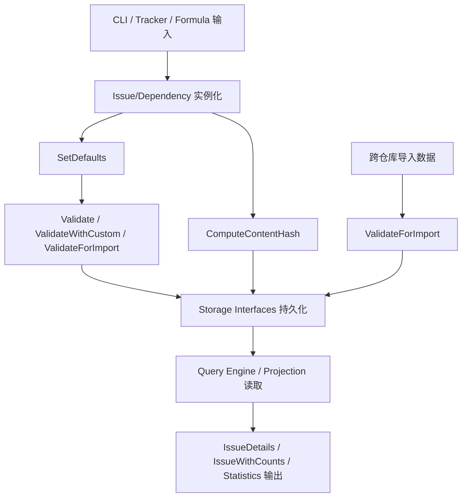

# issue_domain_model 深度解析

`issue_domain_model` 是整个系统里“问题对象的宪法层”。它不负责存储、不负责查询执行、不负责 CLI 展示；它负责定义**什么是一个合法、可比较、可推理的 Issue 与依赖关系**。如果把整个系统比作一座城市，这个模块不是交通系统（query/storage），也不是市政大厅（commands/integrations），而是城市的法律条文：字段含义、状态合法性、依赖语义、审计事件类型、以及跨仓库信任边界都在这里定死。没有这一层，其他模块会各自理解“issue 是什么”，最终产生语义漂移和数据不一致。

---

## 这个模块解决了什么问题？

从问题空间看，任务追踪系统最难的不是“存一条记录”，而是保证多入口（CLI、同步器、公式引擎、外部 tracker）在长期演化后仍然对同一个领域对象有一致理解。一个朴素方案是：每个调用方传一个 `map[string]any`，存储层只管落库，业务层自己约定字段。这种做法短期很快，长期会出现三类问题：

第一，**状态与字段不变量失守**。例如 `status=closed` 却没有 `closed_at`，或者非 closed 却带 `closed_at`。这类脏数据会污染 ready work、统计、同步差异。

第二，**跨仓库/跨系统同步没有信任模型**。本地允许的类型与远端允许的类型可能不同；如果硬校验所有类型，会阻断 federation；如果完全不校验，又会把拼写错误当作新类型放进系统。

第三，**内容等价判定不稳定**。在分布式或多副本场景，`Issue` 是否“实质变化”必须可重复判断，否则冲突检测、同步优化、审计归因都会抖动。

这个模块的设计核心是：把这些“语义规则”前置到统一的 domain type 层，用结构体 + 小型行为方法（`Validate*`, `ComputeContentHash`, `Normalize`, `AffectsReadyWork` 等）把规则固化成可复用、可组合的契约。

---

## 心智模型：它是“领域语义内核 + 轻行为对象”

理解这个模块最好的方式是：把它看成一个**“强类型领域字典”**。

- `Issue` 是主实体，携带生命周期、调度、集成、协作、审计相关字段。
- `Dependency` 是边（edge），`DependencyType` 决定这条边是否影响 ready work、是否只是知识图谱关系。
- `EntityRef` / `Validation` / `AttestsMeta` 是“谁做了什么、谁为结果背书”的信誉/证明层抽象。
- `IssueFilter` / `WorkFilter` / `StaleFilter` 是查询意图描述，不执行查询。
- `Statistics` / `EpicStatus` / `MoleculeProgressStats` / `BlockedIssue` / `TreeNode` 是投影视图（projection carrier），用于上层查询结果承载。

类比一下：`Issue` 像数据库里的“主文档”，`Dependency` 像图数据库中的“边记录”，而这个模块的各种 `IsValid*` 和 `Parse*` 方法就是**协议解析器与约束检查器**，保证进出系统的数据都在可解释范围内。

---

## 架构与数据流



这个流里最关键的是两条“准入路径”：

1. 常规创建/更新路径通常走 `SetDefaults` + `ValidateWithCustom(...)`。这里强调本地配置一致性（自定义 status/type 必须显式允许）。
2. federation 导入路径走 `ValidateForImport(...)`。这里采用“trust the chain below you”模型：对内建类型做校验（抓 typo），对非内建类型做信任透传（不阻断上游仓库的扩展语义）。

`ComputeContentHash()` 是另一条并行路径：它不关心“记录身份（ID/时间戳）”，而关心“语义内容”。通过稳定字段顺序 + null 分隔写入哈希，提供跨副本可重复的内容指纹。

---

## 组件深潜

## `Issue`：高密度领域聚合体

`Issue` 是一个刻意“宽字段”的结构体。看起来字段很多，但设计意图是把跨子系统的核心语义集中在一个稳定合同中，而不是散落在 N 个扩展对象里。

非显而易见的点：

`Priority int` 没有 `omitempty`。这是为了保留 `0`（P0）这个合法高优先级值，避免 JSON 序列化把它误当“未设置”。

`Metadata json.RawMessage` 被允许承载扩展信息，但在校验中通过 `json.Valid` 保证至少是结构化 JSON，而不是任意字符串。

`SourceRepo`, `IDPrefix`, `PrefixOverride` 使用 `json:"-"`，说明它们属于运行态路由/ID 策略，不参与同步载荷。

`Labels` / `Dependencies` / `Comments` 放在 `Issue` 内是为了导入导出便利，而不是意味着主存储一定嵌套存储这些关系。

### `(*Issue).SetDefaults()`

它只补默认 `Status` 和 `IssueType`，**不**在反序列化后把 `Priority=0` 改成默认值。这是一个有意识的正确性优先选择：宁愿丢失“是否省略字段”的信息，也不把潜在 P0 任务误改优先级。

### `(*Issue).Validate*()` 三层校验策略

- `Validate()`：仅内建规则。
- `ValidateWithCustom(customStatuses, customTypes)`：允许本地扩展类型。
- `ValidateForImport(customStatuses)`：导入信任模型，类型策略更宽松。

这三层不是重复 API，而是把不同上下文的信任边界显式化。特别是 `ValidateForImport` 中的 `IssueType` 逻辑，体现“本地创建要严格，跨仓库导入要兼容”的取舍。

共同校验重点包括：

- title 必填且 <= 500
- priority 范围 [0,4]
- `EstimatedMinutes` 不能为负
- `StatusClosed <-> ClosedAt` 双向一致性
- `AgentState` 必须合法
- `Metadata` 必须是合法 JSON

### `(*Issue).ComputeContentHash()` 与 `hashFieldWriter`

这是模块里最关键的“确定性机制”。`ComputeContentHash` 刻意**排除** ID、时间戳、压缩元信息等“传输噪声”，仅对“业务语义字段”做 hash。

`hashFieldWriter` 每次写入后追加 `\0` 分隔符，防止字段拼接歧义（例如 `ab|c` 与 `a|bc`）。这个小技巧比直接字符串拼接更稳健。

需要注意：切片字段（如 `BondedFrom`, `Validations`, `Waiters`）按当前顺序写入，意味着调用方若希望“顺序无关”，必须在上游先做稳定排序。

## `Status`, `IssueType`, `AgentState`, `MolType`, `WispType`, `WorkType`

这一组枚举类型都采用“`type string` + 常量 + `IsValid`”模式。优点是兼容 JSON 且扩展简单。

其中最值得关注的是 `IssueType`：

- `IsValid()` 只认核心工作类型（含 `message`、`molecule`）。
- `TypeEvent` 不在 `IsValid()`，但在 `IsBuiltIn()` 里被视为内建系统类型。
- `IsValidWithCustom()` 先认 built-in，再认配置自定义类型。
- `Normalize()` 提供别名归一（如 `enhancement -> feature`）。

这套设计在“核心语义稳定”与“业务类型可扩展”之间做了平衡。

## `Dependency` 与 `DependencyType`

`Dependency` 是图边模型，`IssueID -> DependsOnID`。`Type` 决定这条边的运行语义。

`DependencyType.IsValid()` 的策略很宽：非空且长度 <= 50 即可。也就是说系统允许用户定义新关系类型。

但 `IsWellKnown()` 把内建关系列出来，供需要固定语义的路径识别。

`AffectsReadyWork()` 明确只有 `blocks`, `parent-child`, `conditional-blocks`, `waits-for` 四类影响 ready 计算。这是非常关键的隐式契约：新增 dependency type 默认不会阻塞工作，除非你修改这段逻辑或上层算法。

## `WaitsForMeta` + `ParseWaitsForGateMetadata()`

`waits-for` 的 metadata 用 JSON 字符串存储在 `Dependency.Metadata`。解析函数在 metadata 为空、非法 JSON、未知 gate 时都回退到 `WaitsForAllChildren`。

这是一种“向后兼容优先”的策略：旧数据或坏数据不会导致流程崩溃，只是退到更保守门控语义。

## `AttestsMeta`, `EntityRef`, `Validation`

这三者形成 HOP 信誉与证明的最小模型：谁（`EntityRef`）在何时以何结论（`Validation.Outcome`）验证了什么，或通过 `attests` 边声明某项技能。

`ParseEntityURI()` 同时接受 `hop://...` 与 legacy `entity://hop/...`，体现迁移兼容策略。

## 视图/投影载体

`IssueWithDependencyMetadata`, `IssueDetails`, `IssueWithCounts`, `BlockedIssue`, `TreeNode`, `EpicStatus`, `MoleculeProgressStats`, `Statistics` 都是“查询结果承载结构”。

它们在本模块定义，意味着“输出数据形状”也是领域合同的一部分，而不仅是查询层私有结构。

---

## 依赖关系分析（调用与被调用）

从源码可见，`issue_domain_model`（`internal/types/types.go`）只依赖标准库：`crypto/sha256`, `encoding/json`, `fmt`, `hash`, `strings`, `time`。这说明它是一个低耦合基础层。

根据模块树，它位于 **Core Domain Types** 下，并被多个上层能力共享：

- 查询与投影相关模块会消费 `IssueFilter`, `WorkFilter`, `IssueDetails`, `IssueWithCounts` 这类合同（见 [query_and_projection_types](query_and_projection_types.md)）。
- 存储接口与后端会持久化 `Issue`、`Dependency`、`Comment`、`Event` 等核心实体（见 [storage_contracts](storage_contracts.md)）。
- Tracker 集成、CLI 命令、公式/分子等模块都以这些类型为输入输出边界。

由于你提供的数据没有逐函数级 `depends_on / depended_by` 边明细，我无法精确列出“哪个函数调用了 `ValidateWithCustom`”。但从类型职责和注释可确定：创建/更新/导入路径都依赖这套校验与枚举合法性约束。

---

## 设计决策与权衡

第一个权衡是**灵活性 vs 一致性**。例如 `DependencyType` 允许自定义字符串，提升扩展性；但 `AffectsReadyWork` 只识别少数内建类型，保护核心调度语义不被任意扩展破坏。

第二个权衡是**严格校验 vs federation 兼容**。`ValidateWithCustom` 和 `ValidateForImport` 的分离就是答案：本地写入严格、跨仓库导入适度信任。

第三个权衡是**可演进 schema vs 单体字段膨胀**。`Issue` 字段很多，看似臃肿，但换来的是跨模块统一合同和较低序列化摩擦。代价是维护时必须非常谨慎评估字段变更对哈希、校验、导入导出的连锁影响。

第四个权衡是**确定性 vs 处理成本**。`ComputeContentHash` 手工列字段与顺序，维护成本高于“自动 JSON hash”，但可避免 map 顺序、无关字段、时间戳噪声导致的不稳定。

---

## 使用方式与示例

```go
issue := &types.Issue{
    Title:     "Fix flaky integration test",
    Status:    types.StatusOpen,
    Priority:  1,
    IssueType: types.TypeBug,
    Metadata:  json.RawMessage(`{"area":"ci"}`),
}

issue.SetDefaults()
if err := issue.ValidateWithCustom([]string{"triaged"}, []string{"incident"}); err != nil {
    return err
}

issue.ContentHash = issue.ComputeContentHash()
```

```go
dep := &types.Dependency{
    IssueID:     "bd-123",
    DependsOnID: "bd-100",
    Type:        types.DepWaitsFor,
    Metadata:    `{"gate":"all-children"}`,
}

gate := types.ParseWaitsForGateMetadata(dep.Metadata) // all-children / any-children
_ = gate
```

```go
ref, err := types.ParseEntityURI("hop://gastown/steveyegge/polecat-nux")
if err != nil {
    return err
}
fmt.Println(ref.URI())
```

---

## 新贡献者要特别注意的坑

最常见的坑是：新增了 `Issue` 字段，却忘了评估是否应纳入 `ComputeContentHash`。如果字段代表“实质内容”，漏加会导致变更检测失真；如果字段只是传输/运行态噪声，误加会导致哈希抖动。

第二个坑是 `Priority` 与默认值语义。`0` 是有效 P0，不等于“缺省”。不要在反序列化补默认时覆盖它。

第三个坑是 `closed_at` 不变量。任何状态迁移代码都必须同步维护 `ClosedAt`，否则 `Validate*` 会失败。

第四个坑是自定义类型策略。若你在新入口调用了 `Validate()` 而非 `ValidateWithCustom()`，可能错误拒绝配置中的自定义 status/type。

第五个坑是 dependency 自定义语义。即使 `DependencyType.IsValid()` 通过了，ready work 不会自动受影响；你需要显式考虑 `AffectsReadyWork()` 及上层调度逻辑。

---

## 参考文档

- [Core Domain Types](Core%20Domain%20Types.md)
- [query_and_projection_types](query_and_projection_types.md)
- [storage_contracts](storage_contracts.md)
- [tracker_integration_framework](tracker_integration_framework.md)
- [formula_engine](formula_engine.md)
