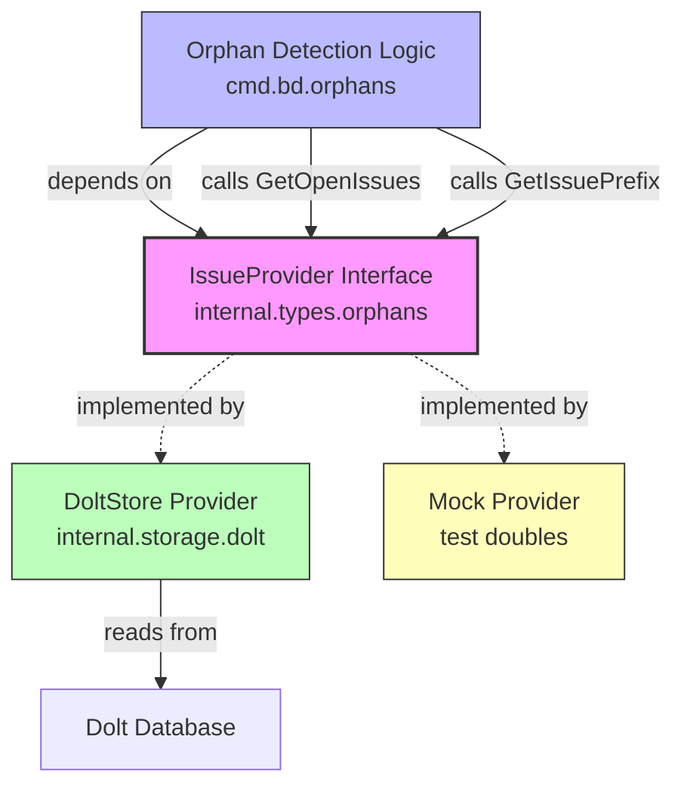

# IssueProvider 契约模块深度解析

## 模块概述

想象你正在管理一个大型仓库，里面存放着成千上万个工单（issue）。随着时间推移，某些工单可能在外部系统（如 GitLab、Jira）中被删除或关闭，但在你的本地存储中仍然标记为"打开"状态——这些就是"孤儿工单"（orphan issues）。`issue_provider_contract` 模块的核心使命就是为**孤儿检测逻辑**提供一个统一的、与存储实现无关的视图接口。

这个模块只定义了一个接口：`IssueProvider`。它不是存储层本身，而是一个**抽象契约**——它告诉孤儿检测逻辑："你只需要知道如何获取所有打开的工单和工单前缀，至于这些数据从哪里来、如何查询，与你无关"。这种设计是典型的**依赖倒置原则**：高层业务逻辑（孤儿检测）不依赖低层实现细节（Dolt 存储、Mock 测试桩），而是依赖一个稳定的抽象。

为什么不能直接在孤儿检测代码里查询 Dolt 表？因为那样会耦合存储细节，使得单元测试变得困难（每次测试都要启动 Dolt），也使得未来切换存储后端变得不可能。这个接口的存在，本质上是在说："我们关心的是**需要什么数据**，而不是**数据从哪里来**"。

## 架构定位与数据流



**架构角色解读**：

这个模块在整个系统中扮演**端口（Port）**的角色，是六边形架构中的"左端口"——它定义了外部世界（孤儿检测逻辑）如何与内部存储系统交互。注意箭头的方向：`Orphan Detection Logic` 依赖 `IssueProvider` 接口，而具体的存储实现（DoltStore、Mock）也依赖这个接口（通过实现它）。这意味着接口是稳定的锚点，实现可以随意替换而不影响调用方。

**数据流动路径**：

1. 孤儿检测逻辑调用 `GetOpenIssues(ctx)` 获取所有状态为 `open` 或 `in_progress` 的工单
2. 同时调用 `GetIssuePrefix()` 获取当前仓库配置的工单前缀（如 "bd"、"TEST"）
3. 接口实现方（如 DoltStore）从底层存储查询数据并返回
4. 孤儿检测逻辑对比外部追踪器（GitLab/Jira）的工单列表，识别出不匹配的孤儿工单

这个接口的调用频率取决于孤儿检测的执行频率——通常是按需触发（用户运行 `bd doctor` 命令）或定期后台任务。

## 核心组件深度解析

### `IssueProvider` 接口

**设计意图**：

这个接口的设计体现了**最小够用原则**（Minimal Sufficiency）。它只有两个方法，因为孤儿检测逻辑只需要这两类信息：
- 所有打开的工单（用于对比外部系统）
- 工单前缀（用于验证工单 ID 格式）

如果未来需要扩展功能（比如需要获取已关闭工单的历史记录），应该谨慎评估是否真的需要修改这个接口，还是应该创建一个新的专用接口。接口膨胀是架构腐化的开始。

**方法详解**：

#### `GetOpenIssues(ctx context.Context) ([]*Issue, error)`

这个方法返回所有状态为 `open` 或 `in_progress` 的工单。注意返回值的约定：**如果没有工单，返回空切片而非 nil，且不返回错误**。

为什么这个约定重要？因为调用方通常会这样处理：

```go
issues, err := provider.GetOpenIssues(ctx)
if err != nil {
    return err
}
// 可以直接 range 遍历，即使 issues 为空也不会 panic
for _, issue := range issues {
    // 处理逻辑
}
```

如果返回 nil 切片，虽然 Go 的 range 可以处理，但某些 JSON 序列化场景下 nil 和空切片的行为不同（nil 序列化为 `null`，空切片序列化为 `[]`）。统一返回空切片避免了调用方的防御性检查。

参数 `ctx` 的存在表明这是一个可能耗时的操作（需要查询数据库），调用方可以通过 context 控制超时或取消查询。这对于孤儿检测尤其重要——如果仓库有数万个工单，查询可能耗时数秒，调用方需要能够设置合理的超时时间。

**返回值类型**：`[]*Issue` 是指向 [`Issue`](issue_domain_model.md) 结构体的指针切片。使用指针而非值类型的原因是：
1. 避免大结构体拷贝（Issue 包含多个字段）
2. 允许调用方修改工单属性（虽然在这个场景下通常是只读）
3. 与系统中其他部分的 Issue 使用方式保持一致

#### `GetIssuePrefix() string`

这个方法返回配置的工单前缀，例如 "bd" 或 "TEST"。工单 ID 通常格式为 `{PREFIX}-{NUMBER}`（如 `bd-123`）。

**默认值约定**：接口注释明确指出，如果未配置前缀，应返回 "bd" 作为默认值。这个设计决策体现了**防御性编程**——调用方不需要处理"前缀未配置"的边缘情况，实现方负责提供合理的默认值。

为什么需要前缀信息？孤儿检测逻辑需要验证工单 ID 的格式是否符合预期。如果一个工单 ID 是 `XYZ-999` 但前缀配置是 `bd`，这可能意味着：
- 这是一个从其他系统导入的工单
- 这是一个配置错误
- 这是一个需要特殊处理的边缘情况

**无 context 参数**：注意这个方法没有 `ctx` 参数，因为前缀通常是内存中的配置值，不需要异步查询。这体现了接口设计的精确性——只在需要时引入复杂性。

## 依赖关系分析

### 上游依赖（谁调用这个接口）

根据模块树，主要调用方位于 [`cmd.bd.orphans`](../cmd/bd/orphans/) 目录：
- `orphanIssueOutput`：孤儿工单输出结构
- `doltStoreProvider`：Dolt 存储实现（同时是实现方）

此外，[`cmd.bd.doctor`](doctor_commands.md) 模块中的深度验证逻辑也可能间接调用此接口进行数据完整性检查。

### 下游依赖（这个接口依赖什么）

接口本身不依赖任何具体实现，但它的方法签名依赖以下类型：
- [`Issue`](issue_domain_model.md)：核心领域模型，定义工单的所有属性
- `context.Context`：标准库上下文，用于取消和超时控制

### 实现方

典型的实现包括：
1. **DoltStore Provider**：从 Dolt 数据库查询工单，需要处理 SQL 查询、结果映射等
2. **Mock Provider**：测试桩，返回预设的工单列表，用于单元测试

实现方需要确保：
- `GetOpenIssues` 的查询性能可接受（可能需要索引优化）
- 返回的工单数据是一致的（不会在查询过程中被修改）
- 错误处理符合调用方预期（区分"无数据"和"查询失败"）

## 设计决策与权衡

### 1. 接口 vs 具体类型

**选择**：使用接口而非具体结构体

**权衡**：
- **收益**：解耦调用方和实现方，便于测试和未来扩展
- **成本**：增加了一层间接性，调试时需要追踪具体实现

**为什么合理**：孤儿检测是跨存储后端的核心功能，未来可能支持 SQLite、PostgreSQL 等其他存储。接口抽象使得这种扩展成为可能。

### 2. 窄接口设计

**选择**：只暴露两个方法，而非完整的 CRUD 操作

**权衡**：
- **收益**：接口稳定，实现简单，调用方不会被无关方法干扰
- **成本**：如果需要额外数据（如工单历史），需要修改接口或创建新接口

**为什么合理**：这个接口有明确的单一职责（孤儿检测），不应该承担其他功能。如果需要其他数据，应该创建专用的接口（如 `IssueHistoryProvider`）。

### 3. 空切片 vs nil

**选择**：返回空切片而非 nil

**权衡**：
- **收益**：调用方无需 nil 检查，JSON 序列化行为一致
- **成本**：实现方需要确保始终返回切片（即使是空的）

**为什么合理**：Go 社区的最佳实践是返回空切片而非 nil，这减少了调用方的认知负担。

### 4. 同步调用 vs 异步回调

**选择**：同步返回结果，而非异步回调或 channel

**权衡**：
- **收益**：调用方代码直观，易于理解和调试
- **成本**：调用方需要自己管理并发（如果需要并行查询多个仓库）

**为什么合理**：孤儿检测通常是批量操作，调用方可以根据需要自行启动多个 goroutine 并行查询。接口保持同步简化了实现复杂度。

## 使用指南与示例

### 基本使用模式

```go
func DetectOrphans(ctx context.Context, provider IssueProvider, trackerIssues []*TrackerIssue) ([]OrphanIssue, error) {
    // 获取所有本地打开的工单
    localIssues, err := provider.GetOpenIssues(ctx)
    if err != nil {
        return nil, fmt.Errorf("failed to get open issues: %w", err)
    }
    
    // 获取前缀用于验证
    prefix := provider.GetIssuePrefix()
    
    var orphans []OrphanIssue
    for _, issue := range localIssues {
        // 验证前缀
        if !strings.HasPrefix(issue.ID, prefix+"-") {
            orphans = append(orphans, OrphanIssue{
                ID: issue.ID,
                Reason: "invalid prefix",
            })
            continue
        }
        
        // 检查是否存在于外部追踪器
        if !existsInTracker(issue.ID, trackerIssues) {
            orphans = append(orphans, OrphanIssue{
                ID: issue.ID,
                Reason: "not found in tracker",
            })
        }
    }
    
    return orphans, nil
}
```

### 实现示例（DoltStore）

```go
type DoltIssueProvider struct {
    store  *DoltStore
    prefix string
}

func (p *DoltIssueProvider) GetOpenIssues(ctx context.Context) ([]*Issue, error) {
    // 使用 context 控制查询超时
    rows, err := p.store.db.QueryContext(ctx, 
        "SELECT * FROM issues WHERE status IN ('open', 'in_progress')")
    if err != nil {
        return nil, err
    }
    defer rows.Close()
    
    var issues []*Issue
    for rows.Next() {
        var issue Issue
        if err := rows.Scan(&issue.ID, &issue.Title, &issue.Status, ...); err != nil {
            return nil, err
        }
        issues = append(issues, &issue)
    }
    
    // 确保返回空切片而非 nil
    if issues == nil {
        issues = []*Issue{}
    }
    
    return issues, nil
}

func (p *DoltIssueProvider) GetIssuePrefix() string {
    if p.prefix == "" {
        return "bd" // 默认值
    }
    return p.prefix
}
```

### 测试桩示例

```go
type MockIssueProvider struct {
    Issues []*Issue
    Prefix string
}

func (m *MockIssueProvider) GetOpenIssues(ctx context.Context) ([]*Issue, error) {
    // 模拟延迟
    select {
    case <-ctx.Done():
        return nil, ctx.Err()
    case <-time.After(10 * time.Millisecond):
        return m.Issues, nil
    }
}

func (m *MockIssueProvider) GetIssuePrefix() string {
    if m.Prefix == "" {
        return "bd"
    }
    return m.Prefix
}

// 测试用例
func TestDetectOrphans(t *testing.T) {
    provider := &MockIssueProvider{
        Issues: []*Issue{
            {ID: "bd-1", Status: "open"},
            {ID: "bd-2", Status: "in_progress"},
        },
        Prefix: "bd",
    }
    
    orphans, err := DetectOrphans(context.Background(), provider, nil)
    assert.NoError(t, err)
    assert.Len(t, orphans, 2) // 所有工单都是孤儿（因为 trackerIssues 为空）
}
```

## 边缘情况与陷阱

### 1. 大数据集性能问题

**问题**：如果仓库有数万个打开的工单，`GetOpenIssues` 可能返回大量数据，导致内存压力。

**缓解策略**：
- 实现方应该确保数据库查询使用索引（`status` 字段）
- 考虑分页或流式接口（但会增加接口复杂度，需要权衡）
- 调用方可以设置合理的 context 超时时间

### 2. 并发修改一致性

**问题**：在 `GetOpenIssues` 查询过程中，其他 goroutine 可能修改工单状态，导致返回的数据不一致。

**缓解策略**：
- 实现方应该在事务隔离级别内执行查询（如 Dolt 的事务快照）
- 调用方应该理解返回的数据是"查询时刻的快照"，可能不是最新状态

### 3. 前缀配置变更

**问题**：如果用户在检测过程中修改了前缀配置，`GetIssuePrefix` 可能返回不一致的值。

**缓解策略**：
- 实现方应该缓存前缀值或在构造函数中固定前缀
- 调用方应该在单次检测逻辑中只调用一次 `GetIssuePrefix` 并复用结果

### 4. 错误处理语义

**陷阱**：实现方可能返回 `nil, nil`（无错误但无数据），调用方需要区分"无数据"和"查询失败"。

**正确做法**：
```go
issues, err := provider.GetOpenIssues(ctx)
if err != nil {
    // 处理错误（数据库连接失败、权限问题等）
    return err
}
if len(issues) == 0 {
    // 正常情况：没有打开的工单
    log.Info("no open issues found")
    return nil
}
```

### 5. Context 传播

**陷阱**：调用方可能忘记传递 context，导致无法控制查询超时。

**正确做法**：始终将 context 作为第一个参数传递，并在整个调用链中传播：
```go
// 错误：忽略 context
issues, _ := provider.GetOpenIssues(context.Background())

// 正确：使用调用方的 context
issues, err := provider.GetOpenIssues(ctx)
```

## 扩展点与限制

### 可以扩展的场景

1. **添加过滤条件**：如果需要按标签、分配人等过滤工单，可以添加新方法：
   ```go
   GetOpenIssuesFiltered(ctx context.Context, filter IssueFilter) ([]*Issue, error)
   ```
   但应该谨慎评估是否真的需要，还是应该在调用方过滤。

2. **添加统计信息**：如果需要快速获取工单数量而不获取完整数据：
   ```go
   GetOpenIssuesCount(ctx context.Context) (int, error)
   ```

### 不应该扩展的场景

1. **添加写操作**：这个接口是只读的，添加 `UpdateIssue` 或 `DeleteIssue` 会破坏单一职责原则。

2. **添加复杂查询**：如果需要复杂查询（如关联工单、历史记录），应该创建专用接口而非膨胀这个接口。

3. **添加存储特定功能**：如 `GetDoltCommitHash` 会耦合 Dolt 实现，破坏抽象。

## 相关模块参考

- [`Issue` 领域模型](issue_domain_model.md)：工单的核心数据结构定义
- [`Storage` 存储接口](storage_contracts.md)：底层存储抽象，`IssueProvider` 的实现可能依赖此接口
- [Orphan 检测命令](cli_orphan_duplicate_commands.md)：使用 `IssueProvider` 的 CLI 命令实现
- [Doctor 诊断模块](cli_doctor_commands.md)：可能间接调用此接口进行数据完整性验证

## 总结

`issue_provider_contract` 模块是一个典型的**小而美**的设计：它只有一个接口、两个方法，却在系统中扮演着关键的解耦角色。它的存在使得孤儿检测逻辑可以独立于存储实现进行测试和演进，体现了"依赖抽象而非具体实现"的设计原则。

对于新加入的贡献者，理解这个模块的关键是认识到：**接口的大小不决定其重要性**。这个接口的价值不在于它做了什么，而在于它允许系统其他部分**不关心**什么——不关心数据来自 Dolt 还是 SQLite，不关心查询是快是慢，不关心配置如何加载。这种"有意的无知"正是良好架构的标志。
