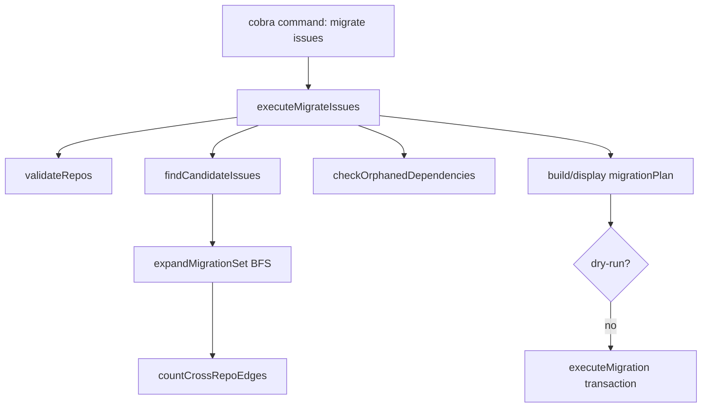

# issue_retargeting_planner（`cmd/bd/migrate_issues.go`）技术深潜

`issue_retargeting_planner` 这个模块本质上是在做一件“看起来简单、实际上很容易出事故”的事：把一批 issue 从一个仓库逻辑归属（`source_repo`）迁移到另一个，同时尽量不把依赖图撕裂。你可以把它想成“搬迁一片街区”：不是只搬你点名的几户（候选 issue），还要看上下游管线（dependency）要不要一起搬，搬完之后哪些道路变成跨区连接（incoming/outgoing edges），以及城市里本来就存在的断头路（orphaned dependency）要不要阻断这次迁移（`--strict`）。

## 这个模块为什么存在

如果只做一个朴素版本，最直接的实现是：按筛选条件查出 issue ID，然后批量 `UpdateIssue(source_repo=to)`。这种做法的最大问题是**忽略依赖图语义**。在 beads 的 issue 模型里，dependency 不只是展示关系，它还会影响调度、阻塞分析、图可视化等行为。只迁移“点名 issue”会让迁移后系统出现两类风险：

第一类是你以为搬的是“一个工作包”，实际上只搬了包皮。比如一个任务依赖多个前置 issue；如果不扩展上游闭包，目标 repo 中看起来“活着”的 issue 其实仍被源 repo 的节点阻塞。第二类是反向耦合问题：别的 issue 依赖你迁移的节点，迁移后就变成跨 repo 连接，可能是预期，也可能是意外。因此模块在执行前生成 `migrationPlan`，先把“会发生什么”量化出来，而不是直接修改数据。

## 心智模型：三层集合 + 一份迁移体检报告

理解本模块最稳的方式，是在脑中维持三个集合和两个计数面板：

- 候选集合 **C**：由过滤条件选出的初始 issue（`findCandidateIssues`）
- 迁移集合 **M**：根据 `--include`（`none/upstream/downstream/closure`）在依赖图上扩展后的集合（`expandMigrationSet`）
- 全局依赖引用集合 **R**：用于孤儿检查，来自全库 dependency 记录中出现过的所有 ID（`checkOrphanedDependencies`）

再加两个面板：

- `dependencyStats`：迁移后仍保留的跨集合边（incoming/outgoing）
- `migrationPlan`：把规模、依赖扩展、跨 repo 边、孤儿风险和最终 issue 列表打包输出

类比一下：C 是“你点名要搬的住户”，M 是“根据供水供电关系必须连带搬迁的住户”，R 是“城市路网里所有被引用的门牌号”，而 `migrationPlan` 就是搬迁前的工程可行性报告。

## 架构与数据流



从架构角色看，这个模块是一个**CLI 层的迁移编排器（orchestrator）**，而不是领域计算引擎。它做流程编排、策略选择和风险展示，真正的数据读写由 `*dolt.DoltStore` / `storage.Transaction` 提供。

入口是 `migrateIssuesCmd`（`cobra.Command`），它负责解析参数、做最早期约束（`--from/--to` 必填且不能相同）、处理 `ids-file`，然后把参数封装成 `migrateIssuesParams` 交给 `executeMigrateIssues`。后者是主流程：先校验仓库，再筛选候选，再图扩展，再孤儿体检，再输出计划，最后在非 dry-run 下执行事务更新。

从依赖关系上看，本模块在模块树中属于 [CLI Migration Commands](CLI Migration Commands.md) 的 `issue_retargeting_planner` 子模块，向下依赖了 [Dolt Storage Backend](Dolt Storage Backend.md) 的存储能力、[Storage Interfaces](Storage Interfaces.md) 的事务契约，以及 [Core Domain Types](Core Domain Types.md) 中的 `IssueFilter` 与 issue/dependency 语义。

## 组件深潜

### `migrateIssuesParams`

这是 CLI 参数的内部传输对象，刻意保持“贴近 flag 语义”的扁平结构：源/目标 repo、过滤条件、依赖扩展策略、执行策略（`dryRun/strict/yes`）。设计上它没有塞任何行为逻辑，优点是命令层改 flag 时改动集中；代价是校验分散在命令入口和执行流程中（例如 `include` 不在这里做枚举约束）。

### `migrationPlan`

`migrationPlan` 是这个模块最关键的“可解释输出”对象。它不是执行输入，而是**面向用户决策的中间报告**：

- `TotalSelected` vs `AddedByDependency` 解释“筛选结果”和“图扩展结果”的差异；
- `IncomingEdges` / `OutgoingEdges` 把跨 repo 关联成本显式化；
- `Orphans` / `OrphanSamples` 暴露数据健康风险；
- `IssueIDs` 给出最终将变更的对象集合。

这个对象同时服务人类输出和 JSON 输出，避免两套报告逻辑漂移。

### `executeMigrateIssues(ctx, p)`

这是主编排函数，代码里已经按 Step 1~7 明确分层。设计意图是把迁移拆成“纯读阶段 + 计划展示 + 可选写阶段”。这其实是在把“可预测性”放在第一优先级：先让用户看到后果，再决定是否落库。

一个值得注意的选择是：**孤儿检查是全局的**（`checkOrphanedDependencies(ctx, s)` 不按迁移集合过滤）。这在 `strict` 模式下意味着：即便待迁移集合本身干净，只要库里任何地方有 orphan，也会阻断执行。它偏向“整体数据完整性优先”，而不是“局部任务可完成优先”。

### `validateRepos`

它并不验证“repo 元数据是否注册存在”，而是通过 `SearchIssues(SourceRepo, Limit=1)` 的可见性来判定。换句话说，repo 的“存在”被近似为“是否至少有一条 issue 属于它”。这非常轻量，避免引入专门 repo registry；但语义上会把“空 repo”视作未出现。代码对此采取软处理：

- 源 repo 无 issue：`strict` 下报错，否则警告；
- 目标 repo 无 issue：提示将被创建（实际上是通过写入 issue 的 `source_repo` 让它“出现”）。

### `findCandidateIssues`

该函数把 CLI 过滤参数翻译为 `types.IssueFilter`。几个关键点：

- 固定加上 `SourceRepo: &p.from`，确保只从源 repo 选；
- `labels` 使用 `IssueFilter.Labels`，语义是 AND（源码注释已写明）；
- `ids` 与其他过滤“取交集”（通过同一个 filter 传给 `SearchIssues` 实现）。

这使它成为“选择器构建器”而不是“后置筛选器”，把过滤压力下推到存储层。

### `expandMigrationSet`

这是核心图算法层。实现上采用 BFS，对初始候选集合按 `include` 策略扩展：

- `upstream`：沿“我依赖谁”方向扩展；
- `downstream`：沿“谁依赖我”方向扩展；
- `closure`：两方向都扩展。

为什么是 BFS 而不是递归 DFS？在 Go CLI 场景里 BFS 更稳：避免深图递归栈风险，也更容易做 visited 去重和队列推进。该函数还在扩展完成后调用 `countCrossRepoEdges`，把结构性影响（跨集合边）纳入计划。

一个非显式但重要的事实是：结果集合来自 map 转 slice，**顺序不稳定**。这不会影响正确性，但会影响 dry-run 输出和确认提示的可复现性。

### `getUpstreamDependencies` / `getDownstreamDependencies`

两者分别封装依赖方向，给 `expandMigrationSet` 提供统一“取邻居”接口。`withinFromOnly` 是关键闸门：默认 `true`，意味着只把源 repo 内节点加入扩展，避免因为图上存在跨 repo 依赖而把迁移范围爆炸到外部。

`getUpstreamDependencies` 在 `withinFromOnly=true` 时会逐条 `GetIssue(dep.DependsOnID)` 判断 repo，属于 N+1 读模式；`getDownstreamDependencies` 则直接拿 `GetDependents` 返回的 issue 对象过滤，成本模型不同。

### `countCrossRepoEdges`

该函数不是在算“图总边数”，而是算“迁移集合与外部集合之间的边界边”：

- `outgoing`：M 内节点依赖 M 外节点；
- `incoming`：M 外节点依赖 M 内节点。

实现上用了两套读取路径：

1. `GetDependencyRecordsForIssues(migrationSet)` 高效计算 outgoing；
2. `GetAllDependencyRecords()` 全表扫描补 incoming。

这是典型的工程折中：为保持实现简单和语义直观，incoming 采用全量扫描，可能在大库上偏重，但逻辑清晰且不依赖复杂索引接口。

### `checkOrphanedDependencies`

它做的是“引用完整性体检”：从全量 dependency 记录中收集所有被引用 ID，再批量 `SearchIssues(IDs=idList)` 检查实体存在性，最终返回“被引用但不存在”的 ID 列表。

这里选择批量查询而非逐条 `GetIssue`，体现了对 I/O 次数的控制；但依然是全库级检查，和迁移子图没有隔离。

### `buildMigrationPlan` / `displayMigrationPlan`

`buildMigrationPlan` 负责纯数据组装，`displayMigrationPlan` 负责呈现（JSON 或人类可读文本）。这种分离让输出渠道切换不污染计算逻辑。

`OrphanSamples` 最多展示 10 条，是典型“信息节流”：既提示风险，又避免终端噪音。

### `confirmMigration`

交互式二次确认，仅在“非 dry-run 且非 `--yes` 且非 JSON 输出”路径触发。也就是脚本化模式和机器可读模式默认无阻塞输入，这对自动化流水线很关键。

### `executeMigration`

真正写入发生在事务闭包里，通过 `tx.UpdateIssue(..., {"source_repo": to}, actor)` 逐条更新。设计上非常克制：只改 `source_repo`，不改 dependency、label、状态等字段，确保迁移语义单一。

它依赖 [Storage Interfaces](Storage Interfaces.md) 的 `Transaction.UpdateIssue` 契约，底层事务提交/回滚由 `transact` 封装管理（`transact` 实现在本文件外）。

### `loadIDsFromFile`

小函数但很实用：支持 `#` 注释和空行过滤，方便维护迁移清单文件。它不做 ID 格式校验，默认把合法性留给后续查询阶段。

### `init`

命令装配层做了三件事：

1. 注册 `bd migrate issues` 子命令；
2. 声明所有 flag 及默认值（尤其 `within-from-only=true` 和 `include=none`）；
3. 提供隐藏兼容别名 `migrate-issues`，并标记 deprecated。

这说明模块在演进中兼顾了 CLI UX 稳定性。

## 依赖分析：它调用谁、谁调用它

从代码可见依赖看，本模块向下主要调用 `*dolt.DoltStore` 的查询能力：`SearchIssues`、`GetDependencyRecords`、`GetDependents`、`GetDependencyRecordsForIssues`、`GetAllDependencyRecords`、`GetIssue`。写路径则通过事务 `UpdateIssue` 完成。这些调用反映出它对存储层有较强的具体类型耦合（函数签名接收 `*dolt.DoltStore`），而不仅是抽象 `Storage` 接口。

向上调用方是 CLI 路由：`migrateIssuesCmd` 通过 `init` 注册到 `migrateCmd`，并提供 root 级兼容别名。模块树也显示它是 [CLI Migration Commands](CLI Migration Commands.md) 下的专门子模块。

关键数据契约有三个：

- `types.IssueFilter`：过滤语义契约（尤其 labels 为 AND，`IDs` 与其他条件叠加）；
- dependency 读取接口返回的数据方向契约（`GetDependencyRecords` 是 issue->depends_on，`GetDependents` 是反向）；
- `Transaction.UpdateIssue` 的部分更新语义（只 patch `source_repo` 字段）。

如果上游 CLI 改了 flag 语义（例如把 `--label` 改成 OR），或者下游存储改了过滤/依赖方向语义，这个模块会直接行为漂移。

## 关键设计取舍

最明显的取舍是“正确性可解释优先于极致性能”。例如先完整构建计划再写入、全局孤儿检查、incoming 边全表扫描，都会增加读取开销，但换来更低误迁移风险和更高可审计性。对于迁移命令这种低频高风险操作，这是合理的。

第二个取舍是“实现简单优先于强扩展性”。`include` 使用字符串分支，没有策略对象或接口抽象；仓库存在性通过 issue 可见性近似判断；写入是逐条更新。这使代码直观、维护成本低，但也让高级场景（例如自定义扩展规则、超大批次并行迁移）扩展空间受限。

第三个取舍是“操作自治性 vs 系统一致性”。`strict` 下采用全局 orphan 阻断，强调系统整体健康；但这会牺牲局部任务自治，可能让运维体验变“被历史债务卡住”。

## 使用方式与示例

典型建议流程是先 dry-run，看计划，再执行：

```bash
# 先看计划，不落库
bd migrate issues \
  --from ~/.beads-planning \
  --to . \
  --status open \
  --priority 1 \
  --include closure \
  --dry-run

# 确认后执行
bd migrate issues \
  --from ~/.beads-planning \
  --to . \
  --status open \
  --priority 1 \
  --include closure \
  --yes
```

如果要从文件喂 ID：

```bash
bd migrate issues --from . --to ~/archive --ids-file ./ids.txt --dry-run
```

`ids.txt` 支持注释：

```txt
# critical set
bd-abc123
bd-def456
```

## 新贡献者要特别注意的坑

第一，`include` flag 当前没有显式值校验。若传入非 `none/upstream/downstream/closure` 的值，`expandMigrationSet` 的 `switch` 不命中分支，结果会退化成“不扩展且无报错”。这在 UX 上容易造成“命令成功但行为不符合预期”。

第二，`strict` 的 orphan 检查是全局的，不是“与本次迁移相关的 orphan”。如果你在修一个局部迁移失败，先确认是不是被库里其他历史坏数据阻断。

第三，迁移集合和 orphan 样本都涉及 map 迭代，输出顺序不稳定。写测试或对比日志时不要依赖顺序，应做集合语义断言。

第四，`getUpstreamDependencies` 在 `within-from-only=true` 时可能产生大量 `GetIssue` 调用；大图场景下要关注 I/O 放大。

第五，仓库“存在性”并非独立实体，空仓库会被当作“尚未出现”。这不是 bug，而是当前数据模型下的定义。

## 可演进点（建议）

可以考虑把 `include` 从字符串分支升级为显式枚举校验，至少在 CLI 层提前报错；也可以把 orphan 检查策略参数化（全局/仅迁移子图），让 `strict` 更可控。对于超大集合，可进一步优化 upstream 过滤的批量读取路径，降低 N+1 成本。

## 参考

- [CLI Migration Commands](CLI Migration Commands.md)
- [Storage Interfaces](Storage Interfaces.md)
- [Dolt Storage Backend](Dolt Storage Backend.md)
- [Core Domain Types](Core Domain Types.md)
- [issue_domain_model](issue_domain_model.md)
- [storage_contracts](storage_contracts.md)
