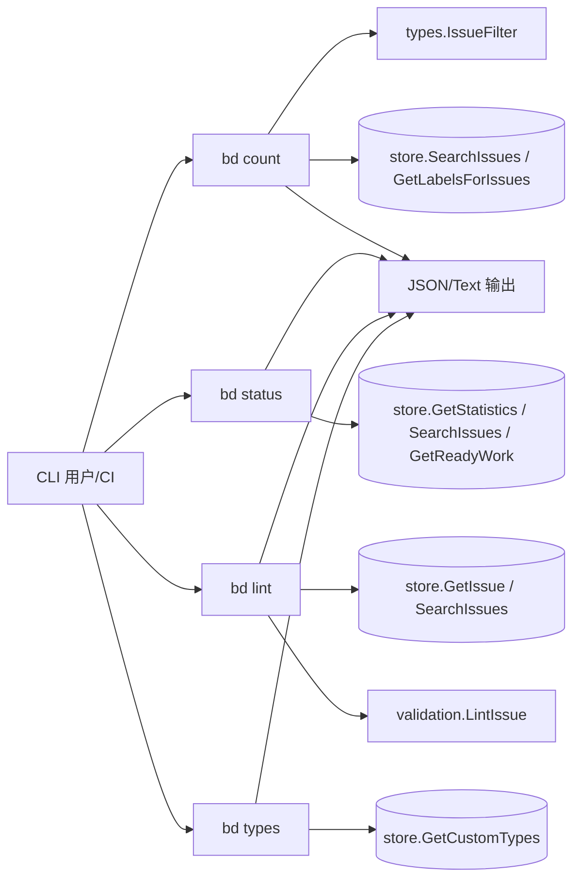
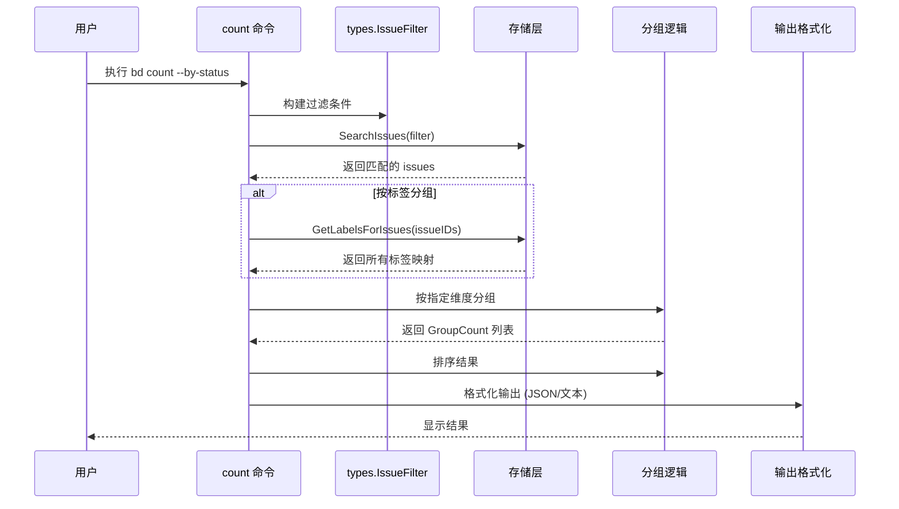
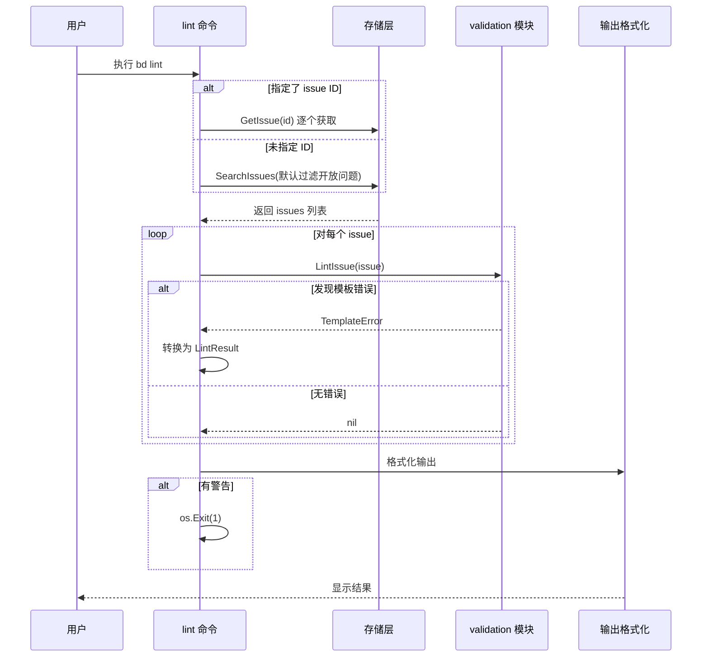

# issue_taxonomy_and_validation_views 模块深度解析

`issue_taxonomy_and_validation_views` 是 `bd` CLI 里一组“认知型视图命令”的集合：它不直接改变业务状态，而是把 issue 数据库翻译成团队能快速决策的信息切面。`count` 负责“按维度计数”，`status` 负责“健康快照”，`lint` 负责“模板完整性检查”，`types` 负责“类型词典可见化”。如果没有这层，用户要么手工拼多个查询、自己做聚合和校验，要么在 CI / 脚本里重复一堆不稳定的解析逻辑。这个模块存在的核心原因，是把“分散的底层查询能力”收敛成“稳定、可自动化、可读的治理视图”。

## 架构与数据流

### 整体架构图



### 各命令详细数据流

#### `bd count` 命令数据流



#### `bd lint` 命令数据流



从架构角色看，这个模块是一个轻量 **view/orchestration layer**：上游是 Cobra 命令分发（`rootCmd.AddCommand(...)`），下游是存储接口与校验引擎。它自己不定义核心领域规则，而是把多个现成能力按“人类问题”重新组织：

- “现在有多少 issue，按什么维度分布？”→ `count`
- “仓库整体健康怎样？”→ `status`
- “Issue 描述质量是否达标？”→ `lint`
- “我到底能用哪些 type？”→ `types`

可以把它想成“机场信息屏”而不是“机场调度中心”：它不直接决定飞机怎么飞（不写领域规则），但把底层状态以可行动的方式呈现给旅客和运行人员。

## 心智模型：四个视图，四种信息压缩策略

理解这个模块最有效的方式，不是按文件读，而是按“信息压缩方式”读。

`count` 的压缩方式是“过滤后聚合”。先把问题空间收窄（`types.IssueFilter`），再把结果映射到一个分组键（status/priority/type/assignee/label）并计数。

`status` 的压缩方式是“预聚合 + 少量派生统计”。优先使用 `store.GetStatistics` 的数据库级汇总，再按 `--assigned` 走一次“过滤后重算”路径补充个体视角。

`lint` 的压缩方式是“规则命中提取”。它不是返回所有 issue，而是只保留触发 `validation.TemplateError` 的项，把缺失 section 提炼成最小可修复单元（`LintResult.Missing`）。

`types` 的压缩方式是“静态基线 + 动态配置叠加”。内建 `coreWorkTypes` 提供稳定下限，`store.GetCustomTypes` 提供团队定制上限。

这四种压缩共同构成“分类学（taxonomy）+ 校验（validation）”视图层：前者让数据可分组，后者让质量可度量。

## 组件深潜

### `cmd.bd.count.GroupCount`

`GroupCount` 是 `count` 在分组模式下的标准输出单元：`Group` + `Count`。它的设计很朴素，但作用是把不同分组维度统一成同一 JSON 契约。无论你按 `--by-status` 还是 `--by-label`，下游脚本都能按同样字段消费。

`count` 的非显式设计重点在 `Run` 逻辑：

第一，它显式限制只能出现一个 `--by-*`，通过 `groupCount > 1` 直接失败。这是一个“刻意保守”的 API 决策：避免多维 group-by 带来的组合爆炸和输出契约复杂化。

第二，它把几乎所有筛选条件收敛进 `types.IssueFilter`（状态、优先级、日期区间、空值判断、文本匹配等），将过滤语义交给存储层执行。好处是复用统一查询路径，坏处是这个命令对 `IssueFilter` 字段演进高度敏感。

第三，`--by-label` 特意先调用一次 `store.GetLabelsForIssues(ctx, issueIDs)`，而不是循环里逐条查 label。这是明显的 N+1 优化：牺牲一点内存换取查询批量化。

第四，输出前用 `slices.SortFunc` + `cmp.Compare` 按分组键排序，保证文本与 JSON 输出稳定可比较，适合 CI diff 和快照测试。

### `cmd.bd.status.StatusOutput`

`StatusOutput` 是 `status` 命令的顶层输出：`Summary *types.Statistics` + `RecentActivity *RecentActivitySummary`。它把“核心健康指标”与“时间窗口活动”分开，避免把活动统计耦合进基础统计结构。

`status` 的关键实现意图有三点：

其一，默认走 `store.GetStatistics(ctx)`，说明这个命令优先依赖存储层预聚合能力，而不是在 CLI 全量扫描再手算。这是性能优先的选择。

其二，`--assigned` 触发 `getAssignedStatistics(actor)` 并覆盖默认统计。这条路径会调用 `store.SearchIssues` + `store.GetReadyWork`，在客户端重算分状态计数。设计上它牺牲了一致性（与全局统计口径略有分叉风险）来换取“按当前用户视角”的实用性。

其三，`--json` 会设置全局 `jsonOutput = true`。这是命令内对全局输出模式的主动覆盖，使用方便，但意味着该命令对全局状态有副作用；在复用命令执行流程或做集成测试时要留意。

### `cmd.bd.status.RecentActivitySummary`

`RecentActivitySummary` 表示最近活动统计结构，但当前 `getGitActivity(_ int)` 直接返回 `nil`。代码注释说明活动跟踪已迁移到 Dolt-native 查询，现阶段这个字段是“前向兼容容器”。

这是一种常见过渡策略：保留输出接口，先让实现降级为空，避免一次性破坏消费者。代价是调用方必须处理 `recent_activity` 缺失。

### `cmd.bd.lint.LintResult`

`LintResult` 是 lint 命中的最小诊断对象：issue 标识信息 + 缺失 sections + warning 数。注意它只承载模板缺失问题，不承载所有潜在错误。

`lint` 的核心机制是：

- 收集 issue（参数指定 ID 则逐个 `store.GetIssue`；否则按 `types.IssueFilter` 批量 `store.SearchIssues`）
- 对每个 issue 调用 `validation.LintIssue(issue)`
- 仅当错误类型是 `*validation.TemplateError` 时提取 `Missing[].Heading`

这个“只抓 TemplateError”的分支说明命令目标非常聚焦：模板完整性，而不是通用数据校验。它让输出更稳定、噪声更低，但也意味着其他 lint 维度需要新命令或扩展错误模型。

另外，命中 warning 后执行 `os.Exit(1)`，这是为 CI 设计的硬信号：有警告即失败。对人工交互很直接，但在库化复用场景里会带来可测试性问题（进程级退出）。

### `cmd.bd.types.typeInfo`

`typeInfo` 是 `types --json` 的输出条目（`name` + `description`）。`types` 命令本身把类型来源拆成两层：

- 内建常量 `coreWorkTypes`（`task/bug/feature/chore/epic/decision`）
- 配置层扩展 `store.GetCustomTypes(ctx)`

`types` 在运行前调用 `ensureDirectMode("types command requires direct database access")`，这揭示了一个隐含约束：即使主要内容是内建类型，它仍希望在“有数据库上下文”的模式下运行，以便读取配置扩展。这是“行为一致性优先”而非“离线可用性优先”的选择。

## 依赖分析：它调用谁，谁调用它

这个模块的外部依赖主要有四组。

第一组是存储查询接口（通过全局 `store`）：`SearchIssues`、`GetIssue`、`GetLabelsForIssues`、`GetStatistics`、`GetReadyWork`、`GetCustomTypes`。这些调用决定了模块是“读多写零”的纯视图层。

第二组是领域与过滤契约：`types.IssueFilter`、`types.WorkFilter`、`types.Statistics`、`types.Status`、`types.IssueType`。模块大量把 CLI flag 映射到这些结构，说明它对 [query_and_projection_types](query_and_projection_types.md) 和 [issue_domain_model](issue_domain_model.md) 的字段语义高度耦合。

第三组是校验引擎：`validation.LintIssue` 与 `validation.TemplateError`（见 [Validation](Validation.md)）。`lint` 命令并不重新实现模板规则，而是严格消费 validation 模块给出的错误类型。

第四组是 CLI 与输出基础设施：Cobra 命令系统（`rootCmd.AddCommand(...)`）、`outputJSON`、`FatalError*`、`jsonOutput`、`ui.Render*`。这说明“谁调用它”主要是 Cobra 的命令分发器；对外暴露的是 CLI 契约而非 Go API。

数据流上最“热”的路径通常是 `count` 和 `status`：一个用于筛选计数，一个用于日常健康检查。尤其 `count` 在复杂过滤 + 分组时，`SearchIssues` 的代价和结果集大小会直接决定体感性能。

## 关键设计取舍与背后原因

这个模块总体选择了“命令内编排 + 复用底层能力”，而没有再抽一层统一 service。这样做短期实现快、读代码直观，但也带来一些横切一致性成本。

一个典型取舍是简洁性 vs 表达力。`count` 限制只能一个 `--by-*`，接口简单、输出稳定；但用户无法直接得到二维透视（例如 status × assignee）。当前选择明显偏向可维护性。

另一个取舍是性能 vs 口径统一。`status` 默认用 `GetStatistics`（快），但 `--assigned` 走 `SearchIssues` + 本地计数（灵活）。这可能引入“不同路径统计字段覆盖范围不完全一致”的张力，但换来了用户最在意的个体视角。

再一个取舍是可用性 vs 纯净性。`lint` 用 `os.Exit(1)` 把结果直接转成进程状态码，CI 友好；代价是命令逻辑不易作为可组合函数复用。

最后是演进兼容性 vs 功能完整性。`status` 仍保留 `RecentActivitySummary` 结构，但当前返回 `nil`。这是在迁移阶段保住接口稳定、推迟实现细节的一种现实主义选择。

## 使用方式与示例

### 基本用法示例

常见调用（来自现有命令语义）：

```bash
# 计数
bd count --status open
bd count --assignee alice --by-status
bd count --by-label --label-any backend,api

# 状态
bd status
bd status --assigned --json
bd status --no-activity

# 模板 lint（适合 CI）
bd lint --status all
bd lint bd-abc bd-def

# 类型视图
bd types
bd types --json
```

### 高级工作流与组合示例

#### 1. CI 质量门禁流水线

```bash
#!/bin/bash
# 示例：pre-merge 质量检查

echo "=== 检查问题模板完整性 ==="
if bd lint --json | jq -e '.total > 0'; then
    echo "❌ 存在模板警告！"
    exit 1
fi

echo "=== 检查阻塞问题数量 ==="
BLOCKED=$(bd count --status blocked)
if [ "$BLOCKED" -gt 5 ]; then
    echo "⚠️  阻塞问题较多 ($BLOCKED)，建议先清理"
fi

echo "✅ 质量检查通过"
```

#### 2. 项目健康报告生成

```bash
#!/bin/bash
# 示例：生成每日项目健康报告

REPORT_FILE="project-health-$(date +%Y-%m-%d).json"

echo "=== 生成项目健康报告 ==="

# 收集状态
bd status --json > status-tmp.json

# 收集问题分布
bd count --by-status --json > count-status-tmp.json
bd count --by-type --json > count-type-tmp.json
bd count --by-assignee --json > count-assignee-tmp.json

# 合并报告
jq -s '.[0] * {status_counts: .[1], type_counts: .[2], assignee_counts: .[3]}' \
    status-tmp.json count-status-tmp.json count-type-tmp.json count-assignee-tmp.json \
    > "$REPORT_FILE"

# 清理临时文件
rm status-tmp.json count-status-tmp.json count-type-tmp.json count-assignee-tmp.json

echo "✅ 报告已生成: $REPORT_FILE"
```

#### 3. 个人工作队列检查

```bash
#!/bin/bash
# 示例：个人工作回顾

echo "=== 我的工作状态 ==="
echo ""

# 个人统计
bd status --assigned
echo ""

# 我的待办分布
echo "=== 我的问题分布 ==="
bd count --assignee "$(whoami)" --by-status
echo ""

# 我的问题类型
echo "=== 我的问题类型 ==="
bd count --assignee "$(whoami)" --by-type
```

### 输出结构示例

#### `count --json` 分组输出结构

```json
{
  "total": 42,
  "groups": [
    {"group": "open", "count": 18},
    {"group": "closed", "count": 24}
  ]
}
```

#### `status --json` 输出结构

```json
{
  "summary": {
    "total_issues": 120,
    "open_issues": 45,
    "in_progress_issues": 12,
    "blocked_issues": 8,
    "closed_issues": 55,
    "ready_issues": 30,
    "pinned_issues": 3,
    "epics_eligible_for_closure": 2,
    "average_lead_time": 48.5
  },
  "recent_activity": null
}
```

#### `lint --json` 输出结构

```json
{
  "total": 7,
  "issues": 3,
  "results": [
    {
      "id": "bd-abc123",
      "title": "用户登录功能异常",
      "type": "bug",
      "missing": ["Steps to Reproduce", "Acceptance Criteria"],
      "warnings": 2
    }
  ]
}
```

## 新贡献者需要特别注意的坑

第一，`count` 的 label 分组是“一条 issue 贡献多个桶”的模型，而不是互斥分组。`total` 不一定等于所有分组计数之和，这是预期行为，不是 bug。

第二，`count` 里 `--id` 会先 `strings.Split(...,",")` 再走 `utils.NormalizeLabels`。这复用了标签规范化逻辑，意味着 ID 大小写/格式会被同一套归一规则影响；改 `NormalizeLabels` 可能波及 ID 过滤。

第三，`status --all` 在当前实现中是兼容性占位（最后 `_ = showAll`），不是行为开关。不要误以为它改变查询范围。

第四，`status` 的最近活动目前恒为 `nil`。如果你在 UI 或脚本里依赖 `recent_activity`，必须做空值处理。

第五，`lint` 在发现模板缺失后会 `os.Exit(1)`。如果你在测试里直接调用命令执行路径，需要拦截或替代进程退出行为。

第六，`types` 依赖 direct mode；在没有正确数据库上下文时，命令会打印错误并返回。即便只是看 core types，也要考虑这一前置条件。

## 模块演化与可能的扩展方向

### 当前架构的演进历史

从代码中的一些线索可以看出，这个模块经历了一些演进：

1. **Git 活动跟踪的迁移**：`getGitActivity` 函数当前返回 `nil`，注释说明活动跟踪已迁移到 Dolt-native 查询
2. **统计口径的双轨制**：`status` 命令有两条路径——预聚合统计和客户端重算统计
3. **视图层的逐渐丰富**：从简单的计数到全面的健康检查和验证

这些演进留下了一些"化石代码"，但保持了接口的稳定性——这是一个很好的实践。

### 未来可能的扩展方向

基于当前的设计，以下是一些合理的扩展方向：

1. **更丰富的分组和聚合**
   - 支持多维分组（例如 status × type）
   - 添加时间序列聚合（按周/月统计问题创建）
   - 支持百分比和比例计算

2. **更强大的 lint 功能**
   - 支持多种 lint 规则类别（不仅仅是模板缺失）
   - 添加自动修复建议
   - 支持 lint 规则的配置开关

3. **增强的 status 命令**
   - 恢复并完善活动跟踪功能
   - 添加趋势指标（与上周相比的变化）
   - 支持自定义仪表盘配置

4. **更好的可组合性**
   - 将命令逻辑重构为可测试的函数（避免 `os.Exit` 直接调用）
   - 添加中间件机制支持自定义输出格式化
   - 探索作为 Go 库使用的可能性

### 对贡献者的建议

如果你计划扩展这个模块，建议遵循以下原则：

1. **保持视图层的纯粹性**：继续避免在命令中实现核心业务逻辑
2. **双重输出格式**：始终同时支持人类可读和 JSON 输出
3. **稳定性优先**：如果要改变现有行为，考虑使用新标志而非改变默认行为
4. **性能意识**：对于可能处理大量问题的命令，考虑批量查询和分页

## 相关模块参考

- 过滤与投影结构：[`query_and_projection_types`](query_and_projection_types.md)
- 领域类型语义：[`issue_domain_model`](issue_domain_model.md)
- 存储接口契约：[`storage_contracts`](storage_contracts.md)
- 模板校验规则来源：[`Validation`](Validation.md)
- 命令上下文与全局状态：[`CLI Command Context`](CLI Command Context.md)
- 创建路径对照（理解视图与写入分层）：[`issue_creation_inputs`](issue_creation_inputs.md)
