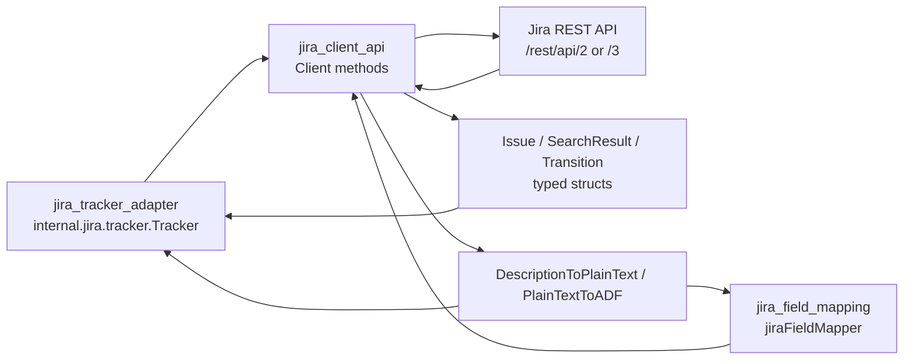

# jira_client_api 深度解析

`jira_client_api`（`internal/jira/client.go`）是整个 Jira 集成里的“协议边界层”：它把一组稳定的 Go 方法（`GetIssue`、`SearchIssues`、`UpdateIssue` 等）映射成 Jira REST API 的具体 HTTP 请求与 JSON 结构。你可以把它想成一个“翻译官 + 海关”：上游（如 `jira_tracker_adapter`）只关心“我要查问题单/更新状态”，而它负责把这些意图翻译成 Jira 认可的 URL、认证头、字段格式（尤其是 ADF 描述），并把 Jira 的响应重新整理为本地可消费的数据结构。这个模块存在的核心原因是：Jira API 并不只是“发个 HTTP 请求”这么简单——版本差异（v2/v3）、分页、认证策略、工作流状态迁移、描述格式（ADF）都需要统一封装，否则这些复杂性会在上层业务中四处泄漏。

## 架构角色与数据流



从依赖关系看，这个模块不是业务编排器，而是**外部系统网关（gateway）**。`jira_tracker_adapter` 中的 `Tracker` 直接调用 `Client.SearchIssues`、`Client.GetIssue`、`Client.CreateIssue`、`Client.UpdateIssue`、`Client.GetIssueTransitions`、`Client.TransitionIssue`。同时，`jira_tracker_adapter` 和 `jira_field_mapping` 都复用这里的文本转换工具：`DescriptionToPlainText` 与 `PlainTextToADF`。

一次典型“更新 issue”链路可以这样理解：`Tracker.UpdateIssue` 先调用 `FieldMapper().IssueToTracker(...)` 生成 Jira `fields`，再调用 `Client.UpdateIssue` 发送 PUT；随后 `Tracker` 再调用 `Client.GetIssue` 读取当前状态，并在必要时调用 `Client.GetIssueTransitions` + `Client.TransitionIssue` 完成工作流迁移。这里 `jira_client_api` 提供的是“原子 API 动作”，而“先更新字段再迁移状态”的过程控制在 `jira_tracker_adapter`。

## 这个模块解决了什么问题（Problem Space）

如果采用朴素方案，上层逻辑会直接拼接 URL、手写 `Authorization`、在每个调用点处理分页与错误、并在每次读写描述时猜测是否为 ADF。结果通常是：

- Jira Cloud 与自建 Jira 的认证方式混在业务代码里；
- API v2/v3 差异（例如搜索路径、description 格式）散落在多个调用点；
- 错误处理不一致（某些地方检查 204，某些地方误把空 body 当失败）；
- 描述字段解析不稳定，导致同步后文本丢失或显示 JSON 原文。

`jira_client_api` 的设计意图是把这些“协议细节”集中封装成一个小而完整的客户端层，让上游只处理业务语义，不碰 HTTP 细节。

## 心智模型（Mental Model）

建议把 `Client` 想成一个三层小管线：

1. **意图层**：`GetIssue`、`SearchIssues`、`TransitionIssue` 这类方法表达“我要做什么”；
2. **协议层**：`apiBase`、`setAuth`、`doRequest` 负责“如何正确跟 Jira 说话”；
3. **格式层**：`Issue`/`IssueFields`/`SearchResult` 负责结构化数据，`DescriptionToPlainText`/`PlainTextToADF` 负责文本编码转换。

这个模型的关键是：上层几乎永远不该直接碰 `http.Client` 或 ADF JSON。只要离开 `Client` 的边界，看到的应是“面向领域语义的结构化对象”。

## 核心组件深潜

### `Client`：有状态但轻量的 Jira 网关

`Client` 持有连接 Jira 所需的最小状态：`URL`、`Username`、`APIToken`、`APIVersion`、`HTTPClient`。`NewClient` 默认设置 `APIVersion = "3"` 和 `30s` 超时，这是一种“安全默认值”策略：先适配 Jira Cloud 主流路径与响应格式，同时避免请求无限阻塞。

`apiBase()` 统一生成 `/rest/api/{version}` 前缀，是个很小但很关键的封装点。因为一旦版本切换规则变化（或后续支持更多路由变体），修改点集中在这里而不是分散在每个 API 方法。

### 请求执行骨架：`doRequest` + `setAuth`

`doRequest` 是模块中最热路径，几乎所有 API 方法最终都会进入它。它承担了四个统一契约：

- 配置前置校验：缺 `URL` 或 `APIToken` 直接报错；
- 请求构造：带 `context.Context`，设置 `Accept`、`User-Agent` 与必要时的 `Content-Type`；
- 认证注入：通过 `setAuth` 统一写 `Authorization`；
- 响应语义：2xx 成功，`204 No Content` 特判返回 `nil` body，其他状态码带响应体报错。

`setAuth` 的选择很实用：

- `Username` 存在时走 Basic Auth（`username:token` base64）；
- 否则走 Bearer token。

这让同一客户端可兼容 Cloud / Server 常见认证方式，而不用在调用层分支。

### 查询与分页：`SearchIssues`

`SearchIssues(ctx, jql)` 的关键价值不是“能查”，而是**把分页吞掉**。它固定 `maxResults = 100`，循环调用直到 `startAt + len(result.Issues) >= result.Total`。上游拿到的是完整 `[]Issue`，不需要知道 Jira 分页机制。

另一个非显而易见点是 API 版本路径差异处理：

- v3 使用 `search/jql`；
- v2 使用 `search`。

这个差异若泄漏到业务层，维护成本会很高；现在被收敛在一个方法内部。

### 单项读取：`GetIssue` 与 `FetchIssueTimestamp`

`GetIssue` 是全字段读取，使用 `searchFields` 常量固定字段集。`FetchIssueTimestamp` 则只请求 `fields=updated`，并调用 `ParseTimestamp` 解析时间。这体现了一个性能与职责平衡：当上游只要“是否更新过”，就不必拉全量字段。

### 写路径：`CreateIssue`、`UpdateIssue`、`TransitionIssue`

`CreateIssue` 接受 `fields map[string]interface{}`，请求体统一包成 `{ "fields": ... }`。创建后它会再次调用 `GetIssue` 拉取完整对象。原因是 Jira create 响应通常只给 `id/key/self`，而上游常需要完整字段用于后续转换。

`UpdateIssue` 只做字段更新，不隐式做状态迁移。`TransitionIssue` 单独封装工作流迁移接口（`/transitions`）。这种拆分契合 Jira 模型：状态变更往往受工作流约束，不是普通字段 PUT。

### 工作流读取：`GetIssueTransitions`

该方法读取可用迁移列表并反序列化为 `[]Transition`。在实际调用链里，`jira_tracker_adapter` 会先读取 transitions 再匹配目标状态并调用 `TransitionIssue`，所以这里提供的是“可执行动作集合”，而非直接“设为某状态”。

### 数据结构：`Issue` / `IssueFields` 及其子字段

这些 struct 是对 Jira JSON 的轻量镜像。`IssueFields` 中大量字段使用指针（如 `*StatusField`、`*UserField`），明确表达“字段可能缺失”。这比零值结构更安全：上层可以区分“确实为空”与“未返回/未配置权限”。

`Description` 使用 `json.RawMessage` 是一个重要设计：它承认 Jira description 可能是 ADF 文档，也可能是纯字符串（尤其在不同 API 版本或历史数据中）。先保留原始 JSON，再由转换函数决定解释策略。

### 文本转换：`DescriptionToPlainText` 与 `PlainTextToADF`

这是模块里最有“兼容性味道”的部分。

`DescriptionToPlainText` 的策略是多级降级：

1. 空或 `null` -> 空字符串；
2. 尝试按 ADF doc 解析；
3. 若不是合法 JSON doc，尝试当字符串 JSON；
4. 再失败就返回原始字节串。

这种做法优先保证“尽量不丢信息”，即使格式异常也尽量给调用者可见文本。

`PlainTextToADF` 则把纯文本按换行拆成 paragraph，构造最小合法 ADF（`type=doc, version=1`）。它不是完整富文本编辑器，而是“最小可写”实现，满足同步场景。

## 依赖分析

### 它调用了什么

在 `client.go` 内部可见的外部依赖主要是标准库 `net/http`、`encoding/json`、`net/url`、`time`，以及 `internal/debug.Logf`。此外，`FetchIssueTimestamp` 依赖同包工具 `ParseTimestamp`（定义在 `internal/jira/refs.go`）。

这说明 `jira_client_api` 尽量保持“薄依赖”：不依赖存储层、不依赖 tracker 抽象，只专注 HTTP 协议与数据建模。

### 什么在调用它

从 `internal/jira/tracker.go` 可直接看到：

- `Tracker.FetchIssues` -> `Client.SearchIssues`
- `Tracker.FetchIssue` -> `Client.GetIssue`
- `Tracker.CreateIssue` -> `Client.CreateIssue`
- `Tracker.UpdateIssue` -> `Client.UpdateIssue` / `Client.GetIssue`
- `Tracker.applyTransition` -> `Client.GetIssueTransitions` / `Client.TransitionIssue`

同时：

- `Tracker.jiraToTrackerIssue` 使用 `DescriptionToPlainText`
- `jiraFieldMapper.IssueToBeads` 使用 `DescriptionToPlainText`
- `jiraFieldMapper.IssueToTracker`（v3）使用 `PlainTextToADF`

所以本模块对上游的契约是：

1. 返回可反序列化且字段语义稳定的 `Issue` / `Transition` 模型；
2. 统一错误语义（HTTP 非 2xx 即 error）；
3. 在 description 上提供跨版本桥接能力。

## 设计权衡与取舍

这个模块整体偏“务实稳定”，而不是“高度可插拔”。几个关键取舍如下：

首先是**灵活性 vs 简洁性**。`CreateIssue`/`UpdateIssue` 直接接受 `map[string]interface{}` 的 `fields`，调用方可快速传任意 Jira 字段，几乎无 schema 约束。这减少了客户端改动频率，但代价是编译期类型安全较弱，字段拼写错误会推迟到运行时。

其次是**正确性 vs 性能**。`CreateIssue` 后立即 `GetIssue` 多一次网络往返，牺牲一点性能换取完整对象一致性；`FetchIssueTimestamp` 则反过来做“最小字段请求”，为增量同步优化带宽与响应时间。可以看出作者按场景局部优化，而非一刀切。

第三是**统一入口 vs 特殊需求**。`doRequest` 统一了认证、header 和错误处理，显著降低重复代码；但它当前没有内建重试、限流、错误分类（例如 429/503），意味着在高压同步场景下需要上层或后续扩展处理。

最后是**兼容性 vs 完整语义**。ADF 处理目前只抽取文本节点并按段落拼接，能覆盖常见描述，但对复杂富文本（表格、mention、emoji、嵌套 mark）并不保真。这是典型“同步优先”选择：先保证可读和可写，再考虑富文本完整映射。

## 使用方式与示例

```go
ctx := context.Background()
client := jira.NewClient("https://company.atlassian.net", "alice@example.com", "token")

// 可选：切换 API 版本
client.APIVersion = "3"

issue, err := client.GetIssue(ctx, "PROJ-123")
if err != nil {
    // handle
}
plain := jira.DescriptionToPlainText(issue.Fields.Description)
_ = plain
```

```go
fields := map[string]interface{}{
    "project":   map[string]string{"key": "PROJ"},
    "summary":   "A new task",
    "issuetype": map[string]string{"name": "Task"},
    "description": jira.PlainTextToADF("line1\nline2"), // v3 常用
}
created, err := client.CreateIssue(ctx, fields)
_ = created
_ = err
```

```go
// 状态迁移通常分两步：先读可用迁移，再执行
trs, err := client.GetIssueTransitions(ctx, "PROJ-123")
if err == nil {
    for _, tr := range trs {
        if tr.To.Name == "Done" {
            _ = client.TransitionIssue(ctx, "PROJ-123", tr.ID)
            break
        }
    }
}
```

## 新贡献者最该注意的边界条件与坑

最容易踩坑的是 description 格式。`IssueFields.Description` 不是 string，而是 `json.RawMessage`。如果你在 v3 写入纯字符串，Jira 可能拒绝或行为不一致；正确做法通常是通过 `PlainTextToADF` 写入。

另一个常见坑是把状态当普通字段更新。Jira 工作流要求通过 transition API 变更状态，`UpdateIssue` 本身不保证状态已切换。参考 `jira_tracker_adapter` 的做法：先更新，再检查当前状态，再按可用 transition 执行迁移。

认证也有隐式契约：`setAuth` 会在 `Username` 非空时走 Basic，否则走 Bearer。若你的 Jira 部署只接受某一种方式，配置必须匹配，不要只改 token 不改 username。

分页方面，`SearchIssues` 会拉取全部页。对于超大项目，这可能导致长时间请求或较大内存占用；如果将来需要流式消费，现有 API 形态（直接返回 `[]Issue`）可能需要扩展。

最后，`PlainTextToADF` 内部 `json.Marshal` 错误被忽略（`data, _ := json.Marshal(doc)`）。在当前固定结构下失败概率极低，但如果后续改造为可插入复杂节点，这里应改成显式错误返回，避免静默失败。

## 相关模块参考

- [jira_tracker_adapter](jira_tracker_adapter.md)：如何编排拉取、更新、状态迁移
- [jira_field_mapping](jira_field_mapping.md)：beads 领域字段与 Jira 字段映射规则
- [Tracker Integration Framework](Tracker Integration Framework.md)：`IssueTracker` / `FieldMapper` 抽象契约

如果你准备改动 `jira_client_api`，建议先沿着 `tracker.go` 的调用链读一遍，确认变更是否会影响 `FieldMapper` 的输入输出假设，尤其是 description、status 和时间戳语义。
