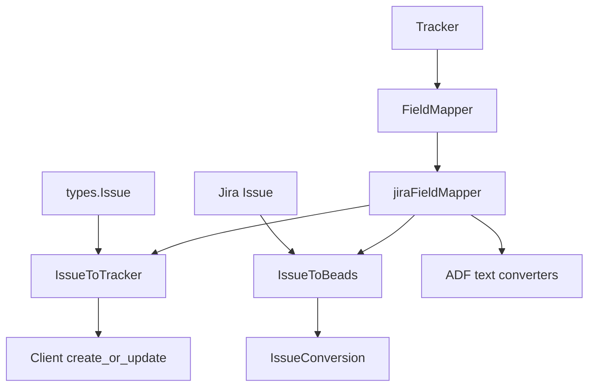

# jira_field_mapping 模块深度解析

`jira_field_mapping` 的核心价值，不是“把几个字段名改一改”这么简单。它解决的是**两个系统语义不对齐**的问题：beads 的内部 Issue 模型追求统一、稳定、可跨平台，而 Jira 的字段格式、状态机、描述格式（ADF vs plain text）和工作流能力都有自己的规则。这个模块像一个“同声传译层”——上游说 beads 语言，下游说 Jira 语言，它负责在不丢失关键信息的前提下做双向翻译，并把 Jira 的复杂性隔离在集成边界内。

## 架构角色与数据流



从架构上看，`jiraFieldMapper` 不是 orchestration 层，也不直接触网，它是一个**纯转换器（transformer）**，被 `internal.jira.tracker.Tracker` 作为 `tracker.FieldMapper` 接口实现来使用。`Tracker` 负责调用 Jira API、处理配置、执行状态迁移；`jiraFieldMapper` 负责把“值”和“结构”转换为双方能理解的格式。

关键路径可以分成两条。

第一条是**拉取（Jira → beads）**。`Tracker.FetchIssues` / `Tracker.FetchIssue` 拿到 `internal.jira.client.Issue` 后，会包装成 `tracker.TrackerIssue`（`Raw` 指向原始 Jira Issue），随后 `jiraFieldMapper.IssueToBeads` 从 `TrackerIssue.Raw` 中断言出 `*Issue` 并转换为 `*types.Issue`，最后以 `*tracker.IssueConversion` 返回给上游同步逻辑。这里的合同很关键：`IssueToBeads` 依赖 `Raw` 必须是 `*Issue`，否则直接返回 `nil`。

第二条是**推送（beads → Jira）**。`Tracker.CreateIssue` / `Tracker.UpdateIssue` 先调用 `mapper.IssueToTracker(*types.Issue)` 生成 Jira `fields map[string]interface{}`，再交给 `Client.CreateIssue` 或 `Client.UpdateIssue`。注意 `IssueToTracker` 不处理 status 迁移，这在 Jira 里是单独的 workflow transition API；`Tracker.UpdateIssue` 会在字段更新后通过 `applyTransition` 对比当前状态与目标状态，再决定是否调用 `GetIssueTransitions` + `TransitionIssue`。

这说明模块边界设计得很刻意：**字段映射与状态迁移分离**，避免把 Jira workflow 细节塞进 FieldMapper。

## 这个模块解决了什么问题（以及为什么朴素方案不够）

如果用朴素方案，最容易做成“硬编码 map + 直接 JSON 透传”：比如 `status == "Done"` 就映射成 `closed`，`description` 原样写回。问题是 Jira 现实世界没这么规整。

首先，状态名是**实例级可定制**的，团队可能叫 `Ready for QA`、`Verified`、`Won't Do`。所以代码里有 `statusMap map[string]string`（beads status → Jira status），并且在 `StatusToBeads` 里做反向匹配（遍历并 `strings.EqualFold`）。这使得基础默认映射可用，同时允许租户级覆盖。

其次，Jira API v2/v3 在描述字段上不兼容。v3 常用 ADF 文档结构，v2 接受 plain text。`IssueToTracker` 通过 `apiVersion` 分支决定是直接写字符串还是 `PlainTextToADF`，而拉取方向用 `DescriptionToPlainText` 尽力把 ADF 还原成文本。没有这层，描述会不是乱码就是丢失。

第三，Jira issue 的字段大量是可空指针（`Priority`/`Status`/`IssueType`/`Assignee` 等）。模块通过 `priorityName`、`statusName`、`typeName` 这些 helper 做安全读取，避免业务转换逻辑被 nil 判断淹没，也避免 panic。

## 心智模型：把它当“协议适配器 + 容错默认值引擎”

理解这个模块最好的方式，是把它想象成机场里的“国际转机柜台”：

- `types.Issue` 是你的出发地证件格式；
- Jira `Issue` / `fields` 是目的地国家证件格式；
- `jiraFieldMapper` 的职责不是决定你去哪里（那是 `Tracker`），而是确保你拿着正确格式的证件能过关。

它的抽象层次也很统一：

- 标量映射：`PriorityToBeads` / `PriorityToTracker`、`StatusToBeads` / `StatusToTracker`、`TypeToBeads` / `TypeToTracker`
- 聚合映射：`IssueToBeads`、`IssueToTracker`
- 安全提取与派生：`priorityName`、`statusName`、`typeName`、`extractBrowseURL`

其中一个设计意图是“**尽量有默认值，不把外部脏数据升级为系统错误**”。比如未知优先级默认 `Medium`（数值 2），未知状态默认 `types.StatusOpen`，未知类型默认 `types.TypeTask`。这偏向同步鲁棒性而非严格失败。

## 组件深潜

### `jiraFieldMapper`（struct）

`jiraFieldMapper` 只有两个状态：`apiVersion` 和 `statusMap`。这意味着它是一个轻量、无副作用、可反复创建的值对象。`Tracker.FieldMapper()` 每次返回 `&jiraFieldMapper{...}`，而不是在 `Tracker` 上缓存一个共享 mapper。这种做法简单、安全，避免并发修改风险，代价是极小对象重复分配（在这里可忽略）。

### `PriorityToBeads(trackerPriority interface{}) int`

这个函数做 Jira priority name 到 beads 数值优先级（0~4）的映射。输入是 `interface{}`，因为 `tracker.FieldMapper` 约束是跨平台统一接口，不强绑定 Jira 类型。实现里先做字符串断言，不匹配就走默认值 2。设计上这是在“类型安全”和“接口通用性”之间选择后者。

### `PriorityToTracker(beadsPriority int) interface{}`

反向映射到 Jira priority name。返回 `interface{}` 同样是接口统一要求，实际返回字符串。`default -> "Medium"` 保证异常输入不会产生空字段。

### `StatusToBeads(trackerState interface{}) types.Status`

这是最有业务味道的转换之一。它先查自定义 `statusMap`（反向匹配 Jira 名称），再走内置默认状态组：

- `"To Do" | "Open" | "Backlog" | "New"` → `types.StatusOpen`
- `"In Progress" | "In Review"` → `types.StatusInProgress`
- `"Blocked"` → `types.StatusBlocked`
- `"Done" | "Closed" | "Resolved"` → `types.StatusClosed`

反向匹配用了 `strings.EqualFold`，体现了“配置值大小写容错”。默认回退 `types.StatusOpen`，是一个偏保守选择：未知状态不会被当成关闭。

### `StatusToTracker(beadsStatus types.Status) interface{}`

先查 `statusMap[string(beadsStatus)]`，未命中再走默认 Jira 状态名。这个优先级确保配置覆盖权高于内置规则。注意它返回的是“状态名”，不是 transition ID；真正状态流转由 `Tracker.applyTransition` 根据可用 transitions 去匹配。

### `TypeToBeads` / `TypeToTracker`

这对函数在“语义精确度”上做了简化：`Feature` 统一映射到 Jira `Story`，未知类型回退 `Task`。这降低了复杂度，但会牺牲某些 Jira 自定义 issue type 的精度。

### `IssueToBeads(ti *tracker.TrackerIssue) *tracker.IssueConversion`

这是拉取路径上的聚合转换。

它首先要求 `ti.Raw` 必须是 `*Issue`。这是一条隐式契约：`Tracker` 在构造 `TrackerIssue` 时要把 Jira 原始对象放进 `Raw`。转换时提取 `Summary`、`Description`（经 `DescriptionToPlainText`）、priority/status/type、assignee display name、labels，并尝试从 `Self + Key` 组合出浏览器链接写入 `ExternalRef`。

返回 `*tracker.IssueConversion`，当前只填 `Issue`，不填 `Dependencies`。这也反映 Jira 集成当前聚焦于 issue 主体字段，不在 field mapper 层处理依赖关系。

### `IssueToTracker(issue *types.Issue) map[string]interface{}`

这是推送路径的字段构造器。返回值是 Jira REST API 预期的 `fields` payload（上层会再包一层 `{ "fields": ... }`）。

几个关键机制：

- 总是写 `summary`
- `description` 按 `apiVersion` 分支：v2 写 plain text，v3 写 `PlainTextToADF`
- `issuetype` 和 `priority` 写成 `{ "name": "..." }` 结构
- labels 非空才写

它刻意不写 project（由 `Tracker.CreateIssue` 注入 `{"key": t.projectKey}`），也不直接写 status（Jira 要 transition API）。这种职责拆分让 mapper 保持“字段转换纯度”。

### helper：`priorityName` / `statusName` / `typeName`

这三个函数本质是“空指针保险丝”。它们把可空对象访问收敛到一处，减少重复 nil 判断，提升主流程可读性。

### helper：`extractBrowseURL(ji *Issue) string`

Jira `Self` 是 REST API URL（如 `/rest/api/3/issue/10001`），但用户真正想点开的是 `/browse/PROJ-123`。这个函数通过截断 `/rest/api/` 前缀来构造人类可读链接。

要注意它是字符串规则匹配，不做 URL 解析；当 `Self` 不是标准结构时会返回空串。这是一种简单且够用的实现。

## 依赖关系与契约分析

从调用关系看，`jira_field_mapping` 的上游主要是 [jira_tracker_adapter](jira_tracker_adapter.md)（`Tracker.FieldMapper()` 返回本模块实现并调用其 `IssueToBeads` / `IssueToTracker` 及标量映射）。它对外实现的是 [tracker_plugin_contracts](tracker_plugin_contracts.md) 中的 `tracker.FieldMapper` 接口合同。

下游依赖主要有两块。

第一块是领域类型：`types.Issue`、`types.Status`、`types.IssueType`，这些来自核心领域模型（可参考 [issue_domain_model](issue_domain_model.md)）。这意味着 mapper 对 beads 领域枚举语义有硬依赖：如果 `types.Status` 的合法值体系变化，`statusMap` key 与默认 switch 都要同步。

第二块是 Jira API 类型与转换工具：`Issue`（`internal.jira.client.Issue`）以及 `DescriptionToPlainText` / `PlainTextToADF`（定义在 Jira client 代码中，可参考 [jira_client_api](jira_client_api.md)）。这带来一个现实耦合：field mapper 并不完全“独立于 client 层”，它复用了 client 中对 ADF 的处理函数。

数据合同里有几条值得显式记住：

- `TrackerIssue.Raw` in Jira path 必须是 `*Issue`，否则 `IssueToBeads` 返回 `nil`
- `statusMap` 的键是 beads status 字符串，值是 Jira 状态名
- `IssueToTracker` 返回的是 Jira `fields` 子对象，不是完整请求体
- 状态同步是“字段更新 + transition”两阶段，不可只依赖 `IssueToTracker`

## 设计决策与权衡

这个模块选择了“**简单默认 + 可配置覆盖**”的策略，而不是做一个重型 schema 配置系统。好处是即插即用，坏处是灵活性有限（例如 issue type 没有自定义 map，priority 也没有租户化映射）。

在正确性与可用性之间，它明显偏向**同步连续性**：遇到未知值尽量降级到默认而不是报错中断。这对长期同步任务很友好，但也可能掩盖配置错误。你会得到“能跑”的结果，但不一定“精确语义对齐”。

在耦合与复用之间，它让 mapper 直接调用 `DescriptionToPlainText`/`PlainTextToADF`，避免重复实现 ADF 解析；代价是 mapper 与 Jira client 包内工具函数耦合更紧。如果将来想把 mapper 抽到独立包，需要重构这部分依赖。

最后，状态映射上用“名称匹配”而非“ID 匹配”。这让配置更易读、跨实例迁移更方便，但名称改动（重命名状态）会立即影响映射稳定性。

## 使用方式与示例

典型使用不是直接 new mapper，而是通过 `Tracker` 获取：

```go
mapper := t.FieldMapper() // tracker.FieldMapper

fields := mapper.IssueToTracker(issue)
fields["project"] = map[string]string{"key": t.projectKey}
created, err := t.client.CreateIssue(ctx, fields)
```

拉取方向：

```go
ti := jiraToTrackerIssue(ji)       // ti.Raw == *jira.Issue
conv := mapper.IssueToBeads(&ti)   // *tracker.IssueConversion
if conv != nil {
    // conv.Issue 可进入 beads 存储/同步链路
}
```

配置自定义状态映射（由 `Tracker.Init` 从 `jira.status_map.*` 读取）：

```toml
jira.status_map.open = "Selected for Development"
jira.status_map.in_progress = "In Dev"
jira.status_map.closed = "Done"
```

## 新贡献者最该注意的坑

第一，`IssueToBeads` 返回 `nil` 并不总是错误，很多时候是 `Raw` 类型不符导致的“静默跳过”。如果你在上游看到 issue 丢失，先检查 `TrackerIssue.Raw` 的实际类型。

第二，`statusMap` 的反向匹配是遍历 map 值做 `EqualFold`，如果你把多个 beads 状态都映射到同一个 Jira 名称，会出现歧义，实际命中哪个取决于 map 迭代顺序（Go map 无序）。这在当前实现里是一个潜在非确定性点。

第三，`extractBrowseURL` 依赖 `Self` 包含 `/rest/api/`。某些代理/网关返回的 URL 结构不一致时，`ExternalRef` 会被设置为空字符串指针（因为当前逻辑只检查 `ji.Self != ""` 后就赋值）。如果你依赖 `ExternalRef` 非空可点击，建议在上游做额外校验。

第四，`TypeToTracker(types.TypeFeature) -> "Story"` 是策略选择，不是 Jira 真理。若团队 heavily 使用 `Feature` 作为独立 issue type，这里会造成语义压缩。

第五，`PlainTextToADF`/`DescriptionToPlainText` 是“足够实用”的转换，不是完整 ADF round-trip。富文本结构（复杂节点、样式、嵌套）可能在往返时丢失细节。

## 参考阅读

- [jira_tracker_adapter](jira_tracker_adapter.md)
- [jira_client_api](jira_client_api.md)
- [tracker_plugin_contracts](tracker_plugin_contracts.md)
- [sync_data_models_and_options](sync_data_models_and_options.md)
- [issue_domain_model](issue_domain_model.md)
