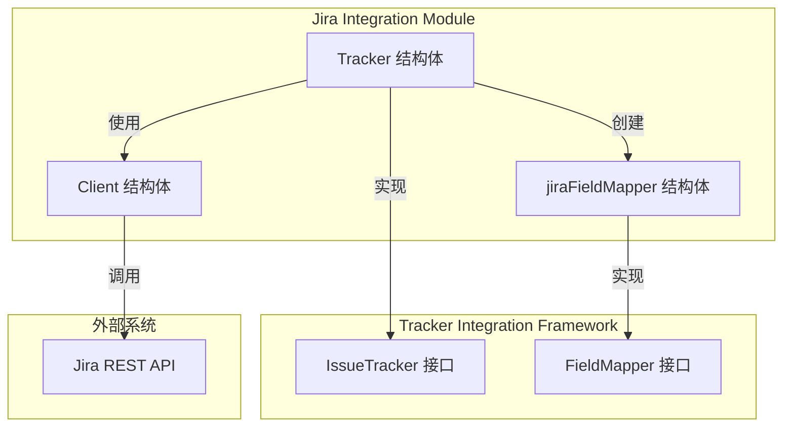

# Jira Tracker 模块深度解析

## 概览

Jira Tracker 模块是 Beads 系统与外部 Jira 项目管理平台进行双向同步的桥梁。它实现了通用的 [IssueTracker](tracker_integration_framework.md) 接口，封装了 Jira API 的复杂性，将 Jira 特定的数据结构和工作流转换为 Beads 内部的统一模型。

## 解决的问题

在没有这个模块的情况下，要让 Beads 与 Jira 集成会面临几个挑战：

1. **API 版本差异**：Jira 有多个 API 版本（主要是 v2 和 v3），特别是在描述格式（JSON 与 ADF）上有显著差异
2. **工作流差异**：Jira 的状态转换是基于工作流配置的，不能直接设置状态，需要先找到可用的过渡
3. **配置多样性**：每个 Jira 实例都可能有自定义的状态名称、优先级和问题类型
4. **双向同步**：需要同时处理从 Jira 拉取数据和推送数据到 Jira

设计思路是将 Jira 特有的复杂性隔离在这个模块内，通过 [FieldMapper](tracker_integration_framework.md) 接口进行数据转换，通过 `IssueTracker` 接口提供统一的操作入口。

## 架构与核心抽象



### 核心组件角色

1. **Tracker**：
   - 主要职责：实现 `IssueTracker` 接口，编排 Jira 同步操作
   - 类比：就像一个翻译官，既懂 Beads 的语言，也懂 Jira 的语言

2. **jiraFieldMapper**：
   - 主要职责：处理字段级别的数据转换
   - 类比：字典，定义了 Beads 概念与 Jira 概念之间的映射关系

3. **Client**：
   - 主要职责：封装与 Jira REST API 的直接通信
   - 类比：邮递员，负责实际的请求发送和响应接收

## 核心数据流程

### 1. 初始化流程

当系统启动时，`Tracker` 的初始化过程如下：

```
Init() → 读取配置（存储或环境变量）→ 创建 Client → 加载状态映射 → 准备就绪
```

关键点：
- 配置优先从存储读取，其次从环境变量
- 默认使用 API v3，但支持 v2
- 状态映射支持任意自定义的 Beads 状态名称

### 2. 拉取问题流程

当执行 `FetchIssues()` 时：

1. 根据 `FetchOptions` 构建 JQL 查询
2. 调用 Jira API 搜索问题
3. 对每个结果调用 `jiraToTrackerIssue()` 进行转换
4. 返回统一的 `TrackerIssue` 列表

### 3. 更新问题流程

当执行 `UpdateIssue()` 时：

1. 使用 `FieldMapper` 将 Beads 问题转换为 Jira 字段
2. 调用 API 更新问题基本信息
3. **关键步骤**：获取当前状态，检查是否需要状态转换
4. 如果需要，找到匹配的过渡并应用
5. 重新获取问题以反映最新状态

## 核心组件深度解析

### Tracker 结构体

```go
type Tracker struct {
    client     *Client
    store      storage.Storage
    jiraURL    string
    projectKey string
    apiVersion string
    statusMap  map[string]string
}
```

**设计意图**：
- `client` 负责实际的 API 调用
- `store` 用于读取配置
- `statusMap` 允许用户自定义 Beads 状态到 Jira 状态的映射，而不依赖硬编码

**关键方法分析**：

#### `Init()` - 初始化与配置

这个方法是一个很好的配置加载模式示例：
1. 先尝试从存储读取配置
2. 如果没有，回退到环境变量
3. 对必填项进行验证
4. 加载可选的状态映射配置

状态映射的加载特别值得注意：
```go
if allConfig, err := t.store.GetAllConfig(ctx); err == nil {
    const prefix = "jira.status_map."
    statusMap := make(map[string]string)
    for key, val := range allConfig {
        if strings.HasPrefix(key, prefix) && val != "" {
            statusMap[strings.TrimPrefix(key, prefix)] = val
        }
    }
    // ...
}
```

这种设计允许用户配置任意的状态映射，而不需要提前知道所有可能的 Beads 状态名称。

#### `UpdateIssue()` - 智能状态转换

这个方法展示了对 Jira 工作流机制的深刻理解：

```go
// 先更新基本字段
if err := t.client.UpdateIssue(ctx, externalID, fields); err != nil {
    return nil, err
}

// 获取当前状态进行比较
current, err := t.client.GetIssue(ctx, externalID)
// ...

// 只有在状态真正不同时才尝试转换
if !strings.EqualFold(currentName, desiredName) {
    if err := t.applyTransition(ctx, externalID, issue.Status); err != nil {
        return nil, err
    }
    // 重新获取以反映转换后的状态
    current, err = t.client.GetIssue(ctx, externalID)
    // ...
}
```

**设计权衡**：
- 先更新基本字段，再处理状态：这样即使状态转换失败，基本更新也已生效
- 重新获取问题：确保返回的是准确的最新状态，即使转换过程中有其他变化
- 使用 `strings.EqualFold`：对状态名称进行大小写不敏感的比较，提高健壮性

#### `applyTransition()` - 工作流过渡

这个方法封装了 Jira 状态转换的复杂性：

```go
func (t *Tracker) applyTransition(ctx context.Context, key string, status types.Status) error {
    // 获取可用过渡
    transitions, err := t.client.GetIssueTransitions(ctx, key)
    // ...
    
    // 查找匹配的过渡
    for _, tr := range transitions {
        if strings.EqualFold(tr.To.Name, desiredName) {
            return t.client.TransitionIssue(ctx, key, tr.ID)
        }
    }
    
    // 如果找不到，记录日志但不报错
    debug.Logf("jira: no available transition to %q for %s (%d transitions checked)\n", desiredName, key, len(transitions))
    return nil
}
```

**设计权衡**：
- 找不到过渡时不报错：这是一个重要的容错设计。Jira 工作流可能不允许某些状态转换，或者问题已经在目标状态。这种情况下，静默失败并记录日志比中断整个同步过程更合理。

### `jiraToTrackerIssue()` - 数据转换

这个函数将 Jira 特定的问题结构转换为通用的 `TrackerIssue`：

**关键点**：
1. **描述转换**：Jira API v3 使用 ADF（Atlassian Document Format），需要转换为纯文本
2. **优先级映射**：将 Jira 的文本优先级（"Highest"、"High" 等）映射为 Beads 的数值优先级（0-4）
3. **元数据存储**：在 `Metadata` 字段中保留 Jira 特定信息，便于调试和扩展

## 依赖分析

### 上游依赖（调用者）

- **Tracker Integration Framework**：通过 `IssueTracker` 接口调用
  - `tracker.Register()`：在初始化时注册自己
  - `tracker.Engine`：可能是实际使用这个 tracker 的主要组件

### 下游依赖（被调用）

- **[Jira Client](jira_tracker.md)**：封装 Jira REST API 调用
- **[jiraFieldMapper](jira_tracker.md)**：处理字段级转换
- **[Storage](storage_interfaces.md)**：读取配置
- **[Types](core_domain_types.md)**：使用核心域类型

## 设计权衡与决策

### 1. 状态映射的灵活性 vs 简单性

**决策**：使用可配置的 `statusMap`，支持任意自定义状态

**原因**：
- Jira 实例通常有自定义的工作流和状态名称
- 硬编码映射会限制适用性
- 用户可能有自己的 Beads 状态定义

**权衡**：
- 优点：极大的灵活性
- 缺点：配置变得更复杂，用户需要了解两个系统的状态

### 2. 状态转换失败的处理

**决策**：找不到匹配过渡时静默失败，只记录日志

**原因**：
- Jira 工作流可能阻止某些转换
- 问题可能已经在目标状态
- 中断整个同步过程比保留部分更新更糟糕

**权衡**：
- 优点：提高了同步的健壮性
- 缺点：状态可能不会按预期改变，需要检查日志

### 3. API 版本支持

**决策**：同时支持 v2 和 v3，默认使用 v3

**原因**：
- 不同的 Jira 实例可能使用不同版本
- v3 是新版本，但 v2 仍然广泛使用
- 主要区别在描述格式（ADF vs JSON）

**权衡**：
- 优点：更广泛的兼容性
- 缺点：需要维护两套逻辑，增加复杂度

### 4. 更新后重新获取问题

**决策**：在更新（特别是状态转换）后重新获取问题

**原因**：
- Jira 可能有自动字段更新、工作流规则等
- 状态转换可能触发其他变化
- 确保返回给调用者的数据是准确的

**权衡**：
- 优点：数据一致性
- 缺点：额外的 API 调用，增加延迟和速率限制压力

## 使用指南与示例

### 配置

Jira Tracker 需要以下配置：

**必填**：
- `jira.url` 或 `JIRA_URL`：Jira 实例 URL
- `jira.project` 或 `JIRA_PROJECT`：项目 Key
- `jira.api_token` 或 `JIRA_API_TOKEN`：API 令牌

**可选**：
- `jira.username` 或 `JIRA_USERNAME`：用户名（对于 Server 版本可能需要）
- `jira.api_version` 或 `JIRA_API_VERSION`：API 版本（"2" 或 "3"，默认 "3"）
- `jira.status_map.*`：状态映射，例如 `jira.status_map.todo = "To Do"`

### 状态映射示例

假设你的 Jira 项目有以下状态："To Do"、"In Progress"、"Code Review"、"Done"

你可以这样配置：

```
jira.status_map.backlog = "To Do"
jira.status_map.in_progress = "In Progress"
jira.status_map.review = "Code Review"
jira.status_map.done = "Done"
```

## 注意事项与陷阱

### 1. 状态转换的限制

**问题**：Jira 的工作流可能不允许直接从任意状态转换到另一状态

**解决**：确保 Beads 中的状态转换路径与 Jira 工作流兼容，或者准备接受某些状态变更可能不会反映在 Jira 中

### 2. API 速率限制

**问题**：Jira API 有速率限制，频繁调用可能被阻止

**注意**：
- `UpdateIssue()` 方法可能会进行多次 API 调用（更新、获取当前状态、转换、重新获取）
- 批量操作时要考虑速率限制

### 3. ADF 描述转换的限制

**问题**：从 ADF 转换为纯文本会丢失格式信息

**注意**：目前的实现是单向的（只在拉取时转换），推送时不会将 Markdown 转换回 ADF

### 4. 自定义字段

**问题**：当前实现不支持自定义字段的同步

**注意**：如果需要同步自定义字段，需要扩展 `jiraFieldMapper` 和相关方法

## 扩展点

1. **自定义字段支持**：可以扩展 `jiraFieldMapper` 来处理自定义字段
2. **更丰富的描述转换**：可以实现双向的 ADF ↔ Markdown 转换
3. **Webhook 支持**：可以添加接收 Jira Webhook 的能力，实现更实时的同步
4. **更多实体同步**：当前主要同步问题，可以扩展到史诗、版本等

## 参考资料

- [Tracker Integration Framework](tracker_integration_framework.md) - 了解通用的 tracker 接口设计
- [Jira Client](jira_tracker.md) - 了解底层 API 封装
- [Core Domain Types](core_domain_types.md) - 了解 Beads 内部的问题模型
