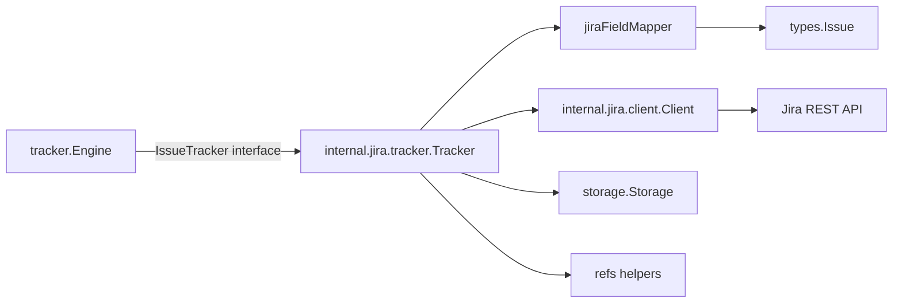

# jira_tracker_adapter 深度解析

`jira_tracker_adapter`（核心实现是 `internal.jira.tracker.Tracker`）本质上是一个“协议翻译网关”：它把 Beads 内部的 `types.Issue`/`tracker.TrackerIssue` 语义，转换成 Jira REST API 能接受和返回的形态，并把 Jira 的工作流约束（尤其是状态流转）封装起来。没有这一层，调用方就得直接处理 JQL、ADF 描述格式、transition API、URL/key 解析等 Jira 细节，最终会把同步引擎和业务逻辑污染成“半个 Jira SDK”。这个模块存在的价值，就是把这些不稳定、厂商特定的细节隔离在一个可替换适配器中。

## 架构角色与数据流



从架构位置看，`Tracker` 不是编排器（那是 `tracker.Engine`），也不是纯 HTTP 客户端（那是 `Client`），它是“**适配层+策略层**”：

第一，它实现 [`IssueTracker`](tracker_plugin_contracts.md) 合约，向同步框架暴露统一能力：`FetchIssues`、`CreateIssue`、`UpdateIssue`、`BuildExternalRef` 等。`Engine.doPull`/`Engine.doPush` 在热路径里频繁调用这些接口，因此 `Tracker` 是外部系统集成路径上的关键节点。

第二，它组合 `jiraFieldMapper` 与 `Client`。`Client` 负责“怎么请求 Jira”，`FieldMapper` 负责“字段语义怎么双向映射”，`Tracker` 负责“什么时候调用谁、按什么顺序调用”。例如更新 issue 时，`Tracker.UpdateIssue` 先走 `Client.UpdateIssue` 更新字段，再用 `GetIssueTransitions`/`TransitionIssue` 处理状态机流转，这个顺序体现了 Jira 的真实约束：状态不是普通字段，必须走 workflow transition。

第三，它通过 `storage.Storage` 读取配置（`jira.url`、`jira.project`、`jira.api_token`、`jira.status_map.*` 等），并在 `getConfig` 中提供 env fallback。这样同步框架可以不关心配置来源。

## 这个模块解决了什么问题（以及朴素方案为何不够）

朴素方案通常是：在同步引擎里直接写 Jira API 调用，把 `types.Issue` 字段拼成 JSON 发出去。这在 Jira 上会很快失效，原因有三点。

其一，Jira API v2/v3 在描述字段上有结构差异。v3 期望 ADF，v2 接受纯文本。`jiraFieldMapper.IssueToTracker` 里通过 `apiVersion` 分支决定是 `PlainTextToADF` 还是直接字符串，这种分叉如果散落在调用方会非常脆弱。

其二，状态更新不是“PUT 一个 status 字段”能完成。Jira 要求通过 transition endpoint 走工作流。`Tracker.UpdateIssue` 的“更新字段 -> 拉当前状态 -> 必要时 `applyTransition` -> 再拉一次确认状态”是典型的 Jira-aware 流程。

其三，团队常有自定义状态命名。`Init` 会扫描 `jira.status_map.*` 形成 `statusMap`，`jiraFieldMapper.StatusToBeads/StatusToTracker` 会优先使用这张映射表，再回退默认值。没有这层，跨项目同步时状态语义会频繁错位。

## 心智模型：把它当作“海关 + 汇率兑换处”

可以把 `Tracker` 想成口岸海关：

- `Client` 像运输系统，负责把包裹送到 Jira API；
- `FieldMapper` 像汇率系统，把本地“货币”（Beads 字段语义）兑换成 Jira 的“货币”；
- `Tracker` 像海关官员，决定先验关单（字段更新），再走特殊通道（状态 transition），最后回执入境结果（`TrackerIssue`）。

这个模型有助于理解为什么它不是一个“胖 SDK 包装器”，而是“语义边界层”。

## 关键组件深挖

### `Tracker` 结构体与注册机制

`init()` 中调用 `tracker.Register("jira", ...)`，把工厂注册到全局 registry。这意味着上层通过 `tracker.NewTracker("jira")` 就能延迟创建实例，而不需要硬编码 Jira 依赖。它的代价是插件名字符串成为隐式契约，改名会影响运行时发现。

`Tracker` 自身保存 `client`、`store`、`jiraURL`、`projectKey`、`apiVersion`、`statusMap`。这是一种轻量有状态适配器设计：初始化一次，后续调用复用配置和 client。

### `Init(ctx, store)`：配置收敛点

`Init` 做了三类事：

1. 读取必需配置：`jira.url`、`jira.project`、`jira.api_token`，缺失直接失败；
2. 读取可选配置：`jira.username`、`jira.api_version`（默认 `"3"`）；
3. 从 `GetAllConfig` 读取任意 `jira.status_map.*`。

这里的设计意图是“强约束核心、弱约束扩展”：关键连接参数必须显式正确，而状态映射允许项目自由扩展。注意 `getConfig` 的签名返回 `(string, error)`，但当前实现几乎总返回 `"", nil`（即未区分“没配”与“读取失败”），这是简单性优先的选择，代价是诊断精度较低。

### `FetchIssues` / `FetchIssue`：拉取路径

`FetchIssues` 组装 JQL：固定 `project = <projectKey>`，按 `opts.State` 追加 `statusCategory` 过滤，按 `opts.Since` 做增量条件 `updated >=`，最后 `ORDER BY updated DESC`。然后调用 `Client.SearchIssues`，并把每个 `Issue` 转成 `tracker.TrackerIssue`（`jiraToTrackerIssue`）。

要注意：`FetchOptions.Limit` 在当前实现中未使用；真正分页由 `Client.SearchIssues` 内部循环完成。这意味着“拉全量再由上游筛”偏向正确性和一致性，但在超大项目下会增加 API 与内存压力。

`FetchIssue` 则是单条读取，返回 `nil, nil` 表示外部不存在，符合 [`IssueTracker`](tracker_plugin_contracts.md) 契约。

### `CreateIssue`：创建路径

`CreateIssue` 先调用 `FieldMapper().IssueToTracker(issue)` 生成 Jira `fields`，再强制写入 `project`，最后 `Client.CreateIssue`。这种“mapper 负责通用字段、adapter 负责上下文强制字段（project）”的分工很清晰：避免 mapper 依赖运行时项目配置。

### `UpdateIssue` + `applyTransition`：最重要的非显式逻辑

这是整个模块最关键的设计点。流程是：

- `IssueToTracker` 生成字段并 `Client.UpdateIssue`；
- `GetIssue` 获取当前状态名；
- 用 `StatusToTracker(issue.Status)` 得到期望状态名；
- 若不同，调用 `applyTransition`：拉取可用 transitions，按 `tr.To.Name` 不区分大小写匹配，命中后 `TransitionIssue`；
- 再次 `GetIssue` 返回最终状态。

这段代码体现的取舍是“**优先兼容 Jira 工作流正确性，接受额外一次/两次 API round-trip**”。如果不这么做，同步会经常出现“字段更新成功但状态没变”。

`applyTransition` 找不到可用路径时不会报错，只记录 `debug.Logf` 并返回 nil。这样做降低了同步中断概率，适合多项目异构 workflow；代价是状态漂移可能被静默吞掉，需要靠日志和监控发现。

### `FieldMapper()` / `jiraFieldMapper`

`FieldMapper()` 每次返回新的 `jiraFieldMapper{apiVersion, statusMap}`。这是无共享可变状态的简单设计，线程安全成本低。

在 `fieldmapper.go` 中最值得关注的是：

- `StatusToBeads` 先按 `statusMap` 反查，再走默认状态集合；
- `StatusToTracker` 先查 `statusMap`，再回退 `To Do / In Progress / Blocked / Done`；
- `IssueToTracker` 在 v3 走 `PlainTextToADF`，v2 用 plain string；
- `IssueToBeads` 使用 `DescriptionToPlainText`，并把 `Self` 转成可读 browse URL（`extractBrowseURL`）。

这让 mapper 成为“语义稳定器”：外部状态名字变化时，只要配置映射，不必改同步引擎。

### `jiraToTrackerIssue` 与辅助函数

`jiraToTrackerIssue` 将 Jira 原始对象归一化到 `tracker.TrackerIssue`：填充标题、标签、优先级、状态、类型、负责人、时间戳和 metadata，并保留 `Raw` 供 mapper 深度转换。

`ParseTimestamp` 支持多种 Jira 时间格式；解析失败时字段保持零值而不终止整体转换，这是一种容错策略。`projectKeyFromIssue` 先读 `Fields.Project.Key`，再从 `KEY-123` 回退切割。

### 引用处理：`IsExternalRef` / `ExtractIdentifier` / `BuildExternalRef`

这三者定义了本地 `external_ref` 与 Jira 的绑定约定：

- `BuildExternalRef` 统一生成 `${jiraURL}/browse/${Identifier}`；
- `IsExternalRef` 判断 URL 是否含 `/browse/` 且（可选）前缀匹配实例地址；
- `ExtractIdentifier` 从 `/browse/` 后截取 key。

这套契约直接被 `Engine.doPush` / `DetectConflicts` 使用，是跨模块关键耦合点。

## 依赖分析与调用关系

从“被谁调用”看，Jira 适配器通过 `tracker.Register` 进入插件生态，被 [`sync_orchestration_engine`](sync_orchestration_engine.md) 的 `Engine` 以 `IssueTracker` 接口调用。热路径包括：

- Pull：`Engine.doPull -> Tracker.FetchIssues -> Client.SearchIssues`；
- Push 创建：`Engine.doPush -> Tracker.CreateIssue -> Client.CreateIssue`；
- Push 更新：`Engine.doPush -> Tracker.UpdateIssue -> Client.UpdateIssue/GetIssue/GetIssueTransitions/TransitionIssue`；
- 冲突检测：`Engine.DetectConflicts -> Tracker.IsExternalRef/ExtractIdentifier/FetchIssue`。

从“它调用谁”看：

- 调 [`jira_client_api`](jira_client_api.md) 中的 `Client`，负责 HTTP、认证、分页、transition API；
- 调 `storage.Storage` 读配置（而不是写业务数据）；
- 调 `jiraFieldMapper` 做字段语义转换；
- 调 `refs` 辅助函数处理外部引用。

核心数据契约是 [`sync_data_models_and_options`](sync_data_models_and_options.md) 里的 `tracker.TrackerIssue` 与 `FetchOptions`。只要这个中间模型稳定，`Engine` 与 Jira 细节就可以解耦。

## 设计决策与权衡

当前实现明显偏向“简单可维护 + Jira 语义正确”而非“最少 API 调用”。例如更新时的多次 GET、transition 失败不 hard fail、`FieldMapper` 即时创建新实例，都是为了降低共享状态复杂度和跨项目配置风险。

同时它也接受了一些刚性耦合：`BuildExternalRef` 固定 `/browse/` 形态、`FetchIssues` 固定 project 维度、`ExtractJiraKey` 仅做字符串截断。这些让主流程非常直白，但在 URL 变体或非标准部署下可扩展性有限。

## 新贡献者的实战建议与坑点

最容易踩坑的是“把状态当普通字段更新”。在 Jira 中状态必须走 `GetIssueTransitions` + `TransitionIssue`，并且 transition 是 workflow 依赖的，可能并不存在。

第二个坑是 API 版本差异。改描述相关逻辑时务必验证 `apiVersion == "2"` 与默认/v3 两条路径；测试里已有 `TestFieldMapperDescriptionV2UsesPlainString` 和 `...V3UsesADF` 可作为回归锚点。

第三个坑是 `external_ref` 解析较宽松。`IsJiraExternalRef` 只要求含 `/browse/`，在未配置 `jiraURL` 时会有误判可能；`ExtractJiraKey` 也不会截断尾部 path/query。涉及冲突检测、反向查找时要谨慎。

第四个坑是 `FetchOptions.Limit` 当前未被 `FetchIssues` 使用。如果你在大规模项目上做性能优化，这里是优先改造点之一。

## 使用示例

```go
ctx := context.Background()
tr, err := tracker.NewTracker("jira")
if err != nil { panic(err) }

if err := tr.Init(ctx, store); err != nil { panic(err) }
if err := tr.Validate(); err != nil { panic(err) }

issues, err := tr.FetchIssues(ctx, tracker.FetchOptions{State: "open"})
if err != nil { panic(err) }
_ = issues
```

配置示例（存储配置键或环境变量二选一/混用）：

```ini
jira.url=https://company.atlassian.net
jira.project=PROJ
jira.api_token=xxxx
jira.username=alice@example.com
jira.api_version=3
jira.status_map.open=Backlog
jira.status_map.in_progress=Active Sprint
jira.status_map.closed=Released
```

## 参考阅读

如果你想继续深入，不要在这里重复阅读框架细节，建议直接看：[`tracker_plugin_contracts`](tracker_plugin_contracts.md)、[`sync_orchestration_engine`](sync_orchestration_engine.md)、[`sync_data_models_and_options`](sync_data_models_and_options.md)、[`jira_client_api`](jira_client_api.md)。