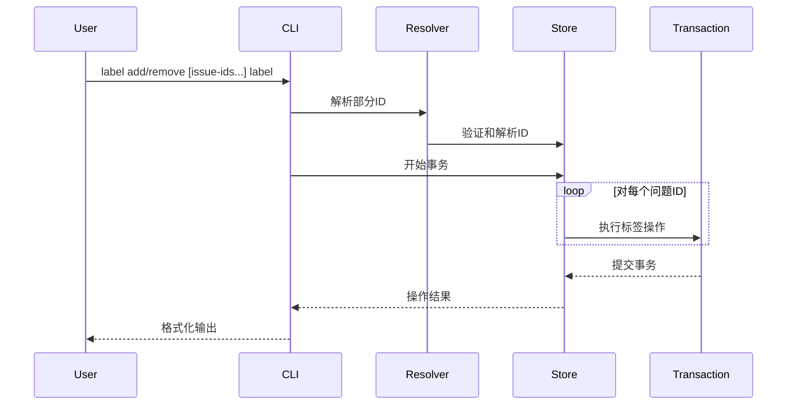
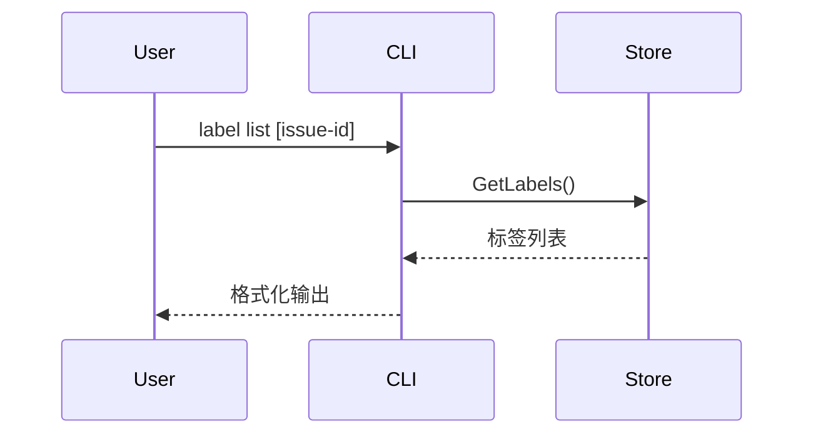
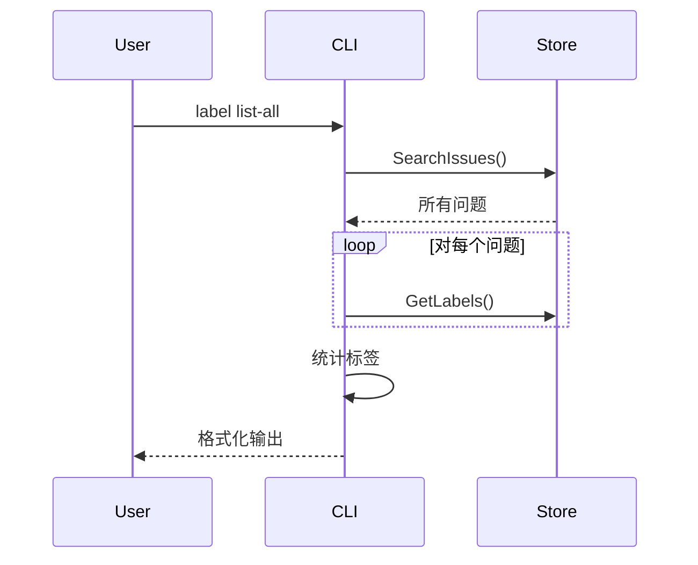

# label_management 模块深度技术文档

## 1. 模块概述

`label_management` 模块是 Beads CLI 中负责管理问题标签的核心命令集，它提供了标签的添加、移除、查询和统计功能。这个模块看似简单，但实际上承载着重要的设计权衡和架构考量。

## 2. 问题空间与设计意图

### 2.1 问题空间

在项目管理中，标签是一种轻量级的分类机制。但在实际应用中，标签管理面临以下挑战：

- **原子性保证**：当对多个问题批量添加或移除标签时，如何确保操作的原子性——要么全部成功，要么全部回滚
- **命名空间保护**：某些特殊标签（如 `provides:`）具有特定语义，需要保护不被随意修改
- **部分ID解析**：用户通常只记得问题ID的前缀，需要系统能智能解析
- **输出格式一致性**：需要同时支持人类可读输出和机器可读的JSON格式

### 2.2 设计意图

该模块的核心设计意图是：
- **事务优先**：所有批量操作都包裹在单个事务中执行
- **安全优先**：保护保留标签命名空间
- **用户友好**：支持部分ID解析，提供清晰的反馈
- **API一致性**：统一的输出格式处理

### 2.3 心智模型（Mental Model）

理解这个模块的关键是建立以下心智模型：

**标签是一种轻量级的、可组合的问题属性**，而不是问题的核心属性。可以把标签想象成便利贴——你可以在多个物品上贴同一张便利贴，也可以随时撕下或更换。

**类比**：这个模块就像一个图书管理员，负责：
- 在书脊上贴标签（`label add`）
- 从书脊上移除标签（`label remove`）
- 查看某本书的所有标签（`label list`）
- 统计图书馆中所有标签的使用情况（`label list-all`）

重要的是，管理员在批量处理标签时会确保要么全部完成，要么一本都不处理（事务性），并且某些特殊标签（如"珍本"）只能由特定流程添加。

## 3. 核心组件解析

### 3.1 核心数据结构

#### 内部 `labelInfo` 结构体：
```go
type labelInfo struct {
    Label string `json:"label"`
    Count int    `json:"count"`
}
```

这个简单的结构体用于 `list-all` 命令的JSON输出，包含标签名称和使用次数。

#### 系统级 `Label` 类型：
```go
type Label struct {
    IssueID string `json:"issue_id"`
    Label   string `json:"label"`
}
```

这是内部存储层使用的完整标签类型，包含问题ID和标签值的关联关系。

### 3.2 关键函数

#### `processBatchLabelOperation`

这是模块的核心函数，它封装了批量标签操作的通用逻辑：

**设计亮点**：
- **事务包装器模式**：通过函数参数 `txFunc` 注入具体的标签操作（添加/移除）
- **统一错误处理**：集中处理事务提交和回滚
- **双输出格式支持**：同时处理JSON和人类可读输出

**参数**：
- `issueIDs []string`：要操作的问题ID列表
- `label string`：要操作的标签
- `operation string`：操作类型（"added"或"removed"）
- `jsonOut bool`：是否输出JSON格式
- `txFunc`：事务内执行的具体标签操作函数

#### `parseLabelArgs`

一个简单但关键的参数解析函数，它假设最后一个参数是标签，前面的都是问题ID。

**设计权衡**：
- 这种设计简化了命令行使用，但要求标签不能包含空格
- 符合Unix命令行的常见惯例

### 3.3 命令组件

#### `labelAddCmd` 和 `labelRemoveCmd`

这两个命令高度相似（代码中有 `//nolint:dupl` 注释表明它们是故意重复的。

**设计决策**：
- 虽然代码相似，但作为独立的命令提供了清晰的用户体验
- 保留了未来扩展的可能性（如添加命令可能需要额外验证）

**关键特性**：
- 部分ID解析
- 保留标签命名空间保护（仅 `labelAddCmd`）
- 只读模式检查

#### `labelListCmd`

列出单个问题的标签。

**设计特点**：
- 直接使用 `store.GetLabels` 而不是事务
- 确保即使空标签也输出空数组而不是nil

#### `labelListAllCmd`

列出数据库中所有唯一标签及其使用次数。

**性能考量**：
- 当前实现是通过 `SearchIssues` 获取所有问题，然后逐个获取标签
- 对于大型数据库，这可能是性能瓶颈，但对于当前使用场景是可接受的

## 4. 数据流程

### 4.1 批量标签操作流程



### 4.2 标签列表查询流程



### 4.3 所有标签统计流程



## 5. 设计权衡与决策

### 5.1 事务 vs 非事务操作

**选择**：批量操作使用事务，单个查询操作不使用

**理由**：
- 批量操作需要原子性保证
- 单个操作本身就是原子的
- 避免不必要的事务开销

### 5.2 保留标签命名空间保护

**选择**：`provides:` 标签只能通过 `bd ship` 命令添加

**理由**：
- 这些标签具有跨项目能力的语义
- 需要特殊的创建逻辑
- 防止用户误操作破坏系统语义

### 5.3 部分ID解析

**选择**：所有命令都支持部分ID解析

**理由**：
- 用户友好性
- 符合CLI工具的常见做法
- 提供更好的用户体验

### 5.4 重复代码 vs 抽象

**选择**：`labelAddCmd` 和 `labelRemoveCmd` 保留重复代码

**理由**：
- 代码结构相似但语义不同
- 保留未来独立扩展的可能性
- 避免过度抽象导致的复杂性

## 6. 使用示例

### 6.1 添加标签

```bash
# 给单个问题添加标签
bd label add issue-123 bug

# 给多个问题添加标签
bd label add issue-123 issue-456 enhancement

# 使用部分ID
bd label add 123 456 feature
```

### 6.2 移除标签

```bash
# 移除标签
bd label remove issue-123 bug
```

### 6.3 列出标签

```bash
# 列出问题的标签
bd label list issue-123

# JSON输出
bd label list issue-123 --json
```

### 6.4 列出所有标签

```bash
# 列出所有标签
bd label list-all

# JSON输出
bd label list-all --json
```

## 7. 边界情况与注意事项

### 7.1 边界情况

1. **空标签**：系统会拒绝空标签
2. **保留标签**：`provides:` 标签只能通过 `bd ship` 命令添加
3. **部分ID解析失败**：如果部分ID不唯一或不存在时会跳过
4. **空标签列表**：输出空数组而不是nil
5. **只读模式**：在只读模式下会拒绝修改操作

### 7.2 注意事项

1. **性能考量**：`label list-all` 命令在大型数据库中可能较慢，因为它需要获取所有问题和标签
2. **标签命名**：标签不能包含空格
3. **事务失败**：如果任何一个操作失败，整个批量操作会回滚
4. **JSON输出**：JSON输出格式统一，便于脚本使用

## 8. 依赖关系

### 8.1 依赖模块

#### [Storage Interfaces](storage_interfaces.md)
- **Storage 接口**：提供标签操作的核心方法：
  - `AddLabel(ctx, issueID, label, actor)`：添加标签
  - `RemoveLabel(ctx, issueID, label, actor)`：移除标签
  - `GetLabels(ctx, issueID)`：获取问题标签
  - `SearchIssues(ctx, query, filter)`：搜索问题
  - `RunInTransaction(ctx, commitMsg, fn)`：执行事务

- **Transaction 接口**：提供事务内的标签操作，支持批量操作的原子性

#### [Core Domain Types](core_domain_types.md)
- **Label 类型**：系统级标签数据结构
- **Issue 类型**：问题实体类型
- **IssueFilter 类型**：问题过滤条件

#### [UI Utilities](ui_utilities.md)
- 提供 UI 渲染功能，用于美化输出

#### Utils 模块
- **ResolvePartialID**：解析部分问题ID为完整ID，提升用户体验

### 8.2 被依赖模块

这个模块是CLI命令层，仅作为用户交互接口，不被其他核心模块依赖。

## 9. 扩展与改进建议

### 9.1 可能的改进

1. **性能优化**：为 `label list-all` 命令添加专用的存储层查询，避免逐个获取标签
2. **标签验证**：添加更丰富的标签验证规则
3. **标签合并**：添加标签合并功能
4. **标签重命名**：添加标签重命名功能
5. **标签颜色**：添加标签颜色支持

### 9.2 扩展点

1. **标签操作钩子**：可以在 `processBatchLabelOperation` 函数中添加钩子机制
2. **自定义标签验证**：可以添加自定义标签验证规则
3. **标签模板**：可以添加标签模板支持

## 10. 总结

`label_management` 模块是一个看似简单但设计精良的标签管理模块。它通过事务保证原子性，通过保留命名空间保护系统语义，通过部分ID解析提供用户友好性，通过统一的输出格式处理提供一致性。这些设计决策体现了对用户体验和系统可靠性的平衡。
