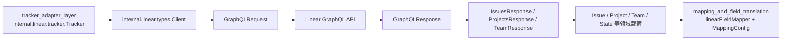

# linear_api_types_and_payloads

`linear_api_types_and_payloads` 模块本质上是在做一件“很基础但非常关键”的事：把 Linear 的 GraphQL 世界，压平成团队里可以稳定依赖的 Go 类型和请求/响应载荷结构。你可以把它想成一个“海关申报层”——外部系统（Linear）进来的数据格式和内部系统想处理的格式并不天然一致，这一层负责定义清晰的申报单，确保上下游都按同一份契约对齐。它看起来只是很多 struct，但这些 struct 其实决定了同步链路是否稳健、扩展时是否容易踩坑。

## 架构角色与数据流



从依赖关系看，这个模块在架构中的角色是 **“外部 API 契约层（contract boundary layer）”**，不是业务编排器。已知调用关系里，`internal.linear.tracker.Tracker` 持有 `*Client`，说明 tracker 适配层把这个模块当作底层通信与数据模型契约来使用；而映射层（`linearFieldMapper` + `MappingConfig`）消费这里定义的 Linear 载荷，做进一步语义映射。换句话说：这里不负责“业务决策”，负责“把线接对”。

一个典型路径（按现有类型命名和依赖关系可推断）是：Tracker 组织 GraphQL query/mutation 与变量，装入 `GraphQLRequest`，经 `Client`（含 endpoint、HTTP client、认证信息）发往 Linear；返回体先落到 `GraphQLResponse`（统一承接 `data/errors`），再反序列化到具体查询/变更响应结构（如 `IssuesResponse`、`IssueCreateResponse`、`ProjectUpdateResponse`），最后把 `Issue/Project/Team/State/...` 交给后续映射层和同步层。这个路径的核心收益是：**同一条 HTTP 通道支持多种 GraphQL operation，但每个 operation 的业务载荷有独立强类型容器。**

## 模块要解决的核心问题（为什么需要它）

如果用“朴素方案”做 Linear 集成，通常会出现两种极端：

第一种是全程 `map[string]any`/动态 JSON，短期快，但后续非常脆弱。你改一个 GraphQL 字段名，错误会在运行时才爆；并且错误位置分散在代码各处。

第二种是把所有类型直接耦合到业务域模型，省掉中间层，但会把外部 API 变化直接传染到内部核心模型，导致“外部 schema 轻微波动，内部逻辑大面积重编译/重测试”。

这个模块的设计意图是取中间最稳的一条路：

- 为 Linear API 定义“专属输入输出模型”（`GraphQLRequest`、`GraphQLResponse`、`IssuesResponse` 等），
- 把外部系统语义（如 `Issue.Identifier`、`Relation.Type`、`State.Type`）先完整承接下来，
- 再交给映射模块转成内部语义。

这样做的关键洞察是：**集成层最怕“语义泄漏”**。先把“外部长什么样”固定在边界层，再谈“内部要怎么用”。

## 心智模型：三层信封模型

理解这个模块最简单的方式是“三层信封”：

第一层是 **传输信封**：`Client` + API 常量（`DefaultAPIEndpoint`、`DefaultTimeout`、`MaxRetries`、`RetryDelay`、`MaxPageSize`）。它描述“怎么发、发到哪、默认策略是什么”。

第二层是 **协议信封**：`GraphQLRequest`/`GraphQLResponse`/`GraphQLError`。它描述“GraphQL 通用壳子长什么样”。

第三层是 **业务信封**：`Issue`、`Project`、`Team`、`State` 及各类 `*Response`。它描述“某个 query/mutation 的 data 结构具体长什么样”。

把这三层分开后，开发者能清晰回答三个不同问题：网络问题？协议问题？还是业务字段问题？这就是该模块降低排障复杂度的核心价值。

## 组件深潜

### `Client`

`Client` 是最小必要配置容器，字段包含 `APIKey`、`TeamID`、可选 `ProjectID`、`Endpoint`、`HTTPClient`。设计上它没有塞入复杂行为（至少在当前提供代码里仅体现为 struct），这意味着它偏“配置即依赖注入对象”。

这种选择的好处是：测试和替换传输层更容易（直接注入 `HTTPClient`），并且不会把请求构造逻辑和连接配置耦在一起。代价是调用方（通常是 tracker）要自己承担更多流程编排责任。

### GraphQL 通用载荷：`GraphQLRequest` / `GraphQLResponse` / `GraphQLError`

`GraphQLRequest` 采用 `Query + Variables` 结构，其中 `Variables` 是 `map[string]interface{}`。这是一个典型的灵活性优先设计：GraphQL operation 变化很快，变量形状多样，使用动态 map 可以避免为每个变量集合创建独立类型。

`GraphQLResponse` 则统一承接 `Data []byte` 与 `Errors []GraphQLError`。这里 `Data` 用 `[]byte` 而不是直接 `interface{}`，体现出“先解耦协议壳、再解具体 payload”的策略：先保证你拿到原始 `data`，再按 operation 选择性反序列化到 `IssuesResponse` 或 `ProjectCreateResponse`。

`GraphQLError` 显式保留 `Message`、`Path`、`Extensions.Code`，说明错误处理预期不仅看文案，还要能按路径/错误码做程序化分流（例如限流、参数错误、权限问题）。

### Issue 相关模型：`Issue`、`State`、`User`、`Labels/Label`、`Parent`、`Relations/Relation`

`Issue` 是该模块最“信息密集”的模型。一个非显式但重要的设计点是：很多关联字段是指针（如 `State *State`、`Assignee *User`、`Project *Project`、`Parent *Parent`、`Relations *Relations`）。这不是语法偏好，而是契约表达：**这些字段可能缺席**（因为查询没选、资源为空、权限受限、或业务上不存在）。

另外，时间字段采用字符串（`CreatedAt`/`UpdatedAt`/`CompletedAt`）而非 `time.Time`。这通常是边界层的有意策略：先无损接收 API 原值，把“时间解析/时区策略”留给更靠近业务决策的层，避免在 API 结构层过早绑定时间语义。

`Relation.Type` 注释列出 `blocks`、`blockedBy`、`duplicate`、`related`，它与映射层里的 `RelationMap`（见 [mapping_and_field_translation](mapping_and_field_translation.md)）形成自然接口：此模块只描述外部关系类型，内部依赖语义转换交给专门映射配置。

### Team 与状态模型：`Team`、`TeamStates`、`StatesWrapper`、`TeamResponse`、`TeamsResponse`

这组结构揭示了 Linear GraphQL 的典型“connection/nodes”模式：列表或嵌套集合都经由 `nodes` 包裹。`StatesWrapper` 的存在看起来“多一层”，但这是为了精确贴合响应 JSON 结构，减少自定义反序列化逻辑。

`TeamStates` + `TeamResponse` 则是专门为“按 team 拉 workflow states”这一高频需求服务。结合上游 `teamID` 与下游状态映射，可以推断它是同步时状态归一化的关键前置数据。

### Project 与分页响应：`Project`、`ProjectsResponse`

`Project` 字段设计与 `Issue` 类似，保留了外部字段原貌（如 `SlugId`、`Progress`、`State`）。`ProjectsResponse` 和 `IssuesResponse` 都内置 `PageInfo{HasNextPage, EndCursor}`，并结合常量 `MaxPageSize`，共同表达了一个明确约束：调用方需要按 cursor 分页遍历，而不是假设一次拉全量。

### 变更响应模型：`IssueCreateResponse`、`IssueUpdateResponse`、`ProjectCreateResponse`、`ProjectUpdateResponse`

这些 mutation 响应统一包含 `Success` + 具体实体。这种统一形状让上游编排代码更容易模板化处理（先判成功，再消费实体），也让日志/统计逻辑更一致。代价是：如果未来某 mutation 返回更复杂结构，需要新增专属类型而非复用同一个泛型壳。

## 依赖与耦合分析

从已给依赖信息可确认：

- `internal.linear.tracker.Tracker` 直接依赖 `*Client`。
- `linearFieldMapper` 依赖 `MappingConfig`，并与这里的 `Issue/State/Relation` 等类型形成数据契约对接（字段含义层面的耦合）。

因此该模块的上游/下游关系可以概括为：

- 上游调用者：tracker 适配层（见 [tracker_adapter_layer](tracker_adapter_layer.md)）负责 orchestration。
- 下游被调用对象：Linear GraphQL API（网络边界）。
- 横向协作者：映射层（见 [mapping_and_field_translation](mapping_and_field_translation.md)）负责语义翻译；统计/冲突层见 [sync_statistics_and_conflicts](sync_statistics_and_conflicts.md)。

关键契约点在于 JSON tag 与字段可空性。一旦 Linear schema 变更（例如 `nodes/pageInfo` 形状变化、字段重命名），最先破的是这里的反序列化契约，然后再级联影响 tracker 与 mapper。

## 设计取舍（为什么这样选）

这个模块最明显的取舍是“显式类型数量增加”换“边界稳定性”。

显式定义大量 response struct 的代价是样板代码多；但好处是每个 API 操作的数据形状都可检视、可搜索、可静态检查。对于长期维护的集成系统，这通常比“少写类型、到处动态断言”更划算。

第二个取舍是灵活性与类型安全的平衡：`GraphQLRequest.Variables` 用动态 map，`GraphQLResponse.Data` 用原始字节。这让协议层对操作高度通用，但把一部分类型校验延后到具体反序列化时。换句话说，它不是“全静态安全”，而是“在边界上分层控制风险”。

第三个取舍是语义保持 vs 提前归一化。比如时间保留字符串、状态/关系保留 Linear 原词汇，这会让上游多做一次映射，却避免了边界层“误解释”外部语义。这个选择与项目中独立 mapping 模块的存在是协同一致的。

## 使用方式与示例

下面示例只演示“类型如何协作”，不假设当前文件中存在特定方法实现。

```go
client := &linear.Client{
    APIKey:    "lin_api_xxx",
    TeamID:    "team_uuid",
    Endpoint:  linear.DefaultAPIEndpoint,
    HTTPClient: &http.Client{Timeout: linear.DefaultTimeout},
}

req := linear.GraphQLRequest{
    Query: `query($teamId: String!, $first: Int!) {
      issues(filter: {team: {id: {eq: $teamId}}}, first: $first) {
        nodes { id identifier title updatedAt }
        pageInfo { hasNextPage endCursor }
      }
    }`,
    Variables: map[string]interface{}{
      "teamId": client.TeamID,
      "first":  linear.MaxPageSize,
    },
}

_ = req // 交给 tracker/client 执行
```

针对返回体，推荐遵循“两段式解码”思路：先检查 `GraphQLResponse.Errors`，再按 operation 解码 `Data` 到 `IssuesResponse`/`ProjectsResponse`/`TeamResponse` 等。

## 新贡献者高频踩坑点

首先要注意“字段缺席”和“字段为空”是不同概念。`Issue` 中多个指针字段为 nil 时，不一定是数据错误，可能只是 GraphQL 查询没选该字段。新增逻辑时不要默认解引用。

其次要注意分页。`IssuesResponse` 和 `ProjectsResponse` 明确给了 `HasNextPage`/`EndCursor`，若只取首批数据就做全量同步判断，会造成静默漏数。

再者是关系与状态语义。`Relation.Type`、`State.Type` 属于外部系统词汇，不要直接当内部业务枚举使用；正确做法是经映射配置转换，保持适配层与核心域解耦。

最后，`Client` 的 `ProjectID` 是可选过滤条件。实现查询时若默认附带它，可能把“团队全量同步”意外收窄成“单项目同步”。这类隐式过滤是最难排查的数据缺失来源之一。

## 参考模块

- [tracker_adapter_layer](tracker_adapter_layer.md)
- [mapping_and_field_translation](mapping_and_field_translation.md)
- [sync_statistics_and_conflicts](sync_statistics_and_conflicts.md)
- [Linear Integration](linear_integration.md)
