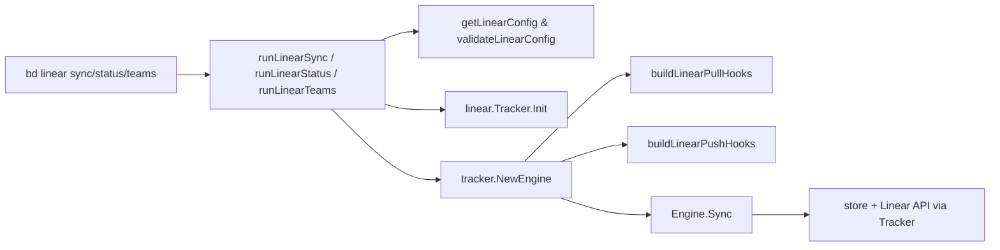

# linear_cli_sync_and_config

`linear_cli_sync_and_config`（对应 `cmd/bd/linear.go`）是 `bd` 命令行里连接“人类操作意图”和“Linear 同步引擎”的那层薄编排器。它本质上不实现同步算法，而是把 CLI flag、项目配置、环境变量、以及 Linear 特有的行为钩子装配成一个可执行的同步会话。你可以把它想成机场的值机柜台：真正飞行的是后面的航司系统（`tracker.Engine` + `internal.linear.tracker.Tracker`），但柜台决定你是否证件齐全、走哪条通道、行李怎么标记，错了就根本飞不起来。

## 这个模块要解决什么问题

如果做一个“天真版” Linear 同步命令，通常会在 `run` 函数里直接：读配置 -> 调 API -> 写本地库。这样很快就会撞墙：第一，冲突策略、dry-run、类型过滤、ephemeral 筛选这些策略会和业务代码混在一起；第二，Linear 的状态映射、描述格式化、依赖/ID 处理属于“平台差异”，不该污染通用同步引擎；第三，CLI 环境存在“store 已开/未开、dbPath 直连、环境变量兜底”等运行态差异，直接耦合会让命令在不同入口行为不一致。

这个模块的设计意图是把这些复杂性分层：

- 命令层只做输入解释、前置校验、hook 装配、结果展示；
- 同步执行交给 [`sync_orchestration_engine`](sync_orchestration_engine.md) 的 `tracker.NewEngine(...).Sync(...)`；
- Linear 平台语义交给 [`linear_tracker_adapter_layer`](linear_tracker_adapter_layer.md) 与 [`linear_mapping_and_field_translation`](linear_mapping_and_field_translation.md)。

换句话说，这里解决的是“把可变的操作场景稳稳翻译成稳定的同步契约”。

## 心智模型：三层适配器

理解这个模块最有效的心智模型是“三层适配器串联”：

第一层是 **CLI 语义适配**：`runLinearSync`/`runLinearStatus`/`runLinearTeams` 把 `cobra.Command` 的 flags 和子命令语义转成内部参数。第二层是 **配置解析适配**：`getLinearConfig`、`validateLinearConfig`、`storeConfigLoader` 把“项目配置 + 环境变量 + 临时 store 打开逻辑”统一为可消费配置。第三层是 **同步钩子适配**：`buildLinearPullHooks` 和 `buildLinearPushHooks` 把 Linear 特有规则注入通用引擎。

把它想象成一个“可插拔流水线”：命令层决定这次跑哪条线；配置层提供原料；hook 层调整工艺；最后交给统一机床（Engine）执行。

## 架构与数据流



在 `sync` 路径里，端到端流程是：命令读取 flags，执行只读保护与配置校验，初始化 `linear.Tracker`，构造 `tracker.Engine`，注入 pull/push hooks，把 flags 映射成 `tracker.SyncOptions`，最后调用 `engine.Sync(ctx, opts)`。也就是说，这个模块的架构角色是**编排器（orchestrator）+ 策略注入器（policy injector）**，而不是同步执行器。

`status` 路径更偏本地观测：读取配置状态、扫描本地 issue（`store.SearchIssues`）、识别 `ExternalRef` 是否属于 Linear（`linear.IsLinearExternalRef`），输出健康概览。`teams` 路径则是最小 API 探针：只需要 API key，调用 `linear.NewClient(...).FetchTeams(ctx)` 帮用户拿到可用 `team_id`。

## 组件深潜

### `runLinearSync(cmd *cobra.Command, args []string)`

这是主入口，负责把“命令行意图”转成“可执行同步计划”。它做了几类关键动作：先取 flags（`--pull/--push/--dry-run/--prefer-local/...`），再做前置保护（非 dry-run 时 `CheckReadonly("linear sync")`；互斥参数校验 `preferLocal && preferLinear`），然后依赖 `ensureStoreActive` 和 `validateLinearConfig` 确保执行面可用。

接下来它初始化 `linear.Tracker`，并用 `tracker.NewEngine(lt, store, actor)` 创建通用同步引擎。这里最重要的设计点是注入两组 hook：`engine.PullHooks = buildLinearPullHooks(ctx)` 与 `engine.PushHooks = buildLinearPushHooks(ctx, lt)`。这让“引擎流程稳定、平台行为可变”成为可能。

最后它把 flags 落到 `tracker.SyncOptions`：包括模式、state 过滤、type include/exclude、`ExcludeEphemeral`、冲突策略（`ConflictLocal` / `ConflictExternal` / `ConflictTimestamp`）。同步结果统一从 `engine.Sync` 返回，再按 `jsonOutput` 与 `dryRun` 控制输出格式。

这个函数的隐含契约是：它假设 `linear.Tracker.Init` 完成后，`tracker.Engine` 就可以用统一协议访问 Linear；因此它不直接触碰 GraphQL 细节。

### `buildLinearPullHooks(ctx context.Context) *tracker.PullHooks`

这个函数只在导入（pull）方向注入 Linear 特化行为，核心是 ID 生成策略。它读取 `linear.id_mode` 与 `linear.hash_length`，当模式为 `"hash"` 时，会先 `store.SearchIssues` 预加载现有 ID 到 `usedIDs`，再读取 `issue_prefix`（默认 `"bd"`），并设置 `hooks.GenerateID`。

`GenerateID` 内部调用 `linear.GenerateIssueIDs`，传入 `linear.IDGenerationOptions{BaseLength, MaxLength, UsedIDs}`，然后把新生成 ID 回写到 `usedIDs`，避免同一批次后续碰撞。

设计上的“why”很明确：pull 场景可能批量导入，若每条都独立随机生成 ID 而不记住已生成结果，批内冲突概率会放大。这里通过进程内 `usedIDs` 形成一个轻量“冲突保险丝”。

### `buildLinearPushHooks(ctx context.Context, lt *linear.Tracker) *tracker.PushHooks`

push hook 是这个模块的策略核心，包含五个行为：

`FormatDescription` 使用 `linear.BuildLinearDescription(issue)`，把本地 issue 描述规范成适合 Linear 的文本。

`ContentEqual` 先做 `linear.NormalizeIssueForLinearHash(local)`，再把远端 `tracker.TrackerIssue` 用 `lt.FieldMapper().IssueToBeads(remote)` 转回 beads 语义，最后比较 `ComputeContentHash()`。这个“先归一化再哈希”的做法，本质是在不同平台文本表示差异下尽量减少假冲突。

`BuildStateCache` 调 `linear.BuildStateCacheFromTracker(ctx, lt)`，`ResolveState` 再把 `types.Status` 映射到 Linear state ID（通过 `*linear.StateCache` 的 `FindStateForBeadsStatus`）。这是一种典型“预热缓存 + 快速查询”模式，减少 push 过程中重复状态查询。

`ShouldPush` 则读取 `linear.push_prefix`（逗号分隔），仅当 `issue.ID` 前缀匹配时才允许推送。这个策略牺牲了一些“自动化透明度”，换来多项目/多前缀仓库里更安全的边界控制。

### `runLinearStatus(cmd, args)`

该函数是运维可观测入口，不做网络调用。它读取 `linear.api_key`、`linear.team_id`、`linear.last_sync`，扫描本地 issue 后统计三个关键数：总量、已有 Linear 引用、待推送（`ExternalRef == nil`）。

这里的好设计是“状态命令偏本地、快速、可离线”。即使 Linear 服务暂时不可达，用户仍能知道本地同步准备度。

### `runLinearTeams(cmd, args)`

用于配置发现。它只要求 API key，不要求 team_id；拿到 key 后创建 `linear.NewClient(apiKey, "")`，调用 `FetchTeams` 列出可访问团队，帮助用户填 `linear.team_id`。

这个命令的价值在于把“先知道 UUID 才能配置”的鸡生蛋蛋生鸡问题打通。

### `validateLinearConfig() error`

校验链路很直接：先 `ensureStoreActive`，再检查 `linear.api_key`、`linear.team_id` 是否存在，最后用 `isValidUUID` 验证 team_id 格式。它没有做 API 可达性验证，属于“静态配置校验”。

取舍是：启动快、错误信息明确；但权限/网络问题会延迟到真正同步时暴露。

### `getLinearConfig(ctx, key) (value, source)`

这是配置解析关键点。优先级是项目配置优先，环境变量兜底。读取路径是：

1. 若全局 `store` 存在，直接 `store.GetConfig`；
2. 否则若有 `dbPath`，临时 `dolt.New(...).GetConfig`；
3. 若仍为空，映射到环境变量（`linearConfigToEnvVar`）再读 `os.Getenv`。

它返回 `(value, source)`，让调用方可以在日志里解释配置来源（例如 `runLinearTeams` 的 `debug.Logf`）。这里的设计洞察是：CLI 命令在不同上下文启动时不一定已有活跃 store，但仍应尽可能解析项目配置，保证行为一致性。

### `getLinearClient(ctx) (*linear.Client, error)`

这个工厂函数从配置组装 `linear.Client`，并可附加 `linear.api_endpoint` 与 `linear.project_id`。它把“构建客户端”的重复逻辑集中起来，降低其他命令复制粘贴风险。

基于提供代码，无法确认它在本文件中的直接调用点；更可能是同包其他命令复用。

### `storeConfigLoader` 与 `(*storeConfigLoader).GetAllConfig()`

`storeConfigLoader` 只有一个 `ctx` 字段，`GetAllConfig()` 直接代理 `store.GetAllConfig(l.ctx)`。它的意义在于把全局 store 适配成 `linear.LoadMappingConfig(...)` 需要的 loader 接口，避免 mapping 层直接依赖 CLI 全局变量。

### `loadLinearMappingConfig(ctx)`

当 `store == nil` 时返回 `linear.DefaultMappingConfig()`，否则使用 `linear.LoadMappingConfig(&storeConfigLoader{ctx})` 从配置加载映射覆盖。这个策略保证“无 store 场景可运行、有 store 场景可定制”。

### `getLinearIDMode(ctx)` / `getLinearHashLength(ctx)`

这对函数把文本配置规范化为安全参数。`id_mode` 默认 `"hash"`；`hash_length` 默认 `6`，并且对非法值回退默认、对越界值钳制到 `3..8`。这是典型的“输入宽容，行为收敛”设计。

### 其他小函数：`isValidUUID`、`maskAPIKey`、`linearConfigToEnvVar`

它们是纯函数工具：UUID 格式验证、API key 脱敏展示、配置键到环境变量映射。虽然简单，但承载了可用性与安全细节（尤其 `maskAPIKey` 避免明文泄露）。

## 依赖关系与数据契约

从调用关系看，这个模块主要依赖四类能力。

第一类是 CLI 与运行时骨架：`cobra.Command`、`rootCmd`、全局 `rootCtx/store/actor/jsonOutput`，以及 `ensureStoreActive`、`CheckReadonly`、`FatalError` 等命令基础设施。它们定义了“命令如何被触发、如何退出、如何输出”的契约。

第二类是同步框架：`tracker.NewEngine`、`tracker.SyncOptions`、`tracker.PullHooks`、`tracker.PushHooks`。这个契约要求本模块提供可执行选项与可选 hook，而不是重新实现同步主循环。相关背景见 [`sync_orchestration_engine`](sync_orchestration_engine.md) 与 [`tracker_plugin_contracts`](tracker_plugin_contracts.md)。

第三类是 Linear 适配层：`linear.Tracker`、`linear.BuildLinearDescription`、`linear.NormalizeIssueForLinearHash`、`linear.BuildStateCacheFromTracker`、`linear.GenerateIssueIDs`、`linear.NewClient`、`linear.IsLinearExternalRef` 等。这里的数据契约是：CLI 层处理的是 `types.Issue` / `tracker.TrackerIssue` 和字符串配置，真正平台协议细节在 Linear 模块内部处理。参见 [`linear_tracker_adapter_layer`](linear_tracker_adapter_layer.md)、[`linear_mapping_and_field_translation`](linear_mapping_and_field_translation.md)、[`linear_api_types_and_payloads`](linear_api_types_and_payloads.md)。

第四类是存储层：`store.GetConfig`、`store.GetAllConfig`、`store.SearchIssues`，以及无活动 store 时的 `dolt.New(...).GetConfig`。这决定了该模块对存储契约的耦合点主要在配置读取和 issue 列表扫描，而非事务写入。

反向来看，“谁调用它”主要是 Cobra 命令路由（`linearCmd` 挂到 `rootCmd`，子命令 `sync/status/teams` 的 `Run` 分别指向三个入口函数）。也就是说它是 CLI routing 层的末端执行单元，在模块树中位于 CLI Routing Commands 下的 `linear_cli_sync_and_config`。

## 设计取舍与原因

这个模块的核心取舍是“把复杂性交给 hook 和下游模块，而让入口保持薄”。它牺牲了某些局部“直观”（例如需要理解 Engine + Hooks 才能读懂全流程），换来跨 tracker 的一致同步骨架。

另一个明显取舍是配置读取的鲁棒性优先。`getLinearConfig` 的临时 store 打开逻辑增加了实现复杂度，但避免了“同一命令在 direct mode 和 normal mode 行为不一致”。

在正确性与性能之间，`buildLinearPullHooks` 选择了“预加载全部 issue ID 到内存”以降低碰撞风险。对于大仓库这会有额外扫描成本，但导入 ID 冲突一旦发生后果更糟，因此更偏正确性。

在灵活性与安全性之间，`ShouldPush` 的 `linear.push_prefix` 策略偏安全：默认不过滤，配置后严格按前缀放行，适合多团队共仓时避免误推送。

## 使用方式与典型示例

```bash
# 基础配置
bd config set linear.api_key "YOUR_API_KEY"
bd config set linear.team_id "12345678-1234-1234-1234-123456789abc"

# 单向/双向同步
bd linear sync --pull
bd linear sync --push
bd linear sync

# 预演与冲突策略
bd linear sync --dry-run
bd linear sync --prefer-local
bd linear sync --prefer-linear

# 推送筛选
bd linear sync --push --type task,feature
bd linear sync --push --exclude-type wisp
bd linear sync --push --include-ephemeral

# 运维辅助
bd linear status
bd linear teams
```

若要启用导入哈希 ID 控制，可配置：

```bash
bd config set linear.id_mode "hash"
bd config set linear.hash_length "6"
```

若要限制只推送特定前缀 issue：

```bash
bd config set linear.push_prefix "bd,projx"
```

## 新贡献者应重点注意的坑

最容易踩坑的是隐式默认值。比如不传 `--include-ephemeral` 时，代码会设置 `opts.ExcludeEphemeral = true`，这意味着某些 issue 类型默认不会被 push。又如冲突策略默认是 `tracker.ConflictTimestamp`，不是本地优先也不是远端优先。

第二个坑是配置来源优先级：项目配置高于环境变量。调试“为什么环境变量没生效”时，先检查 `bd config` 里是否已有非空值。

第三个坑是 `linear.team_id` 只做 UUID 格式校验，不保证这个 team 对 API key 真可访问。格式合法但权限错误会在后续 API 调用才报错。

第四个坑是 `ContentEqual` 的比较依赖 `lt.FieldMapper().IssueToBeads(remote)`。如果该转换返回 `nil`，逻辑会直接返回 `false`，导致更倾向执行更新。这是保守策略，但会增加某些情况下的“看起来重复更新”。

第五个坑是 `getLinearConfig` 在 `store == nil` 且 `dbPath` 非空时会尝试临时打开 Dolt。若路径异常，这一步静默失败后会继续环境变量兜底，排障时要注意这条分支。

## 相关模块参考

- [sync_orchestration_engine](sync_orchestration_engine.md)
- [tracker_plugin_contracts](tracker_plugin_contracts.md)
- [linear_tracker_adapter_layer](linear_tracker_adapter_layer.md)
- [linear_mapping_and_field_translation](linear_mapping_and_field_translation.md)
- [linear_api_types_and_payloads](linear_api_types_and_payloads.md)
- [routing_lookup_primitives](routing_lookup_primitives.md)
