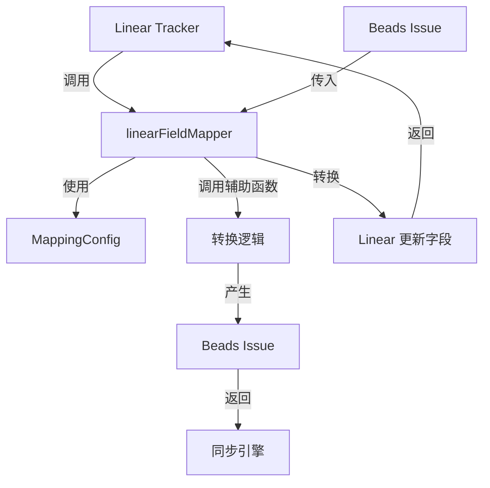

# Linear 字段映射器 (linear_fieldmapper) 技术深度分析

## 问题空间

当您需要在两个不同的问题跟踪系统之间同步数据时，最棘手的挑战不是简单的字段复制，而是**语义映射**的问题。例如，Linear 中的"开始"状态可能对应 Beads 系统中的"进行中"状态，Linear 的优先级 1（紧急）可能需要映射到 Beads 的 0 级（关键）。如果没有一个专门的组件处理这些转换，同步逻辑就会变得混乱且难以维护。

这就是 `linear_fieldmapper` 模块的用武之地：它实现了 `tracker.FieldMapper` 接口，专门负责在 Linear API 的数据模型和 Beads 内部数据模型之间进行双向转换。

## 核心概念与心智模型

把 `linearFieldMapper` 想象成一个**翻译官**：
- 它懂得两种"语言"：Linear 的 API 数据模型和 Beads 的内部数据模型
- 它不仅仅是逐字翻译，还理解背后的语义（比如"优先级"、"状态"在两个系统中的不同含义）
- 它依赖一本"词典"（`MappingConfig`）来处理特定团队的自定义映射

### 关键抽象

- **FieldMapper 接口**：定义了所有问题跟踪系统字段映射器必须实现的契约
- **linearFieldMapper 结构体**：Linear 特定的字段映射器实现，持有配置
- **MappingConfig**：提供自定义映射规则的配置结构（优先级、状态、标签类型、关系等）

## 架构与数据流



### 数据流解析

1. **从 Linear 到 Beads**：
   - `linear.tracker.Tracker` 获取 Linear API 数据
   - 调用 `linearFieldMapper.IssueToBeads()` 进行完整转换
   - 内部使用 `IssueToBeads()` 辅助函数处理核心转换
   - 将 Linear 依赖关系转换为 Beads 的 `DependencyInfo` 格式
   - 返回包含 Beads Issue 和依赖关系的 `IssueConversion`

2. **从 Beads 到 Linear**：
   - 调用 `linearFieldMapper.IssueToTracker()`
   - 将 Beads 的优先级、状态等转换回 Linear 格式
   - 返回一个字段映射，准备用于 Linear API 更新

## 组件深入解析

### linearFieldMapper 结构体

```go
type linearFieldMapper struct {
	config *MappingConfig
}
```

**设计意图**：这是一个薄封装层，核心逻辑实际委托给外部的辅助函数（如 `PriorityToBeads`、`StateToBeadsStatus` 等）。这种设计使配置可以在运行时注入，同时保持接口实现的简洁。

### PriorityToBeads / PriorityToTracker

```go
func (m *linearFieldMapper) PriorityToBeads(trackerPriority interface{}) int {
	if p, ok := trackerPriority.(int); ok {
		return PriorityToBeads(p, m.config)
	}
	return 2
}
```

**设计要点**：
- 使用类型断言确保输入是预期的 `int` 类型
- 提供安全默认值（2，中等优先级）防止转换失败
- 实际转换逻辑在外部函数中，便于测试和复用

### StatusToBeads / StatusToTracker

```go
func (m *linearFieldMapper) StatusToBeads(trackerState interface{}) types.Status {
	if state, ok := trackerState.(*State); ok {
		return StateToBeadsStatus(state, m.config)
	}
	return types.StatusOpen
}
```

**设计要点**：
- Linear 的状态不仅仅是一个字符串，而是包含 `Type` 和 `Name` 字段的 `State` 结构体
- 默认返回 `StatusOpen` 确保即使转换失败，问题也不会消失

### TypeToBeads / TypeToTracker

```go
func (m *linearFieldMapper) TypeToBeads(trackerType interface{}) types.IssueType {
	if labels, ok := trackerType.(*Labels); ok {
		return LabelToIssueType(labels, m.config)
	}
	return types.TypeTask
}
```

**设计洞察**：Linear 没有原生的"问题类型"概念，而是通过标签来模拟。这个函数通过检查标签并使用 `LabelTypeMap` 配置来推断 Beads 问题类型。

### IssueToBeads

```go
func (m *linearFieldMapper) IssueToBeads(ti *tracker.TrackerIssue) *tracker.IssueConversion {
	li, ok := ti.Raw.(*Issue)
	if !ok {
		return nil
	}

	conv := IssueToBeads(li, m.config)
	// ... 转换依赖关系 ...
}
```

**关键流程**：
1. 类型安全检查：确保 `ti.Raw` 确实是 Linear 的 `Issue` 类型
2. 委托转换：调用外部 `IssueToBeads()` 函数处理核心逻辑
3. 依赖关系转换：将 Linear 特定的依赖关系转换为通用的 `tracker.DependencyInfo` 格式

### IssueToTracker

```go
func (m *linearFieldMapper) IssueToTracker(issue *types.Issue) map[string]interface{} {
	updates := map[string]interface{}{
		"title":       issue.Title,
		"description": issue.Description,
		"priority":    PriorityToLinear(issue.Priority, m.config),
	}
	return updates
}
```

**设计要点**：
- 只映射安全、通用的字段（标题、描述、优先级）
- 有意省略一些字段（如状态），可能因为 Linear 的状态转换需要特殊处理
- 返回一个灵活的 `map[string]interface{}`，可以直接用于 GraphQL 更新

## 依赖关系分析

**调用此模块的组件**：
- `internal.linear.tracker.Tracker`：使用此字段映射器进行同步操作

**此模块调用的组件**：
- `internal.tracker.tracker`：实现 `FieldMapper` 接口，使用 `TrackerIssue` 和 `IssueConversion` 类型
- `internal.types.types`：使用 Beads 的核心类型如 `Issue`、`Status`、`IssueType`
- `internal.linear.mapping`：使用 `MappingConfig` 和转换辅助函数
- `internal.linear.types`：使用 Linear 特定的类型如 `Issue`、`State`、`Labels`

**关键数据契约**：
- `TrackerIssue.Raw` 必须是 `*linear.Issue` 类型，否则转换会返回 `nil`
- `MappingConfig` 必须正确配置，否则会使用默认映射
- 依赖关系使用 Linear ID 进行关联

## 设计权衡与决策

### 1. 薄封装 vs 厚实现

**选择**：`linearFieldMapper` 是一个薄封装，实际逻辑在外部辅助函数中

**理由**：
- 提高可测试性：辅助函数可以独立测试
- 提高复用性：其他组件可以直接使用辅助函数
- 保持接口实现简洁

**权衡**：增加了函数调用的间接层，但这是可接受的

### 2. 类型安全 vs 灵活性

**选择**：使用类型断言并提供安全默认值

**理由**：
- `FieldMapper` 接口使用 `interface{}` 类型，这是为了支持多种跟踪器
- 在运行时进行类型检查，确保数据正确性
- 提供默认值防止同步流程因一个字段转换失败而完全中断

**权衡**：静默失败可能掩盖问题，但比完全失败更适合同步场景

### 3. 配置驱动 vs 硬编码

**选择**：使用 `MappingConfig` 支持自定义映射

**理由**：
- 不同团队使用 Linear 的方式不同（状态名称、标签约定等）
- 允许在不修改代码的情况下调整映射
- 遵循开闭原则

**权衡**：增加了配置复杂性，但对于适应不同团队的工作流是必要的

## 使用指南与最佳实践

### 初始化

```go
// 创建配置
config := &linear.MappingConfig{
    PriorityMap: map[string]int{
        "1": 0,  // Linear 紧急 → Beads P0
        "2": 1,  // Linear 高 → Beads P1
        // ...
    },
    StateMap: map[string]string{
        "started": "in_progress",
        // ...
    },
}

// 创建字段映射器
mapper := &linearFieldMapper{config: config}
```

### 转换问题

```go
// 从 Linear 到 Beads
trackerIssue := &tracker.TrackerIssue{Raw: linearIssue}
conversion := mapper.IssueToBeads(trackerIssue)
if conversion != nil {
    beadsIssue := conversion.Issue.(*types.Issue)
    // 使用 beadsIssue...
}

// 从 Beads 到 Linear
updates := mapper.IssueToTracker(beadsIssue)
// 使用 updates 进行 Linear API 调用...
```

## 边缘情况与注意事项

### 类型断言失败

**问题**：如果 `TrackerIssue.Raw` 不是预期的 `*linear.Issue` 类型，`IssueToBeads` 会返回 `nil`

**应对**：调用方应始终检查返回值是否为 `nil`

### 配置缺失

**问题**：如果 `MappingConfig` 中的映射不完整，转换可能使用默认值

**应对**：确保配置完整，或在使用前验证配置

### 依赖关系转换

**注意**：依赖关系使用 Linear ID（如 "TEAM-123"），而不是内部 Beads ID。调用方需要额外的逻辑来解析这些引用。

### 部分更新

**注意**：`IssueToTracker` 只返回部分字段（标题、描述、优先级）。如果需要更新其他字段（如状态），需要单独处理。

## 相关模块

- [Tracker Integration Framework](tracker_integration_framework.md)：定义了 `FieldMapper` 接口和同步引擎
- [Linear Integration](linear_integration.md)：完整的 Linear 跟踪器集成
- [GitLab FieldMapper](gitlab_fieldmapper.md)：GitLab 的类似字段映射器实现
