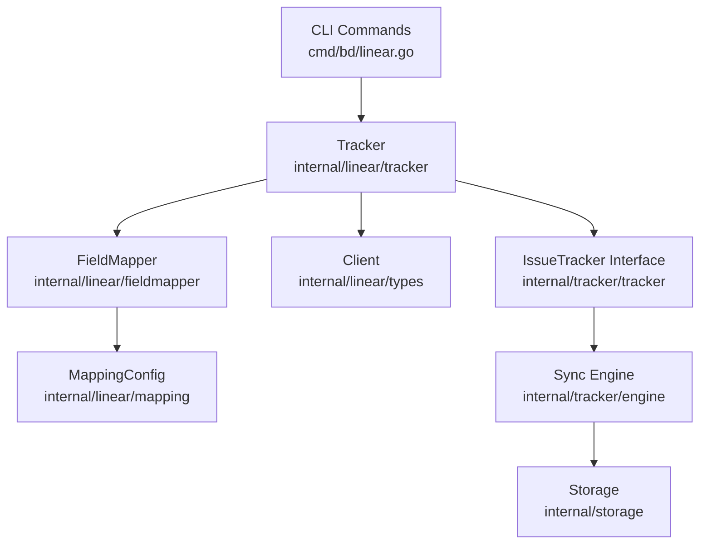

# Linear Integration 模块技术详解

## 1. 问题解决：为什么需要这个模块？

在项目管理工具与本地开发工作流之间建立无缝的数据同步是一个常见但复杂的挑战。Linear 作为现代项目管理工具，拥有强大的 GraphQL API，但直接与之集成需要处理：

1. **数据模型不匹配**：Linear 的 Issue、State、Project 等概念与本地 Beads 系统的领域模型有差异
2. **ID 生成策略冲突**：Linear 使用 UUID，而 Beads 系统可能使用更友好的哈希 ID
3. **状态/优先级映射**：不同系统的工作流状态和优先级定义不同
4. **双向同步冲突**：同时在两个系统中更新数据时的冲突解决
5. **配置灵活性**：不同团队可能有不同的字段映射需求

**Linear Integration 模块**的核心价值在于提供了一个适配层，它将 Linear 的 API 抽象为符合 Beads 系统领域模型的接口，同时提供可配置的映射规则，让同步过程既灵活又可控。

## 2. 核心设计思路与抽象模型

可以将 Linear Integration 模块想象成一个**智能转换器**，它有三个主要组件：

- **翻译官 (FieldMapper)**：负责数据模型和字段值的双向转换
- **外交官 (Tracker)**：处理与 Linear API 的所有通信，实现 IssueTracker 接口
- **配置师 (MappingConfig)**：存储和管理字段映射规则、优先级映射等配置

这种设计遵循了适配器模式，将 Linear 复杂的 API 适配成 Beads 系统期望的统一接口。

### 架构概览



## 3. 核心组件详解

### 3.1 Tracker - 同步引擎的适配器

`Tracker` 是 Linear 集成的核心，它实现了 `IssueTracker` 接口，将所有 Linear 特定的操作封装起来。

```go
type Tracker struct {
    client    *Client
    config    *MappingConfig
    store     storage.Storage
    teamID    string
    projectID string
}
```

**设计意图**：
- 作为 Beads 系统与 Linear API 之间的桥梁
- 封装所有 Linear 特定的业务逻辑和 API 调用
- 提供统一的接口供同步引擎使用

**主要职责**：
- 初始化 Linear 客户端和配置
- 拉取/推送 Issue 数据
- 处理依赖关系同步
- 管理状态缓存

### 3.2 linearFieldMapper - 数据模型转换器

`linearFieldMapper` 负责在 Linear 的数据模型和 Beads 的领域模型之间进行双向转换。

```go
type linearFieldMapper struct {
    config *MappingConfig
}
```

**核心功能**：
- `IssueToBeads`：将 Linear Issue 转换为 Beads Issue
- `BeadsToTrackerIssue`：将 Beads Issue 转换为 Linear 可理解的格式
- 根据 `MappingConfig` 进行字段值映射

### 3.3 MappingConfig - 可配置的映射规则

`MappingConfig` 存储了所有字段映射规则，让集成具有高度的灵活性。

```go
type MappingConfig struct {
    PriorityMap   map[string]int      // Linear优先级 -> Beads优先级
    StateMap      map[string]string   // Linear状态 -> Beads状态
    LabelTypeMap  map[string]string   // Linear标签 -> BeadsIssue类型
    RelationMap   map[string]string   // Linear关系 -> Beads依赖类型
}
```

**设计亮点**：
- 提供默认映射规则，简化初始配置
- 支持自定义映射，满足不同团队需求
- 通过 ConfigLoader 接口从存储中加载配置

### 3.4 Client - Linear API 通信层

`Client` 封装了与 Linear GraphQL API 的所有通信。

```go
type Client struct {
    APIKey     string
    TeamID     string
    ProjectID  string
    Endpoint   string
    HTTPClient *http.Client
}
```

**主要功能**：
- 执行 GraphQL 查询和变更
- 处理 API 认证和错误
- 提供获取 Teams、Issues、Projects 等数据的方法

## 4. 数据流向：从 CLI 到同步完成

让我们追踪一个典型的双向同步流程：

1. **用户执行命令**：`bd linear sync`
2. **命令解析与配置验证**：`validateLinearConfig()` 检查必要配置
3. **创建 Tracker**：初始化 Linear 客户端和 FieldMapper
4. **构建同步引擎**：`tracker.NewEngine(lt, store, actor)`
5. **设置钩子函数**：
   - `buildLinearPullHooks()`：处理 ID 生成等拉取特定逻辑
   - `buildLinearPushHooks()`：处理描述格式化、内容比较等推送特定逻辑
6. **执行同步**：`engine.Sync(ctx, opts)`
   - 拉取阶段：从 Linear 获取 Issues，通过 FieldMapper 转换，存储到本地
   - 推送阶段：从本地获取 Issues，转换为 Linear 格式，推送到 Linear
   - 冲突解决：根据配置的策略处理冲突
7. **输出结果**：显示同步统计和警告

## 5. 关键设计决策与权衡

### 5.1 可配置的映射规则 vs 硬编码

**选择**：提供 `MappingConfig` 支持灵活配置，同时提供默认值

**原因**：
- 不同团队使用 Linear 的方式差异很大
- 默认配置让新用户可以快速上手
- 可配置性满足了高级用户的定制需求

**权衡**：
- ✅ 灵活性高，适应不同场景
- ✅ 向后兼容，映射规则变化不影响代码
- ❌ 配置复杂度增加
- ❌ 需要更多的验证逻辑

### 5.2 ID 生成策略：哈希 vs 直接使用 UUID

**选择**：默认使用哈希 ID，但支持配置

**原因**：
- Linear 使用 UUID，不适合作为 CLI 中的 Issue 标识符
- 哈希 ID 更短、更友好，与 Beads 系统其他部分保持一致
- 提供 `id_mode` 配置，让用户可以选择

**实现细节**：
- `buildLinearPullHooks()` 中的 `GenerateID` 钩子
- 使用 `linear.GenerateIssueIDs()` 生成哈希 ID
- 维护 `usedIDs` 映射避免冲突

### 5.3 钩子模式扩展同步行为

**选择**：使用 `PullHooks` 和 `PushHooks` 扩展同步引擎

**原因**：
- 同步引擎是通用的，不应包含 Linear 特定逻辑
- 钩子模式让 Linear 集成可以自定义同步行为
- 保持了代码的分离和可测试性

**Linear 特定钩子**：
- `GenerateID`：自定义 ID 生成
- `FormatDescription`：格式化描述以适应 Linear
- `ContentEqual`：自定义内容相等性判断
- `BuildStateCache`/`ResolveState`：状态映射
- `ShouldPush`：推送过滤逻辑

## 6. 使用指南与最佳实践

### 6.1 基本配置

```bash
# 必需配置
bd config set linear.api_key "lin_api_..."
bd config set linear.team_id "team-uuid"

# 可选配置
bd config set linear.project_id "project-uuid"  # 只同步特定项目
```

### 6.2 自定义映射规则

```bash
# 优先级映射
bd config set linear.priority_map.0 4  # Linear无优先级 -> Beads Backlog
bd config set linear.priority_map.1 0  # Linear紧急 -> Beads Critical

# 状态映射
bd config set linear.state_map.backlog open
bd config set linear.state_map.my_custom_state in_progress

# 标签到类型映射
bd config set linear.label_type_map.bug bug
bd config set linear.label_type_map.feature story
```

### 6.3 同步命令

```bash
# 双向同步
bd linear sync

# 只拉取
bd linear sync --pull

# 只推送
bd linear sync --push

# 类型过滤
bd linear sync --push --type=task,feature

# 冲突解决
bd linear sync --prefer-local  # 优先使用本地版本
```

## 7. 注意事项与常见问题

### 7.1 常见陷阱

1. **Team ID 格式错误**：确保使用的是 UUID 格式，而不是 Team Key
   ```bash
   bd linear teams  # 查看可用的 Team ID
   ```

2. **API 密钥权限不足**：确保 API 密钥有足够的权限读取和写入 Issues

3. **状态映射不完整**：自定义 Linear 工作流状态时，确保在 `state_map` 中有对应的映射

### 7.2 调试技巧

```bash
# 查看同步状态
bd linear status

# 预览同步而不实际执行
bd linear sync --dry-run

# JSON 输出获取详细信息
bd linear sync --json
```

## 8. 与其他模块的关系

- **Tracker Integration Framework**：Linear 集成是该框架的一个实现，依赖 `IssueTracker` 接口
- **Storage**：用于存储配置和同步状态
- **CLI**：提供用户交互界面
- **Types**：共享的领域模型定义

相关文档：
- [Tracker Integration Framework](tracker_integration_framework.md)
- [Dolt Storage Backend](dolt_storage_backend.md)
- [Core Domain Types](core_domain_types.md)
