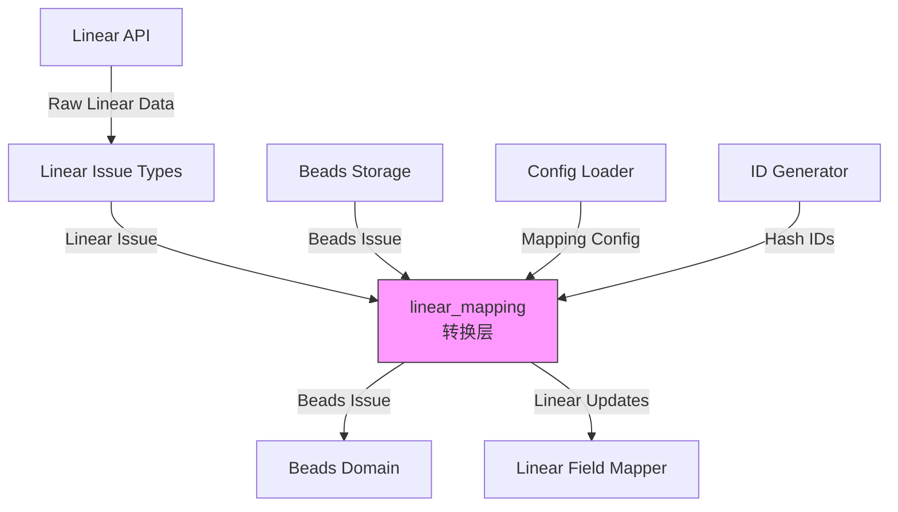

# Linear Mapping 模块技术深度解析

## 1. 模块概述

Linear Mapping 模块是 Beads 系统与 Linear 项目管理工具集成的核心转换层。它主要解决的问题是在两个具有不同数据模型、优先级系统、状态机和工作流的系统之间实现无缝数据同步。

这个模块的存在是必要的，因为：
- Linear 和 Beads 对问题、状态、优先级的概念表示完全不同
- 需要保持双向同步过程中的数据一致性
- 需要支持可配置的映射关系以适应不同团队的工作流

## 2. 核心抽象与架构

### 2.1 心智模型

可以把 Linear Mapping 模块想象成一个"翻译官"：
- 它理解两种语言（Linear 数据模型和 Beads 数据模型）
- 它不仅做字面翻译，还根据上下文做语义转换
- 它有一本可定制的词典（`MappingConfig`），允许团队根据自己的工作流调整翻译规则

### 2.2 架构图



## 3. 核心组件深度解析

### 3.1 MappingConfig：可配置的映射规则

```go
type MappingConfig struct {
    PriorityMap   map[string]int
    StateMap      map[string]string
    LabelTypeMap  map[string]string
    RelationMap   map[string]string
}
```

**设计意图**：这是模块的核心配置结构，采用映射表模式而非硬编码转换逻辑，提供了极大的灵活性。所有映射都使用小写键实现不区分大小写的匹配，这是为了处理 Linear 中可能出现的自定义状态和标签名称的大小写不一致问题。

**关键设计决策**：
- 使用字符串键而非枚举：支持 Linear 的自定义状态和标签
- 分层默认配置：通过 `DefaultMappingConfig()` 提供合理默认值，同时允许完全覆盖
- 配置驱动：通过 `ConfigLoader` 接口从存储中动态加载配置

### 3.2 双向转换函数

#### IssueToBeads：从 Linear 到 Beads 的转换

这是模块中最复杂的函数之一，它不仅仅是字段复制，还包含：
- 状态映射（使用 `StateToBeadsStatus`）
- 优先级转换（使用 `PriorityToBeads`）
- 标签到问题类型的推断（使用 `LabelToIssueType`）
- 依赖关系的方向调整（特别是 "blocks" 和 "blockedBy" 关系）
- 时间戳格式转换

**关键细节**：对于 "blockedBy" 关系，函数会反转依赖方向，因为 Linear 中的 "A is blockedBy B" 在 Beads 中表示为 "B blocks A"。

#### BuildLinearToLocalUpdates：冲突解决时的更新生成

当同步冲突发生且 Linear 版本获胜时，此函数生成一个更新映射，确保只更新必要的字段，保持 Beads 中其他字段的完整性。

### 3.3 ID 生成系统

```go
type IDGenerationOptions struct {
    BaseLength int
    MaxLength  int
    UsedIDs    map[string]bool
}
```

**设计意图**：为从 Linear 导入的问题生成稳定、可重复的哈希 ID。这个系统的核心思想是：
- 相同的内容应该生成相同的 ID（幂等性）
- ID 长度自适应增长以避免冲突
- 支持预填充的已使用 ID 集合以避免与数据库中现有 ID 冲突

**冲突避免策略**：
1. 从基础长度（默认 6）开始
2. 为每个长度尝试最多 10 个 nonce 值
3. 如果冲突则增加长度直到最大长度（默认 8）

### 3.4 内容标准化

```go
func NormalizeIssueForLinearHash(issue *types.Issue) *types.Issue
```

这个函数是数据一致性的关键。它通过以下方式标准化问题内容：
- 使用 Linear 风格格式化描述（合并接受标准、设计和备注）
- 清除 Beads 特有但 Linear 中不存在的字段
- 规范化 ExternalRef 格式

**为什么需要这个**：在双向同步中，我们需要比较问题是否"真正"变更了。如果不标准化，Beads 中的字段重新排列或格式差异会导致虚假的冲突检测。

## 4. 数据流动分析

### 4.1 从 Linear 拉取数据的流程

1. **Linear API 调用** → 获取原始 Linear 数据
2. **类型转换** → 转换为 `internal.linear.types.Issue`
3. **映射配置加载** → 通过 `ConfigLoader` 获取 `MappingConfig`
4. **IssueToBeads 转换**：
   - 转换基本字段（标题、描述）
   - 映射优先级（`PriorityToBeads`）
   - 映射状态（`StateToBeadsStatus`）
   - 从标签推断问题类型（`LabelToIssueType`）
   - 处理依赖关系方向
   - 规范化 ExternalRef
5. **ID 生成** → 为新问题生成哈希 ID
6. **存储** → 保存到 Beads 存储层

### 4.2 向 Linear 推送数据的流程

1. **从存储获取 Beads 问题**
2. **优先级反向映射** → `PriorityToLinear`
3. **状态反向映射** → `StatusToLinearStateType`
4. **描述格式化** → `BuildLinearDescription`
5. **Linear Field Mapper** → 构建 Linear API 调用负载
6. **Linear API 调用** → 推送变更

## 5. 设计决策与权衡

### 5.1 可配置映射 vs 硬编码转换

**选择**：可配置映射表
**原因**：
- Linear 支持自定义工作流和状态，不同团队的配置差异很大
- 允许团队根据自己的需求调整映射，无需修改代码
- 支持 A/B 测试不同的映射策略

**权衡**：
- 增加了配置复杂性
- 需要处理无效配置的情况
- 性能略有下降（需要查找映射表而非直接转换）

### 5.2 哈希 ID 生成策略

**选择**：基于内容的自适应长度哈希 ID
**替代方案**：
- 使用 Linear ID 直接作为 Beads ID（耦合度太高）
- 完全随机的 ID（无法实现幂等导入）
- 固定长度哈希（冲突风险高）

**原因**：
- 幂等性：相同内容总是生成相同 ID，避免重复导入
- 适应性：在小型仓库使用短 ID，大型仓库自动增长避免冲突
- 人性化：相对较短的 ID 便于人工处理

### 5.3 状态映射的双重检查

**选择**：先尝试匹配状态类型，再匹配状态名称
**原因**：
- Linear 的状态类型是标准化的（backlog, unstarted, started, completed, canceled）
- 但团队经常创建自定义状态名称，类型匹配覆盖常见情况，名称匹配处理自定义情况

## 6. 使用与扩展

### 6.1 配置自定义映射

通过配置键设置自定义映射：

```
linear.priority_map.0 = 4       # Linear 无优先级 → Beads  backlog
linear.state_map.started = in_progress
linear.label_type_map.bug = bug
linear.relation_map.blocks = blocks
```

### 6.2 扩展点

1. **自定义 ConfigLoader**：实现 `ConfigLoader` 接口从不同来源加载配置
2. **自定义状态解析**：扩展 `ParseBeadsStatus` 支持更多状态变体
3. **自定义问题类型解析**：扩展 `ParseIssueType` 支持更多类型

## 7. 注意事项与边缘情况

### 7.1 常见陷阱

1. **配置键大小写**：配置键的前缀是固定的，但映射的键会被转换为小写
2. **优先级范围**：Linear 和 Beads 都使用 0-4 的优先级范围，但语义不同
3. **依赖方向**：特别注意 "blocks" 和 "blockedBy" 关系的方向转换

### 7.2 边缘情况处理

1. **ID 生成失败**：如果在最大长度和所有 nonce 尝试后仍无法生成唯一 ID，函数返回错误
2. **时间解析失败**：如果 Linear 的时间戳格式无效，回退到当前时间
3. **状态匹配失败**：如果无法通过类型或名称匹配状态，默认返回 "open"
4. **逆映射不确定性**：`PriorityToLinear` 构建逆映射时，如果多个 Linear 优先级映射到同一个 Beads 优先级，最后一个会覆盖前面的

### 7.3 性能考虑

- `GenerateIssueIDs` 是 O(n*m) 操作，其中 n 是问题数量，m 是尝试的 nonce 数量
- 对于大型批量导入，预填充 `UsedIDs` 映射可以显著减少冲突检测时间
- `LoadMappingConfig` 遍历所有配置键，对于非常大的配置表可能需要优化

## 8. 相关模块

- [Linear Tracker](linear_tracker.md) - 使用此模块进行实际的同步操作
- [Linear Field Mapper](linear_fieldmapper.md) - 处理字段级别的映射
- [Core Domain Types](core_domain_types.md) - 定义 Beads 的问题和相关类型
