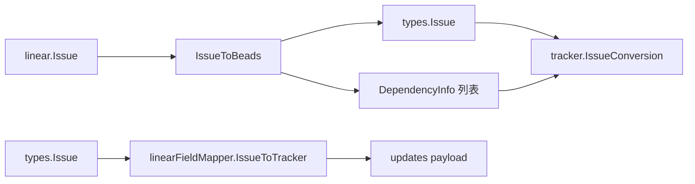

# linear_mapping_and_field_translation

`linear_mapping_and_field_translation`（`internal.linear.mapping.*` + `internal.linear.fieldmapper.linearFieldMapper`）是 Linear 集成的“语义齿轮箱”。如果 `Tracker` 解决的是“接口能不能对接”，这一层解决的是“字段含义会不会错位”。

打个比方：Linear 和 Beads 都说“优先级、状态、类型、依赖”，但词汇和编码不同。这个模块就是同声传译，不仅翻译单词，还处理语境（比如 `blockedBy` 关系方向要反转）。

## 核心抽象

- `MappingConfig`：四张映射表（`PriorityMap`/`StateMap`/`LabelTypeMap`/`RelationMap`），可配置覆盖。
- `LoadMappingConfig(ConfigLoader)`：从 `linear.*_map.*` 配置键加载覆盖，默认回退 `DefaultMappingConfig`。
- `linearFieldMapper`：实现 `tracker.FieldMapper`，把具体转换能力暴露给同步引擎。
- `IssueToBeads` / `BuildLinearToLocalUpdates`：分别用于 pull 方向的“完整转入”与冲突时“局部字段回灌”。

## 关键数据流

最关键的两个方向：
- **Linear -> Beads**：`IssueToBeads` 解析时间、映射 priority/status/type、保留 labels、规范 external_ref，并额外提取 `DependencyInfo`（父子 + relations）。
- **Beads -> Linear**：`IssueToTracker` 只生成必要更新字段（`title`/`description`/`priority`），状态由 `Tracker.findStateID` 另行补齐。

## 非显而易见但重要的选择

- `IssueConversion.Issue` 使用 `interface{}`：明确是为了避免循环依赖。代价是运行时断言；收益是包边界更干净。
- `StateToBeadsStatus` 先看 `state.Type` 再看 `state.Name`：优先标准语义，兼容团队自定义 workflow 名称。
- `RelationToBeadsDep` + `IssueToBeads` 中对 `blockedBy`/`blocks` 做方向反转：这是依赖语义正确性的关键，否则图会反。
- `NormalizeIssueForLinearHash` 会把 description 归一化（拼接 Acceptance Criteria/Design/Notes），并 canonicalize Linear URL，用于减少假冲突。

## ID 生成策略（导入场景）

`GenerateIssueIDs` 采用“长度递增 + nonce 重试”策略：
- 长度范围默认 6~8，可配置且会被约束到 3~8；
- 每个长度最多 10 个 nonce；
- 支持 `UsedIDs` 预填充，避免与 DB 已有 ID 冲突。

这是一个典型的正确性优先策略：宁可在极端碰撞时返回 error，也不生成重复 ID。

## 新贡献者注意事项

- 不要绕开 `MappingConfig` 直接写硬编码映射，否则多团队配置能力会失效。
- `LabelToIssueType` 既支持精确匹配也支持子串匹配，关键词过短会造成误判（比如把很多标签都映射成 bug）。
- `PriorityToLinear` 是通过反转 `PriorityMap` 构建逆映射；若配置出现多对一，逆映射会有覆盖风险。

## 相关文档

- [linear_tracker_adapter_layer](linear_tracker_adapter_layer.md)
- [linear_api_types_and_payloads](linear_api_types_and_payloads.md)
- [sync_statistics_and_conflicts](sync_statistics_and_conflicts.md)
- [tracker_plugin_contracts](tracker_plugin_contracts.md)
