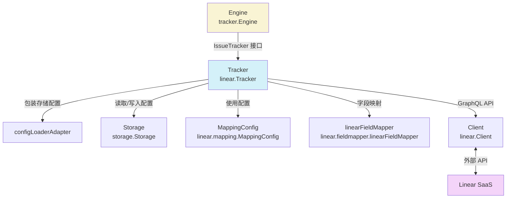

# Linear Tracker 模块深度解析

## 1. 什么问题？为什么需要这个模块？

在深入代码之前，让我们先理解问题空间。`linear_tracker` 模块是 `beads` 系统与 Linear 项目管理工具之间的**集成桥梁**。它解决的核心问题是：

**如何让一个本地工作管理系统（beads）与外部 SaaS 工具（Linear）双向同步问题数据，同时保持各自领域模型的语义完整性？**

一个简单的 HTTP 客户端包装器是不够的，因为：
1. 两个系统有不同的领域模型：beads 使用本地的 `Issue` 类型，而 Linear 有自己的 GraphQL API 响应结构
2. 需要双向数据映射：不仅要读取 Linear 问题到本地，还要将本地变更推回 Linear
3. 状态转换规则复杂：Linear 的工作流状态（Workflow States）与 beads 的状态（Status）不是一一对应的，需要智能映射
4. 配置管理：需要从环境变量或存储中读取 API 密钥、团队 ID 等配置项

这个模块的设计洞察是：**将外部系统的所有细节封装在一个统一的接口后面**，让系统的其他部分不必关心是在和 Linear、GitLab 还是其他工具交互。

---

## 2. 心智模型：把它想象成"语言翻译官"

理解 `linear_tracker` 的最佳方式是把它想象成一个**翻译官**：

- 它懂两种语言：beads 的内部语言（`types.Issue`）和 Linear 的语言（`linear.Issue`）
- 它有一本字典（`MappingConfig`）告诉它如何翻译词汇（优先级、状态等）
- 它有一个护照（API 客户端），可以合法地进出 Linear 的领土
- 当你需要和 Linear 交流时，你用 beads 语说话，它帮你翻译成 Linear 语并传达过去
- 当 Linear 有话要说时，它翻译成 beads 语告诉你

这种翻译官模式的好处是：系统的其他部分不需要学习 Linear 的语言，它们只需要和翻译官用 beads 语交流即可。

---

## 3. 架构与数据流向



### 关键组件角色

| 组件 | 角色 | 核心职责 |
|------|------|----------|
| `Tracker` | 主协调者 | 实现 `IssueTracker` 接口，协调所有 Linear 集成操作 |
| `configLoaderAdapter` | 适配器 | 将 `storage.Storage` 适配为 Linear 模块需要的 `ConfigLoader` 接口 |
| `Client` | 外部 API 客户端 | 封装 Linear GraphQL API 调用（在 `linear.types` 中） |
| `linearFieldMapper` | 字段翻译官 | 处理 beads 和 Linear 之间的字段值映射 |
| `MappingConfig` | 配置字典 | 存储优先级、状态等映射规则 |

### 典型数据流向（同步操作）

1. **初始化阶段**：
   - `Engine` 调用 `Tracker.Init()`
   - `Tracker` 从 `Storage` 读取配置（或环境变量）
   - 创建 `Client` 和加载 `MappingConfig`

2. **拉取问题（Pull）**：
   - `Engine` 调用 `Tracker.FetchIssues()`
   - `Tracker` 通过 `Client` 从 Linear 获取 `Issue` 对象
   - 调用 `linearToTrackerIssue()` 将 `linear.Issue` 转换为 `tracker.TrackerIssue`
   - 返回给 `Engine`，后续通过 `FieldMapper` 转换为 `types.Issue`

3. **推送问题（Push）**：
   - `Engine` 调用 `Tracker.CreateIssue()` 或 `UpdateIssue()`
   - `Tracker` 使用 `FieldMapper` 将 `types.Issue` 转换为 Linear 字段
   - 通过 `Client` 调用 Linear API
   - 将返回的 `linear.Issue` 转换回 `tracker.TrackerIssue`

---

## 4. 核心组件深度解析

### 4.1 `Tracker` 结构体

```go
type Tracker struct {
    client    *Client
    config    *MappingConfig
    store     storage.Storage
    teamID    string
    projectID string
}
```

**设计意图**：这是整个 Linear 集成的"门面"（Facade）。它持有所有需要的依赖项，并实现 `IssueTracker` 接口，让外部系统可以通过统一接口与 Linear 交互。

**关键点**：
- 注意它如何同时持有 `client`（外部 API）、`store`（内部存储）和 `config`（映射规则）—— 它是三个世界的交汇点
- `teamID` 是必需的，而 `projectID` 是可选的，反映了 Linear 的数据模型（问题属于团队，可以关联项目）

### 4.2 `Init` 方法

```go
func (t *Tracker) Init(ctx context.Context, store storage.Storage) error {
    // 1. 保存存储引用
    t.store = store
    
    // 2. 获取 API 密钥和团队 ID（配置优先，环境变量兜底）
    apiKey, err := t.getConfig(ctx, "linear.api_key", "LINEAR_API_KEY")
    // ... 错误处理 ...
    
    teamID, err := t.getConfig(ctx, "linear.team_id", "LINEAR_TEAM_ID")
    // ... 错误处理 ...
    t.teamID = teamID
    
    // 3. 创建客户端
    client := NewClient(apiKey, teamID)
    
    // 4. 可选配置：API 端点和项目 ID
    if endpoint, _ := store.GetConfig(ctx, "linear.api_endpoint"); endpoint != "" {
        client = client.WithEndpoint(endpoint)
    }
    // ... 项目 ID 类似处理 ...
    
    // 5. 加载映射配置
    t.client = client
    t.config = LoadMappingConfig(&configLoaderAdapter{ctx: ctx, store: store})
    return nil
}
```

**设计意图**：初始化是一个很好的例子，展示了如何优雅地处理配置源优先级：**存储配置 > 环境变量**。这种设计让用户可以在不同环境中灵活配置（开发时用环境变量，生产时用存储配置）。

**值得注意的细节**：
- 使用 `_` 忽略 `store.GetConfig` 的错误 — 这是有意为之，因为这些是可选配置
- `configLoaderAdapter` 的使用：这是适配器模式的典型应用，将 `storage.Storage` 接口转换为 `ConfigLoader` 接口

### 4.3 `FetchIssues` 和 `FetchIssue` 方法

```go
func (t *Tracker) FetchIssues(ctx context.Context, opts tracker.FetchOptions) ([]tracker.TrackerIssue, error) {
    // 1. 准备状态参数
    state := opts.State
    if state == "" {
        state = "all"
    }
    
    // 2. 调用客户端获取 Linear 问题
    var issues []Issue
    var err error
    if opts.Since != nil {
        issues, err = t.client.FetchIssuesSince(ctx, state, *opts.Since)
    } else {
        issues, err = t.client.FetchIssues(ctx, state)
    }
    
    // 3. 转换为统一的 TrackerIssue 格式
    result := make([]tracker.TrackerIssue, 0, len(issues))
    for _, li := range issues {
        result = append(result, linearToTrackerIssue(&li))
    }
    return result, nil
}
```

**设计意图**：这个方法展示了**防腐层（Anticorruption Layer）**模式的应用。它将外部系统的数据模型（`linear.Issue`）转换为内部系统能理解的模型（`tracker.TrackerIssue`），防止外部系统的设计"污染"内部系统。

### 4.4 `CreateIssue` 和 `UpdateIssue` 方法

让我们看 `UpdateIssue`，因为它更有趣：

```go
func (t *Tracker) UpdateIssue(ctx context.Context, externalID string, issue *types.Issue) (*tracker.TrackerIssue, error) {
    // 1. 使用字段映射器构建更新字段
    mapper := t.FieldMapper()
    updates := mapper.IssueToTracker(issue)
    
    // 2. 特殊处理：查找并设置状态 ID（因为状态变更需要推送到 Linear）
    stateID, err := t.findStateID(ctx, issue.Status)
    if err != nil {
        return nil, fmt.Errorf("finding state for status %s: %w", issue.Status, err)
    }
    if stateID != "" {
        updates["stateId"] = stateID
    }
    
    // 3. 调用客户端 API
    updated, err := t.client.UpdateIssue(ctx, externalID, updates)
    if err != nil {
        return nil, err
    }
    
    // 4. 转换回统一格式
    ti := linearToTrackerIssue(updated)
    return &ti, nil
}
```

**设计意图**：注意这里的"特殊处理"部分 — 为什么我们不在 `FieldMapper` 中处理状态 ID 呢？因为查找状态 ID 需要调用 Linear API，而 `FieldMapper` 被设计为无状态的纯映射器。这是一个**关注点分离**的好例子：
- `FieldMapper` 负责静态值映射
- `Tracker` 负责需要外部调用的动态映射

### 4.5 `findStateID` 方法

```go
func (t *Tracker) findStateID(ctx context.Context, status types.Status) (string, error) {
    // 1. 将 beads 状态转换为 Linear 状态类型
    targetType := StatusToLinearStateType(status)
    
    // 2. 获取团队的所有工作流状态
    states, err := t.client.GetTeamStates(ctx)
    if err != nil {
        return "", err
    }
    
    // 3. 查找匹配的状态类型
    for _, s := range states {
        if s.Type == targetType {
            return s.ID, nil
        }
    }
    
    // 4. 兜底策略：如果找不到，返回第一个状态
    if len(states) > 0 {
        return states[0].ID, nil
    }
    return "", fmt.Errorf("no workflow states found")
}
```

**设计意图**：这个方法体现了**防御性编程**的思想。它不假设一定能找到完美匹配的状态，而是提供了兜底策略。这在实际集成中非常重要，因为不同的 Linear 团队可能有不同的工作流配置。

### 4.6 `configLoaderAdapter` 结构体

```go
type configLoaderAdapter struct {
    ctx   context.Context
    store storage.Storage
}

func (c *configLoaderAdapter) GetAllConfig() (map[string]string, error) {
    return c.store.GetAllConfig(c.ctx)
}
```

**设计意图**：这是一个微型的适配器模式示例。`LoadMappingConfig` 函数需要一个 `ConfigLoader` 接口，但我们有的是 `storage.Storage` 接口。与其修改 `Storage` 接口或 `LoadMappingConfig` 函数，不如创建一个简单的适配器将两者连接起来。

### 4.7 `linearToTrackerIssue` 函数

这是一个未导出的辅助函数，但它是数据转换的核心：

```go
func linearToTrackerIssue(li *Issue) tracker.TrackerIssue {
    ti := tracker.TrackerIssue{
        ID:          li.ID,
        Identifier:  li.Identifier,
        URL:         li.URL,
        Title:       li.Title,
        Description: li.Description,
        Priority:    li.Priority,
        Labels:      make([]string, 0),
        Raw:         li,  // 重要：保留原始数据
    }
    
    // 处理可选字段
    if li.State != nil {
        ti.State = li.State
    }
    // ... 处理其他可选字段 ...
    
    // 解析时间戳
    if t, err := time.Parse(time.RFC3339, li.CreatedAt); err == nil {
        ti.CreatedAt = t
    }
    // ... 其他时间戳 ...
    
    return ti
}
```

**设计意图**：注意两个关键设计决策：
1. **保留原始数据**：`Raw: li` 让后续代码如果需要访问 Linear 特定字段时可以绕过统一模型
2. **优雅的可选字段处理**：使用 `if li.X != nil` 检查，避免空指针恐慌

---

## 5. 依赖分析

### 5.1 被谁依赖（上游）

- **`tracker.Engine`**：这是主要的调用者，它通过 `IssueTracker` 接口使用 `Tracker`
- **CLI 命令**：例如 `cmd.bd.linear` 包中的命令可能直接使用 `BuildStateCacheFromTracker`

### 5.2 依赖谁（下游）

| 依赖 | 用途 | 耦合度 |
|------|------|--------|
| `storage.Storage` | 读取配置 | 中（通过接口，可替换） |
| `linear.Client` | 调用 Linear API | 高（同一模块内部） |
| `linear.MappingConfig` | 字段映射规则 | 高（同一模块内部） |
| `linearFieldMapper` | 字段值转换 | 高（同一模块内部） |
| `tracker` 包类型 | 接口定义和数据模型 | 中（通过接口，相对稳定） |
| `types` 包类型 | 核心领域模型 | 高（核心类型） |

### 5.3 数据契约

**输入契约**（Tracker 期望从上游得到）：
- `types.Issue`：必须有 `Title`、`Status` 等关键字段
- `tracker.FetchOptions`：可选的 `State` 和 `Since` 参数

**输出契约**（Tracker 保证给上游）：
- `tracker.TrackerIssue`：保证填充 `ID`、`Identifier`、`URL`、`Title` 等核心字段
- 错误：如果 API 调用失败或配置无效，返回有意义的错误信息

---

## 6. 设计决策与权衡

### 6.1 决策 1：通过接口而非具体类型交互

**选择**：`Tracker` 实现 `IssueTracker` 接口，`Engine` 通过接口调用。

**为什么**：
- 让系统可以轻松支持多个 tracker（Linear、GitLab、Jira）
- 便于测试：可以用 mock 实现替换真实的 Tracker
- 符合开闭原则：对扩展开放，对修改关闭

**权衡**：
- ✅ 优点：灵活性高，可测试性好
- ❌ 缺点：增加了一层间接性，理解代码需要跳转到接口定义

### 6.2 决策 2：配置源优先级（存储 > 环境变量）

**选择**：先尝试从存储读取配置，如果没有再看环境变量。

**为什么**：
- 存储配置更适合生产环境：可以动态更改，无需重启
- 环境变量更适合开发环境：易于在本地设置
- 这种优先级让用户可以根据场景选择

**权衡**：
- ✅ 优点：灵活性高，适应不同环境
- ❌ 缺点：如果两个地方都配置了，可能造成困惑（存储的会覆盖环境变量）

### 6.3 决策 3：保留原始数据在 `Raw` 字段

**选择**：在 `TrackerIssue` 中保留完整的 `linear.Issue` 原始对象。

**为什么**：
- 承认统一模型不可能覆盖所有场景
- 让特殊需求可以绕过统一模型直接访问原始数据
- 为未来的扩展留出空间

**权衡**：
- ✅ 优点：提供了"逃生舱"，特殊情况可以处理
- ❌ 缺点：破坏了封装，如果滥用会导致代码依赖 Linear 特定结构

### 6.4 决策 4：状态查找的兜底策略

**选择**：如果找不到匹配的状态类型，就返回第一个状态。

**为什么**：
- 实际集成中，不同团队的工作流配置差异很大
- 宁可设置一个不太对的状态，也不要让整个同步失败
- 这是"最终一致性"优于"完全不工作"的哲学

**权衡**：
- ✅ 优点：提高了集成的健壮性
- ❌ 缺点：可能导致状态设置不正确，需要用户事后手动修正

---

## 7. 使用与示例

### 7.1 基本使用（通过 Engine）

通常你不会直接使用 `Tracker`，而是通过 `tracker.Engine`：

```go
// 假设 engine 已经初始化
issues, err := engine.Pull(ctx, tracker.SyncOptions{})
// ... 处理 issues ...
```

### 7.2 直接使用 Tracker（特殊场景）

```go
// 初始化
tracker := &linear.Tracker{}
err := tracker.Init(ctx, store)
if err != nil {
    log.Fatal(err)
}

// 拉取问题
issues, err := tracker.FetchIssues(ctx, tracker.FetchOptions{State: "started"})
if err != nil {
    log.Fatal(err)
}

// 创建问题
newIssue := &types.Issue{
    Title:  "Fix login bug",
    Status: types.StatusTodo,
}
created, err := tracker.CreateIssue(ctx, newIssue)
if err != nil {
    log.Fatal(err)
}
```

### 7.3 配置选项

| 配置键 | 环境变量 | 必需 | 说明 |
|--------|----------|------|------|
| `linear.api_key` | `LINEAR_API_KEY` | 是 | Linear API 密钥 |
| `linear.team_id` | `LINEAR_TEAM_ID` | 是 | Linear 团队 ID |
| `linear.project_id` | `LINEAR_PROJECT_ID` | 否 | Linear 项目 ID（可选） |
| `linear.api_endpoint` | - | 否 | Linear API 端点（用于测试或私有实例） |

---

## 8. 边缘情况与陷阱

### 8.1 陷阱 1：状态映射不完美

**问题**：Linear 的工作流状态可以自定义，beads 的状态是固定的，映射可能不准确。

**缓解**：
- 使用 `MappingConfig` 自定义映射规则
- 注意 `findStateID` 的兜底行为，如果需要精确控制，考虑在配置中指定状态 ID

### 8.2 陷阱 2：`Raw` 字段的滥用

**问题**：代码可能开始依赖 `TrackerIssue.Raw` 中的 Linear 特定字段，导致耦合。

**缓解**：
- 代码审查时注意对 `Raw` 字段的使用
- 如果某个字段经常被访问，考虑将其添加到 `TrackerIssue` 的标准字段中

### 8.3 陷阱 3：配置优先级混淆

**问题**：用户在环境变量和存储中都设置了配置，不明白为什么环境变量没有生效。

**缓解**：
- 文档明确说明优先级（存储 > 环境变量）
- 考虑在日志中输出配置来源（虽然当前代码没有这样做）

### 8.4 边缘情况：空工作流状态

**问题**：如果 Linear 团队没有任何工作流状态，`findStateID` 会返回错误。

**缓解**：
- 这种情况在实际中几乎不可能发生（Linear 创建团队时会设置默认工作流）
- 如果确实发生，错误信息很明确："no workflow states found"

---

## 9. 相关模块链接

- [Tracker Integration Framework](tracker_integration_framework.md)：了解 `IssueTracker` 接口和 `Engine`
- [Linear Types](linear_integration.md#linear_types)：了解 `Client` 和 `Issue` 类型
- [Linear Field Mapper](linear_integration.md#linear_fieldmapper)：了解字段映射细节
- [Linear Mapping](linear_integration.md#linear_mapping)：了解映射配置

---

## 总结

`linear_tracker` 模块是一个设计良好的集成层示例。它通过以下方式解决了复杂的外部系统集成问题：

1. **接口抽象**：使用 `IssueTracker` 接口隔离外部系统细节
2. **适配器模式**：使用 `configLoaderAdapter` 连接不兼容的接口
3. **防腐层**：通过 `linearToTrackerIssue` 等转换函数防止外部模型污染内部模型
4. **防御性编程**：提供兜底策略处理不完美的映射
5. **关注点分离**：将静态映射和动态 API 调用分开

对于新贡献者，关键是理解"翻译官"这个心智模型，以及数据如何在 beads 和 Linear 之间流动。记住：**Tracker 的工作是让外部系统看起来像是 beads 的一部分，而不是让 beads 变成外部系统的一部分**。
