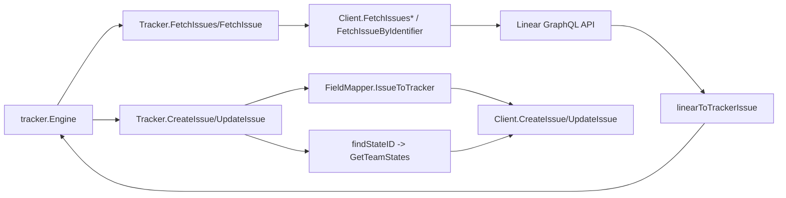

# linear_tracker_adapter_layer

`linear_tracker_adapter_layer`（`internal.linear.tracker.Tracker` + `configLoaderAdapter`）是 Linear 集成里真正“接上总线”的那一层。你可以把它理解为一个插头转换器：上游同步引擎只认 `tracker.IssueTracker` 统一接口，而 Linear 只认 GraphQL、Team state、Linear URL 语义。`Tracker` 的存在就是把这两边电压和插座形状对齐。

## 核心职责

1. **初始化与配置装配**：`Init` 从 `storage.Storage` 读取 `linear.api_key` / `linear.team_id`（并回退 `LINEAR_API_KEY` / `LINEAR_TEAM_ID`），构造 `NewClient`，可选附加 `linear.api_endpoint` 与 `linear.project_id`。
2. **同步入口适配**：实现 `FetchIssues`、`FetchIssue`、`CreateIssue`、`UpdateIssue`，把 Linear 的 `Issue` 转换成 `tracker.TrackerIssue`，或把本地 `*types.Issue` 转成 Linear 更新 payload。
3. **引用协议定义**：通过 `IsExternalRef`、`ExtractIdentifier`、`BuildExternalRef` 统一 external_ref 的识别与生成。
4. **状态解析桥接**：`findStateID` 用 `StatusToLinearStateType` + `GetTeamStates` 找到具体 `stateId`，让 Beads status 能真正落到 Linear workflow。

## 端到端数据流（关键路径）

叙述版：
- **Pull**：引擎调用 `FetchIssues`，`Tracker` 根据 `opts.Since` 选择 `Client.FetchIssues` 或 `Client.FetchIssuesSince`，再用 `linearToTrackerIssue` 逐条转成统一模型。
- **Push**：引擎给 `CreateIssue`/`UpdateIssue` 一个本地 issue，`Tracker` 先用 `FieldMapper().IssueToTracker` 生成字段更新，再强制补上 `stateId`（通过 `findStateID`），最后调用 `Client` 写回 Linear。

## 关键设计取舍

- **简化优先**：`Validate` 只检查 `t.client != nil`，不做网络探活。好处是初始化快；代价是权限/网络问题要到首次 API 调用才暴露。
- **配置解耦优先**：`configLoaderAdapter` 只暴露 `GetAllConfig()` 给 `LoadMappingConfig`，避免 mapping 层直接依赖 storage 包。
- **可用性优先于严格映射**：`findStateID` 找不到匹配类型时回退到第一个 state；保证请求可发，但语义可能不理想（比如团队 workflow 非标准）。

## 隐式契约与坑

- `UpdateIssue(ctx, externalID, ...)` 的 `externalID` 必须是 Linear 内部 issue UUID（来自 `tracker.TrackerIssue.ID`），不是 `TEAM-123`。
- `BuildExternalRef` 会 canonicalize URL（去 slug）；这对冲突检测哈希稳定性有帮助，但要求全链路都接受 canonical 形式。
- `FetchIssues` 默认 `state == "all"`；如果上游忘了传 state，不会自动只取 open。

## 相关文档

- [linear_api_types_and_payloads](linear_api_types_and_payloads.md)
- [mapping_and_field_translation](linear_mapping_and_field_translation.md)
- [sync_statistics_and_conflicts](sync_statistics_and_conflicts.md)
- [tracker_plugin_contracts](tracker_plugin_contracts.md)
- [sync_orchestration_engine](sync_orchestration_engine.md)
