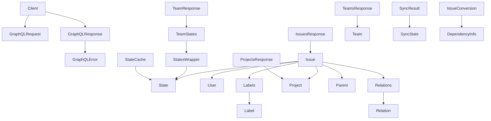

# Linear Types 模块技术深度解析

## 1. 模块概述

`linear_types` 模块是 Linear 问题跟踪系统与 Beads 内部系统之间的桥梁。它定义了与 Linear GraphQL API 交互所需的所有数据类型、请求/响应结构以及核心配置。这个模块解决的核心问题是如何在两个具有不同数据模型的系统之间建立清晰、类型安全的映射关系，同时处理 API 通信的复杂性。

想象一下，这个模块就像是两个国家之间的大使馆——它理解两种语言（Linear 的 GraphQL API 和 Beads 的内部类型系统），管理通信协议，处理翻译工作，并确保信息在两个系统之间准确传递。

## 2. 架构设计

### 2.1 核心组件关系图



### 2.2 架构角色与数据流

这个模块在整个系统中扮演着**适配器层**的角色，主要负责：

1. **API 通信契约**：定义了与 Linear GraphQL API 交互的精确格式，包括请求结构（`GraphQLRequest`）和响应结构（`GraphQLResponse`、`IssuesResponse` 等）
2. **数据模型映射**：提供了 Linear 数据模型（`Issue`、`Project`、`User` 等）与 Beads 内部类型之间的转换基础
3. **同步状态管理**：跟踪同步操作的统计信息（`SyncStats`、`PullStats`、`PushStats`）和冲突信息（`Conflict`）
4. **缓存优化**：通过 `StateCache` 减少不必要的 API 调用

数据流动的典型路径是：
1. `Client` 构造 `GraphQLRequest` 发送到 Linear API
2. 接收 `GraphQLResponse` 并解析为具体类型（如 `IssuesResponse`）
3. 将 Linear 类型（`Issue`）转换为 Beads 内部类型，过程中使用 `IssueConversion` 和 `DependencyInfo`
4. 同步操作完成后，生成 `SyncResult` 包含 `SyncStats` 和可能的 `Conflict` 信息

## 3. 核心组件深度解析

### 3.1 Client 结构体

**目的**：提供与 Linear GraphQL API 交互的配置入口点。

**设计意图**：这个结构体封装了所有必要的认证和配置信息，使 API 调用可以在不同环境（开发、生产）和不同团队/项目之间轻松切换。注意 `ProjectID` 是可选的，这允许在团队级别或项目级别进行操作，提供了灵活性。

**关键参数**：
- `APIKey`：Linear API 认证密钥
- `TeamID`：目标团队的标识符
- `ProjectID`：可选的项目过滤器
- `Endpoint`：GraphQL API 端点（默认使用 `DefaultAPIEndpoint`）
- `HTTPClient`：自定义 HTTP 客户端，用于测试或特殊网络配置

### 3.2 Issue 结构体

**目的**：表示 Linear 系统中的问题，是整个模块的核心数据结构。

**设计意图**：这个结构体精确映射了 Linear GraphQL API 返回的问题数据结构。注意许多字段都是指针类型（如 `*State`、`*User`），这是因为 Linear API 可能不会在所有上下文中返回所有字段，使用指针可以明确表示字段的存在性。

**关键字段**：
- `Identifier`：人类可读的问题标识符（如 "TEAM-123"），这是用户在 Linear 界面中看到的标识
- `Priority`：优先级数值（0-4），表示问题的重要性
- `State`：工作流状态，表示问题在开发流程中的位置
- `Relations`：问题之间的关系，用于构建依赖图
- `CompletedAt`：可选的完成时间戳，仅在问题已完成时存在

### 3.3 State 与 StateCache

**目的**：表示 Linear 的工作流状态，并提供缓存机制避免重复 API 调用。

**设计意图**：工作流状态在 Linear 中相对稳定，但在同步过程中会频繁访问。`StateCache` 的设计是一个明显的性能优化——它缓存了团队的所有状态，并提供了按 ID 查找的映射，还特别缓存了"开放"状态的 ID，这是创建新问题时的常用默认值。

**关键特性**：
- `State.Type`：标准化的状态类型（"backlog"、"unstarted"、"started"、"completed"、"canceled"），用于跨团队的状态语义理解
- `StateCache.OpenStateID`：预定义的开放状态，简化了新问题创建流程

### 3.4 Relation 与 DependencyInfo

**目的**：表示问题之间的关系，并在系统转换过程中传递依赖信息。

**设计意图**：这里有一个重要的关注点分离——`Relation` 表示 Linear API 返回的原始关系数据，而 `DependencyInfo` 则是为 Beads 内部系统设计的转换后结构。注意 `DependencyInfo` 存储的是 Linear 标识符而不是内部 ID，这是因为依赖关系的解析需要在所有问题都导入后才能进行，这是一个典型的批处理设计模式。

**关系类型**：
- "blocks"：一个问题阻塞另一个问题
- "blockedBy"：一个问题被另一个问题阻塞
- "duplicate"：重复问题
- "related"：一般相关关系

### 3.5 SyncStats 与 Conflict

**目的**：跟踪同步操作的统计信息和冲突情况。

**设计意图**：同步操作是复杂的，可能部分成功部分失败。这些结构提供了详细的反馈，帮助用户理解同步过程中发生了什么。`Conflict` 结构体的设计特别值得注意——它包含了足够的信息来进行手动冲突解决，包括两个版本的修改时间、Linear 问题的 URL 和标识符，以及内部和外部 ID。

**关键统计指标**：
- `Pulled`/`Pushed`：从 Linear 拉取/向 Linear 推送的问题数量
- `Created`/`Updated`：创建/更新的问题数量
- `Skipped`：跳过的问题数量（可能是因为没有变化）
- `Conflicts`：检测到的冲突数量
- `Errors`：发生的错误数量

### 3.6 GraphQLRequest 与 GraphQLResponse

**目的**：定义与 Linear GraphQL API 通信的标准格式。

**设计意图**：这些结构提供了类型安全的 GraphQL 通信抽象。`GraphQLResponse` 的 `Data` 字段是 `[]byte` 类型，这是一个有意的设计选择——它允许灵活地将数据解析为不同的具体类型（如 `IssuesResponse`、`ProjectsResponse` 等），同时仍然提供了统一的错误处理机制。

**错误处理**：`GraphQLError` 包含了消息、路径和扩展代码，这对于调试 GraphQL 查询问题非常宝贵。

## 4. 依赖关系分析

### 4.1 被依赖模块

`linear_types` 是一个相对独立的模块，主要依赖标准库：
- `net/http`：用于 HTTP 通信
- `time`：用于时间处理和超时控制

### 4.2 依赖此模块的模块

根据模块树结构，以下模块依赖于 `linear_types`：
- [linear_tracker](linear_tracker.md)：使用这些类型实现 `IssueTracker` 接口
- [linear_fieldmapper](linear_fieldmapper.md)：使用这些类型进行字段映射
- [linear_mapping](linear_mapping.md)：使用这些类型进行配置和 ID 生成

### 4.3 数据契约

这个模块定义了几个重要的隐含契约：
1. **时间格式契约**：所有时间戳（如 `CreatedAt`、`UpdatedAt`）都是 ISO 8601 格式的字符串
2. **可选字段契约**：指针字段表示可能不存在的数据，使用前必须检查 nil
3. **分页契约**：所有列表查询响应（`IssuesResponse`、`ProjectsResponse`）都包含 `PageInfo`，支持游标分页
4. **标识符契约**：Linear 的 UUID 存储在 `ID` 字段，人类可读标识符存储在 `Identifier` 字段

## 5. 设计决策与权衡

### 5.1 指针 vs 值类型

**决策**：大多数可选字段使用指针类型。

**权衡**：
- ✅ 优点：明确表示字段的存在性，与 GraphQL 的 nullable 字段语义匹配
- ❌ 缺点：增加了 nil 检查的负担，可能导致空指针异常

**设计理由**：Linear API 在不同查询上下文中返回不同的字段集，使用指针可以精确表示这种不确定性，避免了使用零值可能导致的误解（例如，优先级为 0 是明确的"无优先级"，而不是字段缺失）。

### 5.2 扁平化 vs 嵌套结构

**决策**：采用与 Linear API 完全匹配的嵌套结构。

**权衡**：
- ✅ 优点：简化了 JSON 序列化/反序列化，与 API 文档直接对应
- ❌ 缺点：结构较为复杂，有些嵌套层级（如 `StatesWrapper`）看起来冗余

**设计理由**：保持与 API 结构的一致性是首要考虑，这使得代码更易于维护，因为可以直接参考 Linear 的 API 文档。那些看似冗余的包装结构（如 `Labels`、`Relations`）是 GraphQL 分页模式的直接反映。

### 5.3 同步与缓存策略

**决策**：提供 `StateCache` 来缓存工作流状态，但不缓存其他数据。

**权衡**：
- ✅ 优点：减少了高频访问但很少变化的数据的 API 调用
- ❌ 缺点：增加了状态管理的复杂性，可能导致缓存过期问题

**设计理由**：工作流状态是同步过程中最常访问的数据之一，但变化频率很低，是缓存的理想候选。其他数据（如问题、项目）变化频繁，缓存它们会带来更大的一致性风险。

### 5.4 错误处理策略

**决策**：在 `GraphQLResponse` 中包含错误数组，同时在 `SyncResult` 中提供高级错误摘要。

**权衡**：
- ✅ 优点：既提供了详细的技术错误信息，又提供了用户友好的摘要
- ❌ 缺点：错误信息在多个地方表示，可能导致不一致

**设计理由**：不同的消费者需要不同级别的错误细节——调试时需要完整的 GraphQL 错误，而用户界面只需要知道是否成功以及有多少错误。

## 6. 使用指南与最佳实践

### 6.1 Client 配置

```go
// 创建基本客户端
client := &linear.Client{
    APIKey:   "your-api-key",
    TeamID:   "your-team-id",
    Endpoint: linear.DefaultAPIEndpoint,
    HTTPClient: &http.Client{
        Timeout: linear.DefaultTimeout,
    },
}

// 创建带项目过滤的客户端
clientWithProject := &linear.Client{
    APIKey:    "your-api-key",
    TeamID:    "your-team-id",
    ProjectID: "your-project-id", // 只同步此项目的问题
}
```

### 6.2 处理可选字段

```go
// 错误示例：可能导致空指针异常
assigneeName := issue.Assignee.Name

// 正确示例：始终检查指针是否为 nil
var assigneeName string
if issue.Assignee != nil {
    assigneeName = issue.Assignee.Name
}
```

### 6.3 处理分页

```go
// 这个伪代码展示了如何处理分页响应
func fetchAllIssues(client *linear.Client) ([]linear.Issue, error) {
    var allIssues []linear.Issue
    var endCursor string
    
    for {
        // 构建包含游标（如果有）的查询
        // ...
        
        // 执行查询
        response, err := executeQuery(client, query)
        if err != nil {
            return nil, err
        }
        
        // 处理结果
        allIssues = append(allIssues, response.Issues.Nodes...)
        
        // 检查是否有更多页
        if !response.Issues.PageInfo.HasNextPage {
            break
        }
        
        endCursor = response.Issues.PageInfo.EndCursor
    }
    
    return allIssues, nil
}
```

### 6.4 状态缓存使用

```go
// 初始化状态缓存
func initializeStateCache(client *linear.Client) (*linear.StateCache, error) {
    // 从 API 获取团队状态
    states, err := fetchTeamStates(client)
    if err != nil {
        return nil, err
    }
    
    // 构建映射
    statesByID := make(map[string]linear.State)
    var openStateID string
    
    for _, state := range states {
        statesByID[state.ID] = state
        // 找到第一个"未开始"或"待办"状态
        if (state.Type == "unstarted" || state.Type == "backlog") && openStateID == "" {
            openStateID = state.ID
        }
    }
    
    return &linear.StateCache{
        States:      states,
        StatesByID:  statesByID,
        OpenStateID: openStateID,
    }, nil
}
```

## 7. 边缘情况与注意事项

### 7.1 时间戳处理

Linear 返回的时间戳是 ISO 8601 格式的字符串，但可能使用不同的精度或时区。始终使用 `time.Parse` 进行转换，并考虑时区问题：

```go
createdAt, err := time.Parse(time.RFC3339, issue.CreatedAt)
if err != nil {
    // 处理其他可能的时间格式
}
```

### 7.2 关系方向

Linear 的关系是有方向的，需要注意正确解释：
- 如果问题 A 有一个类型为 "blocks" 的关系指向问题 B，那么 A 阻塞 B
- 如果问题 A 有一个类型为 "blockedBy" 的关系指向问题 B，那么 A 被 B 阻塞

在导入关系时，要避免创建重复的依赖关系。

### 7.3 增量同步与 `PullStats.Incremental`

当进行增量同步时，`DependencyInfo` 可能不完整，因为只拉取了部分问题。在这种情况下，应该避免修改现有问题的依赖关系，或者采取特殊的处理策略。

### 7.4 项目 ID 可选性

当 `Client.ProjectID` 为空时，应该同步整个团队的问题；当它不为空时，应该只同步指定项目的问题。但是，问题之间的关系可能跨越项目边界，需要仔细处理。

### 7.5 状态类型的语义

虽然 `State.Type` 字段有标准化的值，但不同团队可能使用不同的工作流。例如，有些团队可能没有 "started" 状态，直接从 "unstarted" 到 "completed"。代码不应该假设所有状态类型都存在。

## 8. 总结

`linear_types` 模块是 Linear 集成的基础，它通过精心设计的数据类型和结构，解决了两个系统之间的数据映射和通信问题。其设计体现了几个关键原则：

1. **API 一致性**：数据结构与 Linear GraphQL API 保持一致
2. **明确的可选性**：使用指针明确表示可能缺失的字段
3. **性能考虑**：通过 `StateCache` 减少不必要的 API 调用
4. **详细的可观测性**：通过统计和冲突结构提供同步过程的可见性

对于新贡献者，理解这个模块的关键是认识到它不仅是数据结构的集合，更是两个系统之间的翻译层——每一个设计决策都反映了在保持 API 一致性、提供类型安全和处理实际同步问题之间的平衡。
