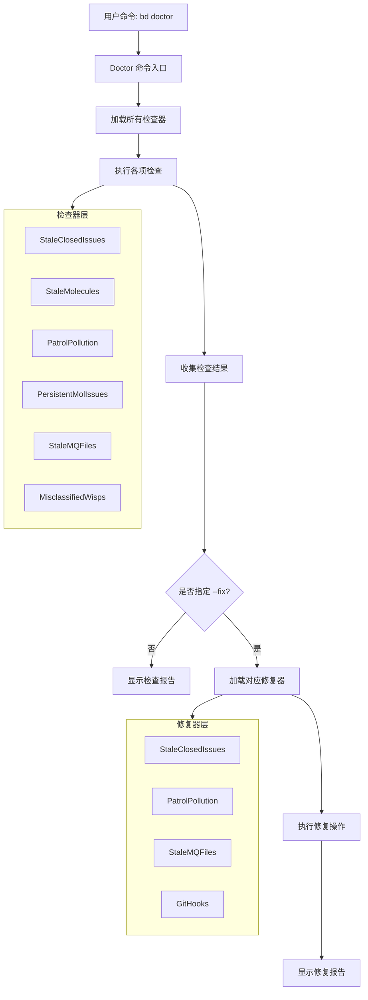

# Maintenance and Fix 模块技术深度分析

## 概述

`maintenance_and_fix` 模块是 Beads 系统中负责数据库维护、问题检测和自动修复的核心组件。它通过一系列精心设计的检查器和修复器，帮助保持数据库的健康状态，清理过期数据，检测配置问题，并提供自动修复功能。

## 目录

1. [问题空间与设计意图](#问题空间与设计意图)
2. [核心概念与心智模型](#核心概念与心智模型)
3. [架构设计与数据流](#架构设计与数据流)
4. [核心组件深度分析](#核心组件深度分析)
5. [依赖关系分析](#依赖关系分析)
6. [设计决策与权衡](#设计决策与权衡)
7. [使用指南与最佳实践](#使用指南与最佳实践)
8. [常见问题与注意事项](#常见问题与注意事项)

## 问题空间与设计意图

### 为什么需要这个模块？

在长期运行的项目管理系统中，数据库会逐渐积累各种"垃圾数据"：
- 已关闭但长期未清理的问题
- 临时生成的但未正确标记为临时的问题
- 过时的系统生成的记录
- 配置不当导致的重复或错误数据

这些问题会导致：
1. 数据库体积膨胀，影响性能
2. 查询结果包含不必要的旧数据
3. 用户界面显示混乱
4. 系统资源浪费

### 设计目标

该模块的设计目标是：
1. **自动化检测**：定期扫描数据库，识别需要维护的问题
2. **安全修复**：提供可配置的自动修复功能，避免误操作
3. **渐进式清理**：允许用户逐步清理，而非一次性大规模删除
4. **配置灵活**：通过配置文件控制清理策略，适应不同项目需求

## 核心概念与心智模型

### 关键概念

1. **Doctor Check（医生检查）**：
   - 类比：就像体检中的各项检查指标
   - 每个检查专注于一个特定类型的问题
   - 返回状态（OK/Warning/Error）和建议修复方案

2. **Fix Handler（修复处理器）**：
   - 对应每个检查的修复逻辑
   - 可以自动执行或由用户确认后执行
   - 提供详细的执行报告

3. **Maintenance Threshold（维护阈值）**：
   - 控制何时触发警告或修复的配置参数
   - 可以基于时间、数量或其他指标

### 心智模型

可以将该模块想象成一个**智能数据库管家**：

```
┌─────────────────────────────────────────────────────────┐
│                    数据库管家                              │
├─────────────────────────────────────────────────────────┤
│  ┌─────────────┐  ┌─────────────┐  ┌─────────────┐   │
│  │   stale      │  │  patrol     │  │   hooks     │   │
│  │  checker    │  │  checker    │  │  checker    │   │
│  └──────┬──────┘  └──────┬──────┘  └──────┬──────┘   │
│         │                 │                 │           │
│         └─────────────────┼─────────────────┘           │
│                           │                             │
│                  ┌────────▼────────┐                    │
│                  │   诊断引擎       │                    │
│                  └────────┬────────┘                    │
│                           │                             │
│         ┌─────────────────┼─────────────────┐           │
│         │                 │                 │           │
│  ┌──────▼──────┐  ┌──────▼──────┐  ┌──────▼──────┐   │
│  │  stale      │  │  patrol     │  │   hooks     │   │
│  │   fixer     │  │   fixer     │  │   fixer     │   │
│  └─────────────┘  └─────────────┘  └─────────────┘   │
└─────────────────────────────────────────────────────────┘
```

这个管家会：
1. 定期巡查数据库的各个角落
2. 发现问题时发出警告
3. 根据配置自动或手动修复问题
4. 提供详细的工作报告

## 架构设计与数据流

### 整体架构

该模块采用**检查-修复**分离的架构模式：



### 关键数据流

1. **检查流程**：
   ```
   命令入口 → 加载配置 → 打开数据库 → 执行检查 → 生成报告
   ```

2. **修复流程**：
   ```
   检查结果 → 验证工作区 → 加载配置 → 打开数据库 → 执行修复 → 报告结果
   ```

## 核心组件深度分析

### 1. 维护检查器（Maintenance Checkers）

#### CheckStaleClosedIssues

**目的**：检测可以清理的已关闭问题

**设计亮点**：
- 默认禁用（`stale_closed_issues_days=0`），避免意外删除
- 使用 SQL COUNT 查询而非加载所有问题，性能优化显著
- 区分"禁用但有大量关闭问题"的警告场景

**关键代码逻辑**：
```go
// 检查是否启用
if thresholdDays == 0 {
    // 检查是否有大量关闭问题需要警告
    var closedCount int
    db.QueryRow("SELECT COUNT(*) FROM issues WHERE status = 'closed'").Scan(&closedCount)
    // ...
}

// 查找可清理的问题
cutoff := time.Now().AddDate(0, 0, -thresholdDays).Format(time.RFC3339)
db.QueryRow(
    "SELECT COUNT(*) FROM issues WHERE status = 'closed' AND closed_at < ? AND (pinned = 0 OR pinned IS NULL)",
    cutoff,
).Scan(&cleanable)
```

**性能考量**：
- 旧方法：加载所有关闭问题 → 57秒（23k问题）
- 新方法：SQL COUNT 查询 → 亚秒级响应

#### CheckPatrolPollution

**目的**：检测巡逻操作产生的污染数据

**检测模式**：
- 巡逻摘要：标题匹配 `"Digest: mol-*-patrol"`
- 会话结束：标题匹配 `"Session ended: *"`

**设计特点**：
- 使用阈值控制警告触发（PatrolDigestThreshold=10, SessionBeadThreshold=50）
- 提供样本ID便于用户验证
- 分离检测逻辑（`detectPatrolPollution`）便于测试

### 2. 外部钩子管理器集成（External Hook Managers）

#### DetectExternalHookManagers

**目的**：检测项目中使用的外部Git钩子管理工具

**支持的工具**：
- lefthook
- husky
- pre-commit / prek
- overcommit
- yorkie
- simple-git-hooks

**设计亮点**：
- 优先级顺序检测，避免重复报告
- 支持多种配置文件格式和位置
- 区分"配置文件存在"和"实际激活"

#### DetectActiveHookManager

**目的**：通过读取实际的Git钩子确定哪个管理器真正激活

**优势**：
- 比仅检查配置文件更可靠
- 处理多个管理器共存的情况
- 尊重 `core.hooksPath` 配置

**实现细节**：
```go
// 获取git common dir（处理工作树）
git rev-parse --git-common-dir

// 检查自定义hooks路径
git config --get core.hooksPath

// 检查常见钩子的管理器签名
for _, hookName := range []string{"pre-commit", "pre-push", "post-merge"} {
    // 读取钩子内容，匹配管理器模式
}
```

### 3. 修复处理器（Fix Handlers）

#### StaleClosedIssues

**目的**：删除过期的已关闭问题

**安全特性**：
- 默认禁用，需要显式配置
- 跳过置顶问题（pinned issues）
- 提供详细的删除/跳过统计

**注意**：当前版本对Dolt后端跳过此修复

#### PatrolPollution

**目的**：删除巡逻污染数据

**流程**：
1. 查询所有非临时问题
2. 识别匹配污染模式的问题
3. 批量删除
4. 报告删除统计

### 4. 辅助数据结构

#### patrolPollutionResult

```go
type patrolPollutionResult struct {
    PatrolDigestCount int      // 巡逻摘要数量
    SessionBeadCount  int      // 会话结束bead数量
    PatrolDigestIDs   []string // 样本ID（最多3个）
    SessionBeadIDs    []string // 样本ID（最多3个）
}
```

#### HookIntegrationStatus

```go
type HookIntegrationStatus struct {
    Manager          string   // 钩子管理器名称
    HooksWithBd      []string // 已集成bd的钩子
    HooksWithoutBd   []string // 未集成bd的钩子
    HooksNotInConfig []string // 完全未配置的钩子
    Configured       bool     // 是否有任何bd集成
    DetectionOnly    bool     // 是否仅检测（无法验证配置）
}
```

## 依赖关系分析

### 内部依赖

1. **配置系统**：
   - `configfile.Config`：读取维护阈值配置
   - `configfile.BackendCapabilities`：检查后端特性

2. **存储系统**：
   - `dolt.Store`：数据库访问
   - `dolt.Config`：存储配置

3. **类型系统**：
   - `types.Issue`：问题数据结构
   - `types.IssueFilter`：问题过滤
   - `types.Status`：问题状态

### 外部依赖

1. **文件系统操作**：
   - `os`：文件读写
   - `filepath`：路径处理

2. **配置解析**：
   - `yaml.v3`：YAML配置解析
   - `github.com/BurntSushi/toml`：TOML配置解析
   - `encoding/json`：JSON配置解析

3. **正则表达式**：
   - `regexp`：模式匹配

4. **命令执行**：
   - `os/exec`：执行git命令和bd命令

### 被依赖关系

该模块被 `cmd/bd/doctor` 包调用，作为医生命令的核心实现部分。

## 设计决策与权衡

### 1. 默认禁用 vs 默认启用

**决策**：大多数维护检查默认禁用

**原因**：
- 避免意外删除用户数据
- 让用户有意识地选择维护策略
- 不同项目的需求差异很大

**权衡**：
- ✅ 安全性优先
- ❌ 用户可能不知道有这些功能
- 缓解：在有大量数据时显示警告建议启用

### 2. 基于时间 vs 基于大小

**决策**：当前使用基于时间的阈值

**设计说明**：
```go
// 设计注释明确指出这是一个粗略的代理
// Time-based thresholds are a crude proxy for the real concern,
// which is database size.
```

**权衡**：
- ✅ 实现简单，用户理解直观
- ❌ 不能直接反映数据库大小问题
- 未来计划：考虑添加 `max_database_size_mb` 配置

### 3. SQL查询 vs ORM加载

**决策**：直接使用SQL COUNT查询

**性能对比**：
- 旧方法：`SearchIssues` 加载所有问题 → 57秒（23k问题）
- 新方法：SQL COUNT → <1秒

**权衡**：
- ✅ 性能提升显著
- ❌ 与特定存储后端耦合
- 缓解：仅限于检查计数，实际删除仍使用标准存储API

### 4. 检测 vs 修复分离

**决策**：检查和修复逻辑分离

**优势**：
- 可以先预览问题再决定是否修复
- 检查逻辑可以独立测试
- 修复逻辑可以有多个实现（自动/手动确认等）

**权衡**：
- ✅ 灵活性高
- ❌ 有些代码可能重复
- 缓解：共享辅助函数（如 `loadMaintenanceIssues`）

### 5. 数据库优先 vs JSONL后备

**决策**：优先使用数据库，JSONL作为后备

**实现**：
```go
func loadMaintenanceIssues(path string) ([]*types.Issue, error) {
    // 优先尝试数据库
    issues, err := loadMaintenanceIssuesFromDatabase(beadsDir)
    if err == nil {
        return issues, nil
    }
    
    // 后备到JSONL
    issues, jsonlErr := loadMaintenanceIssuesFromJSONL(beadsDir)
    // ...
}
```

**权衡**：
- ✅ 兼容性好，支持迁移场景
- ❌ 代码复杂度增加
- ❌ JSONL数据可能过时

## 使用指南与最佳实践

### 基本使用

1. **运行检查**：
   ```bash
   bd doctor
   ```

2. **运行检查并自动修复**：
   ```bash
   bd doctor --fix
   ```

### 配置建议

1. **启用过期问题清理**：
   在 `.beads/metadata.json` 中添加：
   ```json
   {
     "stale_closed_issues_days": 30
   }
   ```

2. **对于大型项目**：
   - 先使用较小的阈值测试
   - 定期手动检查清理结果
   - 考虑使用置顶保护重要问题

### 钩子集成最佳实践

1. **使用外部钩子管理器**：
   - 推荐 lefthook（功能强大，性能好）
   - 确保在配置中集成 `bd hooks run`

2. **lefthook配置示例**：
   ```yaml
   pre-commit:
     commands:
       beads:
         run: bd hooks run
   
   post-merge:
     commands:
       beads:
         run: bd hooks run
   
   pre-push:
     commands:
       beads:
         run: bd hooks run
   ```

## 常见问题与注意事项

### 常见问题

1. **Q: 为什么我的过期问题没有被清理？**
   A: 检查：
   - 是否在配置中设置了 `stale_closed_issues_days`
   - 问题是否被置顶（pinned）
   - 使用的是否是Dolt后端（当前版本跳过）

2. **Q: 如何知道哪些问题会被删除？**
   A: 先运行 `bd doctor` 查看报告，报告中会显示样本ID。

3. **Q: Git钩子集成检测不正确怎么办？**
   A: 可以手动运行 `bd hooks install --chain` 来确保钩子正确安装。

### 注意事项

1. **数据安全**：
   - 首次启用清理功能时，建议先备份数据库
   - 重要问题考虑使用置顶保护

2. **性能考虑**：
   - 对于非常大的数据库，检查可能需要一些时间
   - 避免在高峰期运行自动修复

3. **钩子管理**：
   - 如果使用多个钩子管理器，确保它们能正确协作
   - 更换钩子管理器后，重新运行 `bd hooks install --chain`

4. **版本兼容性**：
   - 注意不同版本的配置格式变化
   - 升级后重新运行医生检查

## 总结

`maintenance_and_fix` 模块是Beads系统的"保健医生"，通过精心设计的检查和修复机制，帮助保持数据库健康。它的设计体现了以下核心原则：

1. **安全第一**：默认禁用危险操作，需要显式启用
2. **性能优先**：使用优化的查询策略，避免不必要的数据加载
3. **灵活兼容**：支持多种配置和后备方案
4. **用户友好**：提供清晰的报告和建议

正确使用这个模块可以显著提升系统性能，减少数据混乱，让您的Beads数据库保持健康状态。
