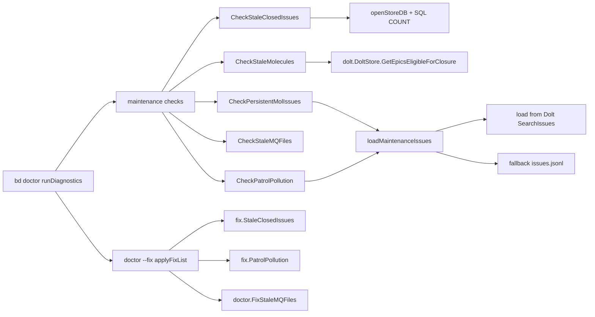

# maintenance_detection_and_auto_cleanup

这个模块本质上是 `bd doctor` 的“保洁巡检员”：它不关心业务功能是否可用，而是专门盯着那些**不会立刻让系统报错、但会持续污染数据和体验**的残留物——比如应当临时存在却被持久化的 issue、历史遗留的 merge queue 文件、可清理的陈旧 closed issue 等。朴素做法通常是“全量读出再用 Go 过滤”，但在大库上会非常慢（源码里明确提到过 23k issue 可达 57 秒级），所以这里的设计核心是：**能在存储层计数就绝不在应用层全量扫描**，并且把“检测（doctor）”和“执行清理（fix）”严格分离，默认偏保守。

## 架构角色与数据流



在系统里，这个模块是一个“维护类诊断编排层”。上游由 `cmd/bd/doctor.go` 的 `runDiagnostics` 顺序调用：`CheckStaleClosedIssues`、`CheckStaleMolecules`、`CheckPersistentMolIssues`、`CheckStaleMQFiles`、`CheckPatrolPollution`、`CheckCompactionCandidates`。这些函数统一返回 `DoctorCheck`（字段是 `Name/Status/Message/Detail/Fix/Category`），所以能无缝进入 doctor 的渲染、JSON 输出、以及 fix 阶段。

下游分两类：第一类是存储访问（`openStoreDB`、`dolt.NewFromConfigWithOptions`、`store.SearchIssues`、`GetEpicsEligibleForClosure`）；第二类是文件系统访问（`.beads/mq/*.json` 和 `issues.jsonl`）。`bd doctor --fix` 时，`applyFixList` 根据 `check.Name` 路由到 `fix.StaleClosedIssues`、`fix.PatrolPollution` 或 `doctor.FixStaleMQFiles`。

## 心智模型：像“城市卫生局”的两层机制

可以把它想成城市卫生局的两层机制：

第一层是“巡检”：只统计风险并贴告示，不轻易动数据。`Check*` 系列几乎都遵循这个策略，很多失败场景会返回 `StatusOK` + `N/A (...)`，避免把“检查器自身不可用”误判成“业务系统故障”。

第二层是“执法清理”：只有用户明确执行 `bd doctor --fix` 才删除数据，且多数清理具备显式门槛（如 `stale_closed_issues_days` 默认为 0，等于关闭）。这是一种“安全默认（safe by default）”的治理策略。

## 关键组件深挖

### `CheckStaleClosedIssues(path string) DoctorCheck`

它解决的是“closed issue 长期累积导致库体量膨胀”的慢性问题。最关键的设计点不在规则，而在**查询策略**：函数直接用 SQL `COUNT(*)` 计算，避免把大量 issue 拉到内存过滤。

逻辑分两段。若 `configfile.Load` 读到的 `stale_closed_issues_days` 为 0（默认禁用），函数不会直接 warning，而是先查 closed 总量；只有超过 `largeClosedIssuesThreshold`（默认 10000，可测试覆写）才建议启用清理。这样避免了“明明数据量小，却被强推清理策略”的噪声告警。

若阈值大于 0，则按 `closed_at < cutoff` 且 `pinned = 0 OR NULL` 计数。注意 pinned 被排除是隐式契约：被 pin 的 issue 即使陈旧也视为保留资产。

### `fix.StaleClosedIssues(path string) error`

这是上述检查的 fix 处理器。流程是：

1. `validateBeadsWorkspace` 先验校验路径合法。
2. 加载 `metadata.json`，读 `GetStaleClosedIssuesDays()`。
3. 若阈值为 0，则直接打印 disabled 并退出。
4. 用 `dolt.NewFromConfig` + `store.SearchIssues`（`IssueFilter{Status: closed, ClosedBefore: cutoff}`）取候选。
5. 跳过 `issue.Pinned`，其余执行 `store.DeleteIssue`。

一个值得注意的现实张力：代码里有 `if cfg != nil && cfg.GetBackend() == configfile.BackendDolt { ... skipped ... }` 的早退提示，这会让“Dolt 后端直接跳过 stale closed 清理”。这和检测阶段依赖 Dolt/SQL 的事实形成了演进中的不对称，说明这段 fix 逻辑仍带有历史兼容包袱（注释里也提到 SQLite-specific / fallback 的背景）。新贡献者改这段时要先明确当前产品期望，而不是机械“保持一致”。

### `CheckStaleMolecules(path string) DoctorCheck`

它不做字符串启发式，而是走领域语义：调用 `store.GetEpicsEligibleForClosure(ctx)`，再筛选 `EligibleForClose && TotalChildren > 0`。这比“只看状态字段”更稳健，因为 stale molecule 的定义本质是图关系完结但根未关闭。

返回中只展示最多 3 个样例 ID（`staleIDs`），保持输出可读性，避免一次 warning 打爆终端。

### `CheckPersistentMolIssues(path string) DoctorCheck`

该函数处理的是“本应 ephemeral 的 mol 产物被持久化”问题。它依赖 `loadMaintenanceIssues` 统一加载 issue，然后按 `strings.HasPrefix(issue.ID, "mol-") && !issue.Ephemeral` 判定。

这里的隐式数据契约是：`mol-` 前缀与 `Ephemeral` 语义应一致。若未来 ID 规则变更（例如不再用 `mol-`），这类检查会立即失真。

### `CheckPatrolPollution(path string) DoctorCheck` 与 `detectPatrolPollution`

这组函数针对 patrol 操作残留污染，采用标题模式分类：

- `Digest: mol-...-patrol`
- `Session ended: ...`

`classifyPatrolIssue` 把匹配逻辑集中到单一函数，`detectPatrolPollution` 只负责扫描和计数。这个分层很实用：一旦模式演进，只改分类器即可。

另一个设计点是“阈值告警而非存在即告警”：`PatrolDigestThreshold=10`、`SessionBeadThreshold=50`。说明团队接受少量残留，但把大量残留视为系统性问题。

### `fix.PatrolPollution(path string) error`

fix 端不会复用 `getPatrolPollutionIDs`，而是自行 `SearchIssues` 后按同样模式匹配并删除。这样做简单直接，但代价是**检测与修复逻辑重复**，未来模式变更时需要双点维护，容易漂移。

### `CheckStaleMQFiles` / `FixStaleMQFiles`

这是纯文件系统治理：检查 `.beads/mq/*.json` 是否存在，fix 直接 `os.RemoveAll(.beads/mq)`。因为注释明确这些是 local-only 旧实现残留，所以删除策略激进且安全边界清晰。

### `loadMaintenanceIssues` 及其回退链

这是本模块最重要的“弹性读取器”。策略是：

- 先 `loadMaintenanceIssuesFromDatabase`（Dolt source of truth，`SearchIssues` 且 `Ephemeral=false`）
- 失败后回退 `loadMaintenanceIssuesFromJSONL`
- 双失败才返回组合错误

这个设计保证 doctor 在迁移/故障/兼容场景下尽量“还能给信号”，而不是完全失明。

### `loadMisclassifiedWispIssues*` 与 `checkMisclassifiedWisps`

这组函数通过 SQL `id LIKE '%-wisp-%' AND (ephemeral=0 OR NULL)` 检测误分类 wisp，并在 JSONL 路径提供等价过滤。值得注意：在给定代码里，`runDiagnostics` 并未注册 `checkMisclassifiedWisps`，它目前更像一个预留或未接线能力点。

### `cleanupResult`

`cmd/bd/doctor/fix/maintenance.go` 中定义了 `cleanupResult{DeletedCount, SkippedPinned}`，但当前 `StaleClosedIssues` / `PatrolPollution` 实现并未返回或使用该结构，属于“存在但未形成闭环”的信号。若后续要做结构化 fix 报告（JSON/遥测），这是天然扩展点。

## 依赖关系与契约分析

该模块上游强依赖 `runDiagnostics` 的调用次序和 `DoctorCheck.Name` 文本契约。`applyFixList` 是通过字符串 `case "Stale Closed Issues"` / `"Patrol Pollution"` / `"Legacy MQ Files"` 路由 fix；这意味着重命名检查名会直接导致 fix 失联。

下游主要依赖：

- `internal/configfile`：读取 `GetStaleClosedIssuesDays`、`GetBackend`。
- `internal/storage/dolt`：`New`、`NewFromConfig`、`NewFromConfigWithOptions`、`SearchIssues`、`DeleteIssue`、`GetEpicsEligibleForClosure`。
- `internal/types`：`Issue`、`IssueFilter`、`StatusClosed`。

数据契约里最热路径是 `issues` 表字段语义：`status`、`closed_at`、`pinned`、`ephemeral`、`id`、`title`。字段名或语义变更会同时影响 SQL 检查与字符串规则检查。

## 设计取舍（tradeoffs）

这个模块整体偏向“保守正确性”而非“自动化彻底清理”。检测失败多返回 `OK + N/A`，减少误报；fix 需要用户显式触发，并且关键清理默认禁用。代价是你可能看到“有问题但未自动处理”的体验。

在性能上，它在高频路径采用 SQL 聚合，避免全量扫描；但在 patrol/persistent mol 这类规则检测上仍有全量遍历（先 `SearchIssues` 再本地匹配）。这是“实现简洁 vs 规模极限性能”的折中：当前模式匹配复杂度低，且通过 `Ephemeral=false` 预过滤已减轻负担。

在架构耦合上，模块与 `DoctorCheck.Name` 的字符串耦合较强，灵活性弱，但实现简单直观，不需要额外注册中心。

## 新贡献者最该注意的坑

首先，**build tag**：`maintenance.go` 是 `//go:build cgo`，对应的 `checks_nocgo.go` 提供 stub（“Requires CGO”）。你改了 cgo 版本逻辑，别忘了 non-cgo 行为一致性。

其次，别把“检查器失败”当“系统失败”。当前约定是维护检查尽量降级返回 `N/A`，避免让 `doctor` 过于脆弱。

再次，修改 `DoctorCheck.Name` 要同步 `cmd/bd/doctor_fix.go` 的 `switch`。这是最常见的隐形断链。

还有，标题/ID 模式匹配（`mol-`、`-wisp-`、`Digest: mol-...-patrol`）都属于软契约，变更命名规范时要统一更新检测与 fix。

最后，`loadMaintenanceIssues` 的 DB→JSONL 回退是兼容生命线；新增检查时若也读 issue，优先复用这条路径，不要只绑定单一后端。

## 使用示例

```bash
# 常规巡检（包含维护类检查）
bd doctor

# 自动执行可修复项（会触发 maintenance fix handlers）
bd doctor --fix

# 只看 patrol 污染专项（在 doctor 的 --check 子命令体系内）
bd doctor --check=pollution
```

对于 stale closed issues，必须在 `.beads/metadata.json` 显式启用：

```json
{
  "stale_closed_issues_days": 30
}
```

否则 `CheckStaleClosedIssues` 只会在 closed 数量极大时给出“建议启用”的 warning。

## 参考阅读

- [doctor_contracts_and_taxonomy](doctor_contracts_and_taxonomy.md)
- [database_state_checks](database_state_checks.md)
- [artifact_scanning_and_classic_cleanup](artifact_scanning_and_classic_cleanup.md)
- [migration_readiness_and_completion](migration_readiness_and_completion.md)
- [storage_contracts](storage_contracts.md)
- [issue_domain_model](issue_domain_model.md)
