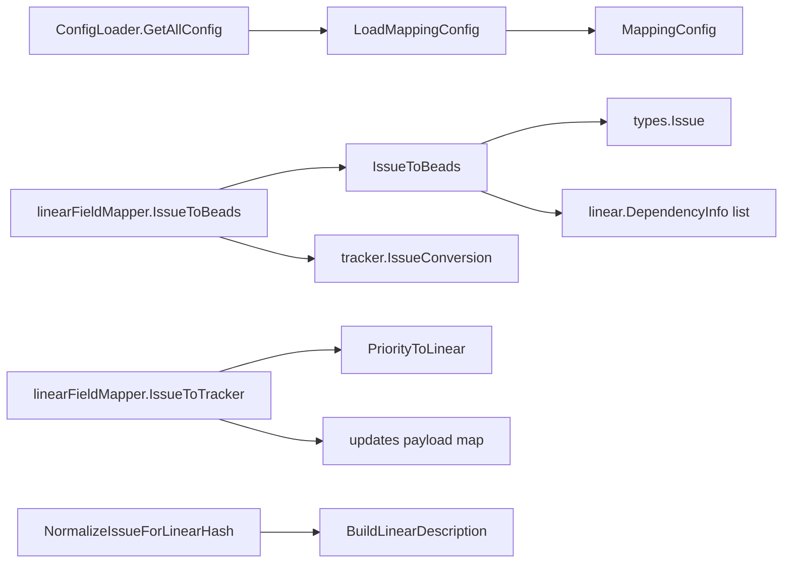

# mapping_and_field_translation

`mapping_and_field_translation` 是 Linear 集成里的“语义翻译层”：它不负责拉数据、推数据，也不负责存储；它专门解决一个更隐蔽但更致命的问题——**两套看起来相似的字段，在语义上并不等价**。如果没有这层，系统会出现“同步成功但业务含义错了”的静默数据偏差（例如状态看起来更新了，但依赖方向反了，或者冲突检测一直误报）。

---

## 1) 这个模块为什么存在（Problem Space）

Linear 与 Beads 都有 `priority`、`status/state`、`type`、`labels`、`relations`，但它们的模型并不是一一对应：

- 优先级数字区间虽然都像 0~4，但含义不同；
- 状态模型不同：Linear 是 `State{Type, Name}`，Beads 是 `types.Status` 枚举；
- Beads 的结构化字段（`AcceptanceCriteria`/`Design`/`Notes`）在 Linear 侧会折叠进 description；
- 依赖关系里 `blocks` / `blockedBy` 的方向语义不能直接照抄字符串；
- 团队在 Linear 里常有自定义 workflow state name，硬编码映射会很快失效。

所以这个模块的目标不是“字段搬运”，而是“**语义对齐 + 可配置策略 + 安全回退**”。

一个直观类比：
> 想象你在做跨国物流。包裹（issue）能运过去不难，难的是报关编码（priority/status/type）和单据格式（description 归一化）必须对齐，否则货到了但法律意义已经变了。

---

## 2) 心智模型（Mental Model）

建议把本模块拆成两层来理解：

1. **规则层（mapping.go）**：
   - `MappingConfig` + 一组纯转换函数（如 `PriorityToBeads`、`StateToBeadsStatus`、`IssueToBeads`）
   - 负责“怎么翻译”
2. **适配层（fieldmapper.go）**：
   - `linearFieldMapper` 实现 `tracker.FieldMapper`
   - 负责“把规则接进同步框架的统一接口”

也就是：
- mapping.go = 翻译词典 + 语法规则
- fieldmapper.go = 同传耳机（接口适配）

---

## 3) 架构总览与数据流

### 流程解读（端到端）

#### A. 配置加载路径（启动/初始化时）
1. 通过 `ConfigLoader.GetAllConfig()` 读取配置键值。
2. `LoadMappingConfig` 先拿 `DefaultMappingConfig()`，再按键前缀覆盖：
   - `linear.priority_map.*`
   - `linear.state_map.*`
   - `linear.label_type_map.*`
   - `linear.relation_map.*`
3. 若 loader 为空或读取失败，保留默认配置，保证系统可运行。

**意图**：优先可用性，避免“配置系统抖动导致同步全停”。

#### B. Pull 转换路径（Linear -> Beads）
1. `linearFieldMapper.IssueToBeads` 从 `tracker.TrackerIssue.Raw` 断言 `*Issue`。
2. 调用 `IssueToBeads(li, config)` 做完整转换：
   - 时间解析（`CreatedAt`/`UpdatedAt`/`CompletedAt`）
   - 优先级/状态/类型映射
   - assignee、labels、external_ref 规范化
   - 抽取依赖边（parent + relations）
3. 把 `linear.IssueConversion` 重打包为 `tracker.IssueConversion`。

**关键点**：issue 主体和 dependencies 分离返回，便于“先落 issue，再连依赖边”。

#### C. Push 更新路径（Beads -> Linear）
1. `linearFieldMapper.IssueToTracker(issue)` 产出最小更新集：`title`、`description`、`priority`。
2. `priority` 通过 `PriorityToLinear` 由配置逆向映射得出。
3. 状态转换由 `StatusToLinearStateType` 提供“状态类型意图”（字符串），供上层继续解析到具体 Linear 状态。

#### D. 冲突哈希归一化路径
1. `NormalizeIssueForLinearHash` 复制 issue。
2. 通过 `BuildLinearDescription` 把 `Description + AcceptanceCriteria + Design + Notes` 拼成 Linear 风格描述。
3. 清空 Beads 侧额外字段，避免哈希比较把“结构差异”当“内容冲突”。

---

## 4) 关键设计决策与权衡

### 决策 1：配置驱动映射（而非硬编码）
- 选择：`MappingConfig` + `LoadMappingConfig`
- 好处：能适应不同团队 workflow，不必改代码重发版本。
- 代价：错误配置会产生“合法但错误”的语义结果。

### 决策 2：默认回退优先（而非严格失败）
- 体现：
  - `LoadMappingConfig` 读取失败回默认配置；
  - 多个映射函数遇到未知值回默认（如 status 回 open、priority 回 medium）；
  - 时间解析失败使用 `time.Now()`。
- 好处：批量同步不中断。
- 代价：可观测性下降，异常可能被“温和吞掉”。

### 决策 3：接口解耦优先（而非强类型贯穿）
- 体现：
  - `ConfigLoader` 只定义 `GetAllConfig()`，避免 mapping 依赖存储细节；
  - `linearFieldMapper` 通过 `tracker.FieldMapper` 的 `interface{}` 契约接入。
- 好处：适配层边界清晰，便于多 tracker 复用同一引擎模式。
- 代价：需要运行时类型断言，错误多以默认值/`nil` 体现。

### 决策 4：关系类型映射与方向处理分离
- 体现：
  - `RelationToBeadsDep` 只管“类型名”；
  - `IssueToBeads` 里专门处理 `blockedBy`/`blocks` 方向翻转。
- 好处：职责清晰，维护依赖语义时不易相互污染。
- 代价：阅读时需跨函数理解完整语义。

### 决策 5：ID 生成采用“渐进扩容 + nonce”
- 体现：`GenerateIssueIDs` 用 `BaseLength..MaxLength` + `nonce 0..9`。
- 好处：兼顾短 ID 可读性与碰撞控制。
- 代价：极端碰撞下会报错，需要调用方处理失败路径。

---

## 5) 子模块说明

### [mapping_config_and_conversion](mapping_config_and_conversion.md)
本子模块是核心翻译内核，包含 `MappingConfig`、`LoadMappingConfig`、`IssueToBeads`、`BuildLinearToLocalUpdates`、`GenerateIssueIDs` 等。它处理配置解析、字段语义映射、依赖抽取、冲突归一化等关键逻辑。可以把它看作“翻译词典 + 规则引擎”。

### [field_mapper_adapter](field_mapper_adapter.md)
本子模块实现 `linearFieldMapper`，把上述翻译能力接到 `tracker.FieldMapper` 插件契约上。它的职责是接口适配、类型门控、跨层数据结构重打包（`linear.IssueConversion` -> `tracker.IssueConversion`）。可以把它看作“引擎与翻译内核之间的窄腰适配器”。

---

## 6) 与其他模块的依赖关系（Cross-module）

### 主要上游/横向契约
- [tracker_plugin_contracts](tracker_plugin_contracts.md)：`FieldMapper` / `IssueTracker` 接口定义，本模块实现其字段映射语义。
- [sync_orchestration_engine](sync_orchestration_engine.md)：同步编排层会通过 `FieldMapper` 间接调用本模块。
- [linear_tracker_adapter_layer](linear_tracker_adapter_layer.md)：Linear 适配器持有 `MappingConfig` 并暴露 `linearFieldMapper`。

### 主要下游数据模型
- [Core Domain Types](Core Domain Types.md)：本模块输出 `types.Issue`、`types.Status`、`types.IssueType`。
- [linear_api_types_and_payloads](linear_api_types_and_payloads.md)：本模块输入/处理的 Linear `Issue`/`State`/`Labels`/`Relations`/`Project` 等来自这里。

### 配置来源
- [Configuration](Configuration.md)：`LoadMappingConfig` 通过 `ConfigLoader` 抽象读取配置（具体实现由上层注入）。

---

## 7) 新贡献者最需要警惕的坑

1. **`*MappingConfig` 不能为空**：多数函数默认调用方传入有效 config。  
2. **`PriorityToLinear` 是“逆向构建”**：若你把 `PriorityMap` 配成多对一，逆映射可能不稳定。  
3. **`LabelToIssueType` 有子串匹配**：关键词太泛会导致误判类型。  
4. **时间解析失败会回 `time.Now()`**：这会影响审计和冲突判定，需要日志观测。  
5. **`IssueToTracker` 只返回最小字段集**：不要误以为它覆盖了所有 Linear 可更新字段。  
6. **依赖方向非常敏感**：改 `blocks`/`blockedBy` 逻辑时要验证整张依赖图，而不是只看单条映射。  
7. **归一化逻辑会影响冲突检测**：若修改 `BuildLinearDescription` 的拼接顺序，需评估哈希比较兼容性。

---

## 8) 实践建议（Contributor Playbook）

- 新增映射规则时，优先扩展 `MappingConfig`（策略可配），其次才是硬编码。  
- 任何涉及 `IssueToBeads` 的变更都应做“双向回归”验证：字段正确性 + 依赖方向正确性。  
- 修改 `NormalizeIssueForLinearHash` 前，先确认与 push payload 结构是否仍一致。  
- 若要提高可观测性，可在回退路径（默认值触发）增加 debug 日志，而不是直接改为 hard fail。
